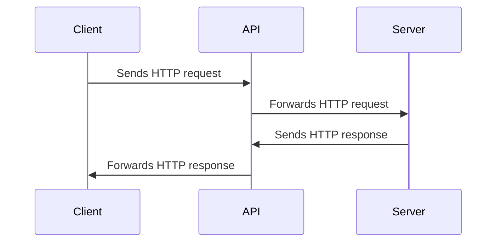
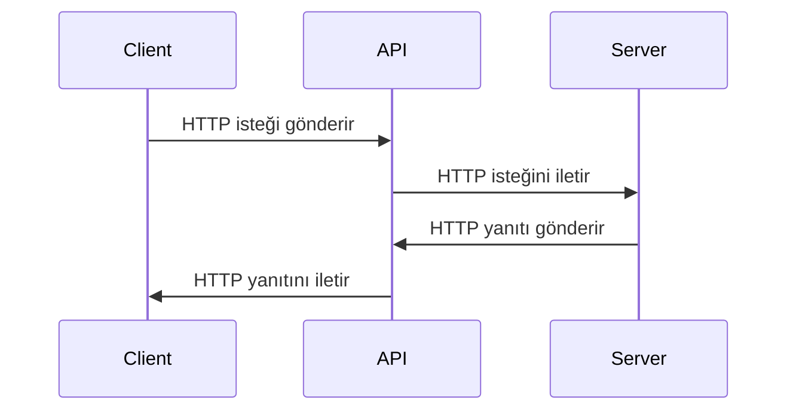

# API - Application Programming Interface

In this chapter, we will cover APIs, their types, resources, responses, and CRUD operations.


Image source: Dall-E by OpenAI

- [API - Application Programming Interface](#api---application-programming-interface)
  - [Learning Outcomes](#learning-outcomes)
  - [Types of Web APIs](#types-of-web-apis)
  - [API Resource](#api-resource)
  - [API Response](#api-response)
  - [CRUD API](#crud-api)

## Learning Outcomes

By the end of this chapter, you will be able to:

- Explain what a web API is and how it works.
- Describe the various types of web APIs, including RESTful APIs, SOAP APIs, and GraphQL APIs.
- Define API resources and URIs.
- Describe the structure of API responses and data formats such as JSON and XML.
- Explain the core operations of a CRUD API and their relationship to HTTP methods.

In the context of this course, we are referring to APIs that operate over the HTTP protocol, known as Web APIs.

A web API represents a programming interface for web applications. It is a collection of protocols, tools, and mechanisms for creating web-based applications that can communicate with each other over the Internet.

Web APIs are typically accessed via HTTP requests and responses, allowing web applications to interact with data and services provided by other applications, often on different servers or in different locations around the world.



## Types of Web APIs

- **RESTful APIs**: Representational State Transfer (REST) is a popular architectural style for creating web APIs that use HTTP requests to fetch and manipulate data. RESTful APIs are designed to be scalable, reliable, and easy to use.
- **SOAP APIs**: Simple Object Access Protocol (SOAP) is another popular protocol for creating web APIs that exchange XML-based messages. SOAP APIs are often used in enterprise-level applications that require complex messaging and transaction support.
- **GraphQL APIs**: GraphQL is a relatively new technology for creating web APIs that allows clients to request only the data they need, rather than retrieving entire resources. GraphQL APIs are commonly used in modern web and mobile applications that require efficient data retrieval and processing.

Web APIs are essential components of modern web development, enabling developers to create complex and feature-rich applications by leveraging the power of the Internet and the collective resources of the global developer community.

## API Resource

In the context of web APIs, a resource is any piece of data or functionality that can be accessed or manipulated over the Internet using a URI (Uniform Resource Identifier) and HTTP requests.

A resource can be anything from a single data unit (e.g., a customer record in a database) to a collection of related items, such as a list of products in an online store. Resources can also include more complex functionalities, such as a search engine or payment gateway.

In a RESTful API, resources are typically represented as nouns in URIs, and HTTP methods (GET, POST, PUT, DELETE, etc.) are used to perform actions on these resources. For example, a typical RESTful API might have URIs like:

- `/customers`
- `/customers/123`
- `/orders/456`
- `/products/search?q=keyword`

In this example, the first URI represents a collection of customers, the second URI represents a specific customer with ID 123, the third URI represents a specific order with ID 456, and the fourth URI represents a search query for products matching the keyword "keyword."

By clearly and consistently defining resources and URIs, web APIs can provide a simple and intuitive interface for accessing data and functionalities over the Internet, making it easier for developers to build web applications that can communicate with other systems and services, regardless of their location or implementation details.

You can find a selection of free public web APIs here: [Public APIs](https://github.com/public-apis/public-apis)

## API Response

Typically, a web API returns data in response to a request, formatted in JSON (JavaScript Object Notation) or XML (Extensible Markup Language). JSON has become the standard response format for web APIs because it is lightweight and easy to read and write. XML is still used in some web APIs, especially SOAP APIs, but it is less common compared to JSON.

A web API response may also contain additional data, such as the status of the request, error messages, metadata, and other useful information. For example, a web API response might include an HTTP status code indicating whether the request was successful, along with an error message explaining why the request failed.

An example of a typical API response might look like this:

```json
{
  "status": 200,
  "message": "OK",
  "data": {
    "id": 123,
    "name": "John Smith",
    "email": "john@smith.com",
    "phone": "555-123-4567"
  }
}
```

In this example, the web API response is a JSON object containing three key-value pairs. The first key-value pair includes the status of the request. The second key-value pair contains a message about the request. The third key-value pair includes the data returned as a result of the request.

If the API response includes a list of data, such as a list of customer records, it might look like this:

```json
{
  "status": 200,
  "message": "OK",
  "data": [
    {
      "id": 123,
      "name": "John Smith",
      "email": "john@smith.com",
      "phone": "555-123-4567"
    },
    {
      "id": 456,
      "name": "Jane Doe",
      "email": "jane@doe.com",
      "phone": "555-987-6543"
    }
  ]
}
```

## CRUD API

`CRUD` is an acronym that stands for the four basic operations that can be performed on data: **Create**, **Read**, **Update**, and **Delete**. These are also the core operations that can be performed using web APIs.

- **Create** - creates a new data record.
- **Read** - retrieves an existing data record.
- **Update** - modifies an existing data record.
- **Delete** - removes an existing data record.

These operations often correlate with HTTP methods used to perform them:

- **Create** - uses the HTTP POST method.
- **Read** - uses the HTTP GET method.
- **Update** - uses the HTTP PUT or PATCH method.
- **Delete** - uses the HTTP DELETE method.
- 
# API - Uygulama Programlama Arayüzü

Bu bölümde, API'leri, türlerini, kaynaklarını, yanıtlarını ve CRUD işlemlerini ele alacağız.


Görsel kaynağı: Dall-E by OpenAI

- [API - Uygulama Programlama Arayüzü](#api---uygulama-programlama-arayüzü)
  - [Öğrenme Çıktıları](#öğrenme-çıktıları)
  - [Web API Türleri](#web-api-türleri)
  - [API Kaynağı](#api-kaynağı)
  - [API Yanıtı](#api-yanıtı)
  - [CRUD API](#crud-api)

## Öğrenme Çıktıları

Bu bölümü tamamladığınızda şunları yapabileceksiniz:

- Bir web API'sinin ne olduğunu ve nasıl çalıştığını açıklayın.
- RESTful API'ler, SOAP API'ler ve GraphQL API'leri gibi çeşitli web API türlerini tanımlayın.
- API kaynaklarını ve URI'leri tanımlayın.
- API yanıtlarının yapısını ve JSON ve XML gibi veri formatlarını açıklayın.
- Bir CRUD API'sinin temel işlemlerini ve bunların HTTP yöntemleriyle olan ilişkisini açıklayın.

Bu kurs bağlamında, HTTP protokolü üzerinden çalışan API'lere web API'leri denir.

Bir web API'si, web uygulamaları için bir programlama arayüzünü temsil eder. Diğer uygulamalarla internet üzerinden iletişim kurabilen web tabanlı uygulamalar oluşturmak için kullanılan protokoller, araçlar ve mekanizmalar bir koleksiyonudur.

Web API'leri genellikle HTTP istekleri ve yanıtları aracılığıyla erişilir, bu da web uygulamalarının diğer uygulamalar tarafından sağlanan veriler ve hizmetlerle etkileşimde bulunmasını sağlar. Bu uygulamalar genellikle farklı sunucularda veya dünya çapında farklı lokasyonlarda bulunabilir.


## Web API Türleri

- **RESTful API'ler**: Representational State Transfer (REST), HTTP istekleriyle veri almak ve üzerinde işlem yapmak için kullanılan popüler bir mimari tarzdır. RESTful API'ler, ölçeklenebilir, güvenilir ve kolay kullanılacak şekilde tasarlanmıştır.
- **SOAP API'ler**: Simple Object Access Protocol (SOAP), XML tabanlı mesajların değiş tokuşunu sağlayan başka bir popüler protokoldür. SOAP API'leri genellikle karmaşık mesajlaşma ve işlem desteği gerektiren kurumsal düzeyde uygulamalarda kullanılır.
- **GraphQL API'ler**: GraphQL, istemcilerin sadece ihtiyaç duydukları veriyi istemelerini sağlayan yeni bir teknolojidir, böylece tüm kaynakları almak yerine yalnızca gerekli veriler çekilir. GraphQL API'leri, modern web ve mobil uygulamalarda verimli veri alımı ve işleme gereksinimi duyan uygulamalar için yaygın olarak kullanılır.

Web API'leri, modern web geliştirmede önemli bileşenlerdir ve geliştiricilerin internetin gücünü ve küresel geliştirici topluluğunun kolektif kaynaklarını kullanarak karmaşık ve özellik açısından zengin uygulamalar oluşturmasını sağlar.

## API Kaynağı

Web API'leri bağlamında, bir kaynak, internet üzerinden bir URI (Uniform Resource Identifier) ve HTTP istekleri kullanarak erişilebilen veya üzerinde işlem yapılabilen herhangi bir veri veya işlevsellik parçasıdır.

Bir kaynak, bir müşteri kaydı gibi tek bir veri biriminden, bir çevrimiçi mağazada bir ürün listesi gibi ilişkili öğelerin bir koleksiyonuna kadar herhangi bir şey olabilir. Kaynaklar ayrıca daha karmaşık işlevsellikleri de içerebilir, örneğin bir arama motoru veya ödeme geçidi.

Bir RESTful API'de kaynaklar genellikle URI'lerde isim olarak temsil edilir ve bu kaynaklar üzerinde işlem yapmak için HTTP yöntemleri (GET, POST, PUT, DELETE vb.) kullanılır. Örneğin, tipik bir RESTful API aşağıdaki gibi URI'lere sahip olabilir:

- `/customers`
- `/customers/123`
- `/orders/456`
- `/products/search?q=keyword`

Bu örnekte, ilk URI müşteri koleksiyonunu temsil eder, ikinci URI ID'si 123 olan belirli bir müşteriyi temsil eder, üçüncü URI ID'si 456 olan belirli bir siparişi temsil eder ve dördüncü URI "keyword" anahtar kelimesine uyan ürünler için bir arama sorgusunu temsil eder.

Kaynakları ve URI'leri açıkça ve tutarlı bir şekilde tanımlayarak, web API'leri internet üzerinden veri ve işlevselliklere erişmek için basit ve sezgisel bir arayüz sağlayabilir, bu da geliştiricilerin başka sistemlerle ve hizmetlerle, konumlarına veya uygulama detaylarına bakılmaksızın, iletişim kurabilen web uygulamaları inşa etmelerini kolaylaştırır.

Burada ücretsiz halka açık web API'lerinin bir seçkisini bulabilirsiniz: [Public APIs](https://github.com/public-apis/public-apis)

## API Yanıtı

Genellikle, bir web API'si bir isteğe yanıt olarak veriyi JSON (JavaScript Object Notation) veya XML (Extensible Markup Language) formatında döndürür. JSON, hafif olması ve okunması ve yazılması kolay olduğundan web API'leri için standart yanıt formatı haline gelmiştir. XML, bazı web API'lerinde, özellikle SOAP API'lerinde hala kullanılmaktadır, ancak JSON'a kıyasla daha az yaygındır.

Bir web API'si yanıtı ayrıca isteğin durumu, hata mesajları, meta veriler ve diğer faydalı bilgileri içerebilir. Örneğin, bir web API yanıtı, isteğin başarılı olup olmadığını belirten bir HTTP durum kodu ile birlikte, isteğin neden başarısız olduğunu açıklayan bir hata mesajı içerebilir.

Tipik bir API yanıtı örneği şu şekilde olabilir:

```json
{
  "status": 200,
  "message": "OK",
  "data": {
    "id": 123,
    "name": "John Smith",
    "email": "john@smith.com",
    "phone": "555-123-4567"
  }
}

```

Bu örnekte, web API yanıtı, üç anahtar-değer çiftini içeren bir JSON nesnesidir. İlk anahtar-değer çifti, isteğin durumunu içerir. İkinci anahtar-değer çifti, isteğe ilişkin bir mesajı içerir. Üçüncü anahtar-değer çifti, isteğin sonucu olarak döndürülen veriyi içerir.

Eğer API yanıtı, müşteri kayıtları gibi bir veri listesi içeriyorsa, şu şekilde görünebilir:
```
{
  "status": 200,
  "message": "OK",
  "data": [
    {
      "id": 123,
      "name": "John Smith",
      "email": "john@smith.com",
      "phone": "555-123-4567"
    },
    {
      "id": 456,
      "name": "Jane Doe",
      "email": "jane@doe.com",
      "phone": "555-987-6543"
    }
  ]
}
```
## CRUD API

`CRUD`, veriler üzerinde gerçekleştirilebilecek dört temel işlemi temsil eden bir kısaltmadır: **Create** (Oluştur), **Read** (Okuma), **Update** (Güncelle), ve **Delete** (Sil). Bunlar, web API'leri kullanılarak gerçekleştirilebilen temel işlemlerdir.

- **Create** - yeni bir veri kaydı oluşturur.
- **Read** - mevcut bir veri kaydını alır.
- **Update** - mevcut bir veri kaydını değiştirir.
- **Delete** - mevcut bir veri kaydını siler.

Bu işlemler, genellikle bunları gerçekleştirmek için kullanılan HTTP yöntemleriyle ilişkilidir:

- **Create** - HTTP POST yöntemi kullanır.
- **Read** - HTTP GET yöntemi kullanır.
- **Update** - HTTP PUT veya PATCH yöntemi kullanır.
- **Delete** - HTTP DELETE yöntemi kullanır.


