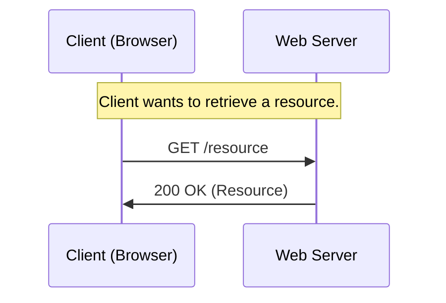
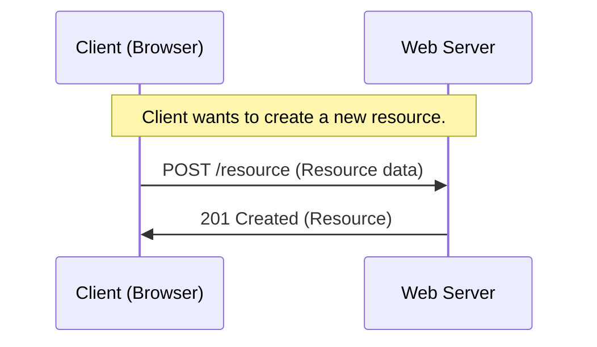
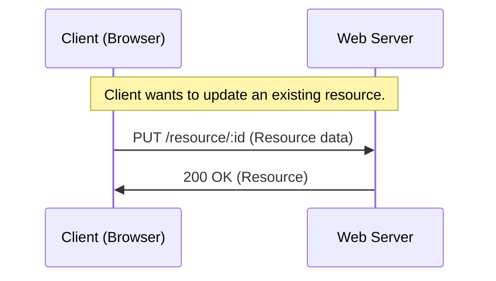
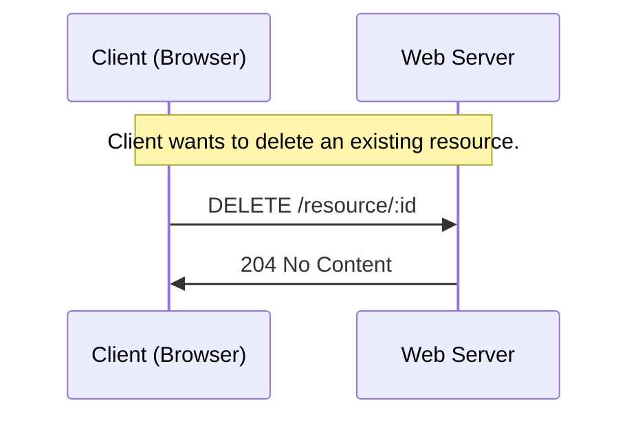
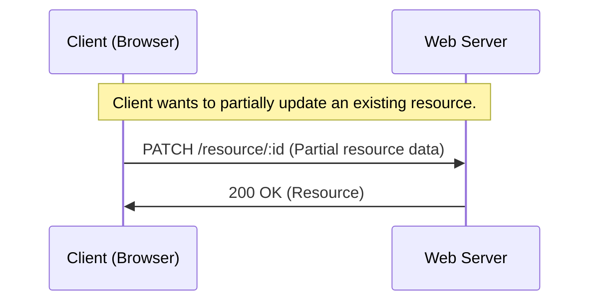
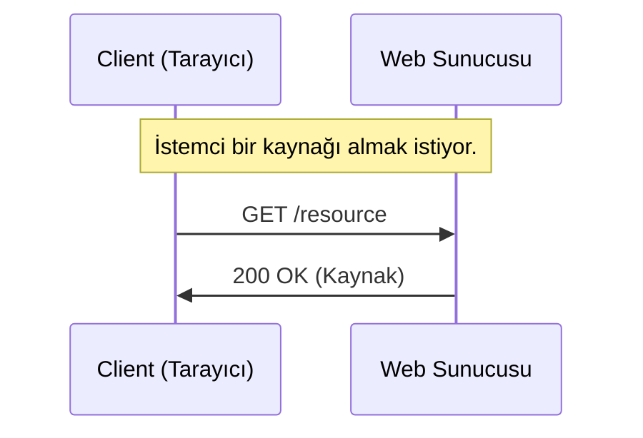
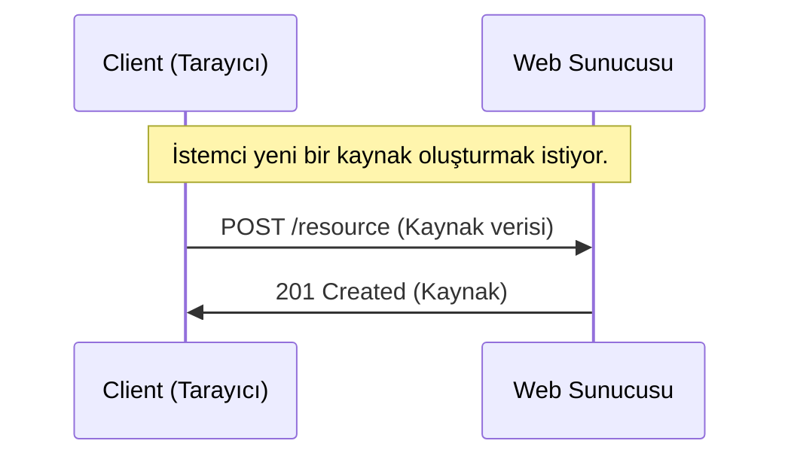
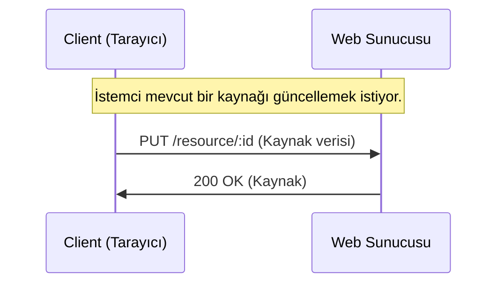
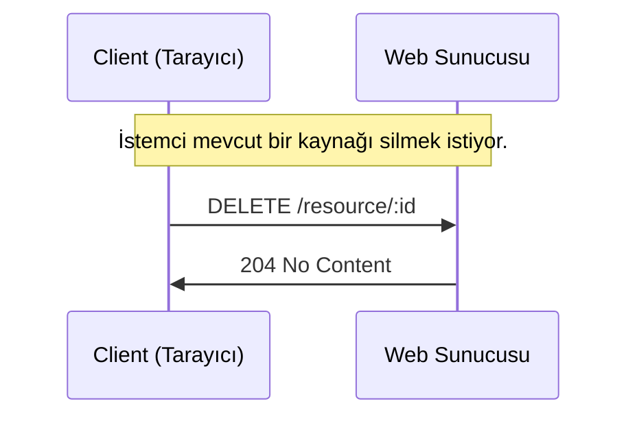
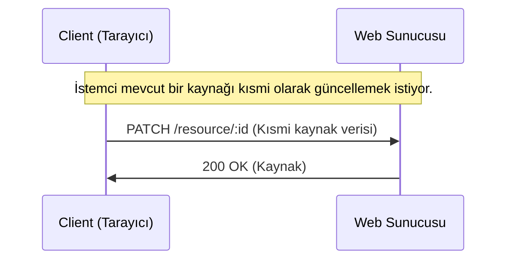

# HTTP Request Methods

In this chapter, we will discuss the various HTTP request methods used for interacting with web APIs.

Image source: Dall-E by OpenAI

- [HTTP Request Methods](#http-request-methods)
  - [GET](#get)
  - [POST](#post)
  - [PUT](#put)
  - [DELETE](#delete)
  - [PATCH](#patch)
  - [OPTIONS](#options)
    - [Sources](#sources)

HTTP request methods are used to indicate the desired action to be performed on a resource identified by the URI (Uniform Resource Identifier) in the HTTP request.

## GET

**GET**: The GET method is used to retrieve a resource from the server. It is a safe and idempotent method, meaning that multiple identical requests have the same effect as a single request. The response to a GET request typically includes the requested resource or its representation in the message body.

In this example, the client sends an `HTTP GET` request to the server to retrieve a resource. The server responds with a status code of `200 OK` along with the requested resource.

## POST

**POST**: The POST method is used to send data to the server to create or update a resource. It is not idempotent, meaning that multiple identical requests may have different effects. The response to a POST request typically includes the representation of the created or updated resource in the message body.

In this example, the client sends an `HTTP POST` request to the server to create a new resource, providing the necessary data in the request body. The server responds with a status code of `201 Created` along with the newly created resource.

## PUT

**PUT**: The PUT method is used to update an existing resource on the server. It is idempotent, meaning that multiple identical requests have the same effect as a single request. The response to a PUT request typically includes the representation of the updated resource in the message body.

In this example, the client sends an `HTTP PUT` request to the server to update an existing resource, providing the necessary data in the request body. The server responds with a status code of `200 OK` along with the updated resource.

## DELETE

**DELETE**: The DELETE method is used to remove a resource from the server. It is idempotent, meaning that multiple identical requests have the same effect as a single request. The response to a DELETE request typically includes a confirmation message in the message body.

In this example, the client sends an `HTTP DELETE` request to the server to delete an existing resource. The server processes the request, deletes the resource, and responds with a status code of `204 No Content`.

## PATCH

**PATCH**: The PATCH method is used to partially update an existing resource on the server. It is not idempotent, meaning that multiple identical requests may have different effects. The response to a PATCH request typically includes the representation of the updated resource in the message body.

In this example, the client sends an `HTTP PATCH` request to the server to partially update an existing resource, providing only the necessary data to be modified in the request body. The server processes the request, partially updates the resource, and responds with a status code of `200 OK` along with the updated resource.

## OPTIONS

The OPTIONS method is used to retrieve the available options for a resource. It is a safe and idempotent method, meaning that multiple identical requests have the same effect as a single request. The response to an OPTIONS request typically includes information about the supported methods, headers, and other options for the resource.

These HTTP request methods enable clients to interact with server resources in a standard and consistent manner, regardless of the specific implementation details of the server.

### Sources

- [HTTP Methods - MDN](https://developer.mozilla.org/en-US/docs/Web/HTTP/Methods)

# HTTP İstek Yöntemleri

Bu bölümde, web API'leri ile etkileşimde bulunmak için kullanılan çeşitli HTTP istek yöntemlerini tartışacağız.

Görsel kaynağı: Dall-E by OpenAI

- [HTTP İstek Yöntemleri](#http-istek-yöntemleri)
  - [GET](#get)
  - [POST](#post)
  - [PUT](#put)
  - [DELETE](#delete)
  - [PATCH](#patch)
  - [OPTIONS](#options)
    - [Kaynaklar](#kaynaklar)

HTTP istek yöntemleri, HTTP isteğinde yer alan URI (Uniform Resource Identifier - Evrensel Kaynak Tanımlayıcı) tarafından tanımlanan bir kaynağa yapılacak işlemi belirtir.

## GET

**GET**: GET yöntemi, sunucudan bir kaynak almak için kullanılır. Güvenli ve idempotent bir yöntemdir, yani birden fazla aynı istek, tek bir isteğin etkisiyle aynı sonuca yol açar. GET isteğine verilen yanıt genellikle talep edilen kaynağın veya onun temsili olan verinin mesaj gövdesini içerir.

Bu örnekte, istemci, sunucudan bir kaynak almak için `HTTP GET` isteği gönderir. Sunucu, 200 OK durum kodu ile birlikte talep edilen kaynağı yanıt olarak gönderir.

## POST
**POST** : POST yöntemi, sunucuya veri göndermek ve bir kaynağı oluşturmak veya güncellemek için kullanılır. İdempotent değildir, yani birden fazla aynı istek farklı etkiler yaratabilir. POST isteğine verilen yanıt genellikle oluşturulan veya güncellenen kaynağın temsili olan veriyi içerir.

Bu örnekte, istemci, sunucudan yeni bir kaynak oluşturmak için `HTTP POST` isteği gönderir ve gerekli veriyi istek gövdesine ekler. Sunucu, `201 Created` durum kodu ile birlikte yeni oluşturulan kaynağı yanıt olarak gönderir.

## PUT
**PUT**: PUT yöntemi, sunucudaki mevcut bir kaynağı güncellemek için kullanılır. İdempotenttir, yani birden fazla aynı istek, tek bir isteğin etkisiyle aynı sonuca yol açar. PUT isteğine verilen yanıt genellikle güncellenen kaynağın temsili olan veriyi içerir.

Bu örnekte, istemci, sunucudaki mevcut bir kaynağı güncellemek için `HTTP PUT` isteği gönderir ve gerekli veriyi istek gövdesine ekler. Sunucu, `200 OK` durum kodu ile birlikte güncellenmiş kaynağı yanıt olarak gönderir.

## DELETE
**DELETE**: DELETE yöntemi, sunucudan bir kaynağı kaldırmak için kullanılır. İdempotenttir, yani birden fazla aynı istek, tek bir isteğin etkisiyle aynı sonuca yol açar. DELETE isteğine verilen yanıt genellikle bir onay mesajı içerir.

Bu örnekte, istemci, sunucudan mevcut bir kaynağı silmek için `HTTP DELETE` isteği gönderir. Sunucu, isteği işler, kaynağı siler ve `204 No Content` durum kodu ile yanıt verir.

## PATCH
**PATCH** : PATCH yöntemi, sunucudaki mevcut bir kaynağı kısmi olarak güncellemek için kullanılır. İdempotent değildir, yani birden fazla aynı istek farklı etkiler yaratabilir. PATCH isteğine verilen yanıt genellikle güncellenen kaynağın temsili olan veriyi içerir.

Bu örnekte, istemci, sunucudaki mevcut bir kaynağı kısmi olarak güncellemek için `HTTP PATCH` isteği gönderir ve yalnızca değiştirilmesi gereken veriyi istek gövdesine ekler. Sunucu, isteği işler, kaynağı kısmi olarak günceller ve `200 OK` durum kodu ile yanıt verir.

## OPTIONS
OPTIONS yöntemi, bir kaynağın mevcut seçeneklerini almak için kullanılır. Güvenli ve idempotent bir yöntemdir, yani birden fazla aynı istek, tek bir isteğin etkisiyle aynı sonuca yol açar. OPTIONS isteğine verilen yanıt genellikle desteklenen yöntemler, başlıklar ve kaynak için diğer seçenekler hakkında bilgi içerir.

Bu HTTP istek yöntemleri, istemcilerin sunucu kaynaklarıyla standart ve tutarlı bir şekilde etkileşimde bulunmalarını sağlar, sunucunun özel uygulama detaylarından bağımsız olarak.

## Kaynaklar
- [HTTP Methods - MDN](https://developer.mozilla.org/en-US/docs/Web/HTTP/Methods)

