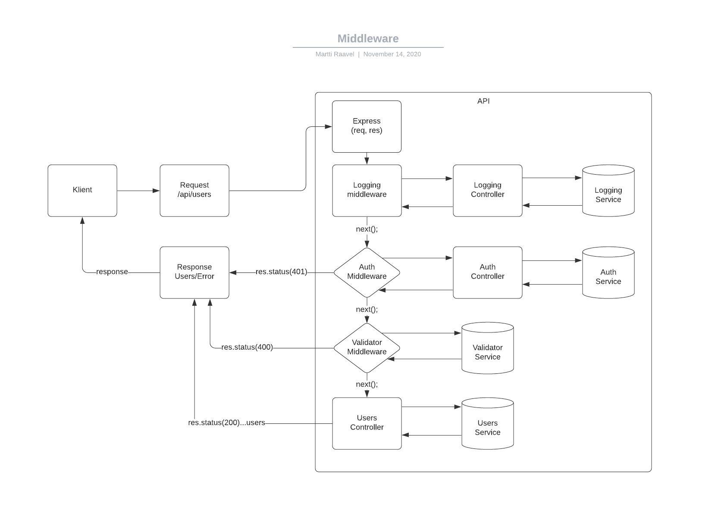

# Middleware in Express

In this section, we will discuss middleware in the context of Express.js.


Image source: Dall-E by OpenAI

- [Middleware in Express](#middleware-in-express)
  - [Learning Outcomes](#learning-outcomes)
  - [What are Middleware Functions?](#what-are-middleware-functions)
  - [Next Function](#next-function)
  - [Using Middleware](#using-middleware)
    - [Example of Logging Middleware](#example-of-logging-middleware)
  - [Request/Response Cycle with Middleware](#requestresponse-cycle-with-middleware)
  - [Not Found Middleware](#not-found-middleware)
    - [Registering Not Found Middleware](#registering-not-found-middleware)

## Learning Outcomes

By the end of this section, you will be able to:

- Explain what middleware is and how it is used.
- Write middleware functions.
- Implement middleware in an Express.js application.

## What are Middleware Functions?

Middleware functions are functions that have access to the request object (`req`), response object (`res`), and the next middleware function in the application's request-response cycle. Essentially, you can think of middleware as a filter that processes requests before they reach the next stage in the request-response cycle. For example, middleware could handle logging, authentication, request data parsing, or any other functionality that is important for the application.

## Next Function

The `next` function is an Express router function that, when called, passes control to the next middleware in the stack.

## Using Middleware

Middleware can:

- Execute code.
- Modify the request and response objects.
- End the request-response cycle.
- Call the next middleware in the stack.

It’s important to remember that if a middleware does not end the request-response cycle (e.g., using `return res.status(200).json…`), it must call the `next()` function; otherwise, the application will hang.

### Example of Logging Middleware

```javascript
// Middleware for logging HTTP requests

const logger = (req, res, next) => {
  // Log the request URL, method, and time
  console.log(req.url, req.method, new Date().toISOString());
  // Call the next middleware
  return next();
};
```

Middleware can be applied in different ways.

One option is to register the middleware for all requests:

```javascript
...
// Importing middleware (path depends on file location)
const logger = require('./middlewares/logger');

...

// Registering middleware
app.use(logger);

...
```

Another option is to register middleware only for specific routes:

```javascript
...
// Importing middleware
const logger = require('./middlewares/logger');

...

// Registering middleware
app.get('/api', logger, (req, res) => {
  res.send('Hello World!');
});
...
```

## Request/Response Cycle with Middleware



## Not Found Middleware

One useful scenario for middleware is displaying a 404 page when the requested resource is not found. Example:

```javascript
// Middleware to display a 404 page when the requested resource is not found

const notFound = (req, res, next) => {
  res.status(404).send({
    success: false,
    message: "Route not found",
  });
};

module.exports = notFound;
```

### Registering Not Found Middleware

```javascript
...
// Importing middleware
const notFound = require('./middlewares/notFound');

...

// Registering middleware
app.use('*', notFound);

...
```

Here, it is important to register this middleware after all routes, using the path `*`. This means that if a user accesses a route that does not exist in the API, they will be directed to this middleware function.

Now, if a user tries to access a route that does not exist, they will receive the following response:

```json
{
  "success": false,
  "message": "Route not found"
}
```

# Express'te Middleware

Bu bölümde, Express.js bağlamında middleware (ara katman yazılımı) konusunu ele alacağız.


Görsel kaynağı: Dall-E by OpenAI

- [Express'te Middleware](#expresste-middleware)
  - [Öğrenme Çıktıları](#öğrenme-çıktıları)
  - [Middleware Fonksiyonları Nedir?](#middleware-fonksiyonları-nedir)
  - [Next Fonksiyonu](#next-fonksiyonu)
  - [Middleware Kullanımı](#middleware-kullanımı)
    - [Logging Middleware Örneği](#logging-middleware-örneği)
  - [Request/Response Döngüsü ile Middleware](#requestresponse-döngüsü-ile-middleware)
  - [Not Found Middleware](#not-found-middleware)
    - [Not Found Middleware Kaydı](#not-found-middleware-kayıt)

## Öğrenme Çıktıları

Bu bölümü tamamladıktan sonra şunları yapabileceksiniz:

- Middleware'in ne olduğunu ve nasıl kullanıldığını açıklayabilirsiniz.
- Middleware fonksiyonları yazabilirsiniz.
- Express.js uygulamanızda middleware uygulayabilirsiniz.

## Middleware Fonksiyonları Nedir?

Middleware fonksiyonları, istek nesnesine (`req`), yanıt nesnesine (`res`) ve uygulamanın istek-yanıt döngüsündeki bir sonraki middleware fonksiyonuna erişimi olan fonksiyonlardır. Temelde, middleware'i, istek-yanıt döngüsünün bir sonraki aşamasına ulaşmadan önce istekleri işleyen bir filtre olarak düşünebilirsiniz. Örneğin, middleware, loglama, kimlik doğrulama, istek verisi ayrıştırma veya uygulama için önemli diğer işlevleri yönetebilir.

## Next Fonksiyonu

`next` fonksiyonu, Express yönlendirici fonksiyonudur ve çağrıldığında, kontrolü yığındaki bir sonraki middleware'e geçirir.

## Middleware Kullanımı

Middleware şunları yapabilir:

- Kod çalıştırabilir.
- İstek ve yanıt nesnelerini değiştirebilir.
- İstek-yanıt döngüsünü sonlandırabilir.
- Yığındaki bir sonraki middleware'i çağırabilir.

Bir middleware, istek-yanıt döngüsünü sonlandırmazsa (örneğin, `return res.status(200).json…` kullanarak), `next()` fonksiyonunu çağırmalıdır; aksi takdirde uygulama duraklar.

### Logging Middleware Örneği

```javascript
// HTTP isteklerini loglayan middleware

const logger = (req, res, next) => {
  // İstek URL'sini, metodunu ve zamanı logla
  console.log(req.url, req.method, new Date().toISOString());
  // Bir sonraki middleware'i çağır
  return next();
};

```
Middleware farklı şekillerde uygulanabilir.

Bir seçenek, middleware'i tüm istekler için kaydetmektir:

```javascript
...
// Middleware'i içeri aktarma (dosya konumuna bağlı)
const logger = require('./middlewares/logger');

...

// Middleware kaydı
app.use(logger);

...

```
Diğer bir seçenek ise sadece belirli rotalar için middleware kaydetmektir:

```javascript
...
// Middleware'i içeri aktarma
const logger = require('./middlewares/logger');

...

// Middleware kaydı
app.get('/api', logger, (req, res) => {
  res.send('Merhaba Dünya!');
});
...
```
## Request/Response Döngüsü ile Middleware


## Not Found Middleware
Middleware'in faydalı bir senaryosu, istenen kaynak bulunamadığında bir 404 sayfası göstermektir. Örnek:

```javascript
// İstenen kaynak bulunamadığında 404 sayfası gösteren middleware

const notFound = (req, res, next) => {
  res.status(404).send({
    success: false,
    message: "Rota bulunamadı",
  });
};

module.exports = notFound;

```
One useful scenario for middleware is displaying a 404 page when the requested resource is not found. Example:

```javascript
// Middleware to display a 404 page when the requested resource is not found

const notFound = (req, res, next) => {
  res.status(404).send({
    success: false,
    message: "Route not found",
  });
};

module.exports = notFound;
```

### Registering Not Found Middleware

```javascript
...
// Importing middleware
const notFound = require('./middlewares/notFound');

...

// Registering middleware
app.use('*', notFound);

...
```

Burada, bu middleware'in tüm rotalardan sonra kaydedilmesi önemlidir ve * yolu kullanılır. Bu, bir kullanıcı API'de mevcut olmayan bir rota erişmeye çalıştığında, bu middleware fonksiyonuna yönlendirilmesini sağlar.

Artık, bir kullanıcı mevcut olmayan bir rotaya erişmeye çalıştığında şu yanıtı alacaklardır:

```json
{
  "success": false,
  "message": "Route not found"
}
```


