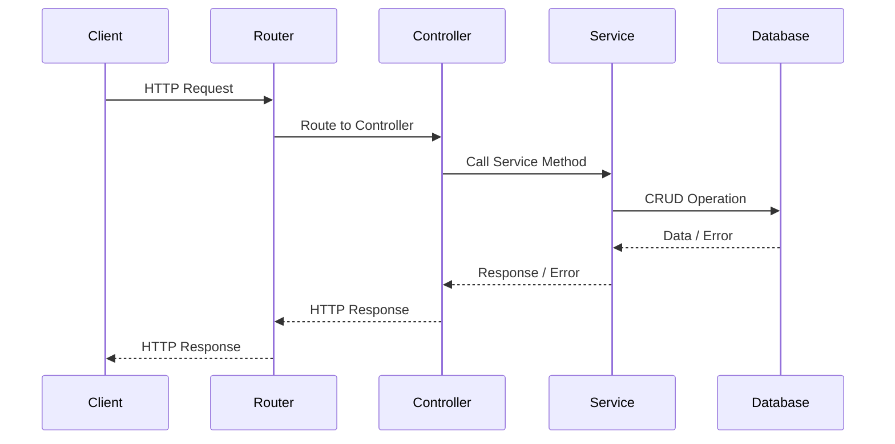

# API Structuring

In this lesson, we will explore API structuring and its importance. Proper API structuring makes the API more readable, manageable, and modifiable.


Image source: Dall-E by OpenAI

- [API Structuring](#api-structuring)
  - [Learning Outcomes](#learning-outcomes)
  - [Why is API Structuring Important?](#why-is-api-structuring-important)
  - [Models](#models)
  - [Controllers](#controllers)
  - [Services](#services)
  - [Routers](#routers)
  - [Flow Diagram](#flow-diagram)

## Learning Outcomes

By the end of this lesson, you will be able to:

- Explain why API structuring is important.
- Describe the principles of API structuring, such as models, controllers, services, and routers.
- Explain how API structuring helps manage and develop the API better.

## Why is API Structuring Important?

If all API code is written in a single file, it quickly becomes difficult to read, manage, and modify. Therefore, it’s good practice to divide the API into different modules, each dealing with a specific aspect.

There are several different ways and principles for structuring an API, but generally, the most important aspects are that the API is readable, manageable, and modifiable.

In this material, we will use the following principles for API structuring:

- Each resource is divided into at least four modules: `model`, `controller`, `service`, and `router`.
- Each module is in a separate file.
- Each resource-related module is in a directory named after the resource.

For example:

```text
src
├───components
│   ├───users
│   │   ├───usersControllers.js
│   │   ├───usersModels.js
│   │   ├───usersRouters.js
│   │   └───usersServices.js
│   └───...
app.js
...
```

## Models

A model is a module that describes the structure of a resource. Using a model, you can define which fields a resource has, which fields are required, which are optional, and so on.

## Controllers

Controllers act as intermediaries between HTTP requests and responses and application logic. Typically, controllers are responsible for the following tasks:

- **Request Data Validation**: Are the received request parameters, body, or headers correct?
- **Request Routing**: Routing the request to the appropriate service or utility for further processing.
- **Error Handling**: Checking the existence and correctness of data returned by the service. If an error occurs, format it as a suitable HTTP error response.
- **Response Formatting**: Formatting the data received from the service into an appropriate HTTP response.
- **Request/Response Logging**: Logging requests and responses when necessary.
- **Security**: Implementing authentication and authorization as needed.

These functions and activities may vary based on application requirements, and some functions can be delegated to middleware.

## Services

Services contain business or application logic and are therefore independent of controllers. Services deal with tasks such as:

- **Data Management**: Performing CRUD (Create, Read, Update, Delete) operations against a database or another data source.
- **Business Rules**: Calculations, validation, or data transformation, etc.
- **Third-party Integration**: Connecting to third-party services/APIs for data retrieval/sending.
- **Cache Management**: Improving performance using caching.
- **Error Handling**: Managing errors and passing them to the controller.

## Routers

Routers are modules responsible for directing requests to the appropriate controller. A router examines which resource and which request method the request is for, and directs it to the corresponding resource controller.

## Flow Diagram

The previously mentioned example is illustrated by the following diagram:



1. **Client**: The user or system sending an HTTP request to the API.
2. **Router**: The router decides which controller should handle the request.
3. **Controller**: The controller validates the request and calls the appropriate service.
4. **Service**: The service contains business and application logic and interacts with the database or another resource.
5. **Database**: The database from which the service retrieves or stores data.

- The client sends an HTTP request, which first reaches the router.
- The router directs the request to the appropriate controller.
- The controller invokes the appropriate service method.
- The service performs the necessary CRUD operation on the database.
- The database responds to the service, which in turn forwards this information or error to the controller.
- The controller formats and sends the HTTP response, which goes through the router and returns to the client.
