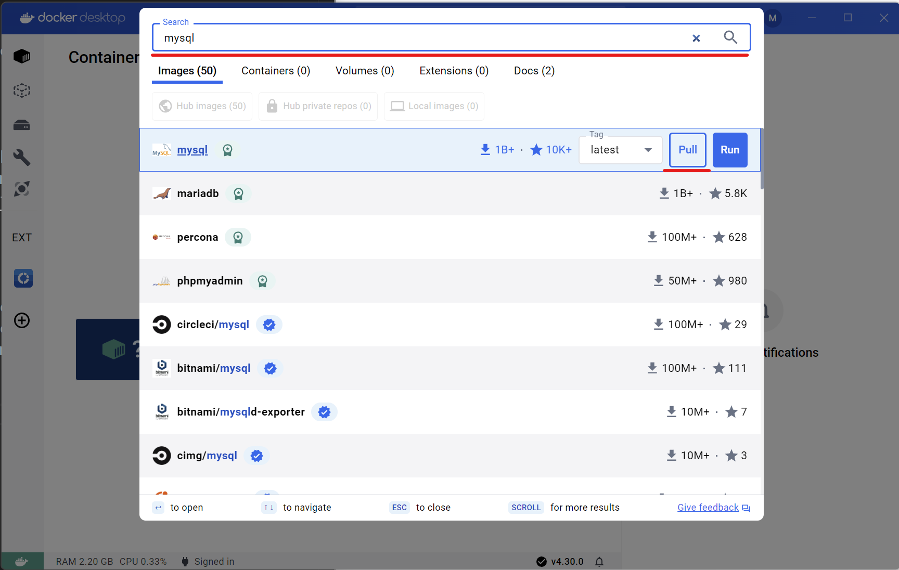
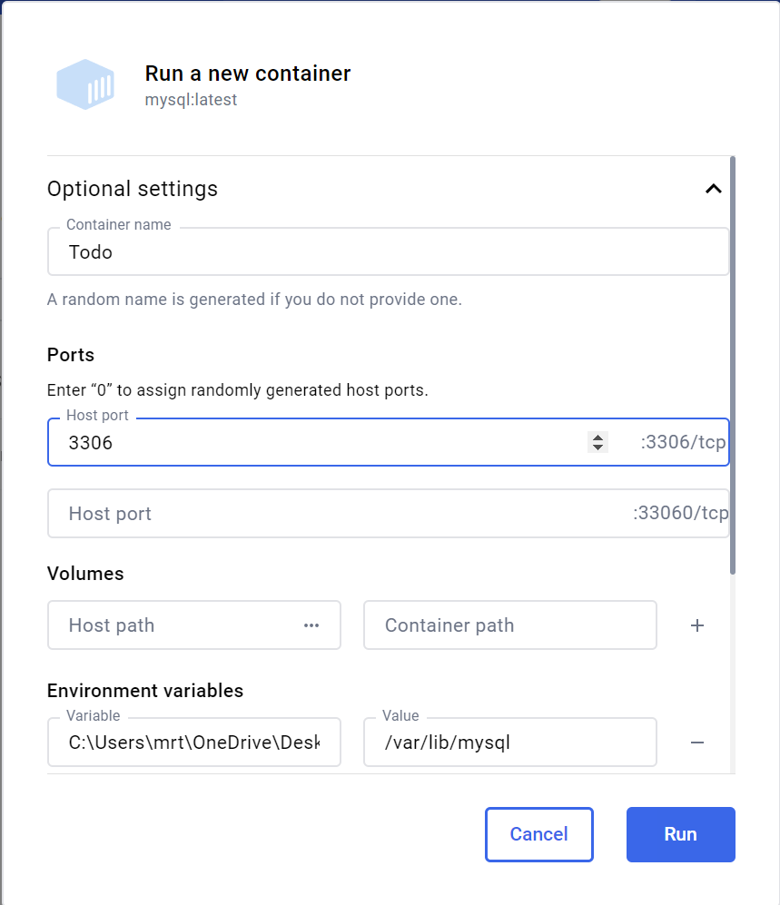

# MySQL in Docker

In this chapter, we will discuss using MySQL in a Docker container.


Image source: Dall-E by OpenAI

- [MySQL in Docker](#mysql-in-docker)
  - [Learning Outcomes](#learning-outcomes)
  - [Creating a MySQL Image and Container in Docker Desktop](#creating-a-mysql-image-and-container-in-docker-desktop)
  - [Creating a MySQL Container via Terminal](#creating-a-mysql-container-via-terminal)
  - [Sources](#sources)
  - [Exercises](#exercises)

## Learning Outcomes

By the end of this chapter, learners should be able to:

- Pull and run a MySQL Docker container;
- Configure the MySQL container for use.

One of the easiest ways to use MySQL on your computer is through Docker. To use Docker, Docker Desktop must be installed on your computer. If it is not installed yet, you can download it [here](https://www.docker.com/products/docker-desktop).

## Creating a MySQL Image and Container in Docker Desktop

First, we launch Docker Desktop and search for the MySQL image on Docker Hub. To do this, type `mysql` into the search bar at the top of the Docker Desktop window and click the `Pull` button next to the first result to download the official MySQL image to your computer.



Next, go to the `Images` section on the left menu and click the `Run` button next to the MySQL image in the `Actions` column.


In the `Run a new container` window that opens, select `Optional settings` and fill in the required fields:

- **Container name:** The name of the container to be created.
- **Ports:** The port on which MySQL will accept queries (default is 3306).
- **Volumes:** If you want the container’s data to be stored on your computer, you need to define a folder for the data and map it to the container’s folder.
- **Environment variables:** These can be used to set various MySQL settings, such as username, password, etc.
  - `MYSQL_ROOT_PASSWORD`: The password for the MySQL root user.
  - `MYSQL_DATABASE`: The name of the database to be created.
  - `MYSQL_USER`: The name of the user to be created.
  - `MYSQL_PASSWORD`: The password for the user to be created.
  - ...



After configuring the settings, click `Run`, which will create and start the container.

As a result, we will have a running MySQL container, which can be accessed via the terminal (also available in Docker Desktop), connected to an SQL tool (like SQLTools in VS Code), or used by our own application that utilizes the MySQL database.

## Creating a MySQL Container via Terminal

If you prefer to create the MySQL container via the terminal, you can use the following command to create a container with the same settings:

// Database name: todos, root password: super-secret, user: todo-user, user password: my-secret, volume: docker folder `mysql-data` mapped to the container folder `/var/lib/mysql`

```bash
docker run --name mysql-todo -e MYSQL_ROOT_PASSWORD=super-secret -e MYSQL_DATABASE=todos -e MYSQL_USER=todo-user -e MYSQL_PASSWORD=my-secret -p 3306:3306 -v mysql-data:/var/lib/mysql -d mysql
```

When you run this command, the MySQL container will be created with the following settings:

- **Database name:** `todos`
- **Root user password:** `super-secret`
- **User:** `todo-user`
- **User password:** `my-secret`
- **Port:** `3306`
- **Volume:** `mysql-data`, mapped to the container folder `/var/lib/mysql`
- **Container name:** `mysql-todo`
- **Image:** mysql
- The container will run in the background (detach mode).

To check if the container is running, you can use the following command:

```bash
docker ps
```

Now, we have an environment where we can use the MySQL database. If desired, we can easily stop, delete, or restart it. We can also create new containers using the same MySQL image.

## Sources

- [Docker Official Documentation](https://docs.docker.com/)
- [MySQL Official Docker Image](https://hub.docker.com/_/mysql)
- [Docker Hub](https://hub.docker.com/)

## Exercises

- Create a MySQL container in Docker Desktop on your computer using settings that suit you.
