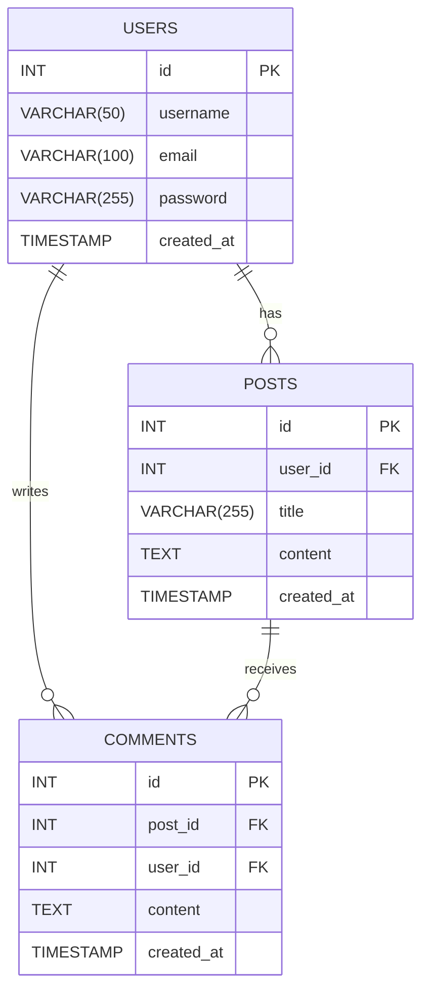

# MySQL: Creating, Modifying, and Deleting Tables

MySQL is a powerful relational database management system widely used for managing data in applications, including web applications. With MySQL, you can create databases and tables, define field types and attributes, modify existing tables, and delete tables and their data. This guide covers the basics of creating, modifying, and deleting MySQL tables, with practical examples using a database for a blogging application containing users, posts, and comments tables.

## Learning Outcomes

By the end of this guide, learners should be able to:

- Understand the principles of creating MySQL tables.
- Create tables by defining field types and attributes.
- Modify existing tables by adding, deleting, or altering columns.
- Delete tables from a database.
- Use basic commands to manage databases and tables.

## Database Schema Example



## Creating Tables

### Creating a Database

Before creating tables, you need to create a database to store them.

```sql
CREATE DATABASE blog;
USE blog;
```

### Creating a Table

Use the `CREATE TABLE`  command, followed by the table name and column definitions.


#### Independent Table

```sql
CREATE TABLE users (
    id INT AUTO_INCREMENT PRIMARY KEY,
    username VARCHAR(50) NOT NULL,
    email VARCHAR(100) NOT NULL,
    password VARCHAR(255) NOT NULL,
    created_at TIMESTAMP DEFAULT CURRENT_TIMESTAMP
);
```

### Field Types and Attributes

#### Field Types

- **INT**: Integer, used for numeric values.s.
- **VARCHAR(n)**: Variable-length string with a maximum length of `n` 
- **TEXT**: Long textual data.
- **DATE**: Date.
- **DATETIME**: Date and time.
- **TIMESTAMP**: Auto-updated date and time.
- **BOOLEAN**: True or false.
  
#### Field Attributes

- **PRIMARY KEY**: Uniquely identifies each row in a table.
- **AUTO_INCREMENT**: Automatically increments numeric values.
- **NOT NULL**: Ensures the column cannot contain null values.
- **DEFAULT**: Sets a default value for the column.

### Blogging Application Example


#### Users Table

```sql
CREATE TABLE users (
    id INT AUTO_INCREMENT PRIMARY KEY,
    username VARCHAR(50) NOT NULL,
    email VARCHAR(100) NOT NULL,
    password VARCHAR(255) NOT NULL,
    created_at TIMESTAMP DEFAULT CURRENT_TIMESTAMP
);
```

#### Posts Table


```sql
CREATE TABLE posts (
    id INT AUTO_INCREMENT PRIMARY KEY,
    user_id INT NOT NULL,
    title VARCHAR(255) NOT NULL,
    content TEXT NOT NULL,
    created_at TIMESTAMP DEFAULT CURRENT_TIMESTAMP,
    FOREIGN KEY (user_id) REFERENCES users(id)
);
```


#### Comments Table

```sql
CREATE TABLE comments (
    id INT AUTO_INCREMENT PRIMARY KEY,
    post_id INT NOT NULL,
    user_id INT NOT NULL,
    content TEXT NOT NULL,
    created_at TIMESTAMP DEFAULT CURRENT_TIMESTAMP,
    FOREIGN KEY (post_id) REFERENCES posts(id),
    FOREIGN KEY (user_id) REFERENCES users(id)
);
```

## Modifying Tables

Tables often need adjustments, such as adding or deleting columns or changing column attributes.

### Adding a Column

Use the `ALTER TABLE` command with the  `ADD` clause.


### Deleting a Column

Use the  `ALTER TABLE` command with the  `DROP COLUMN` clause.

#### Example: Deleting a Column

```sql
ALTER TABLE users DROP COLUMN bio;
```

### Modifying a Column

#### Change a Column's Type

```sql
ALTER TABLE users MODIFY COLUMN email VARCHAR(150);
```

#### Example: Rename a Column

```sql
ALTER TABLE users CHANGE COLUMN username user_name VARCHAR(50);
```


#### Example: Adding Multiple Columns

```sql
ALTER TABLE users 
ADD COLUMN bio TEXT,
ADD COLUMN date_of_birth DATE;
```

### Adding Columns to Comments Table

```sql
ALTER TABLE comments 
ADD COLUMN is_approved BOOLEAN DEFAULT FALSE,
ADD COLUMN likes INT DEFAULT 0;
```

### Adding Columns to Posts Table


```sql
ALTER TABLE posts 
ADD COLUMN category VARCHAR(50),
ADD COLUMN tags VARCHAR(255);
```

### Adding and Modifying Columns Together

```sql
ALTER TABLE users 
ADD COLUMN phone_number VARCHAR(15),
MODIFY COLUMN password VARCHAR(500);
```

## Deleting Tables

To delete a table from the database, use the `DROP TABLE` command. This permanently removes the table and its data.

### Deleting a Table

```sql
DROP TABLE comments;
```

#### Deleting Multiple Tables

```sql
DROP TABLE posts, users;
```

## Full Example: Creating, Modifying, and Deleting Tables

### Creating Tables

```sql
CREATE DATABASE blog;
USE blog;

CREATE TABLE users (
    id INT AUTO_INCREMENT PRIMARY KEY,
    username VARCHAR(50) NOT NULL,
    email VARCHAR(100) NOT NULL,
    password VARCHAR(255) NOT NULL,
    created_at TIMESTAMP DEFAULT CURRENT_TIMESTAMP
);

CREATE TABLE posts (
    id INT AUTO_INCREMENT PRIMARY KEY,
    user_id INT NOT NULL,
    title VARCHAR(255) NOT NULL,
    content TEXT NOT NULL,
    created_at TIMESTAMP DEFAULT CURRENT_TIMESTAMP,
    FOREIGN KEY (user_id) REFERENCES users(id)
);

CREATE TABLE comments (
    id INT AUTO_INCREMENT PRIMARY KEY,
    post_id INT NOT NULL,
    user_id INT NOT NULL,
    content TEXT NOT NULL,
    created_at TIMESTAMP DEFAULT CURRENT_TIMESTAMP,
    FOREIGN KEY (post_id) REFERENCES posts(id),
    FOREIGN KEY (user_id) REFERENCES users(id)
);
```

### Modifying Tables

```sql
-- Veeru lisamine kasutajate tabelisse
ALTER TABLE users ADD COLUMN bio TEXT;

-- Veeru kustutamine kasutajate tabelist
ALTER TABLE users DROP COLUMN bio;

-- Veeru tüübi muutmine
ALTER TABLE users MODIFY COLUMN email VARCHAR(150);

-- Veeru nime muutmine
ALTER TABLE users CHANGE COLUMN username user_name VARCHAR(50);

-- Mitme veeru lisamine kommentaaride tabelisse
ALTER TABLE comments 
ADD COLUMN is_approved BOOLEAN DEFAULT FALSE,
ADD COLUMN likes INT DEFAULT 0;

-- Mitme veeru lisamine postituste tabelisse
ALTER TABLE posts 
ADD COLUMN category VARCHAR(50),
ADD COLUMN tags VARCHAR(255);

-- Veergude lisamine ja muutmine kasutajate tabelis
ALTER TABLE users 
ADD COLUMN phone_number VARCHAR(15),
MODIFY COLUMN password VARCHAR(500);
```

### Deleting Tables

```sql
-- Kommentaaride tabeli kustutamine
DROP TABLE comments;

-- Mitme tabeli kustutamine
DROP TABLE posts, users;
```
