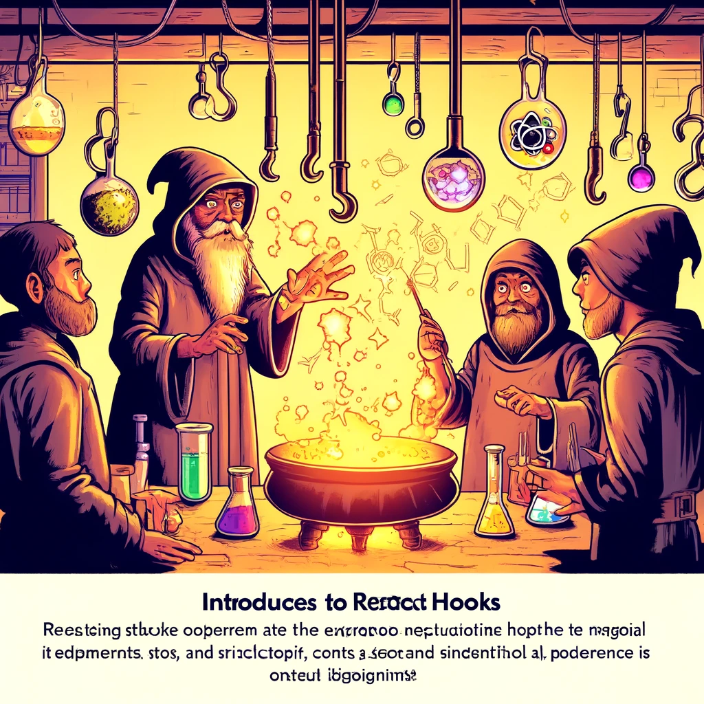

# React Hooks

React Hooks are functions that allow you to use state and other React features in functional components. Hooks enable you to manage state, trigger side effects, and utilize other React functionalities without relying on class components. Introduced in React version 16.8, Hooks have significantly simplified and empowered the use and management of functional components.



Source: Dall-E by OpenAI

- [React Hooks](#react-hooks)
  - [Learning Outcomes](#learning-outcomes)
  - [Basics of Hooks](#basics-of-hooks)
    - [What are Hooks?](#what-are-hooks)
    - [Rules of Hooks](#rules-of-hooks)
  - [`useState` Hook](#usestate-hook)
    - [Example: Using the `useState` Hook](#example-using-the-usestate-hook)
  - [`useEffect` Hook](#useeffect-hook)
    - [Example: Using the `useEffect` Hook](#example-using-the-useeffect-hook)
  - [Other Common Hooks](#other-common-hooks)
    - [`useContext` Hook](#usecontext-hook)
    - [Example: Using the `useContext` Hook](#example-using-the-usecontext-hook)
    - [`useReducer` Hook](#usereducer-hook)
    - [Example: Using the `useReducer` Hook](#example-using-the-usereducer-hook)
    - [`useRef` Hook](#useref-hook)
    - [Example: Using the `useRef` Hook](#example-using-the-useref-hook)
  - [Custom Hooks](#custom-hooks)
    - [Example: Creating a Custom Hook](#example-creating-a-custom-hook)
  - [Sources](#sources)
  - [Questions and Exercises](#questions-and-exercises)
  - [Exercise](#exercise)

---

## Learning Outcomes

By the end of this chapter, learners will be able to:

- Explain what Hooks are and why they are used.
- Use the `useState` Hook for state management in functional components.
- Use the `useEffect` Hook for handling side effects.
- Describe and utilize other common hooks like `useContext`, `useReducer`, and `useRef`.
- Create custom hooks for reusable logic.

---

## Basics of Hooks

### What are Hooks?

Hooks are special functions that allow you to use state and other React features in functional components. They follow certain rules, such as only being called at the top level of a component or custom hook.

### Rules of Hooks

- **Call Hooks only at the top level:** Do not call Hooks inside loops, conditions, or nested functions.
- **Call Hooks only in React functional components or custom hooks:** Avoid using Hooks outside of these contexts.

---

## `useState` Hook

The `useState` Hook allows components to manage and update their state. It returns an array containing the current state value and a function to update it.

### Example: Using the `useState` Hook

```javascript
import React, { useState } from 'react';

function Counter() {
  const [count, setCount] = useState(0);

  return (
    <div>
      <p>You clicked {count} times</p>
      <button onClick={() => setCount(count + 1)}>
        Click me
      </button>
    </div>
  );
}

export default Counter;
```

## `useEffect` Hook

The `useEffect` Hook allows you to perform side effects in functional components, such as fetching data, setting up subscriptions, or manipulating the DOM. By default, `useEffect` runs after every render.

### Example: Using the `useEffect` Hook

```javascript
import React, { useState, useEffect } from 'react';

function Example() {
  const [count, setCount] = useState(0);

  useEffect(() => {
    document.title = `You clicked ${count} times`;

    return () => {
      // Cleanup, kui component unmountitakse või effect uuendatakse
      console.log('Cleanup');
    };
  }, [count]); // Ainult kui count muutub

  return (
    <div>
      <p>You clicked {count} times</p>
      <button onClick={() => setCount(count + 1)}>
        Click me
      </button>
    </div>
  );
}

export default Example;
```

## Other Common Hooks

### `useContext` Hook

The `useContext` Hook allows you to access context values in a component tree without prop drilling.

### Example: Using the useContext Hook

```javascript
import React, { createContext, useContext, useState } from 'react';

const MyContext = createContext();

function MyProvider({ children }) {
  const [value, setValue] = useState("Hello from Context!");

  return (
    <MyContext.Provider value={value}>
      {children}
    </MyContext.Provider>
  );
}

function MyComponent() {
  const value = useContext(MyContext);
  return <p>{value}</p>;
}

function App() {
  return (
    <MyProvider>
      <MyComponent />
    </MyProvider>
  );
}

export default App;
```

### `useReducer` Hook

The `useReducer` Hook is an alternative to `useState` , suitable for managing complex state logic that involves multiple sub-values or actions.

### Example: Using the useReducer Hook

```javascript
import React, { useReducer } from 'react';

const initialState = { count: 0 };

function reducer(state, action) {
  switch (action.type) {
    case 'increment':
      return { count: state.count + 1 };
    case 'decrement':
      return { count: state.count - 1 };
    default:
      throw new Error();
  }
}

function Counter() {
  const [state, dispatch] = useReducer(reducer, initialState);

  return (
    <div>
      <p>Count: {state.count}</p>
      <button onClick={() => dispatch({ type: 'increment' })}>+</button>
      <button onClick={() => dispatch({ type: 'decrement' })}>-</button>
    </div>
  );
}

export default Counter;
```

### `useRef` Hook

The `useRef` Hook lets you persist references to DOM elements or other values across renders.

### Example: Using the useRef Hook

```javascript
import React, { useRef } from 'react';

function TextInputWithFocusButton() {
  const inputEl = useRef(null);

  const onButtonClick = () => {
    inputEl.current.focus();
  };

  return (
    <div>
      <input ref={inputEl} type="text" />
      <button onClick={onButtonClick}>Focus the input</button>
    </div>
  );
}

export default TextInputWithFocusButton;
```

## Custom Hooks

Custom hooks let you reuse logic across components. A custom hook is just a JavaScript function that uses other hooks.

### Example: Creating a Custom Hook

```javascript
import React, { useState, useEffect } from 'react';

function useWindowWidth() {
  const [width, setWidth] = useState(window.innerWidth);

  useEffect(() => {
    const handleResize = () => setWidth(window.innerWidth);
    window.addEventListener('resize', handleResize);
    return () => window.removeEventListener('resize', handleResize);
  }, []);

  return width;
}

function App() {
  const width = useWindowWidth();

  return <div>Window width: {width}</div>;
}

export default App;
```

## Sources

- [React Official Documentation - Hooks](https://reactjs.org/docs/hooks-intro.html)
- [React Hooks API Reference](https://reactjs.org/docs/hooks-reference.html)
- [JavaScript Front-End Frameworks and Libraries](https://www.javascriptstuff.com/)

## Questions and Exercises

- What are hooks, and why are they used in React?
- How do you use the `useState` Hook for managing state?
- Explain the `useEffect` Hook and how it is used for handling side effects.
- How do you use the `useContext` Hook to access context values?
- When is it recommended to use the`useReducer` hook?

## Harjutus

- Create a new React project using Create React App.
- Create a component that uses the  `useState` Hook to manage and display a click count.
- Create a component that uses the `useEffect` Hook to update the document title based on state.
