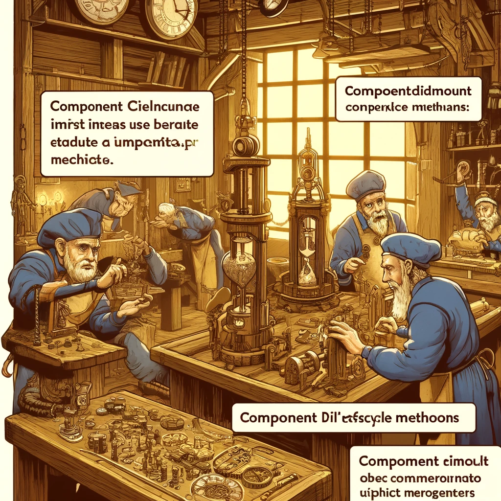

# React Lifecycle Methods

React lifecycle methods enable developers to execute code at specific points during a component's lifecycle. These methods are particularly important in class-based components, allowing control over component creation, updating, and removal. This chapter explores React lifecycle methods, their use cases, and practical examples.



Image Source: Dall-E by OpenAI

- [React Lifecycle Methods](#react-lifecycle-methods)
  - [Learning Outcomes](#learning-outcomes)
  - [React Lifecycle Methods in Class-Based Components](#react-lifecycle-methods-in-class-based-components)
    - [Creation Phase](#creation-phase)
    - [Updating Phase](#updating-phase)
    - [Unmounting Phase](#unmounting-phase)
  - [Lifecycle Methods in Functional Components](#lifecycle-methods-in-functional-components)
    - [`useEffect` Hook](#useeffect-hook)
      - [componentDidMount and componentWillUnmount](#componentdidmount-and-componentwillunmount)
      - [componentDidUpdate](#componentdidupdate)
  - [Practical Example: Full Lifecycle Methods Usage](#practical-example-full-lifecycle-methods-usage)
    - [Class-Based Component](#class-based-component)
    - [Functional Component with Hooks](#functional-component-with-hooks)
  - [References](#references)
  - [Review Questions or Exercises](#review-questions-or-exercises)
  - [Exercise](#exercise)

---

## Learning Outcomes

By the end of this chapter, learners should be able to:

- Explain what React lifecycle methods are and why they are used.
- Use various lifecycle methods in class-based components.
- Manage component creation, updates, and unmounting with lifecycle methods.
- Understand lifecycle management in functional components using hooks.

---

## React Lifecycle Methods in Class-Based Components

React lifecycle methods can be divided into three main phases: creation, updating, and unmounting.

---

### Creation Phase

1. **`constructor(props)`**: Invoked during component creation, typically used to set the initial state and bind methods.

```javascript
class MyComponent extends React.Component {
  constructor(props) {
    super(props);
    this.state = { count: 0 };
  }
  
  render() {
    return <div>{this.state.count}</div>;
  }
}
```

1. **componentDidMount()**: Invoked immediately after the component is mounted. Commonly used for data fetching or DOM manipulations.
2. 
```javascript
class MyComponent extends React.Component {
  componentDidMount() {
    console.log("Component did mount");
  }
  
  render() {
    return <div>Component</div>;
  }
}
```

### Updating Phase

1. **shouldComponentUpdate(nextProps, nextState)**: Determines whether a component should re-render when props or state change. Useful for performance optimization.

```javascript
class MyComponent extends React.Component {
  shouldComponentUpdate(nextProps, nextState) {
    return nextState.count !== this.state.count;
  }
  
  render() {
    return <div>{this.state.count}</div>;
  }
}
```

2. **componentDidUpdate(prevProps, prevState)**: Invoked immediately after updating. Commonly used for DOM updates or network requests based on updated props or state.

```javascript
class MyComponent extends React.Component {
  componentDidUpdate(prevProps, prevState) {
    if (prevState.count !== this.state.count) {
      console.log("Component did update");
    }
  }
  
  render() {
    return <div>{this.state.count}</div>;
  }
}
```

### Unmounting Phase

1. **componentWillUnmount()**: Invoked just before a component is removed from the DOM. Useful for cleanup tasks like removing event listeners or cancelling network requests.

```javascript
class MyComponent extends React.Component {
  componentWillUnmount() {
   
    console.log("Component will unmount");
  }
  
  render() {
    return <div>Component</div>;
  }
}
```

## Lifecycle Methods in Functional Components

In functional components, lifecycle management is handled using hooks, primarily the `useEffect` hook.

### `useEffect` Hook

The `useEffect` hook enables managing side effects in functional components and simulates class-based lifecycle methods.

#### componentDidMount ja componentWillUnmount

```javascript
import React, { useEffect } from 'react';

function MyComponent() {
  useEffect(() => {
    console.log("Component did mount");
    
    return () => {
      console.log("Component will unmount");
    };
  }, []); // Empty dependency array ensures the effect runs only once
  
  return <div>Component</div>;
}
```

#### componentDidUpdate

```javascript
import React, { useState, useEffect } from 'react';

function MyComponent() {
  const [count, setCount] = useState(0);

  useEffect(() => {
    console.log("Component did update", count);
  }, [count]); // Effect runs only when `count` changes
  
  return (
    <div>
      <p>{count}</p>
      <button onClick={() => setCount(count + 1)}>Increment</button>
    </div>
  );
}

```

## Practical Example: Full Lifecycle Methods Usage

### Class-Based Component

```javascript
import React from 'react';

class MyComponent extends React.Component {
  constructor(props) {
    super(props);
    this.state = { count: 0 };
    this.increment = this.increment.bind(this);
  }

  increment() {
    this.setState({ count: this.state.count + 1 });
  }

  componentDidMount() {
    console.log("Component did mount");
  }

  shouldComponentUpdate(nextProps, nextState) {
    return nextState.count !== this.state.count;
  }

  componentDidUpdate(prevProps, prevState) {
    if (prevState.count !== this.state.count) {
      console.log("Component did update");
    }
  }

  componentWillUnmount() {
    console.log("Component will unmount");
  }

  render() {
    return (
      <div>
        <p>Count: {this.state.count}</p>
        <button onClick={this.increment}>Increment</button>
      </div>
    );
  }
}

export default MyComponent;
```

### Functional Component with Hooks

```javascript
import React, { useState, useEffect } from 'react';

function MyComponent() {
  const [count, setCount] = useState(0);

  useEffect(() => {
    console.log("Component did mount");

    return () => {
      console.log("Component will unmount");
    };
  }, []);

  useEffect(() => {
    console.log("Component did update", count);
  }, [count]);

  return (
    <div>
      <p>Count: {count}</p>
      <button onClick={() => setCount(count + 1)}>Increment</button>
    </div>
  );
}

export default MyComponent;
```

## References

- [React Official Documentation - State and Lifecycle](https://reactjs.org/docs/state-and-lifecycle.html)
- [React Official Documentation - Hooks API Reference](https://reactjs.org/docs/hooks-reference.html)
- [JavaScript Front-End Frameworks and Libraries](https://www.javascriptstuff.com/)

## Review Questions or Exercises

- What are React lifecycle methods, and why are they used?
- Explain the differences between componentDidMount and componentWillUnmount.
- How is shouldComponentUpdate used, and why is it beneficial?
- Explain how to use the useEffect hook in functional components.
- Create an example that demonstrates component creation, updating, and unmounting using lifecycle methods.

## Exercise

- Create a class-based component that displays a data list, fetches data from a server using componentDidMount, and updates the list using componentDidUpdate.
- Create a functional component that achieves the same functionality using the useEffect hook.
- Test component unmounting and ensure proper cleanup is performed using componentWillUnmount or the cleanup function in useEffect.
