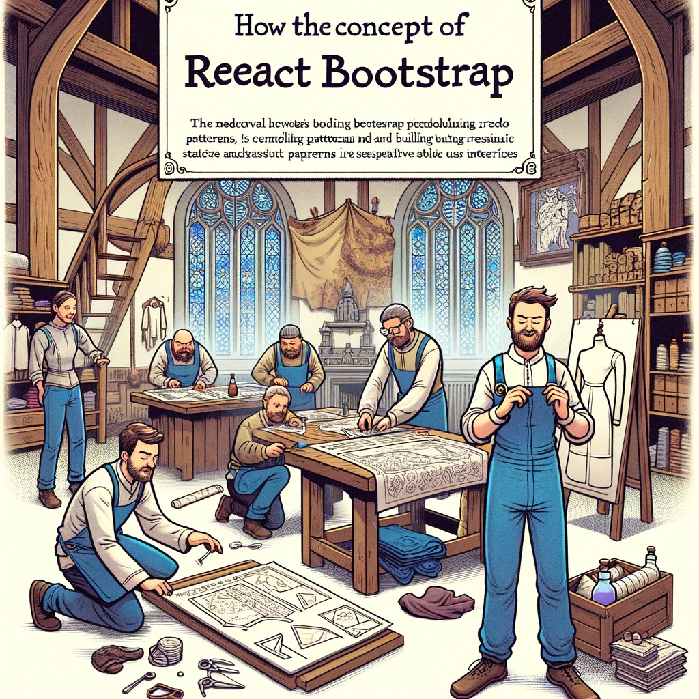

# React and Bootstrap: How to Use

Bootstrap is a popular open-source CSS framework that allows for quickly and easily creating attractive and mobile-friendly web pages. By combining Bootstrap with React, you can build user interfaces that are both functional and visually appealing. This chapter covers how to use React with Bootstrap, including installing the necessary libraries and creating components.



Image Source: Dall-E by OpenAI

- [React and Bootstrap: How to Use](#react-and-bootstrap-how-to-use)
  - [Learning Outcomes](#learning-outcomes)
  - [Installing and Setting Up Bootstrap](#installing-and-setting-up-bootstrap)
    - [Bootstrap and React Bootstrap](#bootstrap-and-react-bootstrap)
      - [Installing Bootstrap and React Bootstrap](#installing-bootstrap-and-react-bootstrap)
  - [Using React Bootstrap Components](#using-react-bootstrap-components)
    - [Example: Button](#example-button)
    - [Example: Navigation Bar](#example-navigation-bar)
    - [Example: Form](#example-form)
  - [Customizing Bootstrap Styles](#customizing-bootstrap-styles)
    - [Custom CSS](#custom-css)
    - [Custom Bootstrap Themes](#custom-bootstrap-themes)
  - [Resources](#resources)
  - [Practice Questions or Exercises](#practice-questions-or-exercises)
  - [Exercise](#exercise)

## Learning Outcomes

By the end of this chapter, learners should be able to:

- Install and set up Bootstrap in a React project;
- Create and use React Bootstrap components;
- Customize Bootstrap styles to meet project requirements.

## Installing and Setting Up Bootstrap

### Bootstrap and React Bootstrap

To use Bootstrap in a React project, you can use the React Bootstrap library, which provides a complete set of Bootstrap components built specifically for React.

#### Installing Bootstrap and React Bootstrap

- Install Bootstrap and React Bootstrap via npm:

```bash
npm install bootstrap react-bootstrap
```

- Import Bootstrap CSS into your `index.js` or `App.js` file:

```javascript
import 'bootstrap/dist/css/bootstrap.min.css';
```

## Using React Bootstrap Components

### Example: Button

React Bootstrap offers various components, such as buttons, navigation bars, forms, and more. Here's an example of creating a simple button.

```javascript
import React from 'react';
import { Button } from 'react-bootstrap';

function App() {
  return (
    <div className="App">
      <Button variant="primary">Primary Button</Button>
    </div>
  );
}

export default App;
```

### Example: Navigation Bar

Creating a navigation bar with React Bootstrap is straightforward.

```javascript
import React from 'react';
import { Navbar, Nav, NavDropdown } from 'react-bootstrap';

function NavigationBar() {
  return (
    <Navbar bg="light" expand="lg">
      <Navbar.Brand href="#home">React Bootstrap</Navbar.Brand>
      <Navbar.Toggle aria-controls="basic-navbar-nav" />
      <Navbar.Collapse id="basic-navbar-nav">
        <Nav className="mr-auto">
          <Nav.Link href="#home">Home</Nav.Link>
          <Nav.Link href="#link">Link</Nav.Link>
          <NavDropdown title="Dropdown" id="basic-nav-dropdown">
            <NavDropdown.Item href="#action/3.1">Action</NavDropdown.Item>
            <NavDropdown.Item href="#action/3.2">Another action</NavDropdown.Item>
            <NavDropdown.Item href="#action/3.3">Something</NavDropdown.Item>
            <NavDropdown.Divider />
            <NavDropdown.Item href="#action/3.4">Separated link</NavDropdown.Item>
          </NavDropdown>
        </Nav>
      </Navbar.Collapse>
    </Navbar>
  );
}

export default NavigationBar;
```

### Example: Form

Using Bootstrap form components with React Bootstrap.

```javascript
import React, { useState } from 'react';
import { Form, Button } from 'react-bootstrap';

function ContactForm() {
  const [formData, setFormData] = useState({
    name: '',
    email: '',
    message: ''
  });

  const handleChange = (e) => {
    const { name, value } = e.target;
    setFormData({ ...formData, [name]: value });
  };

  const handleSubmit = (e) => {
    e.preventDefault();
    console.log(formData);
  };

  return (
    <Form onSubmit={handleSubmit}>
      <Form.Group controlId="formName">
        <Form.Label>Name</Form.Label>
        <Form.Control
          type="text"
          placeholder="Enter your name"
          name="name"
          value={formData.name}
          onChange={handleChange}
        />
      </Form.Group>
      <Form.Group controlId="formEmail">
        <Form.Label>Email address</Form.Label>
        <Form.Control
          type="email"
          placeholder="Enter your email"
          name="email"
          value={formData.email}
          onChange={handleChange}
        />
      </Form.Group>
      <Form.Group controlId="formMessage">
        <Form.Label>Message</Form.Label>
        <Form.Control
          as="textarea"
          rows={3}
          placeholder="Enter your message"
          name="message"
          value={formData.message}
          onChange={handleChange}
        />
      </Form.Group>
      <Button variant="primary" type="submit">
        Submit
      </Button>
    </Form>
  );
}

export default ContactForm;
```

## Customizing Bootstrap Styles

### Custom CSS

If you want to customize Bootstrap styles, you can add your CSS and override the default styles.

1. Create a CSS file, e.g., `custom.css`.

```css
/* custom.css */
.custom-button {
  background-color: #ff5733;
  border-color: #ff5733;
}
```

2. Import and use your CSS in components.

```javascript
import React from 'react';
import { Button } from 'react-bootstrap';
import './custom.css';

function App() {
  return (
    <div className="App">
      <Button className="custom-button">Custom Button</Button>
    </div>
  );
}

export default App;
```

### Custom Bootstrap Themes

Bootstrap allows theme customization by overriding Sass variables. To do this, you need to install `node-sass`.

1. Install `node-sass`:

```bash
npm install node-sass
```

2. Create a Sass file and override required variables.

```scss
/* custom.scss */
$theme-colors: (
  "primary": #ff5733,
  "secondary": #333333,
);

@import "~bootstrap/scss/bootstrap";
```

3. Import your Sass file in `index.js` or `App.js`.

```javascript
import './custom.scss';
```

## Resources

- [React Bootstrap Official Documentation](https://react-bootstrap.github.io/)
- [Bootstrap Official Documentation](https://getbootstrap.com/)
- [JavaScript Front-End Frameworks and Libraries](https://www.javascriptstuff.com/)
- [Create React App Documentation](https://create-react-app.dev/docs/getting-started/)

## Practice Questions or Exercises

- What is Bootstrap, and how does it help in web development?
- How do you install and set up Bootstrap in a React project?
- Write an example React component using a Bootstrap button.
- How can you customize Bootstrap styles in a React project?

## Exercise

- Create a new React project using Create React App.
- Add Bootstrap and React Bootstrap to the project.
- Create a navigation bar using React Bootstrap components.
- Create a form with fields for name, email, and message using React Bootstrap components.
- Customize one of the Bootstrap components with your CSS and display the results.
