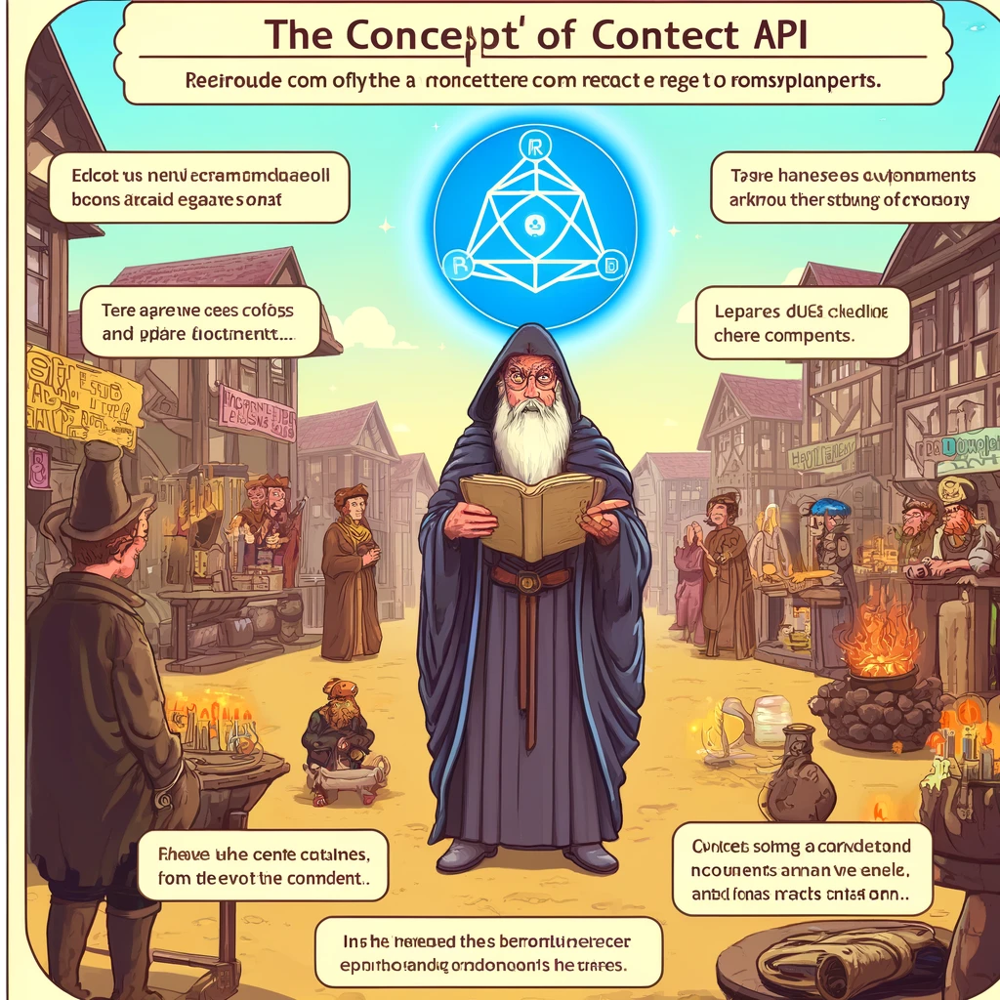

# React Context API

React Context API is a powerful tool that enables you to share values across components without the need to manually pass props through every level of the component tree. It is particularly useful for managing global states like themes, authentication, or language settings.



Image Source: Dall-E by OpenAI

- [React Context API](#react-context-api)
  - [Learning Outcomes](#learning-outcomes)
  - [Understanding React Context API](#understanding-react-context-api)
    - [Creating Context](#creating-context)
    - [Using the `Provider` Component](#using-the-provider-component)
    - [Using the `Consumer` Component](#using-the-consumer-component)
    - [Using the `useContext` Hook](#using-the-usecontext-hook)
  - [Example: Implementing Theme Management with Context API](#example-implementing-theme-management-with-context-api)
    - [Create a Context File](#create-a-context-file)
    - [Wrap the Main App with `ThemeProvider`](#wrap-the-main-app-with-themeprovider)
    - [Consume the Theme Context in a Component](#consume-the-theme-context-in-a-component)
  - [Summary](#summary)
  - [Review Questions](#review-questions)
  - [Exercise](#exercise)
  - [References](#references)

## Learning Outcomes

By the end of this chapter, you should be able to:

- Explain what React Context API is and when to use it.
- Create and configure React Context.
- Consume Context values in different components.
- Manage and update Context values in an application.

---

## Understanding React Context API

### Creating Context

Creating a context starts with the `React.createContext` function. This creates a context object containing `Provider` and `Consumer` components.

```javascript
import React from 'react';

// Create a context object
const MyContext = React.createContext();
```

### Using the `Provider` Components

The `Provider` component specifies the data you want to share. It wraps the components that need access to the context values.

```javascript
// App.js
import React, { useState } from 'react';
import MyContext from './MyContext';
import MyComponent from './MyComponent';

const App = () => {
  const [value, setValue] = useState('Hello, World!');

  return (
    <MyContext.Provider value={{ value, setValue }}>
      <MyComponent />
    </MyContext.Provider>
  );
};

export default App;
```

### Using the`Consumer` Components

The `Consumer` component allows access to context values. While useful in simple cases, `useContext` is often more convenient..

```javascript
// MyComponent.js
import React from 'react';
import MyContext from './MyContext';

const MyComponent = () => (
  <MyContext.Consumer>
    {({ value, setValue }) => (
      <div>
        <p>{value}</p>
        <button onClick={() => setValue('Hello, React!')}>Change Text</button>
      </div>
    )}
  </MyContext.Consumer>
);

export default MyComponent;
```

### Using the `useContext` Hook

The `useContext` hook provides a modern and straightforward way to access context values in functional components.

```javascript
// MyComponent.js
import React, { useContext } from 'react';
import MyContext from './MyContext';

const MyComponent = () => {
  const { value, setValue } = useContext(MyContext);

  return (
    <div>
      <p>{value}</p>
      <button onClick={() => setValue('Hello, React!')}>Change Text</button>
    </div>
  );
};

export default MyComponent;
```

## Example: Implementing Theme Management with Context API

Let's create an example where we manage a light and dark theme using `Provider` and `useContext`.

### Create a Context File

```javascript
// ThemeContext.js
import React, { createContext, useState } from 'react';

export const ThemeContext = createContext();

// children on komponendi alamkomponendid, see tagab, et kõik alamkomponendid saavad konteksti väärtusi
export const ThemeProvider = ({ children }) => {
  const [theme, setTheme] = useState('light');

  const toggleTheme = () => {
    setTheme((prevTheme) => (prevTheme === 'light' ? 'dark' : 'light'));
  };

  return (
    <ThemeContext.Provider value={{ theme, toggleTheme }}>
      {children}
    </ThemeContext.Provider>
  );
};
```

### Wrap the Main App with `ThemeProvider` .

```javascript
// App.js
import React from 'react';
import { ThemeProvider } from './ThemeContext';
import ThemedComponent from './ThemedComponent';

const App = () => (
  <ThemeProvider>
    <ThemedComponent />
  </ThemeProvider>
);

export default App;
```

### Consume the Theme Context in a Componen

```javascript
// ThemedComponent.js
import React, { useContext } from 'react';
import { ThemeContext } from './ThemeContext';

const ThemedComponent = () => {
  const { theme, toggleTheme } = useContext(ThemeContext);

  const styles = {
    light: { background: '#fff', color: '#000' },
    dark: { background: '#000', color: '#fff' },
  };

  return (
    <div style={styles[theme]}>
      <p>The current theme is {theme}</p>
      <button onClick={toggleTheme}>Toggle Theme</button>
    </div>
  );
};

export default ThemedComponent;
```

## Summary

- **React Context API** offers a way to share values across components without "prop drilling."
- **`Provider`** specifies the context values shared across child components.
- **`Consumer` and `useContext`** enable components to consume context values.
- **Context API** is ideal for managing global states like themes or authentication.

## Review Questions

1. What is React Context API, and when should you use it?
2. ow do you create and use a `Provider` component in React Context API?
3. How do you consume context values using the `Consumer` component and `useContext` hook?
4. Why is Context API a better choice compared to prop drilling?

## Exercise

- **LCreate an application to manage language settings (e.g., switching between English and .....) and display greeting text in the selected language.**
- **Use `Provider` and `useContext`to handle the selected language and dynamically update the content of the application.**

## Allikad

- [React Documentation - Context](https://react.dev/reference/react/useContext)
- [React Context API for Beginners](https://www.freecodecamp.org/news/react-context-for-beginners/)
