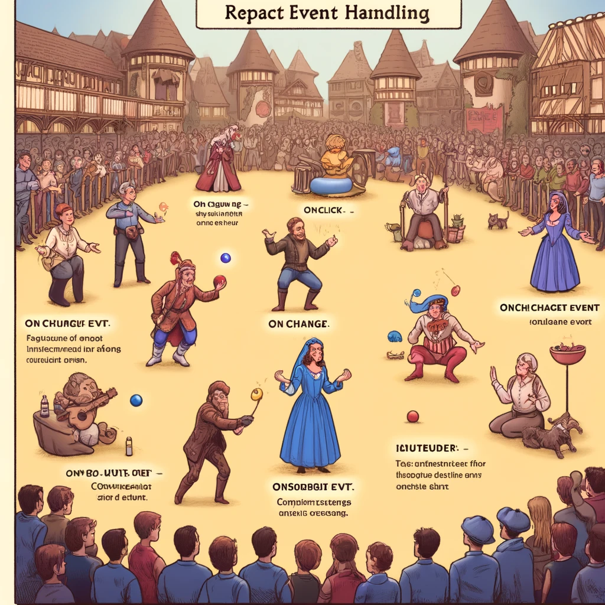

# React Event Handling

Event handling is a crucial part of React applications, allowing developers to respond to user inputs and interactions, such as clicks, input changes, and form submissions. React's approach to event handling is similar to standard DOM event handling but with added optimizations and features for better code readability and maintainability. This guide covers the fundamentals, event types, and best practices for handling events in React.



_Image Source: DALL-E by OpenAI_

- [React Event Handling](#react-event-handling)
  - [Learning Objectives](#learning-objectives)
  - [Understanding Event Handling in React](#understanding-event-handling-in-react)
    - [What is Event Handling?](#what-is-event-handling)
    - [Event Handling Basics](#event-handling-basics)
    - [Example: Event Handling in Functional Components](#example-event-handling-in-functional-components)
      - [Handling Click Events](#handling-click-events)
    - [Example: Event Handling in Class Components](#example-event-handling-in-class-components)
      - [Handling Click Events](#handling-click-events-1)
    - [Event Handling and `this` Context](#event-handling-and-this-context)
      - [Binding in the Constructor](#binding-in-the-constructor)
      - [Using Arrow Functions](#using-arrow-functions)
    - [React Event Types](#react-event-types)
      - [Click Events](#click-events)
      - [Change Events](#change-events)
      - [Form Submissions](#form-submissions)
    - [Synthetic Events](#synthetic-events)
    - [Best Practices for Event Handling](#best-practices-for-event-handling)
  - [Practical Example: Complex Event Handling](#practical-example-complex-event-handling)
    - [State Management and Event Handling](#state-management-and-event-handling)
  - [References](#references)
  - [Review Questions or Exercises](#review-questions-or-exercises)
  - [Exercise](#exercise)

---

## Learning Objectives

By the end of this guide, learners should be able to:

- Explain how event handling works in React.
- Implement event handlers in functional and class components.
- Use event handlers for different event types (e.g., click, change, submit).
- Apply best practices for event handling in React.

---

## Understanding Event Handling in React

### What is Event Handling?

Event handling involves defining functions that respond to user actions, such as clicks, keystrokes, or form submissions. In React, event handling is similar to JavaScript's DOM event handling but includes unique features for better compatibility and consistency.

---

### Event Handling Basics

- **Event Names:** React uses camelCase for event names (e.g., `onClick`, `onChange`).
- **Event Handlers:** Event handlers are functions passed as attributes (e.g., `{this.handleClick}`).
- **Synthetic Events:** React provides synthetic events, a wrapper around browser-native events, to ensure cross-browser compatibility.

---

### Example: Event Handling in Functional Components

#### Handling Click Events

```javascript
import React from 'react';

function App() {
  function handleClick() {
    alert('Button clicked!');
  }

  return (
    <div>
      <button onClick={handleClick}>Click me</button>
    </div>
  );
}

export default App;
```

### Example: Event Handling in Class Components

#### Handling Click Events

```javascript
import React, { Component } from 'react';

class App extends Component {
  handleClick() {
    alert('Button clicked!');
  }

  render() {
    return (
      <div>
        <button onClick={this.handleClick}>Click me</button>
      </div>
    );
  }
}

export default App;
```

### Event Handling and this Context

In class components, you often need to bind event handlers to the component's context using `bind` or arrow functions.

#### Binding in the Constructor

```javascript
class App extends Component {
  constructor(props) {
    super(props);
    this.handleClick = this.handleClick.bind(this);
  }

  handleClick() {
    alert('Button clicked!');
  }

  render() {
    return (
      <div>
        <button onClick={this.handleClick}>Click me</button>
      </div>
    );
  }
}
```

#### Using Arrow Functions

```javascript
class App extends Component {
  handleClick = () => {
    alert('Button clicked!');
  };

  render() {
    return (
      <div>
        <button onClick={this.handleClick}>Click me</button>
      </div>
    );
  }
}
```

### React Event Types

#### Click Events

```javascript
function App() {
  function handleClick() {
    alert('Button clicked!');
  }

  return (
    <button onClick={handleClick}>Click me</button>
  );
}
```

#### Change Events

```javascript
function App() {
  function handleChange(event) {
    console.log('Input value:', event.target.value);
  }

  return (
    <input type="text" onChange={handleChange} />
  );
}
```

#### Form Submissions

```javascript
function App() {
  function handleSubmit(event) {
    event.preventDefault();
    alert('Form submitted!');
  }

  return (
    <form onSubmit={handleSubmit}>
      <button type="submit">Submit</button>
    </form>
  );
}
```

### Synthetic Events

React uses synthetic events, which are consistent event objects across browsers for better compatibility and performance.

```javascript
function App() {
  function handleEvent(event) {
    console.log(event.type); // Näiteks "click"
  }

  return (
    <button onClick={handleEvent}>Click me</button>
  );
}
```

### Best Practices for Event Handling

- **Use Arrow Functions or Bind:** Ensure event handlers are bound to the component context.
- **Avoid Inline Event Handlers:** Inline handlers can cause unnecessary renders and performance issues.
- **Handle Events Synthetic:** Use React's synthetic events for compatibility across browsers.
- **DDebounce and Throttle:** Limit the invocation of handlers for intensive events like scrolling or typing.
- 
## Practical Example: Complex Event Handling

### State Management and Event Handling

```javascript
import React, { useState } from 'react';

function App() {
  const [name, setName] = useState('');
  const [submittedName, setSubmittedName] = useState('');

  function handleChange(event) {
    setName(event.target.value);
  }

  function handleSubmit(event) {
    event.preventDefault();
    setSubmittedName(name);
  }

  return (
    <div>
      <form onSubmit={handleSubmit}>
        <input type="text" value={name} onChange={handleChange} />
        <button type="submit">Submit</button>
      </form>
      {submittedName && <h1>Hello, {submittedName}!</h1>}
    </div>
  );
}

export default App;
```

## References

- [React Official Documentation - Handling Events](https://reactjs.org/docs/handling-events.html)
- [JavaScript Front-End Frameworks and Libraries](https://www.javascriptstuff.com/)
- [MDN Web Docs - Event Handling](https://developer.mozilla.org/en-US/docs/Web/Guide/Events/Event_handlers)

## Review Questions or Exercises

- What is event handling, and why is it important in React?
- How do you bind event handlers in class components?
- Explain the use of arrow functions for defining event handlers.
- What are synthetic events, and why are they used in React?
- Provide an example of handling form submission in React.

## Exercise

- Create a new React project using Create React App.
- Add a button component that displays an alert when clicked.
- Add a text input that displays the entered value in real-time using event handling.
- Create a form component that handles form submission and displays the submitted values.
- Experiment with different event types (e.g., click, change, submit) and apply best practices for event handling.
