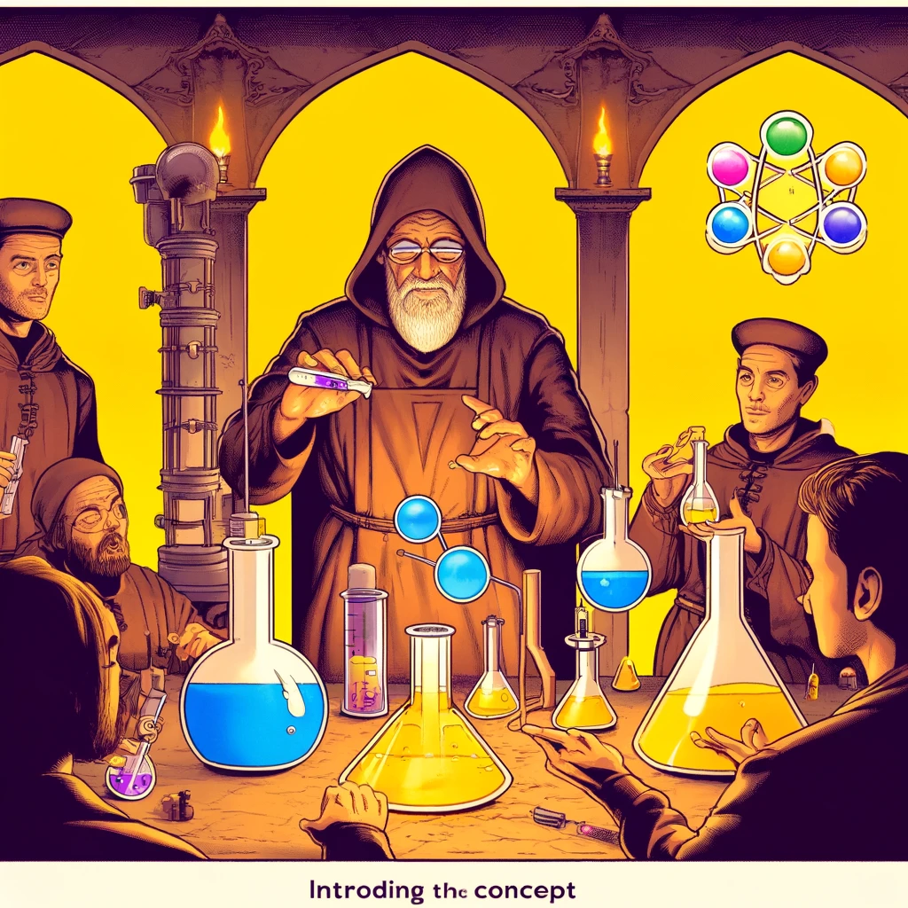

# React: Overview and Usage

React is a popular open-source JavaScript library for building user interfaces. Developed by Facebook, it has become one of the most widely used tools due to its component-based architecture and performance. React focuses on creating components that allow developers to build reusable and isolated pieces of the UI.



Source: Dall-E by OpenAI

- [React: Overview and Usage](#react-overview-and-usage)
  - [Learning Outcomes](#learning-outcomes)
  - [Key Concepts in React](#key-concepts-in-react)
  - [Creating and Setting Up a React Project](#creating-and-setting-up-a-react-project)
    - [Create React App](#create-react-app)
      - [Installing Create React App](#installing-create-react-app)
  - [React Components](#react-components)
    - [Functional Components](#functional-components)
    - [Class Components](#class-components)
  - [React Hooks and State Management](#react-hooks-and-state-management)
    - [useState](#usestate)
    - [useEffect](#useeffect)
  - [Styling React Components](#styling-react-components)
    - [Inline Styles](#inline-styles)
    - [CSS Files](#css-files)
    - [CSS Modules](#css-modules)
    - [CSS Frameworks](#css-frameworks)
  - [Sources](#sources)
  - [Questions or Exercises](#questions-or-exercises)
  - [Exercise](#exercise)

---

## Learning Outcomes

By the end of this chapter, learners will be able to:

- Explain what React is and how it works.
- Create a React project and set up a development environment.
- Create and manage React components.
- Use React Hooks and manage state effectively.

---

## Key Concepts in React

**Components:** The building blocks of React that allow developers to split the user interface into small, manageable pieces. Components can be functional or class-based.

**Virtual DOM:** React uses a lightweight representation of the DOM called the Virtual DOM. It enables efficient updates by comparing changes before applying them to the real DOM.

**JSX:** A syntax extension for JavaScript that allows writing HTML within JavaScript. JSX makes code easier to read and write.

**Hooks:** Functions introduced in React 16.8 that enable state and lifecycle features in functional components. Common hooks include `useState` and `useEffect`.

---

## Creating and Setting Up a React Project

React projects can be started in several ways, such as manually setting up dependencies or using a tool like:

- [Create React App](https://create-react-app.dev/)
- [Vite](https://vitejs.dev/)
- [Create Next App](https://nextjs.org/docs/api-reference/create-next-app)

In this guide, we'll focus on **Create React App** due to its simplicity and suitability for beginners.

---

### Create React App

Create React App is a convenient tool for setting up and running a React project without manual configuration.

#### Installing Create React App

1. Ensure that Node.js and npm are installed.
2. Run the following command in your terminal:

```bash
npx create-react-app my-app
```

3. Navigate to your project directory:

```bash
cd my-app
```

4. Start the development server:

```bash
npm start
```

This will open your new React application in your default browser.

## React Components

### Functional Components

Functional components are simple JavaScript functions that accept props as arguments and return React elements.

*Props* allow data to be passed from parent components to child components.

Example:

```javascript
import React from 'react';

function Greeting(props) {
  return <h1>Hello, {props.name}!</h1>;
}

export default Greeting;
```

### Class Components

Class components are ES6 classes that extend React.Component and include a render method.

Example:

```javascript
import React, { Component } from 'react';

class Greeting extends Component {
  render() {
    return <h1>Hello, {this.props.name}!</h1>;
  }
}

export default Greeting;
```

## React Hooks and State Management

React Hooks enable state and other React features in functional components. They are useful for managing state, handling lifecycle events, and more.

*State* is a way to store data within a component that can respond to user actions or other events.

### useState

The `useState` Hook lets functional components manage their own state.

Example:

```javascript
import React, { useState } from 'react';

function Counter() {
  const [count, setCount] = useState(0);

  return (
    <div>
      <p>You clicked {count} times</p>
      <button onClick={() => setCount(count + 1)}>
        Click me
      </button>
    </div>
  );
}

export default Counter;
```

### useEffect

The `useEffect` Hook is used to handle side effects like data fetching and subscriptions.

Example:

```javascript
import React, { useState, useEffect } from 'react';

function DataFetcher() {
  const [data, setData] = useState([]);

  useEffect(() => {
    fetch('https://api.example.com/data')
      .then(response => response.json())
      .then(data => setData(data));
  }, []);

  return (
    <ul>
      {data.map(item => (
        <li key={item.id}>{item.name}</li>
      ))}
    </ul>
  );
}

export default DataFetcher;
```

## Styling React Components

There are multiple ways to style React components:

- Inline styles
- CSS files
- CSS modules
- CSS frameworks (e.g., Bootstrap, Material-UI)

### Inline Styles

Inline styles allow you to directly style components using a JavaScript object.

Example:

```jsx
import React from 'react';

function Welcome(props) {
  const style = {
    border: "1px solid black",
    margin: "10px",
    backgroundColor: "lightgray",
  };

  return <h2 style={style}>Hello, {props.name}!</h2>;
};

export default Welcome;
```


### CSS Modules

CSS files allow you to define styles in separate files and import them into your components.

Example:

```jsx
import React from 'react';
import './styles.css';

function Welcome(props) {
  return <h2 className="welcome">Hello, {props.name}!</h2>;
};

export default Welcome;
```

`styles.css`:

```css
.welcome {
  border: 1px solid black;
  margin: 10px;
  background-color: lightgray;
}
```


### CSS Modules

CSS Modules allow you to scope styles to specific components.

Example:

```jsx
import React from 'react';

import styles from './styles.module.css';

function Welcome(props) {
  return <h2 className={styles.welcome}>Hello, {props.name}!</h2>;
};

export default Welcome;
```

`styles.module.css`:

```css
.welcome {
  border: 1px solid black;
  margin: 10px;
  background-color: lightgray;
}
```

### CSS Frameworks

CSS frameworks like Bootstrap and Material-UI can be used to quickly style components.

Example:

```jsx
import React from 'react';
import { Button } from 'react-bootstrap';

function Welcome(props) {
  return <Button variant="primary">Hello, {props.name}!</Button>;
};

export default Welcome;
```

> Note that in the example provided, specially designed Bootstrap components for React are used. These components are tailored for React and have a syntax that differs slightly from standard Bootstrap usage.

## Sources

- [React Official Documentation](https://reactjs.org/docs/getting-started.html)
- [React Hooks Documentation](https://reactjs.org/docs/hooks-intro.html)
- [Create React App Documentation](https://create-react-app.dev/docs/getting-started/)
- [W3Schools React Tutorial](https://www.w3schools.com/react/)

## Questions or Exercises

- What is React, and how does it work?
- What are React Hooks, and how are they used? Provide examples for `useState` and `useEffect` .
- What is unidirectional data flow, and why is it important in React?

## Exercise

- Create a new React project using Create React App.
- Create a functional component that displays and updates a user’s name.
- Add a component that fetches and displays data from an external API using the `useEffect` Hook.
- Build an application consisting of multiple components that communicate with each other using unidirectional data flow.
