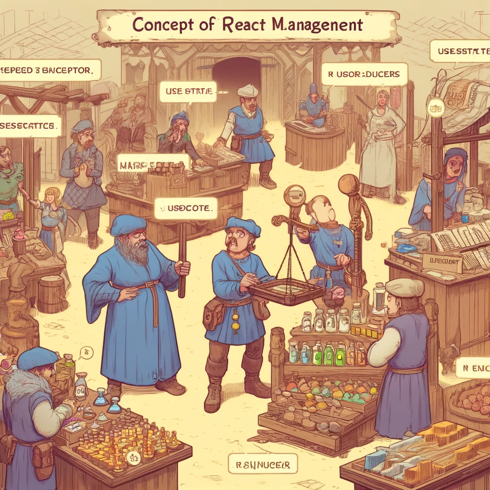

# React State Management

State management in React is a central concept that allows components to manage and update their internal state. It is essential for creating dynamic and interactive web applications as it enables components to respond to user inputs and other events. This chapter covers the basics of state management, using the `useState` hook, prop drilling, and advanced state management frameworks like Redux.



Image Source: Dall-E by OpenAI

- [React State Management](#react-state-management)
  - [Learning Outcomes](#learning-outcomes)
  - [Basics of React State Management](#basics-of-react-state-management)
    - [What is State?](#what-is-state)
    - [`useState` Hook](#usestate-hook)
      - [Using the `useState` Hook](#using-the-usestate-hook)
    - [State and Props](#state-and-props)
    - [State Changes and Rendering](#state-changes-and-rendering)
  - [Prop Drilling](#prop-drilling)
    - [Example of Prop Drilling](#example-of-prop-drilling)
  - [Using Advanced State Management Frameworks](#using-advanced-state-management-frameworks)
    - [Redux](#redux)
      - [Key Concepts of Redux](#key-concepts-of-redux)
      - [Example of Using Redux](#example-of-using-redux)
  - [Context API](#context-api)
    - [Example of Using Context API](#example-of-using-context-api)
  - [Resources](#resources)
  - [Review Questions or Exercises](#review-questions-or-exercises)
  - [Exercises](#exercises)

## Learning Outcomes

By the end of this chapter, learners should be able to:

- Explain what state is in React and how it works;
- Use the `useState` hook for managing state in functional components;
- Implement prop drilling to pass state between components;
- Describe and use advanced state management frameworks like Redux.

## Basics of React State Management

### What is State?

State is an object that holds data private to a component and can only be modified by the same component. It determines how the component behaves and what it renders.

### `useState` Hook

`useState` is a React hook that allows functional components to manage state. It returns an array with two elements: the current state value and a function to update the state.

#### Using the `useState` Hook

```javascript
import React, { useState } from 'react';

function Counter() {
  const [count, setCount] = useState(0);

  return (
    <div>
      <p>You clicked {count} times</p>
      <button onClick={() => setCount(count + 1)}>
        Click me
      </button>
    </div>
  );
}

export default Counter;
```

### State and Props

State and props are the two main ways to manage data in React. State is internal and private to a component, while props are passed from parent to child components.

### State Changes and Rendering

When a component's state changes, React re-renders the component to update the user interface with the new state

## Prop Drilling

Prop drilling is the process of passing data (props) from a parent component to child components through multiple levels. While it is a simple way to share data, it can become difficult to manage in larger and more complex applications.

### Example of Prop Drilling

```javascript
function ParentComponent() {
  const [message, setMessage] = useState("Hello from Parent!");

  return <ChildComponent message={message} />;
}

function ChildComponent(props) {
  return <GrandchildComponent message={props.message} />;
}

function GrandchildComponent(props) {
  return <p>{props.message}</p>;
}
```

## Using Advanced State Management Frameworks

In larger applications, prop drilling can become cumbersome and inefficient. Advanced state management frameworks like Redux or the Context API can be useful in such cases.

### Redux

Redux is a popular state management framework that allows centralized management of application state. Redux follows three principles:

1. **Single Source of Truth:** The entire application state is stored in one central store.
2. **State is Read-Only:** The only way to change the state is by dispatching an action that describes what happened.
3. **State Changes with Pure Functions:** Reducers are pure functions that take the current state and an action as arguments and return a new state.

#### Key Concepts of Redux

- **Store:** The central repository for managing the application state.
- **Action:** A JavaScript object that describes a state change.
- **Reducer:** A pure function that takes the current state and an action, and returns the new state.

#### Example of Using Redux

1. **Install Redux and React-Redux:**

```bash
npm install redux react-redux
```

2. **Create a Redux Store and Reducer:**

```javascript
import { createStore } from 'redux';

// Define an action
const increment = () => {
  return {
    type: 'INCREMENT'
  };
};

// Define a reducer
const counter = (state = 0, action) => {
  switch (action.type) {
    case 'INCREMENT':
      return state + 1;
    default:
      return state;
  }
};

// Create a store
const store = createStore(counter);

store.subscribe(() => console.log(store.getState()));

store.dispatch(increment()); // Increments the state by 1
```

3. **Integrate Redux with React:**

```javascript
import React from 'react';
import ReactDOM from 'react-dom';
import { Provider, useDispatch, useSelector } from 'react-redux';
import { createStore } from 'redux';

// Define an action
const increment = () => {
  return {
    type: 'INCREMENT'
  };
};

// Define a reducer
const counter = (state = 0, action) => {
  switch (action.type) {
    case 'INCREMENT':
      return state + 1;
    default:
      return state;
  }
};

// Create a store
const store = createStore(counter);

function Counter() {
  const count = useSelector(state => state);
  const dispatch = useDispatch();

  return (
    <div>
      <p>Count: {count}</p>
      <button onClick={() => dispatch(increment())}>
        Increment
      </button>
    </div>
  );
}

ReactDOM.render(
  <Provider store={store}>
    <Counter />
  </Provider>,
  document.getElementById('root')
);

```

## Context API

The Context API is a built-in mechanism in React that allows sharing data across the component tree without prop drilling. It is suitable for small to medium-sized applications.

### Example of Using Context API

1. **Create a Context:**

```javascript
import React, { createContext, useContext, useState } from 'react';

const MyContext = createContext();

function MyProvider({ children }) {
  const [value, setValue] = useState("Hello from Context!");

  return (
    <MyContext.Provider value={value}>
      {children}
    </MyContext.Provider>
  );
}

function MyComponent() {
  const value = useContext(MyContext);
  return <p>{value}</p>;
}

function App() {
  return (
    <MyProvider>
      <MyComponent />
    </MyProvider>
  );
}

export default App;
```

## Sources

- [React Official Documentation](https://react.dev)
- [Redux Official Documentation](https://redux.js.org/)

## Review Questions or Exercises

- What is state and how does it differ from props?
- How can you use the `useState` hook in functional components?
- What is prop drilling, and when can it become problematic?
- Describe the key concepts of Redux and how they address state management challenges.
- How can you use the Context API to share state across the component tree?

## Exercises

- Create a new React project using Create React App.
- Build a component that manages and displays its state using the `useState` hook.
- Implement prop drilling to pass state from a parent component to child components.
- Integrate Redux to manage application state in a centralized way.
- Use the Context API to share state across the component tree without prop drilling.
