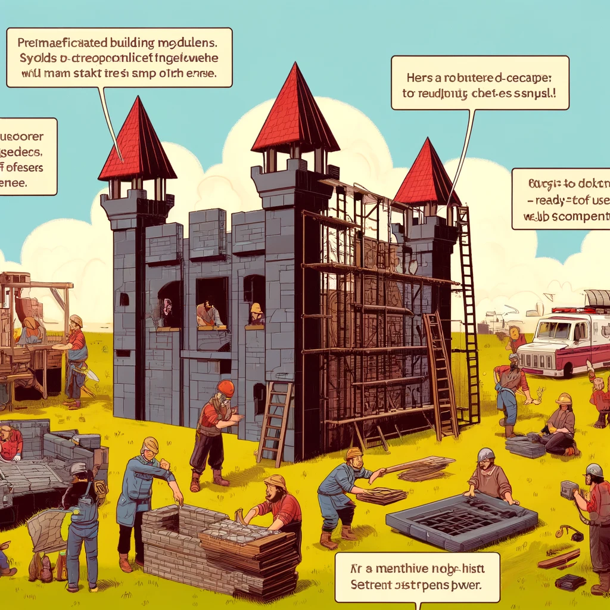

# Bootstrap CSS Framework

Bootstrap is a popular front-end web development framework that helps quickly create visually appealing and responsive websites. It provides a variety of HTML and CSS design templates for components like buttons, forms, and navigation bars, as well as JavaScript plugins for interactive elements like modals and carousels.



Image Source: Dall-E by OpenAI

- [Bootstrap CSS Framework](#bootstrap-css-framework)
  - [Learning Objectives](#learning-objectives)
  - [Features of Bootstrap](#features-of-bootstrap)
  - [Getting Started with Bootstrap](#getting-started-with-bootstrap)
    - [Using a CDN](#using-a-cdn)
    - [Simple Example](#simple-example)
  - [Bootstrap Grid System](#bootstrap-grid-system)
    - [Grid Classes](#grid-classes)
    - [Example of Using the Grid System](#example-of-using-the-grid-system)
  - [Bootstrap Buttons](#bootstrap-buttons)
    - [Button Classes](#button-classes)
    - [Example Buttons](#example-buttons)
  - [Bootstrap Forms](#bootstrap-forms)
    - [Types of Forms](#types-of-forms)
    - [Example Forms](#example-forms)
  - [Bootstrap Navigation Bar](#bootstrap-navigation-bar)
    - [Navbar Classes](#navbar-classes)
    - [Example Navbar](#example-navbar)
  - [Summary](#summary)

## Learning Objectives

After this lesson, you will be able to:

- Explain what Bootstrap is and why it is used;
- Use pre-built Bootstrap components and the grid system;
- Add Bootstrap to your webpage using a CDN.

## Features of Bootstrap

- **Responsive Layouts:** Bootstrap uses flexible grid systems that adapt to various device screen sizes. The grid system is based on containers divided into 12 columns, which help create adaptive and dynamic layouts.
- **Pre-built Components:** It offers a rich selection of HTML and CSS-based components like buttons, input forms, navigation bars, jumbotrons, images, cards, and more, speeding up the development process.
- **JavaScript Plugins:** Bootstrap includes several jQuery-based JavaScript plugins for interactive features like modals, tooltips, popovers, collapses, and other dynamic behaviors.
- **Customizability:** While Bootstrap comes with predefined designs, it allows customization of colors, fonts, and other elements as needed, using Sass (a CSS preprocessor).
- **Extensive Documentation and Community:** Bootstrap is well-documented, making it easy to learn and use. Its large user community means resources and support are readily available.

## Getting Started with Bootstrap

There are two main ways to start using Bootstrap: download the Bootstrap files and link them to your HTML page or use a Content Delivery Network (CDN).

### Using a CDN

The easiest way to use Bootstrap is to include the following links in the `<head>` section of your HTML document:

```html
<!-- Bootstrap CSS -->
<link rel="stylesheet" href="https://cdn.jsdelivr.net/npm/bootstrap@5.3.2/dist/css/bootstrap.min.css">

<!-- Optional JavaScript -->
<!-- jQuery, Popper.js, and Bootstrap JS -->
<script src="https://code.jquery.com/jquery-3.6.0.slim.min.js"></script>
<script src="https://cdn.jsdelivr.net/npm/popper.js@2.11.8/dist/umd/popper.min.js"></script>
<script src="https://cdn.jsdelivr.net/npm/bootstrap@5.3.2/dist/js/bootstrap.min.js"></script>
```

### Simple Example

Here is an example of a simple webpage created with Bootstrap:

```html
<!DOCTYPE html>
<html lang="en">
<head>
    <meta charset="UTF-8">
    <meta name="viewport" content="width=device-width, initial-scale=1.0">
    <title>Bootstrap Example</title>
    <link rel="stylesheet" href="https://cdn.jsdelivr.net/npm/bootstrap@5.3.2/dist/css/bootstrap.min.css">
</head>
<body>
    <div class="container">
        <h1>Welcome to Bootstrap!</h1>
        <p>This is a simple example.</p>
        <button type="button" class="btn btn-primary">Click Me</button>
    </div>

    <script src="https://code.jquery.com/jquery-3.6.0.slim.min.js"></script>
    <script src="https://cdn.jsdelivr.net/npm/popper.js@2.11.8/dist/umd/popper.min.js"></script>
    <script src="https://cdn.jsdelivr.net/npm/bootstrap@5.3.2/dist/js/bootstrap.min.js"></script>
</body>
</html>

```

This code creates a simple webpage that uses Bootstrap's grid system for layout and a styled button.

## Bootstrap Grid System

The Bootstrap grid system is a 12-column system that allows developers to create responsive and dynamic layouts. The grid system divides the screen into 12 equal columns, which can be used to position elements according to their size.
Grid columns are typically placed inside a `<div class="row">` element, which in turn is placed inside a `<div class="container">` or `<div class="container-fluid">`.

### Grid Classes

To use the grid system, add classes to HTML elements to specify their width based on the 12-column system.

For example:

- `.col-6`: The element takes up 6 columns (half the screen).
- `.col-4`: The element takes up 4 columns (one-third of the screen).
- `.col-3`: The element takes up 3 columns (one-quarter of the screen).
- `.col-12`: The element takes up the full width.

### Example of Using the Grid System

```html
<div class="container border">
    <div class="row border">
        <div class="col-6 border">1st Column</div>
        <div class="col-6 border">2nd Column</div>
    </div>
    <div class="row">
        <div class="col-4 border">1st Column</div>
        <div class="col-4 border">2nd Column</div>
        <div class="col-4 border">3rd Column</div>
    </div>
</div>
```

This example creates two rows: the first row has two columns (each taking up half the screen), and the second row has three columns (each taking up one-third of the screen).

>The `border` class is added to elements to visually show their boundaries.

## Bootstrap Buttons

Bootstrap buttons are stylish and interactive elements used to highlight UI functionalities. Buttons can be of various types, such as primary, secondary, success, danger, etc.

### Button Classes

Use the following class names to style Bootstrap buttons:

- `.btn`: Base button class.
- `.btn-primary`: Primary button.
- `.btn-secondary`: Secondary button.
- `.btn-success`: Success button.
- `.btn-danger`: Danger button.
- `.btn-warning`: Warning button.
- `.btn-info`: Info button.
- etc.

### Example Buttons

```html
<button type="button" class="btn btn-primary">Primary</button>
<button type="button" class="btn btn-secondary">Secondary</button>
<button type="button" class="btn btn-success">Success</button>
<button type="button" class="btn btn-danger">Danger</button>
<button type="button" class="btn btn-warning">Warning</button>
<button type="button" class="btn btn-info">Info</button>

```


Read more about buttons in [Bootstrap's official documentation.](https://getbootstrap.com/docs/5.3/components/buttons/).

## Bootstrap Forms

Bootstrap forms are stylish and user-friendly elements that allow users to input and submit data. Bootstrap forms use special class names to define their styles and layouts.

### Types of Forms

Some common classes for forms:

- `.form-group`: Wraps form elements and adds spacing between them.
- `.form-control`: Defines the style for form elements.
- `.form-check`: Class for checkboxes or radio buttons.
- `.form-check-input`: Class for the checkbox or radio input element.
- `.form-check-label`: Class for the label of a checkbox or radio input.
- `.form-text`: Class for help text under form inputs.
- etc.

### Example Forms

```html
<form>
    <div class="form-group">
        <label for="name">Name:</label>
        <input type="text" class="form-control" id="name">
    </div>
    <div class="form-group" id="email-group">
        <label for="email">Email:</label>
        <input type="email" class="form-control" id="email">
        <small class="form-text text-muted">We won't share your email with anyone.</small>
    </div>
    <div class="form-group form-check">
        <input type="checkbox" class="form-check-input" id="subscribe">
        <label class="form-check-label" for="subscribe">Subscribe to Newsletter</label>
    </div>
    <button type="submit" class="btn btn-primary">Submit</button>
</form>

```

This creates a simple form with a name field, an email field, and a subscription checkbox.

More about forms in [Bootstrap's official documentation.](https://getbootstrap.com/docs/5.3/components/forms/).

## Bootstrap Navigation Bar

The Bootstrap navigation bar is a stylish and interactive element that helps users navigate different sections of a website.

### Navbar Classes

Some common classes for creating navigation bars:

- `.navbar`: Base class for a navigation bar.
- `.navbar-expand`: Defines expand behavior on screen sizes.
- `.navbar-light`: Navigation bar with a light background.
- `.navbar-dark`: Navigation bar with a dark background.
- `.navbar-brand`: Branding or logo class for the navigation bar.
- `.navbar-nav`: Class for the navigation menu.
- `.nav-item`: Class for individual menu items.
- `.nav-link`: Class for links in the navigation bar.
- etc.

### Example Navbar

```html
<nav class="navbar navbar-expand-lg navbar-light bg-light">
    <a class="navbar-brand" href="#">My Website</a>
    <button class="navbar-toggler" type="button" data-toggle="collapse" data-target="#navbarNav" aria-controls="navbarNav" aria-expanded="false" aria-label="Toggle navigation">
        <span class="navbar-toggler-icon"></span>
    </button>
    <div class="collapse navbar-collapse" id="navbarNav">
        <ul class="navbar-nav">
            <li class="nav-item active">
                <a class="nav-link" href="#">Home <span class="sr-only">(current)</span></a>
            </li>
            <li class="nav-item">
                <a class="nav-link" href="#">Features</a>
            </li>
            <li class="nav-item">
                <a class="nav-link" href="#">Pricing</a>
            </li>
            <li class="nav-item">
                <a class="nav-link" href="#">Contact</a>
            </li>
        </ul>
    </div>
</nav>

```

This creates a navigation bar with links to different sections of a website.


More about navigation bars in [Bootstrap's official documentation.](https://getbootstrap.com/docs/5.3/components/navbar/).

## Summary

Bootstrap enables developers to quickly create visually appealing and responsive websites using pre-built components and a grid system. Its benefits include responsive layouts, rich components, JavaScript plugins, customizability, and extensive documentation. Explore more about Bootstrap in Bootstrap's official documentation.
