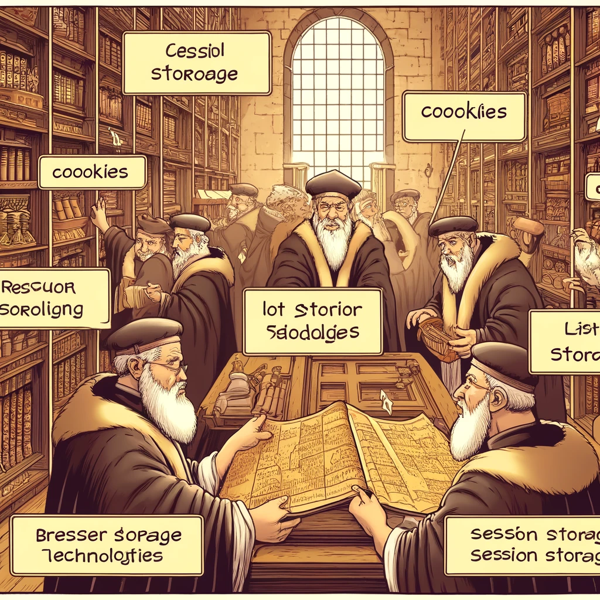

# Browser Storage Technologies: Overview and Usage



Image source: Dall-E by OpenAI

- [Browser Storage Technologies: Overview and Usage](#browser-storage-technologies-overview-and-usage)
  - [Introduction](#introduction)
  - [Learning Outcomes](#learning-outcomes)
  - [Browser Storage Methods](#browser-storage-methods)
    - [Local Storage](#local-storage)
      - [Local Storage Features](#local-storage-features)
      - [Using Local Storage](#using-local-storage)
    - [Session Storage](#session-storage)
      - [Session Storage Features](#session-storage-features)
      - [Using Session Storage](#using-session-storage)
    - [Cookies](#cookies)
      - [Cookies Features](#cookies-features)
      - [Using Cookies](#using-cookies)
    - [IndexedDB](#indexeddb)
      - [IndexedDB Features](#indexeddb-features)
      - [Usage](#usage)
  - [Selection Criteria](#selection-criteria)
    - [Local Storage vs. Session Storage](#local-storage-vs-session-storage)
    - [Cookies](#cookies-1)
    - [IndexedDB](#indexeddb-1)
  - [References](#references)
  - [Quiz or Exercises](#quiz-or-exercises)
  - [Practice](#practice)

## Introduction

Browser storage technologies allow web applications to store data on the user's device. These technologies are critical for ensuring data availability and application performance, even in offline or unstable network conditions. The main browser storage methods are **Local Storage**, **Session Storage**, **Cookies**, and **IndexedDB**. This chapter covers the fundamentals, advantages, and use cases of these technologies.

## Learning Outcomes

By the end of this chapter, learners will be able to:

- Explain different browser storage methods and their use cases;
- Implement Local Storage, Session Storage, Cookies, and IndexedDB in web applications;
- Select the appropriate storage method based on specific needs and use cases.

## Browser Storage Methods

### Local Storage

**Local Storage** is persistent storage that allows web applications to save key-value pairs. Data remains even after the page is reloaded or the browser is closed. It is useful for storing user preferences, session states, and other persistent data.

#### Local Storage Features

- Persistent storage
- Storage limit is typically around 5–10 MB
- Data is tied to the origin and accessible only to scripts from the same origin

#### Using Local Storage

```javascript
// Storing data
localStorage.setItem('key', 'value');

// Retrieving data
const value = localStorage.getItem('key');

// Removing data
localStorage.removeItem('key');

// Clearing all data
localStorage.clear();
```

### Session Storage

**Session Storage** is temporary storage that retains data only during the browsing session. Data is cleared when the page is reloaded or the browser is closed.

#### Session Storage Features

- Temporary storage
- Storage limit is typically around 5–10 MB
- Data is tied to the origin and accessible only to scripts from the same origin

#### Using Session Storage

```javascript
// Storing data
sessionStorage.setItem('key', 'value');

// Retrieving data
const value = sessionStorage.getItem('key');

// Removing data
sessionStorage.removeItem('key');

// Clearing all data
sessionStorage.clear();

```

### Cookies

**Cookies** are small data blocks that the browser stores and sends to the server with each request of the same origin. Cookies are often used for user authentication and session management.

#### Cookies Features

- Storage limit is typically around 4 KB
- Data is sent to the server with every HTTP request
- Allows setting expiration date, domain, and path

#### Using Cookies

```javascript
// Setting a cookie
document.cookie = "username=JohnDoe; expires=Fri, 31 Dec 2021 12:00:00 UTC; path=/";

// Reading cookies
const cookies = document.cookie;
console.log(cookies);

// Deleting a cookie (by setting expiration in the past)
document.cookie = "username=JohnDoe; expires=Thu, 01 Jan 1970 00:00:00 UTC; path=/";

```

### IndexedDB

**IndexedDB** is a low-level API for storing large amounts of structured data on the user's device. It supports indexing and transactions, making it suitable for complex database operations.

#### IndexedDB Features

- Persistent storage
- Suitable for large datasets
- Supports indexing and transactions
- Asynchronous API

#### Usage

```javascript
// Creating or opening a database
const request = indexedDB.open('myDatabase', 1);

request.onupgradeneeded = (event) => {
  const db = event.target.result;
  const objectStore = db.createObjectStore('myObjectStore', { keyPath: 'id' });
  objectStore.createIndex('name', 'name', { unique: false });
};

request.onsuccess = (event) => {
  const db = event.target.result;

  // Adding data
  const transaction = db.transaction(['myObjectStore'], 'readwrite');
  const objectStore = transaction.objectStore('myObjectStore');
  const requestAdd = objectStore.add({ id: 1, name: 'John Doe' });

  requestAdd.onsuccess = () => {
    console.log('Data added to IndexedDB');
  };

  // Retrieving data
  const requestGet = objectStore.get(1);
  requestGet.onsuccess = (event) => {
    console.log('Data retrieved:', event.target.result);
  };
};

```

## Selection Criteria

### Local Storage vs. Session Storage

- **Local Storage:** Use when data needs to persist across page reloads or browser sessions.
- **Session Storage:** Use when data is temporary and only needed during the current session.
- 
### Cookies

- Kasutage, kui on vaja saata andmeid serverile iga HTTP päringuga (näiteks kasutajate autentimiseks ja seansside haldamiseks).

### IndexedDB

- Use when data needs to be sent to the server with every HTTP request (e.g., for user authentication and session management).

## Allikad

- [MDN Web Docs: Web Storage API](https://developer.mozilla.org/en-US/docs/Web/API/Web_Storage_API)
- [MDN Web Docs: Document.cookie](https://developer.mozilla.org/en-US/docs/Web/API/Document/cookie)
- [MDN Web Docs: IndexedDB API](https://developer.mozilla.org/en-US/docs/Web/API/IndexedDB_API)
- [W3C: Web Storage](https://www.w3.org/TR/webstorage/)

## Quiz or Exercises

- What is Local Storage, and how does it differ from Session Storage?
- Describe how to store and retrieve data using Cookies.
- When is it appropriate to use IndexedDB, and what are its advantages over Local Storage?
- Create a sample application that saves user preferences in Local Storage and loads them on page reload.

## Exercises

- Create a web application that allows users to save their favorite color in Local Storage. The application should change its color when a new color is selected and load the saved color on page reload.
- Implement an authentication system using Cookies to save and read user login sessions. The cookie should include the user ID and expiration date.
- Use IndexedDB to create a simple contact management application. The application should allow users to add, view, and delete contacts using IndexedDB for data storage.
