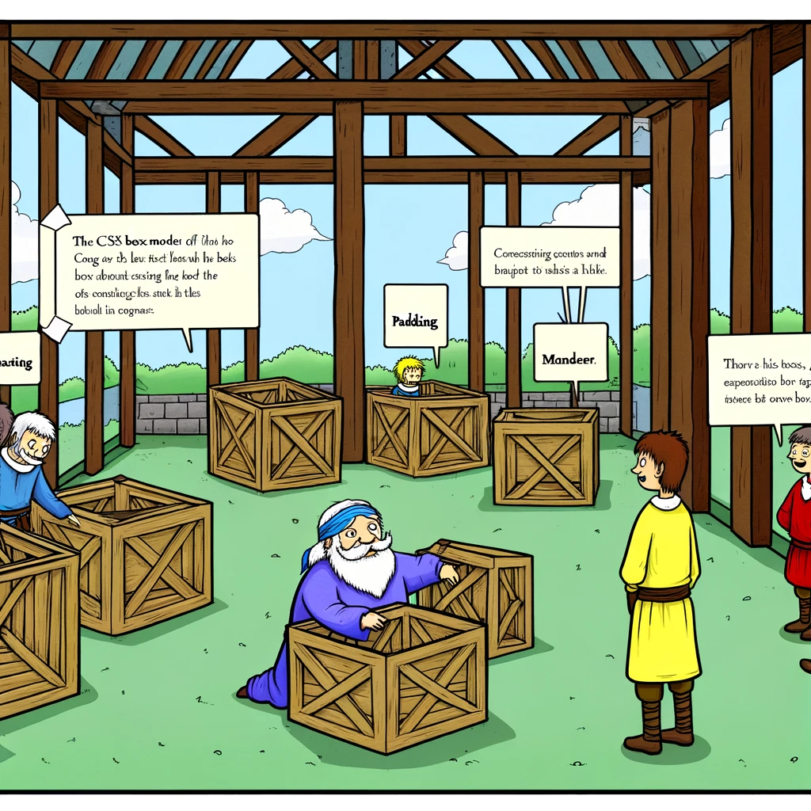

# The Box Model in CSS

This chapter explores the CSS box model and its two main types: the standard box model and the alternate box model.



- [The Box Model in CSS](#the-box-model-in-css)
  - [Learning Outcomes](#learning-outcomes)
  - [What is the Box Model?](#what-is-the-box-model)
  - [Standard Box Model](#standard-box-model)
  - [Alternate Box Model](#alternate-box-model)

## Learning Outcomes

By the end of this chapter, you will be able to:

- Describe the CSS box model;
- Explain the differences between the standard and alternate box models;
- Apply the CSS box model in your web designs.

## What is the Box Model?

The CSS box model is a rectangular layout model for HTML elements. It consists of four parts: `content`, `padding`, `border`, and `margin`.

- **Content** is the actual content inside the element.
- **Padding** is the space between the content and the border.
- **Border** is the boundary of the element.
- **Margin** is the space between the border and adjacent elements.


[Image source](https://developer.mozilla.org/en-US/docs/Learn/CSS/Building_blocks/The_box_model/box-model.png)

## Standard Box Model

The standard box model is the default in CSS, used by most browsers. In the standard box model, the width and height of an element are calculated as:

- `width = content width + left padding + right padding + left border + right border`;
- `height = content height + top padding + bottom padding + top border + bottom border`;

For example, if the following CSS rules are applied to a box:

```css
.box {
  width: 350px;
  height: 150px;
  margin: 10px;
  padding: 25px;
  border: 5px solid black;
}
```

The width and height of the box are calculated as:

- `width = 350px + 25px + 25px + 5px + 5px = 410px`;
- `height = 150px + 25px + 25px + 5px + 5px = 210px`;


[Pildi allikas](https://developer.mozilla.org/en-US/docs/Learn/CSS/Building_blocks/The_box_model/standard-box-model.png)

> Note: Margins are not included in the element's width or height.

## Alternate Box Model

In the alternate box model, the width and height of an element are equal to the specified `width` and `height` values, with padding and border included within these dimensions.

For example, applying the same CSS rules as before but enabling the alternate box model:

```css
.box {
  box-sizing: border-box;
  width: 350px;
  height: 150px;
  margin: 10px;
  padding: 25px;
  border: 5px solid black;
}
```

The width and height of the box are:

- `width = 350px`;
- `height = 150px`;


[Pildi allikas](https://developer.mozilla.org/en-US/docs/Learn/CSS/Building_blocks/The_box_model/alternate-box-model.png)

To enable the alternate box model for an element, set its `box-sizing: property to border-box`:

```css
.box {
  box-sizing: border-box;
}
```

To apply the alternate box model to all elements (a common developer practice), set the box-sizing property on the <html> element and inherit it for all other elements:

```css
html {
  box-sizing: border-box;
}

*, *::before, *::after {
  box-sizing: inherit;
}
```

Learn more about the box model [here](https://developer.mozilla.org/en-US/docs/Learn/CSS/Building_blocks/The_box_model)
