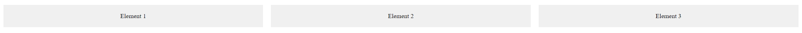

# CSS `display: flex` Property

This tutorial explains the CSS `display: flex` property, a powerful tool for creating flexible and adaptive layouts on web pages.


Image source: Dall-E by OpenAI

- [CSS `display: flex` Property](#css-display-flex-property)
  - [Learning Outcomes](#learning-outcomes)
  - [Basic Usage](#basic-usage)
  - [Key Properties and Their Usage](#key-properties-and-their-usage)
    - [`flex-direction`](#flex-direction)
    - [`justify-content`](#justify-content)
    - [`align-items`](#align-items)
    - [`flex-wrap`](#flex-wrap)
    - [`flex`](#flex)
  - [Complete Example](#complete-example)

## Learning Outcomes

After completing this topic, you will be able to:

- Explain the CSS `display: flex` property;
- Describe how to use `display: flex` for element layouts;
- Apply `display: flex` to create flexible and responsive layouts.

The `display: flex` property in CSS allows you to create flexible and adaptive layouts for HTML elements. The flexbox model aligns elements row by row (or column by column) and provides control over their layout, order, size, and spacing.

## Basic Usage

```css
.container {
    display: flex;
}
```

## Key Properties and Their Usage

### `flex-direction`

Defines the main direction of a flex container—row or column.

Example:

```css
.container {
    display: flex;
    flex-direction: row; /* Default value */
}
```

Possible values:

- `row` - Places items in a row (default).
- `row-reverse` - Places items in a reversed row.
- `column` - Places items in a column.
- `column-reverse` - Places items in a reversed column.

### `justify-content`

Controls the alignment of flex items along the main axis.

Example:

```css
.container {
    display: flex;
    justify-content: center; /* Centers items horizontally */
}

```
Common values:

flex-start - Aligns items to the start of the container.
flex-end - Aligns items to the end of the container.
center - Aligns items to the center.
space-between - Places equal space between items.
space-around - Places equal space around items.

### `align-items`

Controls the alignment of flex items along the cross axis.

Example:

```css
.container {
    display: flex;
    align-items: center; /* Centers items vertically */
}

```
Common values:

flex-start - Aligns items at the start of the cross axis.
flex-end - Aligns items at the end of the cross axis.
center - Centers items along the cross axis.
stretch - Stretches items to fill the container.
baseline - Aligns items along their baselines

### `flex-wrap`

Determines whether flex items should wrap onto multiple rows or columns.

Example:

```css
.container {
    display: flex;
    flex-wrap: wrap; /* Wraps items onto new rows if needed */
}
```
Common values:

nowrap - Prevents wrapping (default).
wrap - Allows wrapping onto multiple lines.
wrap-reverse - Wraps onto multiple lines in reverse order.

### `flex`

Defines how a flex item will grow, shrink, or take up available space in the flex container.

Example:

```css
.item {
    flex: 1; /* Each item takes up equal space */
}

```

The flex property consists of three values:

1. Grow: Specifies how much the item will grow relative to others.
2. Shrink: Specifies how much the item will shrink relative to others.
3. Basis: Specifies the initial size of the item.

## Complete Example

HTML:

```html
<div class="container">
    <div class="item">Item 1</div>
    <div class="item">Item 2</div>
    <div class="item">Item 3</div>
</div>

```

CSS:

```css
.container {
    display: flex;
    justify-content: space-around;
    align-items: center;
    flex-wrap: wrap;
}

.item {
    flex: 1 1 200px;
    padding: 20px;
    margin: 10px;
    background-color: #f0f0f0;
    text-align: center;
}
```

Result:



The display: flex property allows you to create responsive layouts that adapt to content and screen size while giving you precise control over the alignment and sizing of elements.
