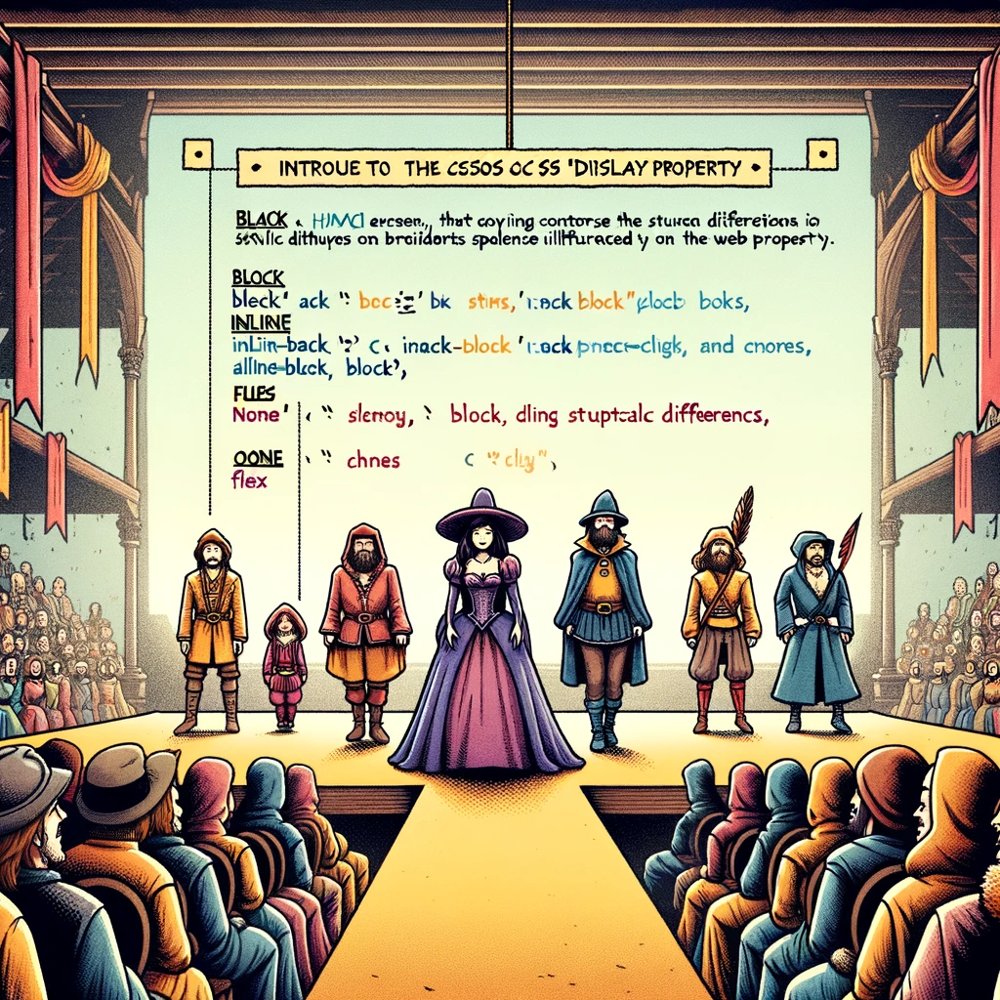

# CSS Display Property

In this tutorial, we explore the CSS `display` property, one of the most important CSS properties used to define how an element is rendered on a webpage.



Image source: Dall-E by OpenAI

## Learning Outcomes

After completing this topic, you will be able to:

- Explain what the CSS `display` property is;
- Describe different `display` values and their effects;
- Apply the `display` property to manage page layouts.

## What is the CSS Display Property?

The CSS `display` property determines how an element is displayed in the document flow. It is a powerful property that allows developers to control element layouts without altering the HTML structure.

Some elements take up the entire width of their container (preceded and followed by a line break). These are called block elements, such as `<h1>`, `<p>`, and `<div>`. Other elements only occupy as much space as necessary and do not cause line breaks; these are inline elements, such as `<a>`, ``, and `<span>`.

## Key Display Values

The `display` property has many values, but here are some of the most commonly used:

- **`block`**: Turns the element into a block element, meaning it occupies the full width of its parent and starts on a new line.
- **`inline`**: Turns the element into an inline element, meaning it flows alongside other elements without breaking the line.
- **`inline-block`**: Combines the behavior of `inline` and `block`. Elements appear inline but allow width and height to be set like block elements.
- **`none`**: Hides the element, making it invisible and non-interactive.
- **`flex`**: Turns the element into a flexible container, enabling flexible child element layouts.
- **`grid`**: Turns the element into a grid container, allowing for more complex layouts using rows and columns.

> **Note:** These are just some of the `display` property values. CSS includes many other values for precise layout management.
>
> A complete list of `display` values is available on [MDN Web Docs](https://developer.mozilla.org/en-US/docs/Web/CSS/display).

## Examples and Use Cases

### Block

Block elements are useful for creating distinct sections on your webpage, such as headers, footers, and sections.

```css
div {
  display: block;
}
```

### Inline

Inline elements are typically used within text, like emphasized words or links, that should not disrupt the text flow.

```css
span {
  display: inline;
}
```

### Inline-Block

Inline-block is ideal for small components that need to appear inline but require defined dimensions.

```css
button {
  display: inline-block;
  width: 100px;
  height: 50px;
}
```

### None

Use `display: none` to hide elements, such as dynamically controlled form fields that appear based on conditions.

```css
.hidden {
  display: none;
}
```

### Flex

Flexbox is a powerful layout tool for arranging elements in a single dimension (row or column).

```css
.container {
  display: flex;
  justify-content: space-between;
}
```

### Grid

Grid is used for more complex layouts requiring control over both rows and columns.

```css
.grid-container {
  display: grid;
  grid-template-columns: repeat(3, 1fr);
}
```

## Summary

The CSS `display` property is one of the most important tools for understanding and managing webpage layouts. Its versatility allows developers to create clean, responsive, and accessible websites. Understanding when and how to use different display values can maximize the visual and functional potential of your webpages.
## Exercises

### Exercise 1: Create a Simple Navigation Bar

**Goal**: Style a basic horizontal navigation bar.

**Description**: Design a basic webpage with a navigation bar consisting of unordered list items. The navigation bar should be horizontal, and each list item should be styled with padding, a border, and a background color. When hovered, the background color should change.
**Expected Tasks**:

- Apply styling (padding, border, background color) to list items.
- Change the background color of list items on hover.

> Hint: Use `list-style-type: none` to remove the list markers.
>
> Hint: Use `display: inline` or `display: inline-block` to arrange the list items horizontally.
>
> Hint: Use the `:hover` pseudo-class to change the background color on hover.

<details>
<summary>Solution/summary>

```html
<!DOCTYPE html>
<html>
  <head>
    <title>Create a Simple Navigation Bar</title>
    <link rel="stylesheet" href="style.css">
  </head>
  <body>
    <ul>
      <li>Home</li>
      <li>About</li>
      <li>Contact</li>
    </ul>
  </body>
</html>

```

```css
ul {
  list-style-type: none;
  margin: 0;
  padding: 0;
}

li {
  display: inline-block;
  padding: 10px;
  border: 1px solid black;
  background-color: yellow;
}

li:hover {
  background-color: red;
}

```

</details>
