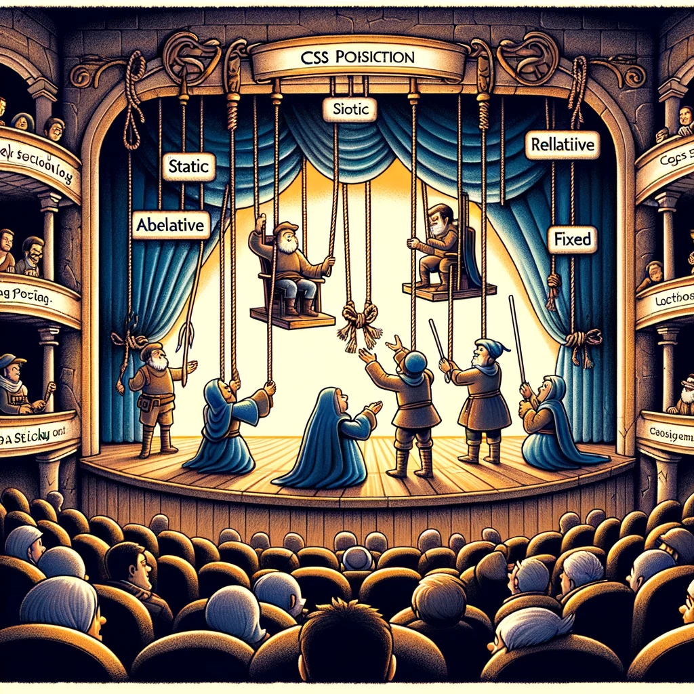

# CSS Position Property

This guide explores the CSS `position` property, an essential tool for placing elements on a web page. Understanding how different `position` values work will help developers create dynamic and customized layouts.



Image source: Dall-E by OpenAI

## Learning Outcomes

After completing this topic, you will be able to:

- Explain what the CSS `position` property is;
- Describe the different `position` values and their effects;
- Apply the `position` property to control the placement of elements.

## What Is the CSS Position Property?

The CSS `position` property allows developers to define the placement method for an element. Using this property, you can determine how an element is positioned relative to its normal flow or other elements.

## Key Position Values

- **`static`**: The default setting, which places the element in its natural flow. The `top`, `right`, `bottom`, and `left` properties have no effect on `static` elements.
- **`relative`**: Positions the element relative to its normal position, allowing it to move without affecting other elements.
- **`absolute`**: Removes the element from the document flow and positions it relative to the nearest positioned ancestor.
- **`fixed`**: Positions the element relative to the viewport, keeping it in place even when scrolling.
- **`sticky`**: Combines `relative` and `fixed` behavior. The element behaves as `relative` until a specified threshold is reached, after which it behaves as `fixed`.

> **Note:** The position of an element can also be adjusted using the `top`, `right`, `bottom`, and `left` properties, which specify its offsets relative to its container.

## Examples and Use Cases

### Example HTML

```html
<!DOCTYPE html>
<html lang="en">
<head>
  <meta charset="UTF-8">
  <meta name="viewport" content="width=device-width, initial-scale=1.0">
  <title>CSS Position Property</title>
  <link rel="stylesheet" href="styles.css">
</head>
<body>
  <div class="container">
    <div class="child child-1">Child 1</div>
    <div class="child child-2">Child 2</div>
    <div class="child child-3">Child 3</div>
  </div>
</body>
</html>
### Static

Enamik HTML elemente kasutab vaikimisi `static` paigutust, mis tähendab, et need asuvad seal, kuhu lehe normaalne voog neid paigutab. See tähendab, et `top`, `right`, `bottom`, ja `left` omadused ei mõjuta elementi.

```css
div {
  position: static;
}
```

### static

This is the default positioning method. Elements remain in their natural flow, and `top`, `right`, `bottom` and `left` properties have no effect.

```css
div {
  position: static;
}
```

### Relative

This positioning method allows you to offset an element relative to its normal position without affecting other elements.

```css
.child-1 {
  background-color: #0f0;
  position: relative;
  top: 20px;
  left: 10px;
}
```

### Absolute

An element with `Absolute` positioning is removed from the normal document flow and positioned relative to its nearest positioned ancestor.

```css
.container {
  position: relative;
}

.child-2 {
  background-color: #f00;
  position: absolute;
  top: 0;
  right: 0;
}
```

### Fixed

This positioning method fixes an element relative to the viewport, keeping it stationary during scrolling.

```css
.child-3 {
  background-color: #778899;
  position: fixed;
  bottom: 0;
  right: 0;
}
```

### Sticky

This method allows an element to act as `relative` until a certain threshold is reached, after which it becomes `fixed`.

```css
header {
  position: sticky;
  top: 0;
}
```

### Complete CSS Example

```css
.constainer {
  border: 1px solid black;
  display: flex;
  position: relative;
}

.child {
  display: inline-block;
  height: 100px;
  width: 100px;
  border: 1px solid black;
}

.child-1 {
  background-color: #0f0;
  position: relative;
  top: 20px;
  left: 10px;
}

.child-2 {
  background-color: #f00;
  position: absolute;
  top: 0;
  right: 0;
}

.child-3 {
  background-color: #778899;
  position: fixed;
  bottom: 0;
  right: 0;
}

```

This example places three elements on the page in different locations using various `position` values.

## Conclusion

The CSS position property is a crucial tool for positioning elements on a web page. It allows you to determine how an element is placed relative to its normal flow or other elements. By understanding and applying the different position values, you can create dynamic and customized layouts that meet your design requirements.
