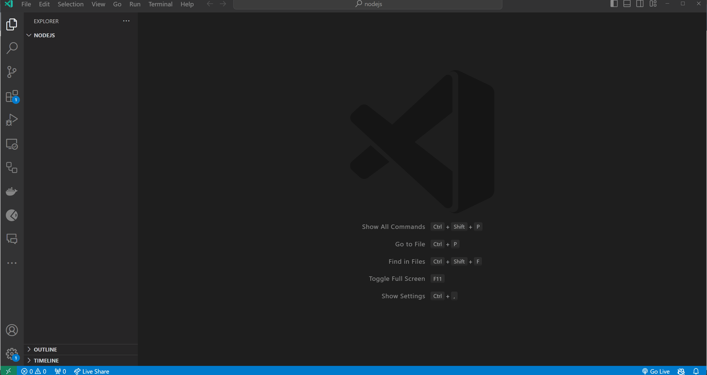
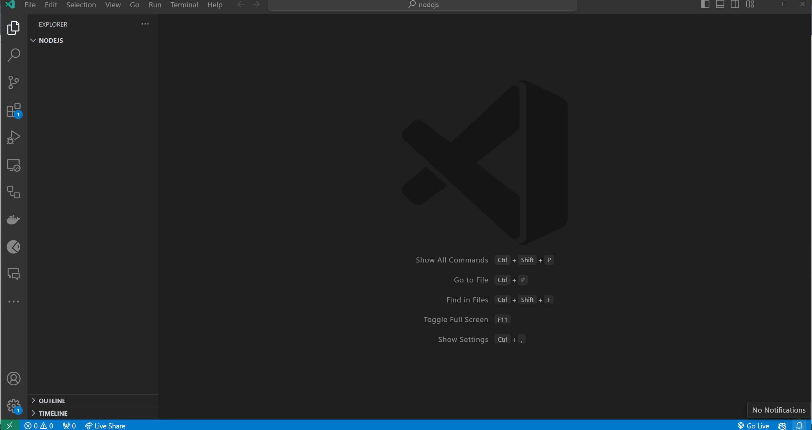
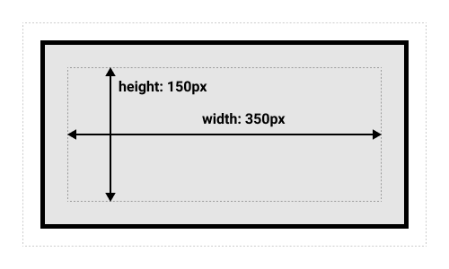

# Cascading Style Sheets (CSS)

In this topic, we'll learn about Cascading Style Sheets (CSS).

- [Cascading Style Sheets (CSS)](#cascading-style-sheets-css)
  - [Learning Outcomes](#learning-outcomes)
  - [What is CSS?](#what-is-css)
  - [Selectors](#selectors)
    - [Tag selectors](#tag-selectors)
    - [Class selectors](#class-selectors)
    - [ID selectors](#id-selectors)
    - [Attribute selectors](#attribute-selectors)
    - [Pseudo-class selectors](#pseudo-class-selectors)
  - [Properties](#properties)
  - [Values](#values)
  - [Units](#units)
    - [Absolute units](#absolute-units)
    - [Relative units](#relative-units)
    - [Values that does not require units](#values-that-does-not-require-units)
  - [Colors](#colors)
    - [Color names](#color-names)
    - [RGB](#rgb)
    - [Hexadecimal](#hexadecimal)
    - [RGBA](#rgba)
  - [How to apply CSS to HTML](#how-to-apply-css-to-html)
    - [Inline CSS](#inline-css)
    - [Internal CSS](#internal-css)
    - [External CSS](#external-css)
  - [Combining different ways to apply CSS to HTML](#combining-different-ways-to-apply-css-to-html)
  - [Box Model](#box-model)
    - [Standard box model](#standard-box-model)
    - [Alternative box model](#alternative-box-model)
  - [Exercises](#exercises)
    - [Exercise 1 - Basic CSS Styling](#exercise-1---basic-css-styling)
    - [Exercise 2: Creating a Simple Navigation Bar](#exercise-2-creating-a-simple-navigation-bar)
    - [Exercise 3: Styling a Content Section with Columns](#exercise-3-styling-a-content-section-with-columns)

## Learning Outcomes

After completing this topic, you'll be able to:

- Explain what CSS is and how it is used to style HTML elements.
- Use CSS selectors to select HTML elements.
- Use CSS properties to specify how the selected HTML elements should be styled.
- Use CSS values to specify the value of a CSS property.
- Use CSS units to specify the size of an element.
- Use CSS colors to specify the color of an element.
- Apply CSS to HTML using inline CSS, internal CSS, and external CSS.
- Combine different ways to apply CSS to HTML.
- Explain what the box model is and how it is used to layout HTML elements.
- Explain the difference between the standard box model and the alternative box model.
- Use the standard box model and the alternative box model to layout HTML elements.


## What is CSS?

CSS is a language used to style HTML elements. It is used to add colors, fonts, layouts, and more to web pages. CSS is a cornerstone technology of the World Wide Web, alongside HTML and JavaScript.

CSS is designed to enable the separation of presentation and content, including layout, colors, and fonts. This separation improves content accessibility, provides more flexibility and control in the specification of presentation characteristics, enables multiple web pages to share formatting by specifying the relevant CSS in a separate `.css` file, and reduces complexity and repetition in the structural content.

When HTML is describing the structure of a web page, CSS is describing how that structure should look. CSS is a style sheet language that allows you to define how the elements of your web page should be displayed. It is used to style the web pages written in HTML.

For example, if you want to change the color of the text on your web page, you can use CSS to do that. You can also use CSS to change the font size, font family, background color, border color, border width, border style, etc:

When we take a simple HTML document and add some CSS to it, we get the following result:

```html
<!DOCTYPE html>
<html>
  <head>
    <title>My First Web Page</title>
    <style>
      p {
        color: red;
        font-size: 20px;
        font-family: Arial, Helvetica, sans-serif;
        background-color: yellow;
        border-color: black;
        border-width: 1px;
        border-style: solid;
      }
    </style>
  </head>
  <body>
    <p>Hello, World!</p>
  </body>

```
Example page would look like this:

<p style="color: red; font-size: 20px; font-family: Arial, Helvetica, sans-serif; background-color: yellow; border-color: black; border-width: 1px; border-style: solid;">Hello, World!</p>

## Selectors

When we want to apply some styling to an HTML element, we need to select that element first to specify which element we want to style. We can select an HTML element using a CSS selector. CSS selectors are used to select the HTML elements you want to style. Selectors a making CSS more powerful by allowing you to target specific elements on your web page. For example, we can choose HTML elements based on their:

- tag name;
- class name;
- id;
- attribute;
- pseudo-class;
- etc.

When we write CSS, we need to specify two things: a selector and a declaration block. The selector is used to select the HTML elements we want to style. The declaration block is used to specify the CSS rules that will be applied to the selected HTML elements. The declaration block is enclosed in curly braces `{}`. Inside the curly braces, we can specify one or more CSS rules. Each CSS rule consists of a property and a value. The property is followed by a colon `:` and the value is followed by a semicolon `;`.

### Tag selectors

Tag selectors are used to select HTML elements based on their tag name. Selectors are case-insensitive, which means that `p`, `P`, and `P` are all the same selector. For example, if we want to select all `<p>` elements on our web page, we can use the following selector:

```css
p {
  color: red;
}
```

In this example, selector for `<p>` elements is `p`. The selector is followed by a set of curly braces `{}`. Inside the curly braces, we spcified a CSS rule that will be applied to all `<p>` elements on our web page. The CSS rule consists of a property and a value. In this example, the property is `color` and the value is `red`. The property is followed by a colon `:` and the value is followed by a semicolon `;`.

### Class selectors

If we want to select all elements with `class="my-class"`, we can use the following selector:

```css
.my-class {
  /* CSS rules */
}
```

Class selectors start with a dot `.` followed by the class name. In this example, the class name is `my-class`.

### ID selectors

If we want to select all elements with `id="my-id"`, we can use the following selector:

```css
#my-id {
  /* CSS rules */
}
```

ID selectors start with a hash `#` followed by the ID name. In this example, the ID name is `my-id`.

### Attribute selectors

If we want to select all elements with `attribute="value"`, we can use the following selector:

```css
[attribute="value"] {
  /* CSS rules */
}
```

Attribute selectors start with a square bracket `[` followed by the attribute name, followed by an equal sign `=`, followed by the attribute value, followed by a closing square bracket `]`. In this example, the attribute name is `attribute` and the attribute value is `value`.

### Pseudo-class selectors

Pseudo-class selectors are used to select HTML elements based on their state. For example, if we want to select all `<a>` elements that are being hovered, we can use the following selector:

```css
a:hover {
  /* CSS rules */
}
```
First we specify the selector (`a`), then we specify the pseudo-class (`:hover`). The selector and the pseudo-class are separated by a colon `:`.

Most common pseudo-classes are:

- `:active` - selects the active link;
- `:focus` - selects the element that has focus;
- `:hover` - selects the element that is being hovered;
- `:link` - selects all unvisited links;
- `:visited` - selects all visited links;
- `:first-child` - selects the first child of an element;
- etc.

Full list of CSS selectors can be found [here](https://developer.mozilla.org/en-US/docs/Web/CSS/CSS_selectors)

## Properties

CSS properties are used to specify how the selected HTML elements should be styled. Each CSS property has a name and a value. The name is followed by a colon `:` and the value is followed by a semicolon `;`. For example, if we want to change the color of the text on our web page, we can use the following CSS rule:

```css
p {
  color: red;
}
```

**Result:**
<p style="color: red">Hello, World!</p>

In this example, the property is `color` and the value is `red`. The property is followed by a colon `:` and the value is followed by a semicolon `;`.

There are many different CSS properties. Some of the most common CSS properties are:

- `color` - specifies the color of the text;
- `font-size` - specifies the font size of the text;
- `font-family` - specifies the font family of the text;
- `background-color` - specifies the background color of an element;
- `border-color` - specifies the border color of an element;
- `border-width` - specifies the border width of an element;
- `border-style` - specifies the border style of an element;
- `border` - specifies the border of an element (shorthand property);
- `width` - specifies the width of an element;
- `height` - specifies the height of an element;
- `margin` - specifies the margin of an element;
- `padding` - specifies the padding of an element;
- `text-align` - specifies the horizontal alignment of text;
- `vertical-align` - specifies the vertical alignment of text;
- `display` - specifies the display behavior of an element;
- `position` - specifies the position of an element;
- etc

Full list of CSS properties can be found [here](https://developer.mozilla.org/en-US/docs/Web/CSS/Reference)

## Values

CSS values are used to specify the value of a CSS property. Each CSS value has a name and a value. The name is followed by a colon `:` and the value is followed by a semicolon `;`. For example, if we want to change the color of the text on our web page, we can use the following CSS rule:

```css
p {
  color: blue;
  size: 20px;
  font-family: Arial, Helvetica, sans-serif;
}
```

**Result:**
<p style="color: blue; size: 20px; font-family: Arial, Helvetica, sans-serif">Hello, World!</p>

In this example there is a CSS rule with three properties, which are applied for all paragraphs in webpage: `color`, `size`, and `font-family`. Each property has a value. The value of the `color` property is `blue`. The value of the `size` property is `20px`. The value of the `font-family` property is `Arial, Helvetica, sans-serif`.

> There are multiple values for `font-family` property. The browser will use the first value that is available on the user's computer. If none of the fonts are available, the browser will use the default font of the user's computer.

Another example of using multiple values for a CSS property is `border` property. The `border` property is a shorthand property for setting the `border-width`, `border-style`, and `border-color` properties. For example, if we want to specify the border of an element, we can use the following CSS rule:

```css
p {
  border: 1px solid black;
}
```
In this example, the `border` property has three values: `1px`, `solid`, and `black`. The first value (`1px`) specifies the border width. The second value (`solid`) specifies the border style. The last value (`black`) specifies the border color.

**Result:**
<p style="border: 1px solid black">Hello, World!</p>

## Units

CSS units are used to specify the size of an element. There are two types of CSS units: `absolute units` and `relative units`.

### Absolute units

Absolute units are fixed units. They are not relative to anything. For example, if we want to specify the width of an element using an absolute unit, we can use the following CSS rule:

```css
p {
  width: 100px;
}
```

In this example, the width of the element is `100px`. The width is not relative to anything. It is fixed at `100px`.

Some of the most common absolute units are:

- `cm` - centimeters - 1cm = 37.8px;
- `mm` - millimeters - 1mm = 3.78px;
- `Q` - quarter-millimeters - 1Q = 0.95px;
- `in` - inches - 1in = 96px;
- `pc` - picas - 1pc = 16px;
- `pt` - points - 1pt = 1.33px;
- `px` - pixels - 1px = 1/96th of 1in;

Usually we use `px` as an absolute unit.

### Relative units

Relative units are relative to something else (parent element, root element, etc.). For example, if we want to specify the width of an element using a relative unit, we can use the following CSS rule:

```css
p {
  width: 100%;
}
```

In this example, the width of the element is `100%`. The width is relative to the width of the parent element. If the width of the parent element is `100px`, the width of the element will be `100px`. If the width of the parent element is `200px`, the width of the element will be `200px`. If the width of the parent element is `300px`, the width of the element will be `300px`. And so on.

Some of the most common relative units are:

- `%` - percent;
- `em` - font size of the parent element;
- `rem` - font size of the root element;
- `vw` - 1% of the viewport width;
- `vh` - 1% of the viewport height;
- `vmin` - 1% of the viewport width or height, whichever is smaller;
- `vmax` - 1% of the viewport width or height, whichever is larger;
- etc.

### Values that does not require units

Some values does not require units. For example, if we want to specify the opacity of an element, we can use the following CSS rule:

```css
p {
  opacity: 0.5;
}
```
**Result:**
<p style="opacity: 0.5">Hello, World!</p>

In this example, the opacity of the element is `0.5`. The opacity is not relative to anything. It is fixed at `0.5`.

Some of the most common values that does not require units are:

- `opacity` - specifies the opacity of an element;
- `z-index` - specifies the stack order of an element;
- `order` - specifies the order of an element;
- etc.

## Colors

Colors are used to specify the color of an element. There are many different ways to specify colors in CSS. Some of the most common ways are:

- `color name` - for example, `red`, `green`, `blue`, etc;
- `rgb` - for example, `rgb(255, 0, 0)`, `rgb(0, 255, 0)`, `rgb(0, 0, 255)`, etc;
- `hexadecimal` - for example, `#ff0000`, `#00ff00`, `#0000ff`, etc;
- `rgba` - for example, `rgba(255, 0, 0, 0.5)`, `rgba(0, 255, 0, 0.5)`, `rgba(0, 0, 255, 0.5)`, etc;

### Color names

There are lot of color names in CSS. Some of the most common color names are:

- `red` - red color;
- `green` - green color;
- `blue` - blue color;
- `yellow` - yellow color;
- `orange` - orange color;
- `purple` - purple color;
- `pink` - pink color;
- `black` - black color;
- `white` - white color;
- etc

Full list of color names can be found [here](https://developer.mozilla.org/en-US/docs/Web/CSS/named-colors)

### RGB

RGB stands for `red`, `green`, and `blue`. It is a color model that is used to specify the amount of red, green, and blue in a color. Each color has a value between `0` and `255`. For example, if we want to specify the color green, we can use the following RGB color:

```css
p {
  color: rgb(0, 255, 0);
}
```
**Result:**
<p style="color: rgb(0, 255, 0)">Hello, World!</p>

In this example, the color of the element is `rgb(255, 0, 0)`. The first number (`255`) specifies the amount of red in the color. The second number (`0`) specifies the amount of green in the color. The last number (`0`) specifies the amount of blue in the color. In this example, the amount of red is `255`, the amount of green is `0`, and the amount of blue is `0`. This means that the color is red.

Some of the most common RGB colors are:

- `rgb(255, 0, 0)` - red color;
- `rgb(0, 255, 0)` - green color;
- `rgb(0, 0, 255)` - blue color;
- `rgb(255, 255, 0)` - yellow color;
- `rgb(255, 165, 0)` - orange color;
- `rgb(128, 0, 128)` - purple color;
- `rgb(255, 192, 203)` - pink color;
- `rgb(0, 0, 0)` - black color;
- `rgb(255, 255, 255)` - white color;
- etc

### Hexadecimal

Hexadecimal means base 16. It is a number system with 16 different digits. First 10 digits are from `0` to `9` just lice in decimal system we are used to. But next 6 digits are from `a` to `f`, which are representing decimal digits from `11` to `16`. It is difficult to read hexadecimal numbers, so we can use [calculators](https://www.binaryhexconverter.com/hex-to-decimal-converter) if we need to convert hexadecimal numbers to decimal numbers.

As in RGB, also in hexadecimal colors, we can specify the amount of red, green, and blue in a color. Each color has a value between `00` (0 in decimal system) and `ff` (255 in decimal system). For example, if we want to specify the color red, we can use the following hexadecimal color:

```css
p {
  color: #ff0000;
}
```
**Result:**
<p style="color: #ff0000">Hello, World!</p>

In this example, the color of the element is `#ff0000`. The first two characters (`ff`) specify the amount of red in the color. The second two characters (`00`) specify the amount of green in the color. The last two characters (`00`) specify the amount of blue in the color. In this example, the amount of red is `ff`, the amount of green is `00`, and the amount of blue is `00`. This means that the color is red.

Some of the most common hexadecimal colors are:

- `#ff0000` - red color;
- `#00ff00` - green color;
- `#0000ff` - blue color;
- `#ffff00` - yellow color;
- `#ffa500` - orange color;
- `#800080` - purple color;
- `#ffc0cb` - pink color;
- `#000000` - black color;
- `#ffffff` - white color;
- etc

Basically, HEX is just a shorter way to write RGB. For example, `rgb(255, 0, 0)` is the same as `#ff0000`. `rgb(0, 255, 0)` is the same as `#00ff00`. `rgb(0, 0, 255)` is the same as `#0000ff`. `rgb(255, 255, 0)` is the same as `#ffff00`. `rgb(255, 165, 0)` is the same as `#ffa500`. `rgb(128, 0, 128)` is the same as `#800080`. `rgb(255, 192, 203)` is the same as `#ffc0cb`. `rgb(0, 0, 0)` is the same as `#000000`. `rgb(255, 255, 255)` is the same as `#ffffff`.

We can use [HEX Calculator](https://www.w3schools.com/colors/colors_hexadecimal.asp) to find hexadecimal colors.

### RGBA

RGBA stands for `red`, `green`, `blue`, and `alpha`. It is a color model that is used to specify the amount of red, green, blue, and alpha in a color. Each color has a value between `0` and `255`. Alpha has a value between `0` and `1`. Alpha means opacity. `0` means fully transparent and `1` means fully opaque. For example, if we want to specify the color red, we can use the following RGBA color:

```css
p {
  color: rgba(255, 0, 0, 0.5);
}
```
**Result:**
<p style="color: rgba(255, 0, 0, 0.5)">Hello, World!</p>

In this example, the color of the element is `rgba(255, 0, 0, 0.5)`. The first number (`255`) specifies the amount of red in the color. The second number (`0`) specifies the amount of green in the color. The last number (`0`) specifies the amount of blue in the color. The last number (`0.5`) specifies the amount of alpha in the color.

To compare Alpha value, we can change it to `1` and see the difference:

```css
p {
  color: rgba(255, 0, 0, 1);
}
```

**Result:**
<p style="color: rgba(255, 0, 0, 1)">Hello, World!</p>

## How to apply CSS to HTML

There are three ways to apply CSS to HTML:

- inline CSS;
- internal CSS;
- external CSS;

### Inline CSS

Inline CSS is used to apply CSS to a single HTML element. For example, if we want to change the color of a single paragraph, we can use the following HTML code:

```html
<p style="color: red">Hello, World!</p>
```

In this example, we used the `style` attribute to apply CSS to the `<p>` element. The `style` attribute is followed by a set of double quotes `""`. Inside the double quotes, we specified the CSS rules that will be applied to the `<p>` element. The CSS rules consists of a property and a value. In this example, the property is `color` and the value is `red`.


### Internal CSS

Internal CSS is used to apply CSS to a single HTML page. For example, if we want to change the color of all paragraphs on a single HTML page, we can use the following HTML code:

```html
<!DOCTYPE html>
<html>
  <head>
    <title>My First Web Page</title>
    <style>
      p {
        color: red;
      }
    </style>
  </head>
  <body>
    <p>Hello, World!</p>
  </body>
</html>
```



In this example, we used the `<style>` tag to apply CSS to the HTML page. The `<style>` tag is followed by a set of curly braces `{}`. Inside the curly braces, we specified the CSS rules that will be applied to the HTML page. In this example, we apply red color to all paragraphs on the HTML page.

### External CSS

External CSS is used to apply CSS to multiple HTML pages. For example, if we want to change the color of all paragraphs on multiple HTML pages, we can use the following HTML code:

```html
<!DOCTYPE html>
<html>
  <head>
    <title>My First Web Page</title>
    <link rel="stylesheet" href="style.css">
  </head>
  <body>
    <p>Hello, World!</p>
  </body>
</html>
```
`style.css` file:
```css
p {
  color: red;
}
```


In this example, we used the `<link>` tag to apply CSS to  HTML page. The `<link>` tag is followed by a set of double quotes `""`. Inside the double quotes, we specified the path to the CSS file. In this example, the path to the CSS file is `style.css`.

In `style.css` file, we specified the CSS rules that will be applied to the HTML page. In this example, we apply red color to all paragraphs on the HTML page.


## Combining different ways to apply CSS to HTML

We can combine all three ways to apply CSS to HTML. For example, if we want to change the color of a single paragraph, we can use the following HTML code:

```html
<!DOCTYPE html>
<html>
  <head>
    <title>My First Web Page</title>
    <style>
      p {
        color: red;
      }
    </style>
  </head>
  <body>
    <p>Hello, World!</p>
    <p style="color: blue">Hello, World!</p>
  </body>
</html>
```

Cascading in CSS means that the styles are applied in a specific order. The order is as follows:

1. Browser default;
2. External style sheet;
3. Internal style sheet (in the `<head>` section);
4. Inline style (inside an HTML element);

In previous example, the color of the second paragraph is `blue`. This is because the inline style is applied after the internal style sheet.

## Box Model

The CSS box model is a rectangular layout design for HTML elements. It consists of four parts: `content`, `padding`, `border`, and `margin`. The `content` is the actual content of the element. The `padding` is the space between the content and the border. The `border` is the border of the element. The `margin` is the space between the border and the next element.


[Image source](https://developer.mozilla.org/en-US/docs/Learn/CSS/Building_blocks/The_box_model/box-model.png)

### Standard box model

The standard box model is the default box model in CSS. It is used by most browsers. In the standard box model, the width and height of an element are calculated as follows:

- `width = content width + padding left + padding right + border left + border right`;
- `height = content height + padding top + padding bottom + border top + border bottom`;

If we assume a box has a following CSS rules:

```css
.box {
  width: 350px;
  height: 150px;
  margin: 10px;
  padding: 25px;
  border: 5px solid black;
}
```

The width and height of the box will be calculated as follows:

- `width = 350px + 25px + 25px + 5px + 5px = 410px`;
- `height = 150px + 25px + 25px + 5px + 5px = 210px`;


[Image source](https://developer.mozilla.org/en-US/docs/Learn/CSS/Building_blocks/The_box_model/standard-box-model.png)

> The width and height of an element does not include the margin.

### Alternative box model

In the alternative box model, the width is the width of the content and the height is the height of the content. The padding, border, and margin are added to the width and height. In the alternative box model, the width and height of an element are calculated as follows:

- `width = content width`;
- `height = content height`;

If we assume a box has a sam CSS rules as before:

```css
.box {
  width: 350px;
  height: 150px;
  margin: 10px;
  padding: 25px;
  border: 5px solid black;
}
```

The width and height of the box will be calculated as follows:

- `width = 350px`;
- `height = 150px`;


[Image source](https://developer.mozilla.org/en-US/docs/Learn/CSS/Building_blocks/The_box_model/alternate-box-model.png)

To turn on the alternative model for an element, set `box-sizing: border-box` on it:

```css
.box {
  box-sizing: border-box;
}
```

To use the alternative box model for all of your elements (which is a common choice among developers), set the box-sizing property on the <html> element and set all other elements to inherit that value:

```css
html {
  box-sizing: border-box;
}

*, *::before, *::after {
  box-sizing: inherit;
}
```

You can read more about box model [here](https://developer.mozilla.org/en-US/docs/Learn/CSS/Building_blocks/The_box_model)

## Exercises

Create `index.html` and `style.css` files. Link `style.css` file to `index.html` file. Use `style.css` file to write CSS code. Use `index.html` file to write HTML code.

Test your code by opening `index.html` file in your browser.

Try to solve exercises without looking at the solutions. If you get stuck, you can look at the solutions.

### Exercise 1 - Basic CSS Styling

**Objective**: Apply fundamental styles to HTML elements.

**Description**: Create an HTML file with a `h1` tag for a title, a `p` tag for a paragraph, and a `div` element. Write a CSS file to style these elements. Change the color and font size of the `h1` tag. For the paragraph, set a different `font-family` and `color`. Give the `div` a solid border, set a background color, and adjust its padding.

**Expected Tasks**:

- Style the `h1` tag with a specific color and font size.
- Apply a different `font-family` and `color` to the paragraph.
- Give the `div` a `border`, `background color`, and `padding`.

> Hint: Use `border` property to give the `div` a solid border with a specific width and color.

<details>
<summary>Solution</summary>

```html
<!DOCTYPE html>
<html>
  <head>
    <title>Basic CSS Styling</title>
    <link rel="stylesheet" href="style.css">
  </head>
  <body>
    <h1>Hello, World!</h1>
    <p>This is a paragraph.</p>
    <div>This is a div.</div>
  </body>
</html>
```

```css
h1 {
  color: red;
  font-size: 50px;
}

p {
  font-family: Arial, Helvetica, sans-serif;
  color: blue;
}

div {
  border: 5px solid black;
  background-color: yellow;
  padding: 25px;
}
```
</details>

### Exercise 2: Creating a Simple Navigation Bar

**Objective**: Style a basic horizontal navigation bar.

**Description**: Design a basic webpage with a navigation bar consisting of unordered list items. The navigation bar should be horizontal, with each list item displayed inline. Style the list items to have padding, a border, and a background color. When hovering over a list item, change its background color.

**Expected Tasks**:
- Apply styling (padding, border, background color) to list items.
- Change the background color of list items on hover

> Hint: Use `list-style-type: none` to remove the bullet points from the list items.
>
> Hint: Use `display: inline` or `display: inline-block` to align list items horizontally.
>
> Hint: Use `:hover` pseudo-class to change the background color of list items on hover.

<details>
<summary>Solution</summary>

```html
<!DOCTYPE html>
<html>
  <head>
    <title>Creating a Simple Navigation Bar</title>
    <link rel="stylesheet" href="style.css">
  </head>
  <body>
    <ul>
      <li>Home</li>
      <li>About</li>
      <li>Contact</li>
    </ul>
  </body>
</html>
```

```css
ul {
  list-style-type: none;
  margin: 0;
  padding: 0;
}

li {
  display: inline-block;
  padding: 10px;
  border: 1px solid black;
  background-color: yellow;
}

li:hover {
  background-color: red;
}
```
</details>

### Exercise 3: Styling a Content Section with Columns

**Objective**: Create a content area divided into columns.

**Description**: Build a section of a webpage intended to display content in three columns. Use `div` elements to represent each column. Style each `div` so they have a border, padding, and a fixed width, and are arranged side by side.

**Expected Tasks**:

- Create three `div` elements to serve as columns.
- Style the `divs` with a border, padding, and set a fixed width in percentage.
- Use `float` or `display: inline-block` to position the `divs` side by side.
