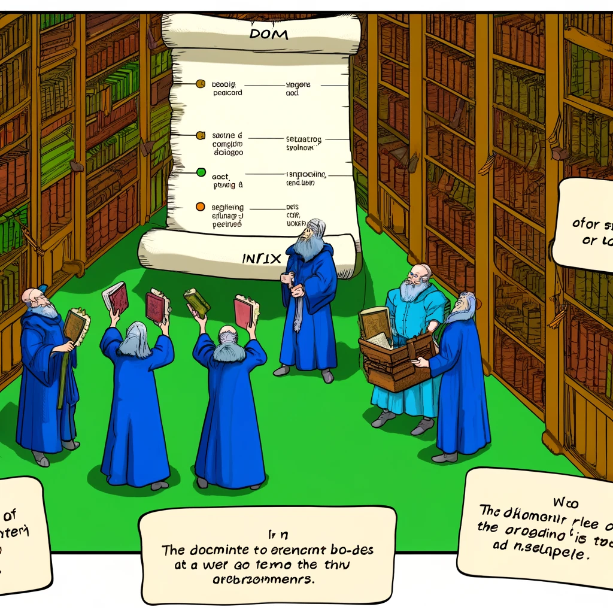

# Document Object Model (DOM)

This guide explains the Document Object Model (DOM) and why it is essential in web development.



*Image Source: Dall-E by OpenAI*

- [Document Object Model (DOM)](#document-object-model-dom)
  - [Learning Outcomes](#learning-outcomes)
  - [What is DOM?](#what-is-dom)
  - [Why is DOM Important?](#why-is-dom-important)
  - [How to Use DOM](#how-to-use-dom)
  - [Examples of DOM Manipulation](#examples-of-dom-manipulation)

## Learning Outcomes

After completing this guide, you will be able to:

- Explain what the Document Object Model (DOM) is and how it works;
- Demonstrate how to use the DOM to select and manipulate elements;
- Understand how the DOM enables web pages to be dynamic and interactive;
- Use the DOM to handle and respond to events.

## What is DOM?

The Document Object Model (DOM) is a programming interface used by web browsers to represent web documents. It provides a structured, hierarchical representation of the web page as a tree, where every HTML element is a node that can be accessed and modified with JavaScript.

For example, the `<body>` element in an HTML document is represented in the DOM as a node with properties like `textContent`, `innerHTML`, and `style`. You can view the DOM representation of any web page using your browser's developer tools.

## Why is DOM Important?

- **Dynamic Content**: DOM allows developers to dynamically modify the content of a web page using JavaScript. You can add, remove, or update elements and styles without reloading the page.
- **Interactivity**: DOM enables developers to add interactivity to web pages, such as responding to user actions like button clicks or form submissions.
- **Event Handling**: DOM provides the capability to handle events like clicks, keyboard inputs, and mouse movements, enabling a richer and more interactive user experience.

## How to Use DOM

Using the DOM involves selecting and manipulating HTML elements with JavaScript. Here are some examples:

- **Selecting Elements**: Use methods like `document.getElementById('header')` to select elements by their ID or `document.querySelector('.class')` to select elements by class.
- **Adding Elements**: Use `document.createElement('p')` to create a new paragraph element and `appendChild()` to add it to the DOM.
- **Modifying Elements**: Update an element’s properties, content, or styles. For example, `element.textContent = 'Hello, World!'` changes the text content of an element.
- **Handling Events**: Add event listeners to respond to user interactions like clicks or key presses.

## Examples of DOM Manipulation

### Changing Content
Update the text or HTML content of a web page element:
```javascript
document.getElementById('myElement').textContent = 'New Text';
```

- **Modifying Styles**: Change the style of an element, such as its color or font:

```javascript
document.getElementById('myElement').style.color = 'red';
```

- **Adding/Removing Elements**: Add new elements or remove existing ones:

```javascript
var newElement = document.createElement('div');
document.body.appendChild(newElement);
```

- **Event Handling**: Set up reactions to user actions like button clicks:

```javascript
const button = document.getElementById('myButton');
button.addEventListener('click', function() {
  alert('Button clicked!');
});

 ```

## Conclusion
The DOM is a fundamental concept in web development, enabling developers to create dynamic, interactive web pages. Understanding and efficiently using the DOM is a crucial skill for any web developer. For more information about the DOM, visit [MDN Web Docs](https://developer.mozilla.org/en-US/docs/Web/API/Document_Object_Model).
