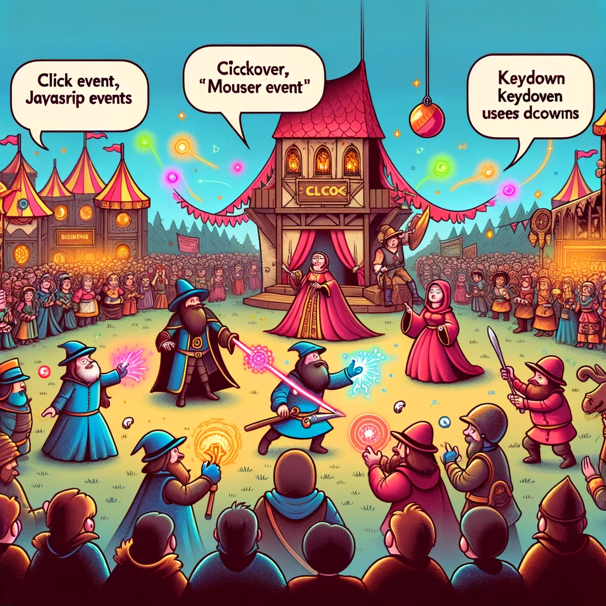

# JavaScript Events

In this guide, we explore JavaScript events, their significance, and how to use them in web development.



*Image Source: Dall-E by OpenAI*

- [JavaScript Events](#javascript-events)
  - [Learning Outcomes](#learning-outcomes)
  - [What Are JavaScript Events?](#what-are-javascript-events)
  - [Why Are JavaScript Events Important?](#why-are-javascript-events-important)
  - [How to Use JavaScript Events](#how-to-use-javascript-events)
  - [JavaScript Event Examples](#javascript-event-examples)
    - [Click Event](#click-event)
    - [Keyboard Event](#keyboard-event)
    - [Form Submission Event](#form-submission-event)
    - [Mouse Event](#mouse-event)

## Learning Outcomes

After completing this guide, you will be able to:

- Explain what JavaScript events are and how they work;
- Apply event listeners to HTML elements;
- Use different event types such as clicks, keyboard events, and form submissions;
- Handle events to create more interactive and user-friendly web applications.

## What Are JavaScript Events?

JavaScript events are actions or occurrences that can happen on a web page, and JavaScript can be used to trigger interactive functions based on these events. These events can include user actions like clicking, scrolling, or pressing keys, as well as system events like the page loading.

## Why Are JavaScript Events Important?

- **Interactivity**: Events allow users to interact with the webpage, enhancing the user experience.
- **Dynamic Content**: Developers can dynamically change web page content in response to user actions.
- **Control and Flexibility**: Events give developers control over element behavior and enable reactions to various user actions.

## How to Use JavaScript Events

Using JavaScript events involves setting event listeners and defining event handlers. Here’s how:

- **Select Elements**: First, select the HTML element you want to add an event listener to:

```javascript
const button = document.getElementById('myButton');
```

- **Add Event Listener**: Attach an event listener for a specific event, such as `click`.

```javascript
button.addEventListener('click', function() {
  alert('Button clicked!');
});

```

- **Handle Events**: Define a function to execute when the event occurs:

```javascript
button.addEventListener('click', handleClick);

function handleClick() {
  alert('Button clicked!');
}

```

## JavaScript Event Examples

### Click Event

React to a user clicking a button:

```javascript
const button = document.getElementById('clickButton');
button.addEventListener('click', () => {
  console.log('Button clicked!');
});
```

### Keyboard Event

Respond to a key press by the user:

```javascript
const inputField = document.getElementById('inputField');
inputField.addEventListener('keydown', (event) => {
  console.log(`Key pressed: ${event.key}`);
});
```

### Form Submission Event

Handle form submissions:

```javascript
const form = document.getElementById('myForm');
form.addEventListener('submit', (event) => {
  event.preventDefault();  // Prevent default form submission
  console.log('Form submitted!');
});

```

### Mouse Event

React to mouse movements over an element:

```javascript
const box = document.getElementById('mouseBox');
box.addEventListener('mousemove', () => {
  console.log('Mouse is moving over the box!');
});
```

By using these examples, you can create more dynamic and user-friendly web applications. JavaScript events are powerful tools that help developers build interactive and engaging web experiences.

For more information on JavaScript events and their types, visit [MDN Web Docs](https://developer.mozilla.org/en-US/docs/Web/Events) .
