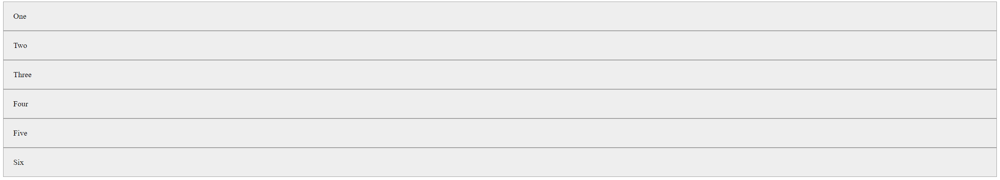
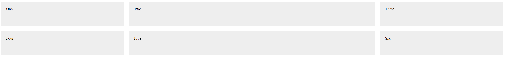
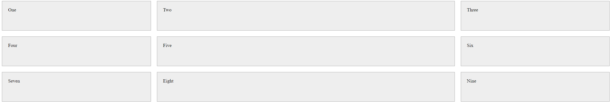
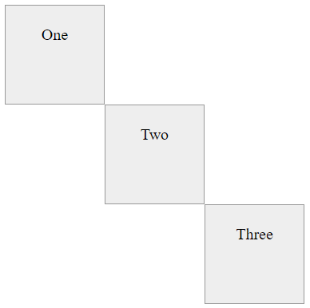

# Grid

In this topic, we'll learn about basics of CSS Grid.

## Learning Outcomes

After completing this topic, you'll be able to:


## What is CSS Grid?

CSS Grid is a layout system that allows you to create complex layouts with ease. It's a two-dimensional system, meaning it can handle both columns and rows, unlike flexbox which is largely a one-dimensional system. CSS Grid is supported in all modern browsers.

Grid provides a grid-based layout system, with rows and columns, making it easier to design web pages without having to use floats and positioning. It offers a new level of flexibility and control in CSS page layouts.

Basically we can think of CSS Grid as a table, where we can define the number of rows and columns, and then place items within the table. The items can span multiple rows and columns, and can be placed anywhere within the table.

## Why Use CSS Grid?

- **Two-Dimensional Layout**: Grid allows you to work with both rows and columns simultaneously, which is not possible with Flexbox (a one-dimensional system).
- **Fixed and flexible track sizes**: You can define grid with fixed track sizes - where the size of the tracks are defined in pixels, or flexible track sizes - where the size of the tracks are defined in percentages or fractions of the available space.
- **Control and Precision**: You can precisely place and size grid items within the grid container using line numbers, names, or by targeting grid areas.
- **Responsive Design**: It simplifies the creation of responsive designs. Grid items can be rearranged and resized easily as the viewport changes, without changing the HTML.
- **Creattion of Additional Tracks**: You can create additional tracks (rows and columns) automatically in the grid container, without changing the HTML.
- **Simplifies Complex Layouts**: It's ideal for complex layouts that were difficult to achieve with older CSS properties, reducing the need for additional markup or complex scripting.
- **Browser Support**: Modern browsers, including the latest versions of Chrome, Firefox, Safari, and Edge, support Grid, making it widely usable in current web development.

> Grid tracks are the columns and rows of the grid. A grid track can be a column or a row.

## How to use CSS Grid

### Grid Container

To create a grid, we first need to define a grid container. A grid container is an element that contains a grid. To create a grid container, we need to set the `display` property of the element to `grid` or `inline-grid`.

```css
.container {
  display: grid;
}
```

Now we create HTML elements inside the container and they will become grid items. We add `class="container"` to the `div` element to make it a grid container. All elements inside the container will become grid items. We also add `class="item"` to each `div` element, so we can style them.

```html
<body>
  <div class="container"> <!-- Grid Container -->
    <div class="item">One</div> <!-- Grid Item -->
    <div class="item">Two</div>
    <div class="item">Three</div>
    <div class="item">Four</div>
    <div class="item">Five</div>
    <div class="item">Six</div>
  </div>
</body>
```

Just for demonstration purposes, we'll add some styles to the grid items.

```css
.item {
  background-color: #eee;
  border: 1px solid #999;
  padding: 20px;
}
```

Our grid container now looks like this:



### Grid Columns

By default, the grid container will display the grid items in a single column. To create a grid with multiple columns, we need to define the number of columns in the grid container using the `grid-template-columns` property.

```css
.container {
  display: grid;
  grid-template-columns: 200px 200px 200px;
}
```

The `grid-template-columns` property defines the number of columns in the grid container, and the width of each column. In the example above, we have defined three columns, each with a width of 200 pixels.

Now our grid container looks like this:


As we can see, now we have three columns with fixed column widths. The columns are 200 pixels wide. If we add more grid items, they will be automatically placed in the next row.

If we want dynamic column widths, we can use percentages or fractions of the available space instead of fixed widths. Fractions are specified using the `fr` unit. For example, if we want the columns to take up equal space, we can use `1fr` for each column.

```css
.container {
  display: grid;
  grid-template-columns: 1fr 1fr 1fr;
}
```
Now our grid container looks like this:


As we can see, now our columns take up all space in the grid container.

Just to make things to look a bit more nice, we'll add some gap between the grid items. A gap is the space between the grid items. We can add gap between the grid items using the `gap` property.

Also lets make thing a bit more interesting by changing the columns to have different widths - lets make the first column 1fr, the second column 2fr, and the third column 1fr.

It means, the first column will take up 1/4 of the available space, the second column will take up 2/4 of the available space, and the third column will take up 1/4 of the available space.

```css
.container {
  display: grid;
  grid-template-columns: 1fr 2fr 1fr;
  gap: 20px;
}
```

Now our grid container looks like this:


We can also mix fixed widths and dynamic widths. For example, if we want the first column to be 200 pixels wide, the second column to take up 1/4 of the available space, and the third column to take up 3/4 of the available space, we can do it like this:

```css
.container {
  display: grid;
  grid-template-columns: 200px 1fr 3fr;
  gap: 20px;
}
```
Now our grid has one fixed width column and two dynamic width columns. What makes things interesting is that the dynamic width columns will take up the available space after the fixed width column has been taken into account and if we resize the browser window, the dynamic width columns will resize accordingly.


## Implicit and Explicit Grids

In our examples above, we have defined the number of columns in the grid container using the `grid-template-columns` property. These columns are called explicit columns. An explicit column is a column that is created by the developer. But in our examples, we also have rows but we haven't defined the number of rows in the grid container. These rows are part of the implicit grid.

We can create an explicit grid by defining the number of rows and columns in the grid container using the `grid-template-columns` and `grid-template-rows` property.

```css
.container {
  display: grid;
  grid-template-columns: 1fr 2fr 1fr;
  grid-template-rows: 100px 100px;
  gap: 20px;
}
```
Now our grid container looks like this:



As we can see, now we have an explicit grid with two rows and three columns. The first row is 100 pixels high, the second row is 100 pixels high, the first column is 1/4 of the available space, the second column is 2/4 of the available space, and the third column is 1/4 of the available space.

But what if we add more grid items? Lets add three more grid items to the grid container.

```html
<body>
  <div class="container">
    <div class="item">One</div>
    <div class="item">Two</div>
    <div class="item">Three</div>
    <div class="item">Four</div>
    <div class="item">Five</div>
    <div class="item">Six</div>
    <div class="item">Seven</div>
    <div class="item">Eight</div>
    <div class="item">Nine</div>
  </div>
</body>
```

As we can see, we now have three rows, but we have only defined two rows in the grid container. The third row is part of the implicit grid. The implicit grid is created automatically when we add more grid items than we have defined rows and columns in the grid container. We can also see, that that grid items in implicit grid don't have same height as the grid items in the explicit grid.


We can also set the height of the rows in the implicit grid using the `grid-auto-rows` property.

```css
.container {
  display: grid;
  grid-template-columns: 1fr 2fr 1fr;
  grid-auto-rows: 100px;
  gap: 20px;
}
```



## Positioning Grid Items

If we want more control over the placement of grid items, we can use the `grid-column-start`, `grid-column-end`, `grid-row-start`, and `grid-row-end` properties. These properties allow us to specify where a grid item should start and end.

But before we can use these properties, we need to understand how the grid is structured. The grid is structured into columns and rows. Each column and row has a start line and an end line. The start line is the line where the column or row starts, and the end line is the line where the column or row ends. The lines are numbered starting from 1 and going up. The lines are numbered from left to right for columns, and from top to bottom for rows.


[Image Source](https://developer.mozilla.org/en-US/docs/Web/CSS/CSS_grid_layout/Basic_concepts_of_grid_layout)

We can use the `grid-column-start` and `grid-column-end` properties to specify where a grid item should start and end horizontally. We can use the `grid-row-start` and `grid-row-end` properties to specify where a grid item should start and end vertically.

For example, if we want to create a 3x3 grid and place three items in the grid so that first item is in the first row and first column, second item is in the second row and second column, and third item is in the third row and third column, we can do it like this:

```html
<body>
  <div class="container">
    <div class="item box-1">One</div>
    <div class="item box-2">Two</div>
    <div class="item box-3">Three</div>
  </div>
</body>
```

```css
.container {
  display: grid;
  grid-template-columns: 100px 100px 100px;
  grid-template-rows: 100px 100px 100px;
}

.item {
  background-color: #eee;
  border: 1px solid #999;
  padding: 20px;
  text-align: center;
}

.box-1 {
  grid-column: 1 / 2;
  grid-row: 1 / 2;
}

.box-2 {
  grid-column: 2 / 3;
  grid-row: 2 / 3;
}

.box-3 {
  grid-column: 3 / 4;
  grid-row: 3 / 4;
}
```
As we can see from the exapmle, we had to create elements with classes `box-1`, `box-2`, and `box-3` to be able to style them individually. First item is placed from the first line of the first column to the second line of the first column and from the first line of the first row to the second line of the first row. Other items are placed in the same way, but in different columns and rows.



One more example:

```css
.box-1 {
  grid-column: 1 / 2;
  grid-row: 1 / 4;
}

.box-2 {
  grid-column: 2 / 3;
  grid-row: 2 / 4;
}

.box-3 {
  grid-column: 3 / 4;
  grid-row: 1 / 3;
}
```


There is lot more to CSS Grid than what we have covered here. We have only scratched the surface of CSS Grid. If you want to learn more about CSS Grid, check out the [CSS Grid Layout](https://developer.mozilla.org/en-US/docs/Web/CSS/CSS_Grid_Layout) documentation on MDN.

## Exercises

Create `index.html` and `style.css` files. Link `style.css` file to `index.html` file. Use `style.css` file to write CSS code. Use `index.html` file to write HTML code.

Test your code by opening `index.html` file in your browser.

Try to solve exercises without looking at the solutions. If you get stuck, you can look at the solutions.

### Exercise 1: Creating a Grid

**Objective**: Create a simple grid layout with four columns of equal width.

**Description**: Design a webpage layout that contains a grid with four columns. Each column should have the same width. There should be gap `10px` between columns. You can use div elements for the grid container and grid items. Style the grid items with different background colors for visual distinction.

> Hint: Use `grid-template-columns` property to define the number of columns and their width.
>
> Hint: Use `gap` property to add gap between columns.
>
> Hint: Use `background-color` property to add background color to grid items.

<details>
<summary>Exercise 1 Solution</summary>

```html
<!DOCTYPE html>
<html lang="en">
<head>
  <meta charset="UTF-8">
  <meta name="viewport" content="width=device-width, initial-scale=1.0">
  <link rel="stylesheet" href="style.css">
  <title>Document</title>
</head>
<body>
  <div class="container">
    <div class="item item-1">One</div>
    <div class="item item-2">Two</div>
    <div class="item item-3">Three</div>
    <div class="item item-4">Four</div>
  </div>
</body>
</html>
```

```css
.container {
  display: grid;
  grid-template-columns: 1fr 1fr 1fr 1fr;
  gap: 10px;
}

.item {
  padding: 20px;
  text-align: center;
}

.item-1 {
  background-color: #eee;
}

.item-2 {
  background-color: #ddd;
}

.item-3 {
  background-color: #ccc;
}

.item-4 {
  background-color: #bbb;
}
```


</details>

### Exercise 2: Creating a Checkered Grid

**Objective**: Create a checkered grid layout with four columns and four rows with equal width and height. Make it look like a chessboard. It means, the first row should have a black cell in the first column, a white cell in the second column, a black cell in the third column, and a white cell in the fourth column. The second row should have a white cell in the first column, a black cell in the second column, a white cell in the third column, and a black cell in the fourth column. And so on.

**Description**: Design a webpage layout that contains a grid with four columns and four rows. Each column and row should have the same width and height. You can use div elements for the grid container and grid items. Style the grid items so that they look like a chessboard.

> Hint: Use `grid-template-columns` property to define the number of columns and their width.
>
> Hint: Use `grid-template-rows` property to define the number of rows and their height.

<details>
<summary>Exercise 2 Solution</summary>

```html
<!DOCTYPE html>
<html lang="en">
<head>
  <meta charset="UTF-8">
  <meta name="viewport" content="width=device-width, initial-scale=1.0">
  <link rel="stylesheet" href="style.css">
  <title>Document</title>
</head>
<body>
  <div class="container">
    <div class="item item-1"></div>
    <div class="item item-2"></div>
    <div class="item item-3"></div>
    <div class="item item-4"></div>
    <div class="item item-5"></div>
    <div class="item item-6"></div>
    <div class="item item-7"></div>
    <div class="item item-8"></div>
    <div class="item item-9"></div>
    <div class="item item-10"></div>
    <div class="item item-11"></div>
    <div class="item item-12"></div>
    <div class="item item-13"></div>
    <div class="item item-14"></div>
    <div class="item item-15"></div>
    <div class="item item-16"></div>
  </div>
</body>
</html>
```

```css
.container {
  display: grid;
  grid-template-columns: 60px 60px 60px 60px;
  grid-template-rows: 60px 60px 60px 60px;
}

.item-1,
.item-3,
.item-6,
.item-8,
.item-9,
.item-11,
.item-14,
.item-16 {
  background-color: #000;
}

.item-2,
.item-4,
.item-5,
.item-7,
.item-10,
.item-12,
.item-13,
.item-15 {
  background-color: #fff;
}
```

> Note: There are many different ways to solve this exercise. This is just one of them.
>
> Note: You can also use `repeat()` function to simplify the solution. For example, `grid-template-columns: repeat(4, 60px);` will create four columns with a width of 60 pixels.

</details>
