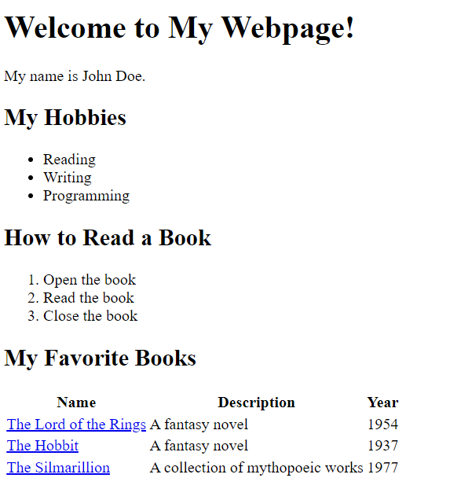

# Hyper Text Markup Language (HTML)

In this topic, we'll learn about Hyper Text Markup Language (HTML).

- [Hyper Text Markup Language (HTML)](#hyper-text-markup-language-html)
  - [Learning Outcomes](#learning-outcomes)
  - [HTML Basics](#html-basics)
  - [HTML Tags](#html-tags)
  - [HTML Elements](#html-elements)
  - [Nested HTML Elements](#nested-html-elements)
  - [HTML Attributes](#html-attributes)
  - [HTML Document Structure](#html-document-structure)
  - [HTML Document Metadata](#html-document-metadata)
  - [How to write HTML?](#how-to-write-html)
  - [How to run HTML?](#how-to-run-html)
  - [Exercises](#exercises)
    - [Exercise 1 - Basic HTML Page Structure](#exercise-1---basic-html-page-structure)
    - [Exercise 2 - HTML Lists](#exercise-2---html-lists)
    - [Exercise 3 - HTML Table and Links](#exercise-3---html-table-and-links)


## Learning Outcomes

After completing this topic, you'll be able to:

- Explain what HTML is;
- Explain what HTML tags are;
- Explain what HTML elements are;
- Explain what HTML attributes are;
- Explain what HTML document structure is;
- Explain what HTML document metadata is;
- Write simple HTML document;
- Run HTML document in a web browser.


## HTML Basics

HTML stands for Hyper Text Markup Language. Markup language means that, rather than using a programming language to write instructions for the computer to follow, you are using tags to identify different types of content. It is the standard markup language for creating Web pages. HTML describes the structure of a Web page. HTML consists of a series of elements, which you use to enclose, or wrap, different parts of the content to make it appear a certain way, or act a certain way. The enclosing tags can make a word or image hyperlink to somewhere else, can italicize words, can make the font bigger or smaller, and so on.

In HTML You don't tell the computer what to do, you tell it what something is. For example, you might say "this is a paragraph", "this is a heading", "this is a link", etc. The browser then knows how to display the content you wrote. Different browsers might display it differently, but they all know what it is. For example, a browser might display a paragraph in a different font than another browser, but they both know it's a paragraph.

## HTML Tags

HTML tags are element names surrounded by angle brackets - in HTML, tag is used to create HTML elements, which are the building blocks of HTML pages. HTML tags are keywords (tag names) surrounded by angle brackets:

```html
<tagname></tagname>
```

HTML tags normally come in pairs like `<p>` and `</p>`. The first tag in a pair is the start tag, the second tag is the end tag. The end tag is written like the start tag, but with a forward slash inserted before the tag name. There are some HTML tags that don't have an end tag, like the `<br>` tag (which indicates a line break).

There are lots of different HTML tags. Some HTML tags are used to display or format text, some HTML tags are used to display images, some HTML tags are used to display tables, some HTML tags are used to display forms, etc. Full list of HTML tags can be found [here](https://developer.mozilla.org/en-US/docs/Web/HTML/Element).

It is difficult to bring out most common HTML tags, because it depends on what you are trying to do. But, there are some HTML tags, which are used very often. For example:

- `<h1>` tag is used to create a first level heading;
- `<p>` tag is used to create a paragraph;
- `<div>` tag is used to create a division or section in an HTML document;
- `<a>` tag is used to create a hyperlink;
- `` tag is used to display an image;
- `<table>` tag is used to create a table;
- `<form>` tag is used to create a form;
- `<input>` tag is used to create an input field;
- `<button>` tag is used to create a button;
- `<ul>` tag is used to create an unordered list;
- `<ol>` tag is used to create an ordered list;
- `<li>` tag is used to create a list item;
- etc.

## HTML Elements

An HTML element is defined by a start tag, some content, and an end tag:

```html
<tagname>Content goes here...</tagname>
```
> Tags are used to mark up the start and end of an HTML element. The element content is everything between the start and the end tag, including the start and end tag.

For example, the following HTML code defines a first level heading and paragraph element:

```html
<h1>This is a heading</h1>
<p>This is a paragraph.</p>
```

The `<h1>` tag defines a first level heading. The `<p>` tag defines a paragraph.

Browsers do not display the HTML tags, but use them to render the content of the page. In Google Chrome this code will be displayed as:


As you can see, the `<h1>` tag makes the text bigger and bold, and the `<p>` tag adds some space above and below the paragraph.

## Nested HTML Elements

HTML elements can be nested (elements can contain elements). Most HTML elements can be nested (except for some HTML elements, like `<br>` tag). For example, the following HTML code defines a first level heading and paragraph element, and the paragraph element contains a link element:

```html
<h1>This is a heading</h1>
<p>This is a paragraph.
  <a href="https://www.google.com/">Google</a>
</p>
```
Nesting HTML elements is very common. For example, the `<body>` element contains all the contents of an HTML document, and the `<head>` element contains all the metadata of an HTML document. Nesting is also used to group elements together. For example, the `<ul>` element contains all the list items (`<li>` elements) of an unordered list (`<ul>` element). For example:

```html
<ul>
  <li>Item 1</li>
  <li>Item 2</li>
</ul>

<ol>
  <li>Item 1</li>
  <li>Item 2</li>
</ol>
```

Other example of nested HTML elements would be a table. A table contains rows (`<tr>` elements). First row of the table contains table headings (`<th>` elements), and other rows contain table cells (`<td>` elements). For example:

```html
<table>
  <tr>
    <th>Header 1</th>
    <th>Header 2</th>
  </tr>
  <tr>
    <td>Cell 1</td>
    <td>Cell 2</td>
  </tr>
  <tr>
    <td>Cell 3</td>
    <td>Cell 4</td>
  </tr>
</table>
```

Table example would be displayed in Google Chrome as:


## HTML Attributes

HTML attributes are special words used inside the start tag to control the element's behaviour. HTML attributes are used to provide additional information about HTML elements. HTML attributes are always specified in the start tag. HTML attributes come in name/value pairs like: `name="value"`.

For example, the following HTML code defines a first level heading with an id attribute:

```html
<h1 id="heading">This is a heading</h1>
```

The `id` attribute specifies a unique id for an HTML element. The value of the `id` attribute must be unique within the HTML document. The `id` attribute is used to identify the element when linking (using a fragment identifier), scripting, or styling (with CSS).

There are some tags, which usually have some attributes. For example, the `<a>` tag is used to create a hyperlink, and it usually has an `href` attribute, which specifies the URL of the page the link goes to. The `` tag is used to display an image, and it usually has an `src` attribute, which specifies the URL of the image to be displayed. For `img` tag the `alt` attribute is also usually used, which specifies an alternate text for an image, if the image cannot be displayed.

```html
<a href="https://www.google.com/">Google</a>

```

Most common HTML attributes can be found [here](https://developer.mozilla.org/en-US/docs/Web/HTML/Attributes).

## HTML Document Structure

An HTML document is a file containing HTML code. An HTML document is made up of the following parts:

- HTML document declaration;
- HTML document root element;
- HTML document head;
- HTML document body.

The HTML document declaration is the first line of the HTML document. It tells the browser that the document is an HTML document. The HTML document declaration is not an HTML tag. It is an instruction to the browser. The HTML document declaration is written like this:

```html
<!DOCTYPE html>
```

The HTML document root element `html` is the outermost element in an HTML document. It is the parent of all other elements in the HTML document. It means that all other elements in the HTML document are descendants of the HTML document root element. The HTML document root element is written like this:

```html
<html>
  ...
</html>
```

The HTML document `head` is the first part of the HTML document. It is the part of the HTML document that is not displayed in the browser window. It is used to specify information about the HTML document, such as the title of the HTML document, the character encoding of the HTML document, etc. The HTML document `head` is written like this:

```html
<head>
  <title>Page Title</title>
</head>
```

The HTML document `body` is the second part of the HTML document. It is the part of the HTML document that is displayed in the browser window. All visible content of the HTML document is written in the HTML document `body`. The HTML document `body` is written like this:

```html
<body>
  <h1>This is a heading</h1>
  <p>This is a paragraph.</p>
</body>
```

If we put all these parts together, we get the following HTML document:

```html
<!DOCTYPE html>
<html>
  <head>
    <title>Page Title</title>
  </head>
  <body>
    <h1>This is a heading</h1>
    <p>This is a paragraph.</p>
  </body>
</html>
```
It is important to note that all HTML elements are descendants of the HTML document root element. 

## HTML Document Metadata

HTML document metadata is data about the HTML document. HTML document metadata is used by browsers (how to display content or reload page), search engines (keywords), etc. HTML document metadata is specified in the HTML document `head`, it is using `meta` tags and attributes. For example:

```html
<head>
  <title>Page Title</title>
  <meta charset="UTF-8">
  <meta name="description" content="Free Web tutorials">
  <meta name="keywords" content="HTML, CSS, JavaScript">
  <meta name="author" content="John Doe">
</head>
```

- `<title>` tag specifies the title of the HTML document.
- `<meta charset="UTF-8">` tag specifies the character encoding of the HTML document.
- `<meta name="description" content="Free Web tutorials">` tag specifies the description of the HTML document.
- `<meta name="keywords" content="HTML, CSS, JavaScript">` tag specifies the keywords of the HTML document.
- `<meta name="author" content="John Doe">` tag specifies the author of the HTML document.

> HTML metadata is not mandatory, but it is recommended to use it in every HTML document.

You can read more about HTML metadata [here](https://developer.mozilla.org/en-US/docs/Learn/HTML/Introduction_to_HTML/The_head_metadata_in_HTML).

## How to write HTML?

HTML is a text-based markup language. It means, that HTML document is a text file, which contains HTML code. So, to write HTML, we need a text editor. There are many different text editors available, including `Notepad++`, `Sublime Text`, `Atom`, `Visual Studio Code`, etc. You can use any of these text editors to write HTML. In this course we'll use `Visual Studio Code` to write HTML.

To start writing HTML, we need to create an HTML document. An HTML document is a text file with `.html` extension. We can create an HTML document using any text editor. For example, we can create an HTML document called `index.html` using `Visual Studio Code`:


As we can see, if we are using `Visual Studio Code` or other code editor, editors are usually can help us to write HTML. For example, if we type `<h1>` tag, editor will automatically add `</h1>` tag. Also, if we type `` tag, editor will automatically add `>` at the end of the tag. Editor will also provide us with suggestions, if we don't remember the name of the tag or attribute.

Actually, we can write HTML using any text editor, even `Notepad`. But, if we are using `Notepad`, we need to remember all the tags and attributes, and we need to type all the tags and attributes manually. So, it is better to use a code editor, which can help us to write HTML.

## How to run HTML?

To run HTML, we need a web browser. There are many different web browsers available, including `Google Chrome`, `Mozilla Firefox`, `Microsoft Edge`, `Opera`, `Safari`, etc. You can use any of these web browsers to run HTML. In this course we'll use `Google Chrome` to run HTML.

To run HTML, we need to open HTML document in a web browser. We can open HTML document in a web browser by double-clicking on the HTML document. Then the computer will open the HTML document in the default web browser:


## Exercises

Try to solve exercises by yourself before checking the solution.

Always test your code to see if it works the way you want.

### Exercise 1 - Basic HTML Page Structure

**Objective**: Create a basic HTML page with standard elements.

**Description**: Create an HTML page (`index.html`) that includes the basic structure: `doctype`, `html`, `head`, and `body` tags. Inside the `body`, add a `h1` tag with the text "Welcome to My Webpage!", followed by a `p` (paragraph) tag with a brief introduction about yourself or a topic of your choice.

Open the HTML page in a web browser to see the result.

Result should look something like this:


<details>
  <summary>Solution</summary>

  ```html
  <!DOCTYPE html>
  <html>
    <head>
      <title>My Webpage</title>
    </head>
    <body>
      <h1>Welcome to My Webpage!</h1>
      <p>My name is John Doe.</p>
    </body>
  </html>
  ```

</details>

### Exercise 2 - HTML Lists

**Objective**: Use HTML to create `ordered` and `unordered` lists.

**Description**: Expand the `index.html` page. Add an `unordered` list (bulleted list) of your favorite hobbies. Then, add an `ordered` list (numbered list) of steps to perform one of those hobbies.

> Hint: Use the `ul` and `ol` tags to create unordered and ordered lists, respectively. Use the `li` tag to create list items inside the `ul` and `ol` tags.
>
> Hint: You can use different levels of headings to separate the two lists.

Result should look something like this:


<details>
  <summary>Solution</summary>

  ```html
  <!DOCTYPE html>
  <html>
    <head>
      <title>My Webpage</title>
    </head>
    <body>
      <h1>Welcome to My Webpage!</h1>
      <p>My name is John Doe.</p>
      <h2>My Hobbies</h2>
      <ul>
        <li>Reading</li>
        <li>Writing</li>
        <li>Programming</li>
      </ul>
      <h2>How to Read a Book</h2>
      <ol>
        <li>Open the book</li>
        <li>Read the book</li>
        <li>Close the book</li>
      </ol>
    </body>
  </html>
  ```
</details>

### Exercise 3 - HTML Table and Links

**Objective**: Create a table and add hyperlinks.

**Description**: Further expand the `index.html` page. Create a table that lists at least three items (e.g., books, movies, recipes), including columns for the item's `name`, a brief `description`, and a `year` or a relevant date. Then, add `hyperlinks` to external websites with more information about each item.

> Hint: Use the `table`, `tr`, `th`, and `td` tags to create a table with rows and columns.
>
> Hint: Use the `a` tag with `src` attribute to create hyperlinks.

Test the hyperlinks by clicking on them.

Result should look something like this:



<details>
  <summary>Solution</summary>

  ```html
  <!DOCTYPE html>
  <html>
    <head>
      <title>My Webpage</title>
    </head>
    <body>
      <h1>Welcome to My Webpage!</h1>
      <p>My name is John Doe.</p>
      <h2>My Hobbies</h2>
      <ul>
        <li>Reading</li>
        <li>Writing</li>
        <li>Programming</li>
      </ul>
      <h2>How to Read a Book</h2>
      <ol>
        <li>Open the book</li>
        <li>Read the book</li>
        <li>Close the book</li>
      </ol>
      <h2>My Favorite Books</h2>
      <table>
        <tr>
          <th>Name</th>
          <th>Description</th>
          <th>Year</th>
        </tr>
        <tr>
          <td><a href="https://en.wikipedia.org/wiki/The_Lord_of_the_Rings">The Lord of the Rings</a></td>
          <td>A fantasy novel</td>
          <td>1954</td>
        </tr>
        <tr>
          <td><a href="https://en.wikipedia.org/wiki/The_Hobbit">The Hobbit</a></td>
          <td>A fantasy novel</td>
          <td>1937</td>
        </tr>
        <tr>
          <td><a href="https://en.wikipedia.org/wiki/The_Silmarillion">The Silmarillion</a></td>
          <td>A collection of mythopoeic works</td>
          <td>1977</td>
        </tr>
      </table>
    </body>
  </html>
  ```
</details>