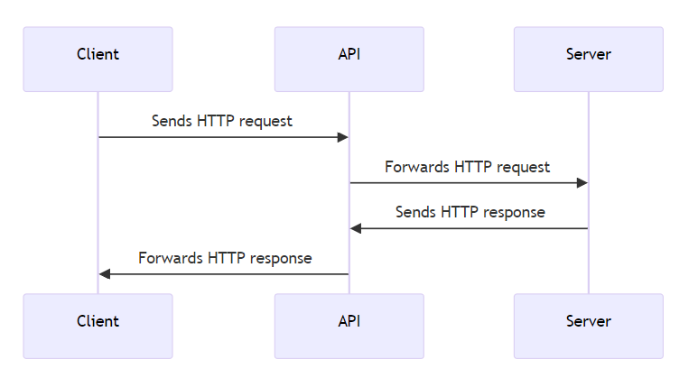

# Web Development

## Back-End Development


---

## Introduction

- What will we do?
- Tools
- What is an API?
- HTTP
- HTTP Methods
- Express
- Structuring

---

## What will we do?

- We will learn how to create web APIs and how to use them.
- We will do practical exercises in lectures.
- For homework, we will apply what we've learned using the Blog API as an example (or another application if desired).

---

## Tools

- VSCode
- Thunder Client
- Postman
- curl
- Docker Desktop

---

## What is an API?

- Application Programming Interface
- Web API
- API Resource
- Request-Response Cycle
- CRUD Operations

---

## Web API

A Web API refers to the programming interface for web applications. It is a collection of protocols, tools, and mechanisms for building web-based applications that can communicate with each other over the Internet.

---

## API Resource

An API resource is any piece of data or functionality that can be accessed or manipulated over the internet using a URI (Uniform Resource Identifier) and HTTP requests.

For example, a typical RESTful API might have URIs like:

- `/customers`
- `/customers/123`
- `/orders/456`
- `/products/search?q=keyword`

---

## HTTP

- HyperText Transfer Protocol

HTTP is the protocol used to transfer hypertext documents across the Internet.

---

## HTTP - Client - Server

HTTP is based on the client-server model, where the client sends a request message, and the server responds with a response message. HTTP requests are typically initiated by the user's web browser or other client applications and can contain various information, such as request methods (GET, POST, PUT, DELETE), headers, and data.

---

## Request-Response Cycle



---

## CRUD Operations

What can be done with API resources?

- Create
- Read
- Update
- Delete

---

## HTTP Methods

HTTP request methods are used to indicate what action the client wants to perform on the resource identified by the URI (Uniform Resource Identifier).

---

## HTTP Methods - GET

The GET method is used to retrieve resources from the server. It is a safe and idempotent method, meaning multiple identical requests will have the same effect as one request. The response to a GET request usually contains the requested resource or its representation in the message body.

---

## HTTP Methods - POST

The POST method is used to submit data to the server to create or update a resource. It is not idempotent, meaning multiple identical requests may have different effects. The response to a POST request typically contains the representation of the created or updated resource in the message body.

---

## HTTP Methods - PUT

The PUT method is used to update an existing resource on the server. It is idempotent, meaning multiple identical requests will have the same effect as one request. The response to a PUT request usually contains the updated resource's representation in the message body.

---

## HTTP Methods - DELETE

The DELETE method is used to remove a resource from the server. It is idempotent, meaning multiple identical requests will have the same effect as one request. The response to a DELETE request usually contains a confirmation message in the message body.

---

## Express

Express is a minimal and flexible Node.js web application framework that provides powerful features for building and managing web applications. It is often used to create web APIs and develop web applications.

---

## Express - Installation

```bash
npm install express
```
---

## Express - Simple Example
```javascript
const express = require('express');
const app = express();

const port = 3000;

app.get('/', (req, res) => {
  return res.send('Hello!');
});

app.listen(port, () => {
  console.log(`Listening on port: ${port}`);
});
```
---
## Express - Methods

- GET - `app.get()`
- POST - `app.post()`
- PUT - `app.put()`
- DELETE - `app.delete()`

---

## Request objekt

The Request object contains information about the HTTP request, such as the request method, headers, request URL, and body. It is used on the server side to read and process data sent by the client.

A Request object is automatically created each time the server receives an HTTP request.

---

## Response objekt

The Response object contains information about the HTTP response, such as the status code, headers, and body. It is used to respond to the client's request from the server.

We can modify the Response object and add the desired data to it.

---

## Structuring
Structuring means dividing the web application's components into different parts to facilitate code management, reusability, and testing.

- Controllers
- Services
- Routes

---

## Controllers

Controllers are components of a web application responsible for processing requests and generating responses. Controllers receive the request object, process it, and generate the response object, which is then sent back to the client.
---

## Services

Services are components of a web application that contain business logic and data processing logic. Services can perform operations such as reading and writing data from a database, interacting with an external API, or performing other complex calculations.
---

## Routes

Routes are components of a web application that define how requests are processed according to routes. Routes define URIs, request methods, and corresponding controllers that handle requests and generate responses.
---

## Homework

- Analyze a blog and think about which API resources it might have (at least four).
- Create an Express application with URIs for at least four blog resources.
- For each resource, create an array containing at least 3 objects with corresponding properties and values for each resource.
- Ensure that requests for each resource return the corresponding resources (e.g., GET /posts returns all posts).
