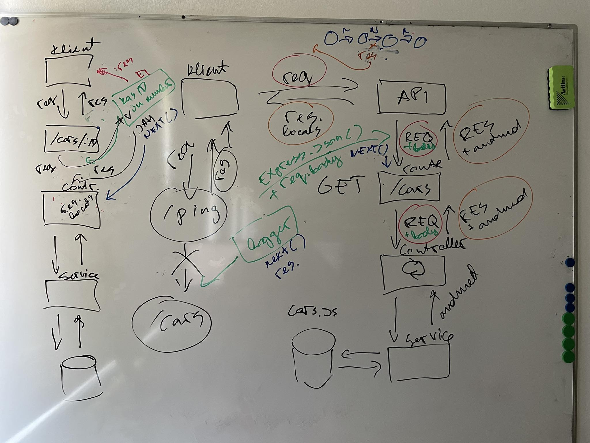

# Fourth Lecture

- [Third Lecture](../Lesson-03/README.md)
- [Fourth Lecture Slides](Slides.md)
- [Fourth Lecture Recording]()
- [Code Written in the Fourth Lecture]()
- [Fifth Lecture](../Lesson-05/README.md)
- [Zoom Link]()

## Topics

- Review of the previous lecture
- [Middleware](https://github.com/FE-BE-Microdegrees/Subjects/blob/main/Back-End-Frameworks/Topics/Middleware/README.md)
- [Express Router](https://github.com/FE-BE-Microdegrees/Subjects/blob/main/Back-End-Frameworks/Topics/Routes/README.md)

## Middleware (Illustration from the Lecture)

## Homework

- Read through the materials for the fourth lecture:
  - [Middleware](https://github.com/FE-BE-Microdegrees/Subjects/blob/main/Back-End-Frameworks/Topics/Middleware/README.md)
  - [Express Router](https://github.com/FE-BE-Microdegrees/Subjects/blob/main/Back-End-Frameworks/Topics/Routes/README.md) materials
- Structure your project's routes as `Router` objects
- Add a `middleware` function to your project that logs all requests with the timestamp to the console
- Install [Docker Desktop](https://www.docker.com/products/docker-desktop) on your computer
