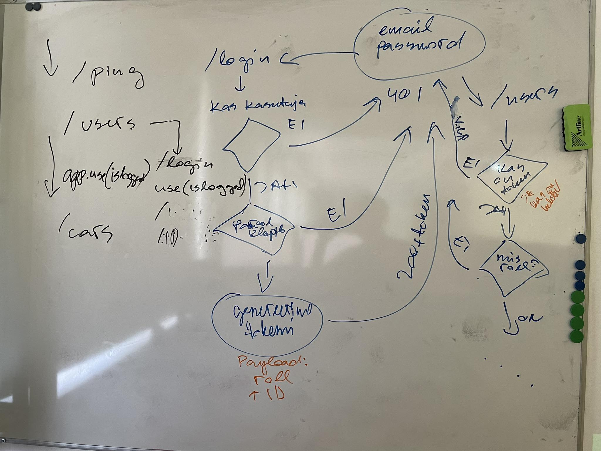

# Fifth Lecture

- [Fourth Lecture](../Lesson-04/README.md)
- [Fifth Lecture Slides](Slides.md)
- [Fifth Lecture Recording]()
- [Code Written in the Fifth Lecture]()
- [Sixth Lecture](../Lesson-06/README.md)

## Topics

- [Authentication and Authorization](https://github.com/FE-BE-Microdegrees/Subjects/tree/main/Back-End-Frameworks/Topics/Auth/README.md)
- [Bcrypt](https://github.com/FE-BE-Microdegrees/Subjects/tree/main/Back-End-Frameworks/Topics/Bcrypt/README.md)
- [JWT](https://github.com/FE-BE-Microdegrees/Subjects/tree/main/Back-End-Frameworks/Topics/JWT/README.md)
- [Sending Data to Express API - Header](https://github.com/FE-BE-Microdegrees/Subjects/tree/main/Back-End-Frameworks/Topics/Sending-Data-To-Express/README.md#headers)
- [Implementing Authentication and Authorization](https://github.com/FE-BE-Microdegrees/Subjects/tree/main/Back-End-Frameworks/Topics/Auth-Middleware/README.md)

## Illustration from the Fifth Lecture

