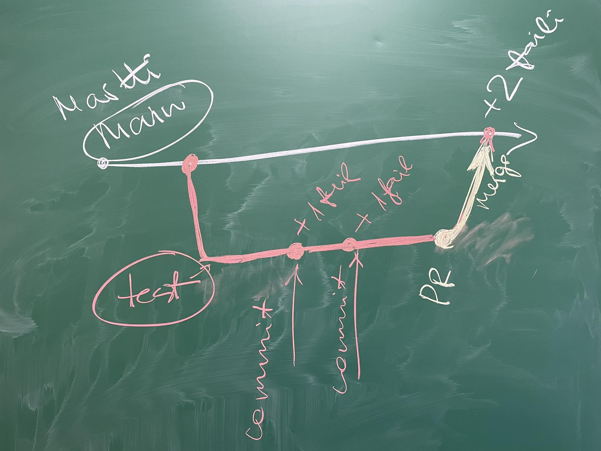

# Second Lecture

- [First Lecture](../Lesson-01/README.md)
- [Second Lecture Slides](Slides.md)
- [Third Lecture](../Lesson-03/README.md)

## Topics

### Software Development

- Recap of the previous lecture
- Solving problems encountered during homework
- [Github Issue](https://github.com/FE-BE-Microdegrees/Subjects/blob/Slides-translation/Software-Development/Topics/Github-Issue/README.md)
- [.gitignore](https://github.com/FE-BE-Microdegrees/Subjects/blob/Slides-translation/Software-Development/Topics/Gitignore/README.md)
- [Branches, Pull Requests, and Merging](https://github.com/FE-BE-Microdegrees/Subjects/blob/Slides-translation/Software-Development/Topics/Branch/README.md)
- [Best Practices for Git and Github](https://github.com/FE-BE-Microdegrees/Subjects/blob/Slides-translation/Software-Development/Topics/Git-Best-Practices/README.md)

### Programming

- Recap of the previous lecture
- Solving problems encountered during homework
- [Operators and Expressions](https://github.com/FE-BE-Microdegrees/Subjects/blob/Slides-translation/Programming-Basics/Topics/Operators/README.md)
- [Conditional Statements](https://github.com/FE-BE-Microdegrees/Subjects/blob/Slides-translation/Programming-Basics/Topics/Conditionals/README.md)
- Exercises

## Homework - Deadline: before the next lecture

- Read through today's lecture materials
- Complete the exercises from:
  - [Operators](https://github.com/FE-BE-Microdegrees/Subjects/blob/Slides-translation/Programming-Basics/Topics/Operators/README.md#harjutused)
  - [Conditionals](https://github.com/FE-BE-Microdegrees/Subjects/blob/Slides-translation/Programming-Basics/Topics/Conditionals/README.md#harjutused)
  - [Additional Conditional Exercises](https://github.com/FE-BE-Microdegrees/Subjects/blob/Slides-translation/Programming-Basics/Topics/Conditionals/Exercises.md) (Optional)
- Upload the completed exercises to Github

