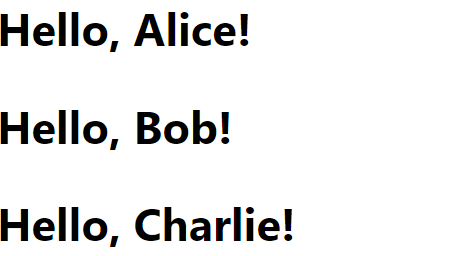

# Web Development

## Front-End Development


---

## Today's Topics

- Review of the Previous Lecture
- [Front-End Frameworks](https://github.com/FE-BE-Microdegrees/Subjects/tree/Front-end-Lessons/Front-End-Frameworks/Topics/FE-Frameworks/README.md)
- [ReactJS](https://github.com/FE-BE-Microdegrees/Subjects/tree/Front-end-Lessons/Front-End-Frameworks/Topics/React/README.md)
- [React Components](https://github.com/FE-BE-Microdegrees/Subjects/tree/Front-end-Lessons/Front-End-Frameworks/Topics/React-Components/README.md)
- [React Props](https://github.com/FE-BE-Microdegrees/Subjects/tree/Front-end-Lessons/Front-End-Frameworks/Topics/React-Props/README.md)
- [React Bootstrap](https://github.com/FE-BE-Microdegrees/Subjects/tree/Front-end-Lessons/Front-End-Frameworks/Topics/React-Bootstrap/README.md)
- [React State Management](https://github.com/FE-BE-Microdegrees/Subjects/tree/Front-end-Lessons/Front-End-Frameworks/Topics/State-Management/README.md)

---

## What Did We Cover Last Time?

---

## Front-End Frameworks

JavaScript front-end frameworks and libraries offer tools and structures that simplify the development of web applications. These frameworks and libraries assist in DOM manipulation, event handling, and data management, providing a structured approach to organizing code.

---

## Popular JavaScript Front-End Frameworks

- React
- Angular
- Vue.js
- Svelte

---

## Advantages of Front-End Frameworks and Libraries

- **Reusable Components:** A component-based architecture allows for the creation of reusable UI components, reducing code duplication and simplifying maintenance;
- **Performance:** Virtual DOM and optimized rendering processes improve the performance of web applications;
- **Modularity:** Frameworks and libraries split applications into smaller, manageable parts, enhancing code organization and scalability;
- **Development Efficiency:** Built-in tools and features, like routing, data binding, and testing, accelerate the development process;

---

## ReactJS

React is a popular open-source JavaScript library used for building user interfaces. Developed by Facebook, it has become one of the most widely-used tools due to its component-based architecture and performance. React focuses on creating components, allowing developers to build reusable and isolated UI pieces.

---

## Key Concepts in React

- Components
- Virtual DOM
- JSX
- Hooks

---

## React Components

React components are the building blocks that allow developers to divide the user interface into small, manageable pieces.

A web application might have various components that together form the app’s user interface. For example, a web page could include components such as:

- Header
- Menu
- Content
- Footer
- ...

Each of these parts can be written as separate components and then assembled on a single page.

---

## Example of a React Component

```jsx
import React from 'react';

function Welcome(props) {
  return <h2>Hello, {props.name}!</h2>;
}

export default Welcome;
```

---

## Importing and Using a React Component

```jsx
import React from 'react';

import Welcome from './Welcome';

function App() {
  return (
    <div>
      <Welcome name="Alice" />
      <Welcome name="Bob" />
      <Welcome name="Charlie" />
    </div>
  );
}

export default App;
```

---

## Component Usage



---

## Virtual DOM

React uses a virtual DOM, which is a lightweight version of the actual DOM. It allows React to perform efficient updates and rendering by comparing changes before updating the real DOM.

For example, when a component's state changes, React generates a new virtual DOM and compares it with the previous one to identify changes. The updates are then applied to the actual DOM
---

## JSX

JSX is a JavaScript extension that allows HTML-like syntax to be written within JavaScript. JSX simplifies the process of reading and writing code.

```jsx
const element = <h1>Hello, world!</h1>;
```

JavaScript expressions and variables can be used inside JSX by wrapping them in curly braces `{}`.

```jsx
const name = 'Alice';
const element = <h1>Hello, {name}!</h1>;
```

---

## Hooks

Hooks are functions in React that allow the use of state and other React features in functional components. The most common Hooks are `useState` and `useEffect`.

State is the internal state of a component that can change and influence the component's rendering. State can change based on user input, API responses, etc. State management is handled using React Hooks.
---

## Starting a React Project

There are multiple ways to start a React project – create it manually, where React-related libraries are installed, or use a tool that automates various configurations and installations.

Some of these tools include:

- [Create React App](https://create-react-app.dev/)
- [Vite](https://vitejs.dev/)
- [Create Next App](https://nextjs.org/docs/api-reference/create-next-app)

---

## Create React App

Create React App is a convenient tool that allows you to quickly set up and start a new React project without manual configuration..

---

## Installing Create React App

- Ensure you have Node.js and npm installed.
- Open a terminal and run the following command:

```bash
npx create-react-app my-app
```

> This command creates a new React project named `my-app`, ready for immediate use.
> 
---

## Starting Create React App

- Navigate to your project folder:

```bash
cd my-app
```

- Start the application:

```bash
npm start
```

> This command opens your new React app in the default browser.

---

## Types of React Components

React components are divided into two types: functional and class-based components.

---

### Functional Components

Functional components are simple JavaScript functions that take props as arguments and return React elements.

```jsx
import React from 'react';

function Greeting(props) {
  return <h1>Hello, {props.name}!</h1>;
}

export default Greeting;
```

---

### Class-Based Components

Class-based components are ES6 classes that extend the React.Component class and include a render method.

```jsx
import React, { Component } from 'react';

class Greeting extends Component {
  render() {
    return <h1>Hello, {this.props.name}!</h1>;
  }
}

export default Greeting;
```

---

## Exporting and Importing React Component

As seen, modules and components are exported and imported in React using the `export default` and `import` keywords, which differs from the approach previously used in Node.js.

---

## Passing Data to Components

Data is passed to components via props. Props are parameters that allow data to be passed from parent components to child components.

---

## Using Props

Props are passed to components similarly to HTML attributes. Below is an example of how to use props in a functional component.

---

### Using Props - User.js

```jsx
import React from 'react';

function User(props) {
  return <div>
    <p>Name: {props.name}</p>
    <p>Age: {props.age}</p>
  </div>;
}
```

---

### Using Props - Users.js

```jsx
import React from 'react';
import User from './User';

const users = [
  { name: 'John', age: 20 },
  { name: 'Jill', age: 30 },
  { name: 'Peter', age: 40 },
];

function Users() {
  return <div>
    {users.map(user => <User name={user.name} age={user.age} />)}
  </div>
}

export default Users;
```

---

### Using Props - App.js

```jsx
import React from 'react';
import Users from './Users';

function App() {
  return <Users />;
}

export default App;
```

---

## Styling React Components

There are several ways to style React components, such as:

- Inline styles
- CSS files
- CSS frameworks

---

## Inline Styles

Inline styles are styles defined directly within JSX as JavaScript objects.

```jsx
const divStyle = {
  color: 'blue',
  backgroundColor: 'lightgray',
};

function App() {
  return <div style={divStyle}>Hello, world!</div>;
}
```

> Use curly braces: `{}` for JavaScript expressions and variables inside JSX.  Note that style property names are written in camelCase format as they are JavaScript objects..
>


---

## Inline Style as an Object Directly in JSX

```jsx
function App() {
  return <div style={{ color: 'blue', backgroundColor: 'lightgray' }}>Hello, world!</div>;
}
```

---

## CSS Files

Components can be styled using separate CSS files that are then imported into components.

```css
.welcome {
  border: 1px solid black;
  margin: 10px;
  background-color: lightgray;
}
```

```jsx
import React from 'react';
import './styles.css';

function Welcome(props) {
  return <h2 className="welcome">Hello, {props.name}!</h2>;
}

export default Welcome;
```

---

### CSS Frameworks

Of course, CSS frameworks like Bootstrap, Material-UI, Tailwind CSS, etc., can also be used.

In React, using CSS frameworks requires installing the framework and importing its components.

---

## React Bootstrap

React Bootstrap is a popular version of the Bootstrap framework created for React, offering reusable components and styles.

---

## Installing React Bootstrap

- Install Bootstrap and React Bootstrap via npm:

```bash
npm install bootstrap react-bootstrap
```

- Import Bootstrap CSS into your `index.js` or `App.js` file:

```javascript
import 'bootstrap/dist/css/bootstrap.min.css';
```

---

## Using React Bootstrap Components

In regular HTML, Bootstrap is used by adding class names, but in React Bootstrap, you use components.

```jsx
import React from 'react';

import { Button } from 'react-bootstrap';

function App() {
  return (
    <div className="App">
      <Button variant="primary">Primary Button</Button>
    </div>
  );
}

export default App;
```

---

## Container, Row, and Col Components

```jsx
import React from 'react';
import { Container, Row, Col } from 'react-bootstrap';

function App() {
  return (
    <Container>
      <Row>
        <Col>1 of 2</Col>
        <Col>2 of 2</Col>
      </Row>
    </Container>
  );
}

export default App;
```

---

## Setting Column Width

Column width can be set using the `xs`, `sm`, `md`, `lg` and `xl` attributes.

`xs` - Extra small
`sm` - Small
`md` - Medium
`lg` - Large
`xl` - Extra large

```jsx
<Col xs={6}>1 of 2</Col>
<Col xs={6}>2 of 2</Col>
```

---

## State Management in React

State management in React is the process of managing a component's state and updating it as needed. State management is essential when we want the component's state to change based on user actions or other events.
---

## State

State is an object representing data that is private to the component and can only be modified by that same component. State determines how the component behaves and what it renders.
---

## `useState` hook

`useState` is a React hook that enables state management within functional components. It returns an array containing two elements: the current state value and a function to update the state.
---

## Using the `useState` Hook

```jsx
import React, { useState } from 'react';

function Counter() {
  const [count, setCount] = useState(0); // State value is 0

  return (
    <div>
      <p>You clicked {count} times</p>
      <button onClick={() => setCount(count + 1)}>
        Click me
      </button>
    </div>
  );
}

export default Counter;

```

---

## Homeworks
