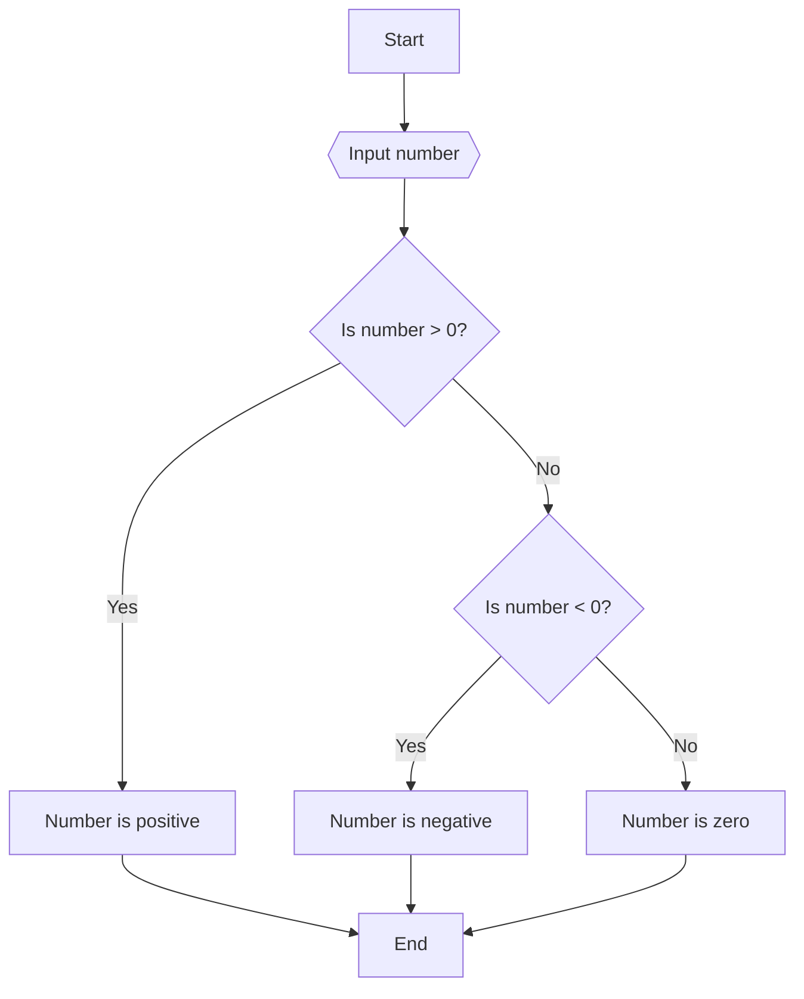
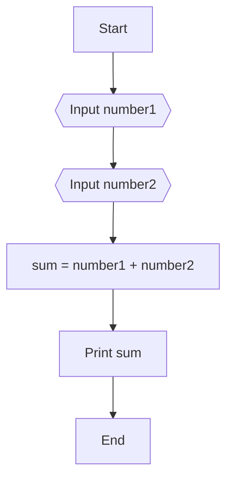

# Algorithms

In this topic, we will learn about algorithms and how to design algorithms to solve problems.

- [Algorithms](#algorithms)
  - [Learning Outcomes](#learning-outcomes)
  - [What is an Algorithm?](#what-is-an-algorithm)
  - [Designing Algorithms](#designing-algorithms)
  - [Pseudocode](#pseudocode)
  - [Flowcharts](#flowcharts)
  - [Exercises](#exercises)
    - [Exercise 1](#exercise-1)
    - [Exercise 2](#exercise-2)
    - [Exercise 3](#exercise-3)

## Learning Outcomes

After completing this topic, you'll be able to:

- Define what an algorithm is
- Design simple algorithms
- Write simple algorithms in pseudocode
- Draw simple flowcharts

## What is an Algorithm?

Very often, when we need to solve problem, we tend to jump into writing code without thinking about the problem. This is not a good approach because it can lead to bugs and errors in our code. It is better to first think about the problem and then write code to solve the problem. This is where algorithms come in. 

An algorithm is a specific set of clearly defined instructions or a step-by-step process designed to perform a task or solve a problem. In the context of computer science and programming, algorithms are used to manipulate data, make calculations, process input, and perform automated reasoning or other decision-making processes. Algorithms are used in many different fields, including mathematics, science, engineering, and economics. Actually, we use algorithms in our everyday life, for example, when we follow a recipe to cook a meal, when we follow a set of directions to get to a destination, or when we follow a set of instructions to assemble a piece of furniture.

## Designing Algorithms

When we tryin to solve a problem, then it is a good idea to follow a step-by-step process. This process is called algorithm design. The process of algorithm design involves the following steps:

- Understand the problem
- Identify the inputs and outputs
- Identify the steps needed to solve the problem
- Write the algorithm in pseudocode or draw a flowchart
- Test the algorithm with different inputs
- Refine the algorithm if necessary

## Pseudocode

Pseudocode is a simple, informal language that is used to describe the steps of an algorithm. It is not a programming language, but it is similar to a programming language. It is used to describe the steps of an algorithm in a way that is easy to understand.

For example, the following pseudocode describes the steps of an algorithm that calculates and prints the sum of two numbers:

```
START
    READ number1
    READ number2
    sum = number1 + number2
    PRINT sum
END
```

Since pseudocode is not meant to be executed, it does not have to follow the syntax of a programming language. It is meant to be read by humans, so it should be easy to understand. It is also meant to be written by humans, so it should be easy to write. It is a good idea to use pseudocode when designing algorithms because it allows us to focus on the logic of the algorithm without having to worry about the syntax of a programming language.

However, there are some common conventions often used in pseudocode:

- Basic Control Structures:
  - `IF`...`THEN`...`ELSE` for conditional branches.
  - `FOR`...`DO` for definite loops (loops with a predetermined number of iterations).
  - `WHILE`...`DO` for indefinite loops (loops where the number of iterations is not predetermined).
  - `REPEAT`...`UNTIL` for loops that must execute at least once before the condition is evaluated.

- Variable Assignment and Declaration:
  - Variables are typically declared implicitly when they are first used, and their assignment is often denoted with a simple `=` symbol.

- Input and Output:
  - `READ`, `INPUT`, or similar phrases for taking input.
  - `PRINT`, `DISPLAY`, or similar phrases for outputting results.

- Comments:
  - Often marked with words like `//`, `#`, or `REM`, followed by the comment text, although the specific symbols can vary.

- Subroutines and Functions:
  - Defined with words like `FUNCTION` or `PROCEDURE`, followed by the subroutine name and possibly parameters.
  - `RETURN` is used to indicate the output of the subroutine.

- Array and Data Structure Usage:
  - Arrays or lists might be used without explicit declaration of their size or type.
  - Other data structures like stacks, queues, or trees can be referenced as per their standard operations (e.g., PUSH, POP for stacks).

- Algorithmic Statements:
  - Statements that describe specific actions like `SORT`, `MERGE`, `FIND`, etc.

- Pseudocode Structure:
  - Pseudocode is usually structured and indented to enhance readability.

```
FUNCTION findMax(numbers: LIST OF INTEGER) RETURNS INTEGER
    maxNumber = numbers[0]
    FOR EACH number IN numbers DO
        IF number > maxNumber THEN
            maxNumber = number
        ENDIF
    ENDFOR
    RETURN maxNumber
END FUNCTION
```

This example shows a function in pseudocode to find the maximum number in a list. Notice the use of indentation and simple English terms to make the algorithm clear and understandable

## Flowcharts

A flowchart is a diagram that represents the steps of an algorithm. It is used to describe the steps of an algorithm in a way that is easy to understand. It is a graphical representation of an algorithm that uses symbols to represent the different steps of the algorithm.

For example, the following flowchart describes the steps of an algorithm that calculates and prints the sum of two numbers:


This is a very simple example of a flowchart to describe basic program that checks if a number is positive, negative, or zero.

In flowcharts, the following symbols are used to represent the different steps of an algorithm:


## Exercises

Create a flowchart or write pseudocode for the following algorithms:

### Exercise 1

Write an algorithm that takes two numbers as input and prints the sum of the two numbers.

<details>
<summary>Solution</summary>


</details>

### Exercise 2

Write an algorithm that takes two numbers as input and prints the larger of the two numbers.

### Exercise 3

Write an algorithm that takes three numbers as input and prints the average of the three numbers.

# Algoritmalar

Bu konumuzda algoritmalar hakkında bilgi edinecek ve problemleri çözmek için algoritmalar tasarlamayı öğreneceğiz.

- [Algoritmalar](#algoritmalar)
  - [Öğrenme Çıktıları](#öğrenme-çıktıları)
  - [Algoritma Nedir?](#algoritma-nedir)
  - [Algoritma Tasarımı](#algoritma-tasarımı)
  - [Pseudocode](#pseudocode)
  - [Akış Diyagramları](#akış-diyagramları)
  - [Alıştırmalar](#alıştırmalar)
    - [Alıştırma 1](#alıştırma-1)
    - [Alıştırma 2](#alıştırma-2)
    - [Alıştırma 3](#alıştırma-3)

## Öğrenme Çıktıları

Bu konuyu tamamladıktan sonra şunları yapabileceksiniz:

- Algoritmanın ne olduğunu tanımlayabileceksiniz
- Basit algoritmalar tasarlayabileceksiniz
- Basit algoritmalar pseudocode ile yazabileceksiniz
- Basit akış diyagramları çizebileceksiniz

## Algoritma Nedir?

Çoğu zaman bir problemi çözmemiz gerektiğinde, probleme düşünmeden doğrudan kod yazmaya başlarız. Bu iyi bir yaklaşım değildir çünkü hatalar ve bug'lar oluşmasına neden olabilir. Problemi önce anlamak ve sonra bu problemi çözmek için kod yazmak daha iyi bir yaklaşımdır. İşte burada algoritmalar devreye girer.

Algoritma, belirli bir görevi gerçekleştirmek veya bir problemi çözmek için tasarlanmış, açıkça tanımlanmış talimatlar veya adım adım bir süreçtir. Bilgisayar bilimi ve programlama bağlamında algoritmalar, verileri manipüle etmek, hesaplamalar yapmak, girdi işlemek ve otomatik mantık veya karar verme süreçleri gerçekleştirmek için kullanılır. Algoritmalar, matematik, bilim, mühendislik ve ekonomi gibi birçok farklı alanda kullanılır. Aslında, algoritmalar günlük hayatımızda da kullanılır; örneğin, bir yemek tarifi takip etmek, bir hedefe gitmek için yönergeleri takip etmek veya bir mobilya parçasını montajlamak için talimatları izlemek gibi.

## Algoritma Tasarımı

Bir problemi çözmeye çalışırken, adım adım bir süreç takip etmek iyi bir fikirdir. Bu süreç, algoritma tasarımı olarak adlandırılır. Algoritma tasarımı süreci şu adımları içerir:

- Problemi anlayın
- Girdi ve çıktıları tanımlayın
- Problemi çözmek için gereken adımları tanımlayın
- Algoritmayı pseudocode ile yazın veya bir akış diyagramı çizin
- Algoritmayı farklı girdilerle test edin
- Algoritmayı gerekirse iyileştirin

## Pseudocode

Pseudocode, bir algoritmanın adımlarını tanımlamak için kullanılan basit, gayri resmi bir dildir. Bir programlama dili değildir, ancak programlama diline benzer. Algoritmanın adımlarını kolayca anlaşılabilir bir şekilde tanımlamak için kullanılır.

Örneğin, aşağıdaki pseudocode, iki sayının toplamını hesaplayıp yazdıran bir algoritmanın adımlarını tanımlar:

BAŞLA SAYI1'İ OKU SAYI2'İ OKU toplam = SAYI1 + SAYI2 TOPLAM'ı YAZDIR BİTİR

markdown
Kodu kopyala

Pseudocode, çalıştırılmak amacıyla yazılmadığı için programlama dilinin sözdizimine uyması gerekmez. İnsanlar tarafından okunmak üzere tasarlanmıştır, bu yüzden anlaşılır olmalıdır. Ayrıca insanlar tarafından yazılmak üzere tasarlandığı için yazılması kolay olmalıdır. Algoritma tasarlarken pseudocode kullanmak iyi bir fikirdir çünkü programlama dilinin sözdizimini düşünmeden algoritmanın mantığına odaklanmamıza olanak tanır.

Ancak pseudocode'da yaygın olarak kullanılan bazı standartlar vardır:

- Temel Kontrol Yapıları:
  - `EĞER`...`O ZAMAN`...`DEĞİLSE` koşullu dallanmalar için.
  - `İÇİN`...`YAP` belirli döngüler (önceden belirlenmiş bir döngü sayısı ile).
  - `İKEN`...`YAP` belirsiz döngüler (döngü sayısı önceden belirlenmemiş).
  - `TEKRAR`...`KADAR` döngülerin, koşul değerlendirilmeden önce en az bir kez çalıştırılması gerektiği durumlar için.

- Değişken Ataması ve Deklarasyonu:
  - Değişkenler genellikle ilk kullanıldığında dolaylı olarak tanımlanır ve atama genellikle `=` sembolüyle gösterilir.

- Girdi ve Çıktı:
  - Girdi almak için `OKU`, `GİRDİ` veya benzer ifadeler.
  - Sonuçları çıktılar için `YAZDIR`, `GÖSTER` veya benzer ifadeler.

- Yorumlar:
  - Genellikle `//`, `#` veya `REM` gibi ifadelerle işaretlenir ve ardından yorum metni gelir, ancak kullanılan semboller değişebilir.

- Alt Programlar ve Fonksiyonlar:
  - `FONKSİYON` veya `PROSEDÜR` kelimeleriyle tanımlanır ve ardından alt program adı ve gerekirse parametreler gelir.
  - `GERİ DÖN` alt programın çıktısını belirtmek için kullanılır.

- Dizi ve Veri Yapıları Kullanımı:
  - Diziler veya listeler, boyutları veya türleri açıkça belirtilmeden kullanılabilir.
  - Yığınlar, kuyruklar veya ağaçlar gibi diğer veri yapıları standart işlemlerine göre referans verilebilir (örneğin, yığınlar için PUSH, POP).

- Algoritmik İfadeler:
  - `SIRALAMA`, `BİRLEŞTİR`, `BUL` gibi belirli işlemleri tanımlayan ifadeler.

- Pseudocode Yapısı:
  - Pseudocode genellikle okunabilirliği artırmak için yapılandırılır ve girintili yazılır.

FONKSİYON findMax(sayılar: İNTEGER LİSTESİ) DÖNDÜRÜR İNTEGER maxSayı = sayılar[0] HER bir sayı İÇİN sayılar'DA YAP EĞER sayı > maxSayı O ZAMAN maxSayı = sayı BİTİR YAP GERİ DÖN maxSayı BİTİR FONKSİYON

less
Kodu kopyala

Bu örnek, bir listedeki maksimum sayıyı bulmak için pseudocode'da yazılmış bir fonksiyonu göstermektedir. Girinti kullanımı ve algoritmanın net ve anlaşılır olmasını sağlamak için basit İngilizce terimler kullanılmıştır.

## Akış Diyagramları

Akış diyagramı, bir algoritmanın adımlarını temsil eden bir diyagramdır. Bir algoritmanın adımlarını kolayca anlaşılabilir bir şekilde tanımlamak için kullanılır. Algoritmanın adımlarını temsil etmek için semboller kullanan grafiksel bir temsildir.

Örneğin, aşağıdaki akış diyagramı, iki sayının toplamını hesaplayıp yazdıran bir algoritmanın adımlarını tanımlar:


This is a very simple example of a flowchart to describe basic program that checks if a number is positive, negative, or zero.

In flowcharts, the following symbols are used to represent the different steps of an algorithm:


Alıştırma 2
İki sayıyı girdi olarak alıp, bu iki sayıdan büyük olanı yazdıran bir algoritma yazın.

Alıştırma 3
Üç sayıyı girdi olarak alıp, bu üç sayının ortalamasını yazdıran bir algoritma yazın.


