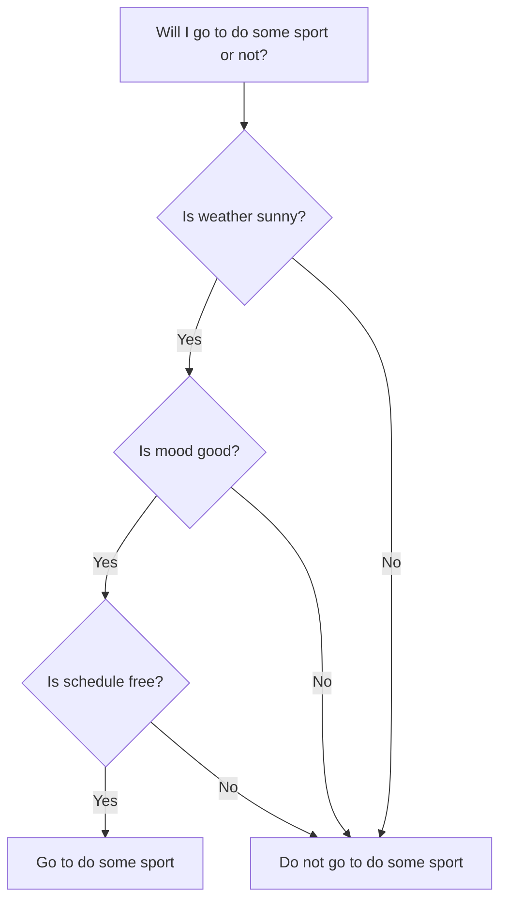

# Conditionals

In this topic, we'll learn about conditionals in Javascript.

- [Conditionals](#conditionals)
  - [Learning Outcomes](#learning-outcomes)
  - [What is a Conditional?](#what-is-a-conditional)
  - [Understanding Conditionals](#understanding-conditionals)
    - [Boolean Expressions](#boolean-expressions)
    - [Comparison Operators](#comparison-operators)
  - [Types of Conditionals](#types-of-conditionals)
    - [if](#if)
    - [if-else](#if-else)
    - [if-else-if](#if-else-if)
    - [switch](#switch)
    - [Ternary operator](#ternary-operator)
  - [Nested Conditional](#nested-conditional)
  - [Truthiness and Falsiness](#truthiness-and-falsiness)
  - [Best Practices](#best-practices)
  - [Exercises](#exercises)
    - [Exercise 1 - Basic If Statement](#exercise-1---basic-if-statement)
    - [Exercise 2 - If-Else Statement](#exercise-2---if-else-statement)
    - [Exercise 3 - Nested If-Else Statement](#exercise-3---nested-if-else-statement)

## Learning Outcomes

After completing this topic, you'll be able to:

- Define what a conditional is
- Explain the difference between `==` and `===`
- Explain the difference between `!=` and `!==`
- Explain the difference between `if`, `if-else`, `if-else-if`, `switch`, and ternary operator
- Explain what a nested conditional is
- Explain what truthiness and falsiness are
- Use best practices when writing conditionals

## What is a Conditional?

A conditional is a statement that is used to perform different actions based on different conditions. For example, we can use a conditional to check if a number is positive or negative and perform different actions based on the result of the check.

In our mind, we use conditionals all the time, when we make decisions. For example, when we decide whether to go to do some sport or not, we check the weather, our mood, our schedule, etc. and based on the result of the check, we decide whether to go to do some sport or not.



## Understanding Conditionals

In order to understand conditionals, we need to understand boolean expressions and comparison operators.

### Boolean Expressions

A boolean expression is an expression that evaluates to a boolean value. A boolean value is a value that is either `true` or `false`. For example, `5 > 3` is a boolean expression that evaluates to `true` because `5` is greater than `3`. `5 < 3` is a boolean expression that evaluates to `false` because `5` is not less than `3`.

### Comparison Operators

Comparison operators are used to compare two values and return a boolean value. There are 6 comparison operators in Javascript:

- `>`: greater than
- `<`: less than
- `>=`: greater than or equal to
- `<=`: less than or equal to
- `==`: equal to
- `!=`: not equal to

```javascript
console.log(5 > 3); // true
console.log(5 < 3); // false
console.log(5 >= 3); // true
console.log(5 <= 3); // false
console.log(5 == 3); // false
console.log(5 != 3); // true
```

## Types of Conditionals

There are 5 types of conditionals in Javascript:

- `if`
- `if-else`
- `if-else-if`
- `switch`
- ternary operator

### if

The `if` statement is used to execute a block of code if a condition is true. The `if` statement has the following syntax:

```javascript
if (condition) {
  // code to be executed if condition is true
}
```

For example:
  
```javascript
let weather = 'sunny';

if (weather === 'sunny') {
  console.log('Im going to the beach!');
}
```

In this example, we check if the weather is sunny and if it is, we print a message to the console.

### if-else

The `if-else` statement is used to execute a block of code if a condition is true and another block of code if the condition is false. The `if-else` statement has the following syntax:

```javascript
if (condition) {
  // code to be executed if condition is true
} else {
  // code to be executed if condition is false
}
```

For example:

```javascript
let weather = 'rainy';

if (weather === 'sunny') {
  console.log('Im going to the beach!');
} else {
  console.log('Im going to the movies!');
}
```

In this example, we check if the weather is sunny and if it is, we print a message to the console. If the weather is not sunny, we print a different message to the console.

### if-else-if

The `if-else-if` statement is used to execute a block of code if a condition is true and another block of code if the condition is false. The `if-else-if` statement has the following syntax:

```javascript
if (condition1) {
  // code to be executed if condition1 is true
} else if (condition2) {
  // code to be executed if condition2 is true
} else {
  // code to be executed if condition1 and condition2 are false
}
```

For example:

```javascript
let weather = 'rainy';

if (weather === 'sunny') {
  console.log('Im going to the beach!');
} else if (weather === 'rainy') {
  console.log('Im going to the movies!');
} else {
  console.log('Im going to stay home!');
}
```

In this example, we check if the weather is sunny and if it is, we will go to the beach. If the weather is not sunny, we check if the weather is rainy and if it is, are going to the movies. If the weather is not sunny and not rainy, we will stay home.

### switch

The `switch` statement is used to execute a block of code based on different cases. The `switch` statement has the following syntax:

```javascript
switch (expression) {
  case value1:
    // code to be executed if expression is equal to value1
    break;
  case value2:
    // code to be executed if expression is equal to value2
    break;
  default:
    // code to be executed if expression is not equal to value1 or value2
}
```

For example:

```javascript
let weather = 'rainy';

switch (weather) {
  case 'sunny':
    console.log('Im going to the beach!');
    break;
  case 'rainy':
    console.log('Im going to the movies!');
    break;
  default:
    console.log('Im going to stay home!');
}
```

This example is equivalent to the previous example with `if-else-if` statement.

### Ternary operator

The ternary operator is used to execute a block of code based on a condition. The ternary operator has the following syntax:

```javascript
condition ? expression1 : expression2
```

For example:

```javascript
let weather = 'rainy';

weather === 'sunny' ? console.log('Im going to the beach!') : console.log('Im going to the movies!');
```

This example is equivalent to the previous example with `if-else` statement.

## Nested Conditional

A nested conditional is a conditional that is inside another conditional. For example:

```javascript
let weather = 'rainy';

if (weather === 'sunny') {
  console.log('Im going to the beach!');
} else {
  if (weather === 'rainy') {
    console.log('Im going to the movies!');
  } else {
    console.log('Im going to stay home!');
  }
}
```

This example is equivalent to the previous example with `if-else-if` statement, but it has more code and it is harder to read, so it is better to use `if-else-if` statement instead of nested conditionals.

## Truthiness and Falsiness

In Javascript, there are values that are considered to be `true` and values that are considered to be `false`. These values are called truthy and falsy values. It means that if we use a truthy value in a boolean expression, it will evaluate to `true` and if we use a falsy value in a boolean expression, it will evaluate to `false`.

The following values are considered to be falsy:

- `false`
- `0`
- `''`
- `null`
- `undefined`
- `NaN`

All other values are considered to be truthy.

For example:

```javascript
let x = 5;

if (x) {
  console.log('x is truthy'); // this will be printed to the console, because 5 is considered to be truthy
} else {
  console.log('x is falsy');
}

x = 0;

if (x) {
  console.log('x is truthy');
} else {
  console.log('x is falsy'); // this will be printed to the console, because 0 is considered to be falsy
}
```

In this example, we check if `x` is truthy or falsy and print a message to the console based on the result of the check.

## Best Practices

- Use `===` instead of `==` when comparing values
- Use `!==` instead of `!=` when comparing values
- Use `if-else-if` statement instead of nested conditionals

## Exercises

Create a file named `index.js` (or another name of your choice) and start adding solutions to the exercises below.

Test your code by running the `index.js` file using the `node index.js` command.

Test your code with different values.

### Exercise 1 - Basic If Statement

**Objective**: Check if a number is positive.

**Description**: Write a JavaScript program that defines a variable to store a number. Use an if statement to print "The number is positive" if the number is greater than zero.

<details>
  <summary>Solution</summary>

```javascript
let number = 5;

if (number > 0) {
  console.log('The number is positive');
}
```
**Expected output**:

```javascript
The number is positive
```


</details>

### Exercise 2 - If-Else Statement

**Objective**: Check if a number is even or odd.

**Description**: Write a JavaScript program that takes a number and checks whether the number is even or odd. Print "The number is even" if the number is even and "The number is odd" if the number is odd.

<details>
  <summary>Solution</summary>

```javascript
let number = 5;

if (number % 2 === 0) {
  console.log('The number is even');
} else {
  console.log('The number is odd');
}
```

**Expected output**:

```javascript
The number is odd
```
</details>

### Exercise 3 - Nested If-Else Statement

**Objective**: Grade classification.

**Description**: Write a JavaScript program that classifies students' grades. The program should take a number (0-100) and classify it as follows:

- `A` for 90 and above
- `B` for 80 to 89
- `C` for 70 to 79
- `D` for 60 to 69
- `F` for below 60

Print the grade classification.

