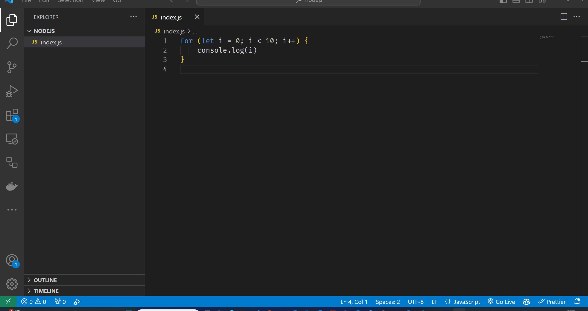

# Debugging

In this topic, we'll learn about debugging in Node JS.

- [Debugging](#debugging)
  - [Learning Outcomes](#learning-outcomes)
  - [What is Debugging?](#what-is-debugging)
  - [Debugging Tools](#debugging-tools)
  - [Debugging Tips](#debugging-tips)

## Learning Outcomes

After completing this topic, you'll be able to:

- Define what debugging is
- Use different methods to debug your code

## What is Debugging?

If we want to know how something works in real life, we can observe the process, sometimes we can intercept the process and see what happens. For example when we are cooking, we can measure some *parameters* like taste, temperature and time. Based on the result of the measurement, we can decide what to do next - add some salt or other spices, change the temperature or modify the cooking time.

In programming, sometimes we don't understand why our program doesn't work as expected. We can use the same approach as in real life - we can observe the process and see what happens. This process is called **debugging**.

Debugging is the process of finding and fixing bugs in a program. A bug is an error in a program that causes it to behave in an unexpected way. Debugging is an important skill for programmers because it allows them to find and fix bugs in their programs.

## Debugging Tools

Despite the fact that Node JS has built in debugger, it is easier to use a debugger that is built into a code editor. Most code editors have built-in debuggers that allow us to step through our code line by line and inspect the values of variables at each step. For example, **Visual Studio Code** has a built-in debugger that allows us to step through our code line by line and inspect the values of variables at each step. We can use the built-in debugger in Visual Studio Code to find and fix bugs in our programs.

To use built-in debugger in Visual Studio Code, we need to start our program in debugging mode by pressing `F5` or by clicking the `Run > Start Debugging` menu item. Then we can choose debugging environment, which in our case is `Node.js`. Then we can set breakpoints in our code by clicking on the line number where we want to set a **breakpoint**. Breakpoint is a point in our code where we want the debugger to pause execution and allow us to inspect the values of variables. Then we can start debugging by pressing `F5` or by clicking the `Run > Start Debugging` menu item. Then we can step through our code line by line and inspect the values of variables at each step.

For simple programs, we can use `console.log()` statements to print the values of variables at different points in our code. For example, if we want to know the value of variable `x` at a certain point in our code, we can add a `console.log(x)` statement at that point in our code and run our program. Then we can check the output of the `console.log(x)` statement to see the value of variable `x` at that point in our code. This is a simple way to debug our code, but it is not very efficient because we have to add `console.log()` statements to our code and run our program every time we want to check the value of a variable.

## Debugging Tips

First of all, we should test our code as we write it. We should not wait until we have written a lot of code before testing it. We should test our code frequently. This will help us find bugs in our code early on and fix them before they become bigger problems later on. Most of the bugs are caused by simple mistakes, such as typos, missing semicolons, and missing parentheses. We should always check our code for these simple mistakes before running it.

- Use the built-in debugger to set breakpoints in your code and inspect the values of variables at those breakpoints.
- Use `console.log()` statements to print the values of variables at different points in your code.