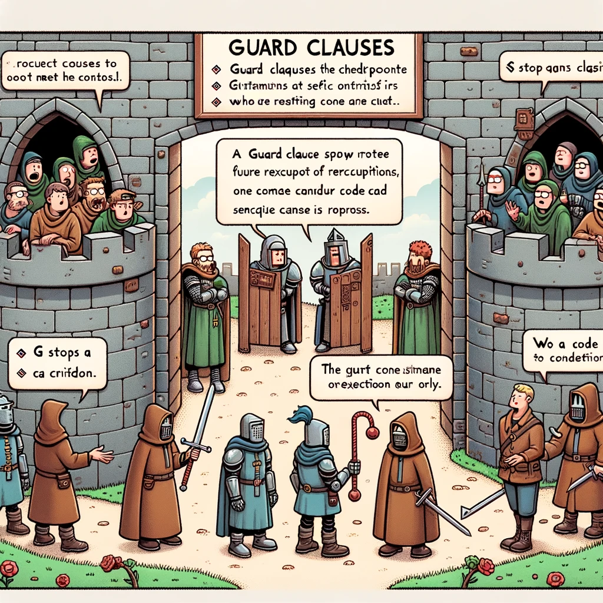

# Guard Clause



Image Source: Dall-E by OpenAI

## Learning Outcomes

After completing this topic, you will:

- Be able to define what a Guard Clause is;
- Understand why Guard Clauses are useful;
- Know how to use Guard Clauses in programming.

## What is a Guard Clause?

A Guard Clause is a programming style where all preconditions for the function’s execution are checked at the beginning. If any of these conditions are not met, the function exits early and returns a value.

## Why Use Guard Clauses?

Guard Clauses are beneficial because they:

- Improve code readability by placing all preconditions at the start of a function.
- Reduce the depth of `if` statements, addressing the nesting problem (when `if` statements are nested within each other).
- Minimize the use of `else` statements, making the code easier to read.

## Example

Instead of writing code like this:

```javascript
function calculatePrice(price, discount) {
  if (price >= 0) {
    if (discount >= 0 && discount <= 100) {
      return price * (1 - discount / 100);
    } else {
      return "Discount must be between 0 and 100";
    }
  } else {
    return "Price cannot be negative";
  }
}
```

You can write it like this:

```javascript
function calculatePrice(price, discount) {
  if (price < 0) {
    return "Price cannot be negative";
  }

  if (discount < 0 || discount > 100) {
    return "Discount must be between 0 and 100";
  }

  return price * (1 - discount / 100);
}
```

By checking each condition in a separate if statement, the code becomes more readable.

## Task

### User Age Check Using Guard Clauses

**Problem:** Write a function that checks a user's age and returns an appropriate message. The function should return different messages depending on whether the user is a minor (under 18), an adult (18 to 65), or a senior (over 65). Use Guard Clauses to make the code cleaner and more readable.

**Requirements:**

1. If the user's age is under 18, the function should return "The user is a minore".
2. If the user's age is between 18 and 65, the function should return "The user is of legal age".
3. If the user's age is over 65, the function should return "The user is a seniorr".
4. The function should validate that the age is reasonable (a positive number). If the input is invalid, it should return "Invalid input".

**Expected Output:

```javascript
console.log(checkUserAge(10));  // The user is a minor
console.log(checkUserAge(20));  // The user is of legal age
console.log(checkUserAge(70));  // The user is a senior
console.log(checkUserAge("kakskümmend"));  // Invalid input

```

<details>
  <summary>Solution</summary>

```javascript
function checkUserAge(age) {
  // Guard Clause: Validate the input
  if (typeof age !== 'number' || age <= 0) {
    return "Vigane sisend";
  }

  // Guard Clause: Check if the user is a minor
  if (age < 18) {
    return "Kasutaja on alaealine";
  }

  // Guard Clause: Check if the user is a senior
  if (age > 65) {
    return "Kasutaja on seenior";
  }

  // If none of the above conditions apply, the user must be an adult
  return "Kasutaja on täisealine";
}

```

</details>
