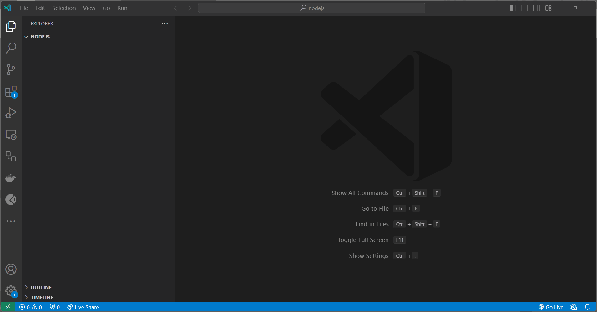

# Loops and iteration

In this topic, we'll learn about loops and iteration.

- [Loops and iteration](#loops-and-iteration)
  - [Learning Outcomes](#learning-outcomes)
  - [What is a Loop?](#what-is-a-loop)
  - [`for` Loop](#for-loop)
  - [`while` Loop](#while-loop)
  - [`do...while` Loop](#dowhile-loop)
  - [`for...in` Loop](#forin-loop)
  - [`for...of` Loop](#forof-loop)
  - [Loop Control Statements](#loop-control-statements)
    - [`continue`](#continue)
    - [`break`](#break)
  - [Exercises](#exercises)
    - [Exercise 1](#exercise-1)
    - [Exercise 2](#exercise-2)
    - [Exercise 3](#exercise-3)

## Learning Outcomes

After completing this topic, you'll be able to:

- Define what a loop is
- Explain the difference between different types of loops
- Explain what loop control statements are
- Explain what `continue` statement is
- Explain what `break` statement is
- Use different loops and loop control statements

## What is a Loop?

A loop is a programming construct that is used to repeat a block of code until a certain condition is met. Loops are used to iterate over a collection of data or to repeat a block of code a certain number of times. There are different types of loops in Javascript: `for`, `while`, `do...while`, `for...in`, and `for...of`.

## `for` Loop

The `for` loop is used to repeat a block of code a certain number of times. The `for` loop consists of three parts: *initialization*, *condition*, and *increment/decrement*. The initialization part is used to initialize the loop counter, the condition part is used to check if the loop counter is less/greater than or equal to a certain value, and the increment/decrement part is used to increment or decrement the loop counter. The `for` loop is used to iterate over a collection of data or to repeat a block of code a certain number of times.

```javascript
for (let i = 0; i < 10; i++) {
  console.log(i);
}
```
Output:
```
0
1
2
3
4
5
6
7
8
9
```
In this example, we created a `for` loop that iterates over the numbers from `0` to `9` and prints them to the console. In the beginning of the loop, we initialize the loop counter (`i`) to `0` (`let i = 0`). Then, we check if the loop counter (`i`) is less than `10` (`i < 10`). If the loop counter is less than `10`, we print the value of the loop counter to the console and increment the loop counter (`i`) by `1` (`i++`). And then we repeat this process until the loop counter is greater than or equal to `10`.

## `while` Loop

The `while` loop is used to repeat a block of code while a certain condition is true. The `while` loop consists of a *condition* and a *block of code*. The condition is used to check if the loop counter is less/greater than or equal to a certain value, and the block of code is used to execute the code inside the loop. The `while` loop is used to iterate over a collection of data or to repeat a block of code a certain number of times.

> **Note:** The `while` loop is similar to the `for` loop, but the `while` loop doesn't have an built in initialization part or an increment/decrement part. So we have to be careful when using the `while` loop because it can easily lead to an infinite loop if we forget to increment/decrement the loop counter.

```javascript
let i = 0;

while (i < 10) {
  console.log(i);
  i++;
}
```
Output:
```
0
1
2
3
4
5
6
7
8
9
```

We can see, that even though the `for` loop and `while` loop are defined differently, they both do the same thing. In these exapmles they both iterate over the numbers from `0` to `9` and print them to the console.

## `do...while` Loop

The `do...while` loop is another type of loop that is used to repeat a block of code while a certain condition is true.

```javascript
let i = 0;

do {
  console.log(i);
  i++;
} while (i < 10);
```
Output:
```
0
1
2
3
4
5
6
7
8
9
```

The key difference between the `while` loop and the `do...while` loop is that the `do...while` loop executes the code inside the loop at least once, even if the condition is false.

## `for...in` Loop

The `for...in` loop is bit different from the previous loops. The `for...in` loop is used to iterate over the properties of an object. The `for...in` loop consists of a *variable* and an *object*. The variable is used to store the name of the property, and the object is used to iterate over the properties of the object. The `for...in` loop is used to iterate over the properties of an object.

```javascript
const person = {
  firstName: 'John',
  lastName: 'Doe',
  age: 25,
  isMarried: false
};

for (let key in person) {
  console.log(key + ': ' + person[key]);
}
```
Output:
```
firstName: John
lastName: Doe
age: 25
isMarried: false
```
In this example, we created an object named `person` with four properties: `firstName`, `lastName`, `age`, and `isMarried`. Then, we created a `for...in` loop that iterates over the properties of the `person` object and prints them to the console.

## `for...of` Loop

The `for...of` loop is another type of loop. The `for...of` loop is used to iterate over the values of an iterable object. The `for...of` loop consists of a *variable* and an *iterable object*. The variable is used to store the value of the current iteration, and the iterable object is used to iterate over the values of the iterable object. 

```javascript
const fruits = ['apple', 'banana', 'orange'];

for (let fruit of fruits) {
  console.log(fruit);
}
```
Output:
```
apple
banana
orange
```
In this example, we created an array named `fruits` with three values: `apple`, `banana`, and `orange`. Then, we created a `for...of` loop that iterates over the values of the `fruits` array and prints them to the console.

## Loop Control Statements

Loop control statements are used to control the flow of a loop. There are two types of loop control statements: `continue` and `break`.

### `continue`

The `continue` statement is used to skip the current iteration of a loop. The `continue` statement consists of the keyword `continue`.

```javascript
for (let i = 0; i < 10; i++) {
  if (i === 5) {
    continue;
  }
  console.log(i);
}
```
Output:
```
0
1
2
3
4
5
6
7
8
9
```

As we can see, the `continue` statement skips the current iteration of the loop. In this example, we created a `for` loop that iterates over the numbers from `0` to `9` and prints them to the console. But if the loop counter is equal to `5`, we skip the current iteration of the loop using the `continue` statement.

### `break`

The `break` statement is used to exit a loop. The `break` statement consists of the keyword `break`.

```javascript
for (let i = 0; i < 10; i++) {
  if (i === 5) {
    break;
  }
  console.log(i);
}
```
Output:
```
0
1
2
3
4
```

As we can see, the `break` statement exits the loop. In this example, we created a `for` loop that iterates over the numbers from `0` to `9` and prints them to the console. But if the loop counter is equal to `5`, we exit the loop using the `break` statement.

## Exercises

Create a file named `index.js` (or another name of your choice) and start adding solutions to the exercises below.

Test your code by running the `index.js` file using the `node index.js` command.

You can also test Your code with different values for the variables.

### Exercise 1

Create a `for` loop that iterates over the numbers from `1` to `10` and prints them to the console.

**Expected output**:

```javascript
1
2
3
4
5
6
7
8
9
10
```

> Hint: Use the `console.log()` method to print the numbers to the console.
>
> Pay attention to the value of the loop counter.

<details>
  <summary>Solution</summary>

```javascript
for (let i = 1; i <= 10; i++) {
  console.log(i);
}
```



</details>

### Exercise 2

Create a `for` loop that iterates over the numbers from `1` to `10` and prints only the even numbers to the console.

> Hint: Use the `%` operator to check if a number is even or odd.

**Expected output**:

```javascript
2
4
6
8
10
```

<details>
  <summary>Solution</summary>

```javascript
for (let i = 1; i <= 10; i++) {
  if (i % 2 === 0) {
    console.log(i);
  }
}
```
</details>


### Exercise 3

Create multiplication table using nested `for` loops.

**Expected output**:

```javascript
1 x 1 = 1
1 x 2 = 2
1 x 3 = 3
...
10 x 8 = 80
10 x 9 = 90
10 x 10 = 100
```

> Hint: Use nested `for` loops to create the multiplication table. Nested means that one loop is inside another loop.
If you want to solve additional exercises, you can find some here: [Additional Exercises for Loops.](./Exercises.md)

# Döngüler ve İterasyon

Bu konuda döngüler ve iterasyon hakkında bilgi edineceğiz.

- [Döngüler ve İterasyon](#döngüler-ve-iterasyon)
  - [Öğrenim Çıktıları](#öğrenim-çıktıları)
  - [Döngü Nedir?](#döngü-nedir)
  - [`for` Döngüsü](#for-döngüsü)
  - [`while` Döngüsü](#while-döngüsü)
  - [`do...while` Döngüsü](#dowhile-döngüsü)
  - [`for...in` Döngüsü](#forin-döngüsü)
  - [`for...of` Döngüsü](#forof-döngüsü)
  - [Döngü Kontrol Deyimleri](#döngü-kontrol-deyimleri)
    - [`continue`](#continue)
    - [`break`](#break)
  - [Alıştırmalar](#alıştırmalar)
    - [Alıştırma 1](#alıştırma-1)
    - [Alıştırma 2](#alıştırma-2)
    - [Alıştırma 3](#alıştırma-3)

## Öğrenim Çıktıları

Bu konuyu tamamladıktan sonra şunları yapabileceksiniz:

- Döngünün ne olduğunu tanımlayın.
- Farklı döngü türlerini açıklayın.
- Döngü kontrol deyimlerinin ne olduğunu açıklayın.
- `continue` deyimini açıklayın.
- `break` deyimini açıklayın.
- Farklı döngüleri ve döngü kontrol deyimlerini kullanın.

## Döngü Nedir?

Döngü, bir kod bloğunu belirli bir koşul sağlanana kadar tekrarlamak için kullanılan bir programlama yapısıdır. Döngüler, bir veri koleksiyonu üzerinde yineleme yapmak veya bir kod bloğunu belirli bir sayıda tekrar etmek için kullanılır. JavaScript'te farklı türde döngüler bulunmaktadır: `for`, `while`, `do...while`, `for...in` ve `for...of`.

## `for` Döngüsü

`for` döngüsü bir kod bloğunu belirli bir sayıda tekrar etmek için kullanılır. `for` döngüsü üç bölümden oluşur: *başlatma*, *koşul* ve *arttırma/azaltma*. 

```javascript
for (let i = 0; i < 10; i++) {
  console.log(i);
}
Çıktı:

Kodu kopyala
0
1
2
3
4
5
6
7
8
9
while Döngüsü
while döngüsü, bir koşul doğru olduğu sürece bir kod bloğunu tekrarlar.

javascript
Kodu kopyala
let i = 0;

while (i < 10) {
  console.log(i);
  i++;
}
Çıktı:

Kodu kopyala
0
1
2
3
4
5
6
7
8
9
do...while Döngüsü
do...while döngüsü, koşul yanlış olsa bile döngüyü en az bir kez çalıştırır.

javascript
Kodu kopyala
let i = 0;

do {
  console.log(i);
  i++;
} while (i < 10);
Çıktı:

Kodu kopyala
0
1
2
3
4
5
6
7
8
9
for...in Döngüsü
for...in döngüsü bir nesnenin özellikleri üzerinde yineleme yapmak için kullanılır.

javascript
Kodu kopyala
const person = {
  firstName: 'John',
  lastName: 'Doe',
  age: 25,
  isMarried: false
};

for (let key in person) {
  console.log(key + ': ' + person[key]);
}
Çıktı:

vbnet
Kodu kopyala
firstName: John
lastName: Doe
age: 25
isMarried: false
for...of Döngüsü
for...of döngüsü, bir yineleme nesnesinin değerleri üzerinde yineleme yapmak için kullanılır.

javascript
Kodu kopyala
const fruits = ['apple', 'banana', 'orange'];

for (let fruit of fruits) {
  console.log(fruit);
}
Çıktı:

Kodu kopyala
apple
banana
orange
Döngü Kontrol Deyimleri
Döngü kontrol deyimleri, bir döngünün akışını kontrol etmek için kullanılır.

continue
continue deyimi, döngünün mevcut yinelemesini atlar ve bir sonraki yinelemeye geçer.

javascript
Kodu kopyala
for (let i = 0; i < 10; i++) {
  if (i === 5) {
    continue;
  }
  console.log(i);
}
Çıktı:

Kodu kopyala
0
1
2
3
4
6
7
8
9
break
break deyimi, döngüyü tamamen sonlandırır.

javascript
Kodu kopyala
for (let i = 0; i < 10; i++) {
  if (i === 5) {
    break;
  }
  console.log(i);
}
Çıktı:

Kodu kopyala
0
1
2
3
4
Alıştırmalar
Bir dosya (index.js gibi) oluşturun ve aşağıdaki alıştırmaları çözmeye başlayın.

Alıştırma 1
1'den 10'a kadar sayılar üzerinde yineleme yapan ve bu sayıları konsola yazdıran bir for döngüsü oluşturun.

javascript
Kodu kopyala
for (let i = 1; i <= 10; i++) {
  console.log(i);
}
Alıştırma 2
1'den 10'a kadar olan sayılar üzerinde yineleme yapan ve sadece çift sayıları konsola yazdıran bir for döngüsü oluşturun.

javascript
Kodu kopyala
for (let i = 1; i <= 10; i++) {
  if (i % 2 === 0) {
    console.log(i);
  }
}
Alıştırma 3
Çarpım tablosu oluşturmak için iç içe for döngüleri kullanın.

javascript
Kodu kopyala
for (let i = 1; i <= 10; i++) {
  for (let j = 1; j <= 10; j++) {
    console.log(`${i} x ${j} = ${i * j}`);
  }
}
