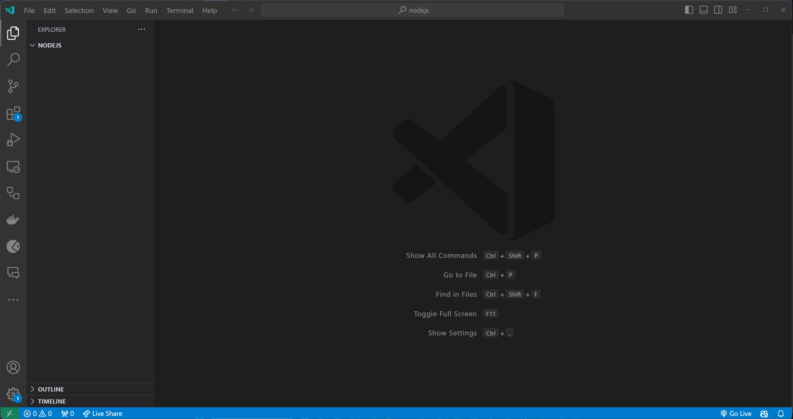

# Modules

In this topic, we'll learn about modules in Javascript.

- [Modules](#modules)
  - [Learning Outcomes](#learning-outcomes)
  - [What is a Module?](#what-is-a-module)
  - [How to Export a Module?](#how-to-export-a-module)
  - [How to Import a Module?](#how-to-import-a-module)
  - [How to Use a Module?](#how-to-use-a-module)
  - [Example of Using Modules](#example-of-using-modules)
  - [Exercises](#exercises)
    - [Exercise 1 - Basic Export and Require](#exercise-1---basic-export-and-require)
    - [Exercise 2 - Export Multiple Functions](#exercise-2---export-multiple-functions)
    - [Exercise 3 - Exporting an Object](#exercise-3---exporting-an-object)

## Learning Outcomes

After completing this topic, you'll be able to:

- Define what a module is
- Explain how to export a module
- Explain how to import a module
- Explain how to use a module

## What is a Module?

A module is a Javascript file that contains code that can be reused in other Javascript files. Modules are used to organize code into logical units that can be reused in other parts of the program. Modules are used to create reusable code that can be used in other programs.

## How to Export a Module?

In order to export a module, we need to use the `module.exports` keyword followed by the name of the module that we want to export. For example, if we want to export a module named `myModule`, we can type `module.exports myModule;` or `module.exports { myModule, myModule1 };` (if we have multiple exports) in the Javascript file where we want to export the module.

```javascript
module.exports myModule; // export a module named myModule
```
or
```javascript
module.exports { myModule, myModule1 }; // export multiple modules named myModule and myModule1
```

## How to Import a Module?

In order to import a module, we need to use the `require` keyword followed by the name of the file containing module(s) that we want to import. For example, if we want to import a module named `myModule` from file `moduleFileName.js`, we can type `require('./moduleFileName');` in the Javascript file where we want to import the module (the `./` part is used to specify the path to the file containing the module(s) that we want to import). 

```javascript
const myModule = require('./moduleFileName'); // import a module from file named `moduleFileName.js`
```
or
```javascript
import { myModule, myModule1 } from './moduleFileName'; // import multiple modules named myModule and myModule1 from the `moduleFileName.js` file
```

## How to Use a Module?

To use module, we need to import it first. After we import the module, we can use it in our code. For example, if we have file called `calculate` that contains a function named `add`, we can import the module and use the function like this:

Contents of `calculate.js` file could be something like this:

```javascript
function add(a, b) {
  return a + b;
}

function subtract(a, b) {
  return a - b;
}

module.exports = { add, subtract }; // export the add and subtract functions
```

Contents of `index.js` file could be something like this:

```javascript
const calculate = require('./calculate'); // import the calculate module

const sum = calculate.add(5, 3); // call the add function from the calculate module and assign the result to the sum variable

console.log(sum); // print the value of the sum variable to the console
```

## Example of Using Modules

In next example, we create a new file named `index.js`, create a `calculate.js` file, export the `add` and `subtract` functions from the `calculate.js` file, import the `calculate.js` file in the `index.js` file, and use the `add` function in our code.


[Click here to download the video](UsingModule.mp4)

## Exercises

Create a files as described in the exercises below.

Test your code by running the `index.js` file using the `node index.js` command.

### Exercise 1 - Basic Export and Require

**Objective**: Create a basic module and import it.

**Description**: Create two files, `greetings.js` and `index.js`. In `greetings.js`, define a function that prints "Hello, World!" to the console. Export this function. In `index.js`, import `greetings.js` and call the imported function.

> Hint: Don't forget to use the `module.exports` keyword to export the function.
>
> Hint: Use the `require` keyword to import the function.

<details>
  <summary>Solution</summary>

  ```javascript
  // greetings.js
  function sayHello() {
    console.log('Hello, World!');
  }

  module.exports = sayHello;
  ```

  ```javascript
  // index.js
  const sayHello = require('./greetings');

  sayHello();
  ```

</details>

### Exercise 2 - Export Multiple Functions

**Objective**: Export multiple functions from a module.

**Description**: Create two files, `greetings.js` and `index.js`. In `greetings.js`, define two functions, one that prints "Hello, World!" to the console and one that takes a name as an argument and prints "Hello, [name]!" to the console. Export both functions. In `index.js`, import `greetings.js` and call the imported functions.

> Hint: You can export multiple functions by using the `module.exports` keyword followed by an object containing the functions that you want to export.

<details>
  <summary>Solution</summary>

  ```javascript
  // greetings.js
  function sayHello() {
    console.log('Hello, World!');
  }

  function sayHelloTo(name) {
    console.log(`Hello, ${name}!`);
  }

  module.exports = { sayHello, sayHelloTo };
  ```

  ```javascript
  // index.js
  const { sayHello, sayHelloTo } = require('./greetings');

  sayHello();
  sayHelloTo('John');
  ```
</details>

### Exercise 3 - Exporting an Object

**Objective**: Export an object containing multiple methods.

**Description**: Create a file `utils.js` with an object that has two methods: `square` (returns the square of a number) and `cube` (returns the cube of a number). Export this object. In `index.js`, import this object and call its methods.

> Hint: You can add functions to an object using the following syntax:
> ```javascript
> const myObject = {
>   myFunction() {
>     // function body
>   }
> }
> ```
>
> Hint: You can call a function from an object using the following syntax:
> ```javascript
> myObject.myFunction();
> ```

# Modüller

Bu konuda, Javascript'teki modülleri öğreneceğiz.

- [Modüller](#moduller)
  - [Öğrenme Çıktıları](#ogrenme-ciktilari)
  - [Modül Nedir?](#modul-nedir)
  - [Bir Modül Nasıl Export Edilir?](#bir-modul-nasil-export-edilir)
  - [Bir Modül Nasıl Import Edilir?](#bir-modul-nasil-import-edilir)
  - [Bir Modül Nasıl Kullanılır?](#bir-modul-nasil-kullanilir)
  - [Modüllerin Kullanımıyla İlgili Örnek](#modullerin-kullanimi-ile-ilgili-ornek)
  - [Alıştırmalar](#alistirmalar)
    - [Alıştırma 1 - Temel Export ve Require](#alistirma-1---temel-export-ve-require)
    - [Alıştırma 2 - Birden Fazla Fonksiyonu Export Etmek](#alistirma-2---birden-fazla-fonksiyonu-export-etmek)
    - [Alıştırma 3 - Bir Obje Export Etmek](#alistirma-3---bir-obje-export-etmek)

## Öğrenme Çıktıları

Bu konuyu tamamladıktan sonra:

- Bir modülün ne olduğunu tanımlayabileceksiniz
- Bir modülün nasıl export edildiğini açıklayabileceksiniz
- Bir modülün nasıl import edildiğini açıklayabileceksiniz
- Bir modülün nasıl kullanıldığını açıklayabileceksiniz

## Modül Nedir?

Modül, başka Javascript dosyalarında tekrar kullanılabilecek kodları içeren bir Javascript dosyasıdır. Modüller, kodu mantıksal birimlere ayırmak ve programın diğer bölümlerinde tekrar kullanılmasını sağlamak için kullanılır. Modüller, tekrar kullanılabilir kod oluşturmak için kullanılır.

## Bir Modül Nasıl Export Edilir?

Bir modülü export etmek için, `module.exports` anahtar kelimesini ve ardından export etmek istediğimiz modülün adını kullanmamız gerekir. Örneğin, `myModule` adında bir modülü export etmek istersek, `module.exports myModule;` veya (birden fazla export varsa) `module.exports { myModule, myModule1 };` yazabiliriz.

```javascript
module.exports myModule; // myModule adında bir modül export et
```
veya
```javascript
module.exports { myModule, myModule1 }; // myModule ve myModule1 adında birden fazla modül export et
```

## Bir Modül Nasıl Import Edilir?

Bir modülü import etmek için, `require` anahtar kelimesini ve ardından import etmek istediğimiz modül(ler)i içeren dosyanın adını kullanmamız gerekir. Örneğin, `moduleFileName.js` dosyasından `myModule` adında bir modülü import etmek istersek, `require('./moduleFileName');` yazabiliriz (buradaki `./` kısmı, modülü içeren dosyanın yolunu belirtmek için kullanılır).

```javascript
const myModule = require('./moduleFileName'); // `moduleFileName.js` dosyasından bir modül import et
```
veya
```javascript
import { myModule, myModule1 } from './moduleFileName'; // `moduleFileName.js` dosyasından myModule ve myModule1 adında birden fazla modül import et
```

## Bir Modül Nasıl Kullanılır?

Bir modülü kullanmak için önce import etmemiz gerekir. Modülü import ettikten sonra, kodumuzda kullanabiliriz. Örneğin, `calculate` adında bir dosyamız olduğunu ve bu dosyada `add` adında bir fonksiyon olduğunu düşünelim. Bu modülü import edip şu şekilde kullanabiliriz:

`calculate.js` dosyasının içeriği şu şekilde olabilir:

```javascript
function add(a, b) {
  return a + b;
}

function subtract(a, b) {
  return a - b;
}

module.exports = { add, subtract }; // add ve subtract fonksiyonlarını export et
```

`index.js` dosyasının içeriği şu şekilde olabilir:

```javascript
const calculate = require('./calculate'); // calculate modülünü import et

const sum = calculate.add(5, 3); // calculate modülünden add fonksiyonunu çağır ve sonucu sum değişkenine ata

console.log(sum); // sum değişkeninin değerini konsola yazdır
```

## Modüllerin Kullanımıyla İlgili Örnek

Bir `index.js` dosyası oluşturun, bir `calculate.js` dosyası oluşturun, `calculate.js` dosyasından `add` ve `subtract` fonksiyonlarını export edin, `index.js` dosyasına `calculate.js` dosyasını import edin ve kodunuzda `add` fonksiyonunu kullanın.


[Videoyu indirmek için buraya tıklayın](UsingModule.mp4)

## Alıştırmalar

Aşağıda belirtilen alıştırmalarda tanımlanan dosyaları oluşturun.

Kodunuzu `node index.js` komutunu kullanarak çalıştırarak test edin.

### Alıştırma 1 - Temel Export ve Require

**Amaç**: Temel bir modül oluşturun ve import edin.

**Açıklama**: `greetings.js` ve `index.js` adında iki dosya oluşturun. `greetings.js` dosyasında "Hello, World!" mesajını konsola yazdıran bir fonksiyon tanımlayın. Bu fonksiyonu export edin. `index.js` dosyasında `greetings.js` dosyasını import edin ve import edilen fonksiyonu çağırın.

> İpucu: Fonksiyonu export etmek için `module.exports` anahtar kelimesini kullanmayı unutmayın.
>
> İpucu: Fonksiyonu import etmek için `require` anahtar kelimesini kullanın.

<details>
  <summary>Çözüm</summary>

  ```javascript
  // greetings.js
  function sayHello() {
    console.log('Hello, World!');
  }

  module.exports = sayHello;
  ```

  ```javascript
  // index.js
  const sayHello = require('./greetings');

  sayHello();
  ```

</details>

### Alıştırma 2 - Birden Fazla Fonksiyonu Export Etmek

**Amaç**: Bir modülden birden fazla fonksiyon export edin.

**Açıklama**: `greetings.js` ve `index.js` adında iki dosya oluşturun. `greetings.js` dosyasında biri "Hello, World!" mesajını konsola yazdıran, diğeri ise bir isim alıp "Hello, [isim]!" mesajını konsola yazdıran iki fonksiyon tanımlayın. Bu iki fonksiyonu export edin. `index.js` dosyasında `greetings.js` dosyasını import edin ve import edilen fonksiyonları çağırın.

> İpucu: Birden fazla fonksiyonu export etmek için `module.exports` anahtar kelimesini ve bir obje kullanabilirsiniz.

<details>
  <summary>Çözüm</summary>

  ```javascript
  // greetings.js
  function sayHello() {
    console.log('Hello, World!');
  }

  function sayHelloTo(name) {
    console.log(`Hello, ${name}!`);
  }

  module.exports = { sayHello, sayHelloTo };
  ```

  ```javascript
  // index.js
  const { sayHello, sayHelloTo } = require('./greetings');

  sayHello();
  sayHelloTo('John');
  ```
</details>

### Alıştırma 3 - Bir Obje Export Etmek

**Amaç**: Birden fazla metot içeren bir obje export edin.

**Açıklama**: `utils.js` adında bir dosya oluşturun ve bu dosyada bir obje tanımlayın. Bu obje, `square` (bir sayının karesini döndüren) ve `cube` (bir sayının küpünü döndüren) metotlarını içersin. Bu objeyi export edin. `index.js` dosyasında bu objeyi import edin ve metotlarını çağırın.

> İpucu: Fonksiyonları bir objeye şu şekilde ekleyebilirsiniz:
> ```javascript
> const myObject = {
>   myFunction() {
>     // fonksiyon içeriği
>   }
> }
> ```
>
> İpucu: Bir objeden bir fonksiyonu şu şekilde çağırabilirsiniz:
> ```javascript
> myObject.myFunction();
> 

