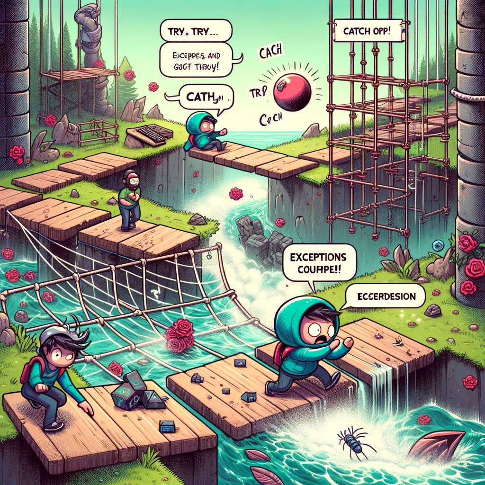
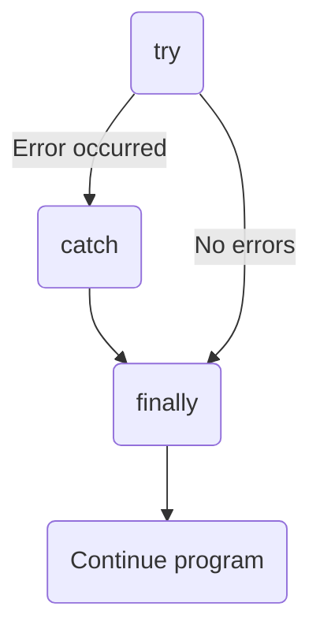
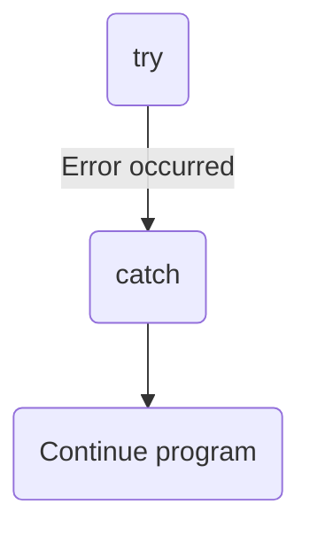
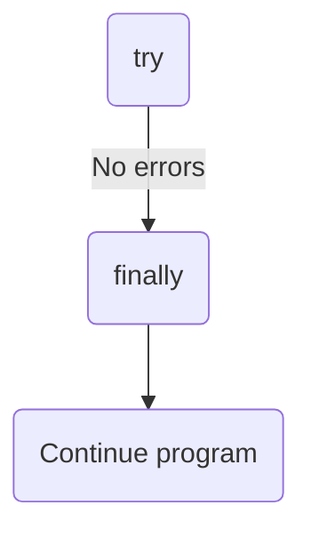

# Try..catch



*Image source: Dall-E by OpenAI*

- [Try..catch](#trycatch)
  - [Learning Outcomes](#learning-outcomes)
  - [What is the `try...catch` statement?](#what-is-the-trycatch-statement)
  - [Syntax](#syntax)
    - [try...catch...finally](#trycatchfinally)
    - [try...catch](#trycatch-1)
    - [try...finally](#tryfinally)
  - [How to Use the `try...catch` Statement](#how-to-use-the-trycatch-statement)

## Learning Outcomes

After completing this topic, you will be able to:

- Define what the `try...catch` statement is;
- Explain how to use the `try...catch` statement;
- Use the `try...catch` statement for error handling.

## What is the `try...catch` statement?

The `try...catch` statement is a JavaScript construct used for error handling. It allows us to try to execute code that may throw an error and, if an error occurs, catch it and handle it appropriately.

The `try...catch` statement is useful because it helps prevent the program from crashing due to errors. It enables handling errors that occur during program execution and allows the program to continue running despite encountering issues that would otherwise cause a termination, especially in environments like Node.js.

A `try...catch` statement consists of a `try` block and either a `catch` block, a `finally` block, or both. The code inside the `try` block is executed first. If an error occurs, the code inside the `catch` block is executed. The code inside the `finally` block is always executed before the control flow exits the entire construct.

## Syntax

```javascript
try {
  // Expressions to execute
} catch (exceptionVar) {
  // Expressions to execute if an error occurs in the try block
} finally {
  // Expressions executed before control flow exits try...catch...finally. These run regardless of whether an error occurred or not.
}
```

The `try...catch` statement always starts with a `try` block. This must be followed by either a `catch` Block, a `finally` block, or both. It provides three forms of the try...catch statement:
```javascript
try...catch
try...finally
try...catch...finally
```

Schematically, this can be represented as follows:

### try...catch...finally



### try...catch



### try...finally



## How to Use the `try...catch` Statement

Suppose we have code that might throw an error, such as attempting to read a non-existent file:

```javascript
const fs = require('fs');
const file = fs.readFileSync('nonexistingFile.txt');

console.log('Program continues');

```

If we try to execute this code, we get an error, and the program stops before reaching the output:

```bash
node:internal/fs/utils:344
    throw err;
    ^

Error: ENOENT: no such file or directory, open 'nonexistingFile.txt'
...
```

In such a case, we can use the following approach:

```javascript
const fs = require('fs');

try {
  const file = fs.readFileSync('nonexistingFile.txt');
} catch (error) {
  console.error('Error reading file:', error.message);
}

console.log('Program continues');

```

Now, the error is handled, and we can continue running the program even if an error occurred:

```bash
Faili lugemisel tekkis viga: ENOENT: no such file or directory, open 'nonexis
tingFile.txt'
Programm jätkub
```
