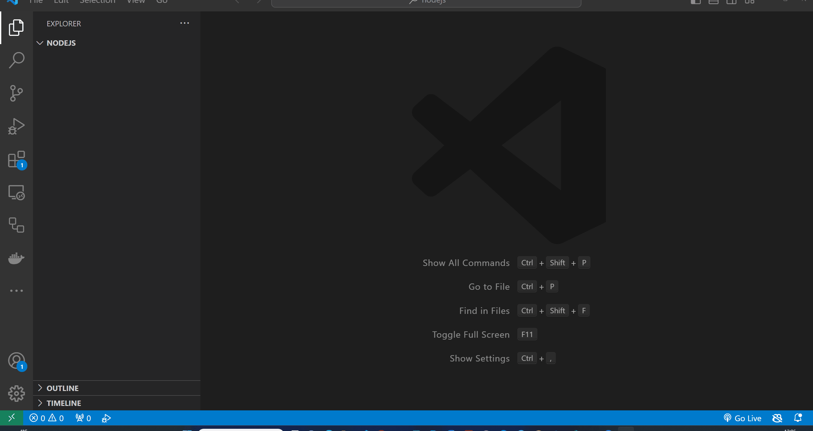

# Variables

In this topic, we'll learn about variables in Javascript.

- [Variables](#variables)
  - [Learning Outcomes](#learning-outcomes)
  - [What is a Variable?](#what-is-a-variable)
  - [How to Declare a Variable?](#how-to-declare-a-variable)
  - [Assigning Values to Variables](#assigning-values-to-variables)
  - [Exercises](#exercises)
    - [Exercise 1](#exercise-1)
    - [Exercise 2](#exercise-2)
    - [Exercise 3](#exercise-3)

## Learning Outcomes

After completing this topic, you'll be able to:
- Define what a variable is
- Declare variables
- Assign values to variables
- Explain the difference between `var`, `let`, and `const`

## What is a Variable?

A variable is a named storage location in a computer's memory that can be used to store data. Variables are used to store values that can be changed during the execution of a program. For example, a variable named `x` can be used to store the value `5`. The value of `x` can be changed to `10` by assigning the value `10` to `x`. Variables are used to store data that can be used later in the program.

We can imagine a variable as a box with a label on it (`variable name`) that can contain something (`value`). We can put something in the box (`assign a value`) and we can take something out of the box (`use the value`). If we want to know what is in the box, we can look at the label (`variable name`) to identify the box and then open the box to see what is inside (`access the value`).

For example, we could have `apples` variable, which contains some apples. If we want to know how many apples we have in the `apples` variable, we can look at the label (`apples`) to identify the box and then open the box to see how many apples are inside (`access the value`).

In Javascript it would be something like this:

```javascript
let apples = 5; // declare a variable named apples and assign the value 5 to it (put 5 apples in the box)
console.log(apples); // print the value of the apples variable to the console (open the box, see how many apples are inside and print the value to the console)
```

## How to Declare a Variable?

In order to use a variable in a program, we must first declare it. In Javascript, we can declare a variable using the `var`, `let`, or `const` keywords.
- The `var` keyword is used to declare a variable that can be reassigned, but we should avoid using `var` nowadays and use `let` instead.
- The `let` keyword is used to declare a variable that can be reassigned.
- The `const` keyword is used to declare a variable that cannot be reassigned.

```javascript
let firstName; // declare a variable named x
let age, lastName; // declare multiple variables 
```

In previous example, we declared variables named `firstName`, `age`, and `lastName`. We can also declare variables and assign values to them at the same time.

## Assigning Values to Variables

We can assign values to variables using the assignment operator `=`. The value on the right side of the assignment operator is assigned to the variable on the left side of the assignment operator.

```javascript
let firstName = 'John'; // declare a variable named firstName and assign the value 'John' to it
let age = 25, lastName = 'Doe'; // declare multiple variables and assign values to them
const PI = 3.14; // declare a constant named PI and assign the value 3.14 to it
```

## Exercises

Create a file named `index.js` (or another name of your choice) and start adding solutions to the exercises below.

Test your code by running the `index.js` file using the `node index.js` command.

You can also test Your code with different values for the variables.

### Exercise 1

Declare a variable named `firstName` and assign the value `John` to it.

Print the value of the `firstName` variable to the console.

Test your code by running the `index.js` file using the `node index.js` command.

<details>
  <summary>Solution</summary>

```javascript
let firstName = 'John'; // declare a variable named firstName and assign the value 'John' to it

console.log(firstName); // print the value of the firstName variable to the console
```


</details>

### Exercise 2

In the same file, declare a variable named `lastName` and assign the value `Doe` to it.

Print out values of the `firstName` and `lastName` variables in a single line. Output should look like this: `John Doe`.

Test your code by running the `index.js` file using the `node index.js` command.

> Hint: Use the `+` operator to concatenate the values of the `firstName` and `lastName` variables.

<details>
  <summary>Solution</summary>

```javascript
let firstName = 'John'; // declare a variable named firstName and assign the value 'John' to it
let lastName = 'Doe'; // declare a variable named lastName and assign the value 'Doe' to it

console.log(firstName + ' ' + lastName); // print out values of the firstName and lastName variables in a single line
```

</details>

### Exercise 3

In the same file, declare a variable named `age` and assign the value `25` to it.

Print out text `John is 25 years old.` using the `firstName` and `age` variables.
# Değişkenler

Bu konuda, JavaScript'teki değişkenler hakkında öğreniyoruz.

- [Değişkenler](#değişkenler)
  - [Öğrenme Hedefleri](#öğrenme-hedefleri)
  - [Değişken Nedir?](#değişken-nedir)
  - [Değişken Nasıl Deklare Edilir?](#değişken-nasıl-deklare-edilir)
  - [Değişkenlere Değer Atama](#değişkenlere-değer-atama)
  - [Alıştırmalar](#alıştırmalar)
    - [Alıştırma 1](#alıştırma-1)
    - [Alıştırma 2](#alıştırma-2)
    - [Alıştırma 3](#alıştırma-3)

## Öğrenme Hedefleri

Bu konuyu tamamladıktan sonra şunları yapabileceksiniz:
- Değişkenin ne olduğunu tanımlayabileceksiniz
- Değişkenleri deklare edebileceksiniz
- Değişkenlere değer atayabileceksiniz
- `var`, `let` ve `const` arasındaki farkları açıklayabileceksiniz

## Değişken Nedir?

Değişken, bilgisayarın belleğinde adlandırılmış bir depolama alanıdır ve bu alanda veriler saklanabilir. Değişkenler, bir programın çalışması sırasında değeri değiştirilebilen verileri saklamak için kullanılır. Örneğin, `x` adında bir değişken, `5` değerini saklamak için kullanılabilir. `x` değişkeninin değeri, `10` olarak değiştirilebilir. Değişkenler, programda daha sonra kullanılmak üzere veri saklamak için kullanılır.

Bir değişkeni, üzerine etiket yapıştırılmış bir kutu gibi düşünebiliriz (`değişken adı`). Bu kutu bir şeyler içerebilir (`değer`). Kutunun içine bir şey koyabiliriz (`değer atama`) ve kutudan bir şey çıkarabiliriz (`değeri kullanma`). Kutunun içinde ne olduğunu öğrenmek istiyorsak, etiketine bakarak (`değişken adı`) kutuyu tanımlarız ve sonra kutuyu açarız (`değeri erişme`).

Örneğin, `elma` adında bir değişkenimiz olabilir, içinde bazı elmalar saklanır. Eğer `elma` değişkeninde kaç tane elma olduğunu öğrenmek istiyorsak, etikete bakarak (`elma`) kutuyu tanımlarız ve sonra kutuyu açarız (`değeri erişme`).

JavaScript'te bu şöyle bir şey olacaktır:

```javascript```
let elma = 5; // elma adında bir değişken deklare edilir ve 5 değeri atanır (kutuda 5 elma var)
console.log(elma); // elma değişkeninin değerini ekrana yazdırır (kutuyu açar, içinde kaç elma olduğunu görür ve ekrana yazdırır)
Değişken Nasıl Deklare Edilir?
Bir değişkeni bir programda kullanabilmek için önce onu deklare etmemiz gerekir. JavaScript'te, var, let veya const anahtar kelimeleriyle bir değişken deklare edebiliriz.

var anahtar kelimesi, değeri değiştirilebilen bir değişkeni deklare etmek için kullanılır, ancak günümüzde var kullanmaktan kaçınılmalı ve yerine let kullanılmalıdır.
let anahtar kelimesi, değeri değiştirilebilen bir değişkeni deklare etmek için kullanılır.
const anahtar kelimesi, değeri değiştirilemeyecek bir değişkeni deklare etmek için kullanılır.

let ilkAd; // ilkAd adında bir değişken deklare edilir
let yas, soyad; // birden fazla değişken deklare edilir
Önceki örnekte, ilkAd, yas ve soyad adlarında değişkenler deklare ettik. Ayrıca, aynı anda değişkenlere değer atayarak da deklare edebiliriz.

Değişkenlere Değer Atama
Değişkenlere değer atamak için atama operatörü = kullanılır. Atama operatörünün sağ tarafındaki değer, sol taraftaki değişkene atanır.

let ilkAd = 'John'; // ilkAd adında bir değişken deklare edilir ve 'John' değeri atanır
let yas = 25, soyad = 'Doe'; // birden fazla değişken deklare edilir ve değerler atanır
const PI = 3.14; // PI adında bir sabit deklare edilir ve 3.14 değeri atanır
Alıştırmalar
Aşağıdaki alıştırmalara çözümleri eklemek için index.js adında bir dosya oluşturun (veya istediğiniz başka bir isim verebilirsiniz).

Kodunuzu, node index.js komutuyla çalıştırarak test edin.

Değişkenler için farklı değerler kullanarak kodunuzu da test edebilirsiniz.

### Alıştırma 1
ilkAd adında bir değişken deklare edin ve ona John değerini atayın.

ilkAd değişkeninin değerini ekrana yazdırın.

Kodunuzu node index.js komutuyla test edin.

<details> <summary>Çözüm</summary>
let ilkAd = 'John'; // ilkAd adında bir değişken deklare edilir ve 'John' değeri atanır

console.log(ilkAd); // ilkAd değişkeninin değerini ekrana yazdırır
</details>

### Alıştırma 2
Aynı dosyada, soyad adında bir değişken deklare edin ve ona Doe değerini atayın.

ilkAd ve soyad değişkenlerinin değerlerini tek bir satırda yazdırın. Çıktı şu şekilde olmalıdır: John Doe.

Kodunuzu node index.js komutuyla test edin.

İpucu: ilkAd ve soyad değişkenlerinin değerlerini birleştirmek için + operatörünü kullanın.

<details> <summary>Çözüm</summary>
let ilkAd = 'John'; // ilkAd adında bir değişken deklare edilir ve 'John' değeri atanır
let soyad = 'Doe'; // soyad adında bir değişken deklare edilir ve 'Doe' değeri atanır

console.log(ilkAd + ' ' + soyad); // ilkAd ve soyad değişkenlerinin değerlerini tek bir satırda yazdırır
</details>

### Alıştırma 3
Aynı dosyada, yas adında bir değişken deklare edin ve ona 25 değerini atayın.

John is 25 years old. metnini, ilkAd ve yas değişkenlerini kullanarak yazdırın.

