# Working with Branches

In this chapter, we'll explore what branches are, how to create them, and how to work with them.

- [Working with Branches](#working-with-branches)
  - [Learning Outcomes](#learning-outcomes)
  - [What is a Branch?](#what-is-a-branch)
  - [Types of Branches](#types-of-branches)
  - [How to Create Branches](#how-to-create-branches)
  - [Example of the Branch Creation Process](#example-of-the-branch-creation-process)
  - [Exercises](#exercises)

## Learning Outcomes

After completing this topic, you will be able to:

- Describe what a branch is and why it is useful.
- Describe different types of branches.
- Create a new branch and make changes in it.
- Create a pull request and merge the branch with the main codebase.

## What is a Branch?

A branch is a concept in version control systems that allows developers to create isolated copies of the codebase. Creating branches enables developers to work on new features, fixes, or experiments without affecting the main codebase.

Working with branches is an essential skill in software development, as it allows developers to:

- **Develop New Features:** Developers can work on new functionalities in an isolated environment.
- **Fix Bugs:** Using branches allows developers to address bugs while keeping the main codebase stable.
- **Experiment with Code:** Branches enable developers to safely experiment with new ideas.
- **Review Code:** Branches provide an isolated environment for code reviews.
- **Test Code:** Branches allow developers to test code in different environments.

## Types of Branches

Version control systems have various types of branches that can be used for different purposes. The names and types of branches may vary depending on the version control system, organizational practices, and project needs. Some common types of branches are:

- **Main Branch (master branch or main branch):** The main branch is the primary branch of the codebase, containing stable code. It is usually the branch from which other branches diverge.
- **Feature Branches (development branches):** Feature branches are temporary branches created for developing new features.
- **Bug Fix Branches (hotfix branches):** Bug fix branches are created to fix issues in the main codebase.

## How to Create Branches

Creating branches typically involves the following steps:

1. **Creating a Branch:** A developer creates a new branch using version control commands or tools.
2. **Switching to the Branch:** The developer switches their working environment to the branch they want to work on.
3. **Working on the Branch:** The developer makes changes and develops new features in the branch's codebase.
4. **Creating a Pull Request:** The developer creates a pull request to merge the branch's changes into the main codebase.
5. **Reviewing and Merging the Pull Request:** The pull request is reviewed and, if approved, the changes are merged into the main codebase.
6. **Deleting the Branch:** After merging the changes, the branch can be deleted.

## Example of the Branch Creation Process

The following example shows how the branch creation process might look using GitHub and GitHub Desktop.

Initially, there is the main branch with stable code. The developer wants to create a branch for a new feature to develop it in an isolated environment.

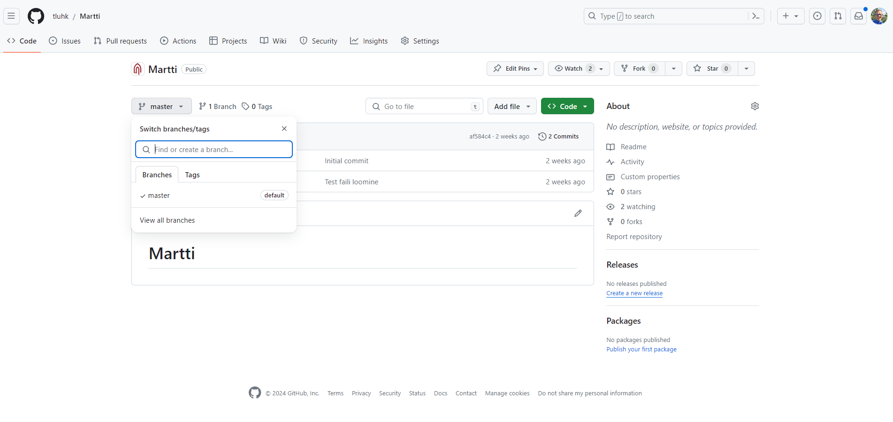

The developer then creates a new branch named `feature/new-feature` and publishes it using GitHub Desktop.

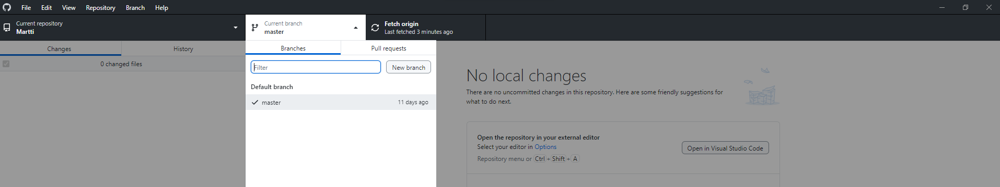

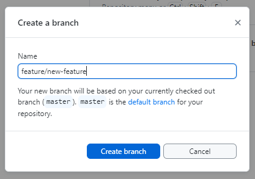

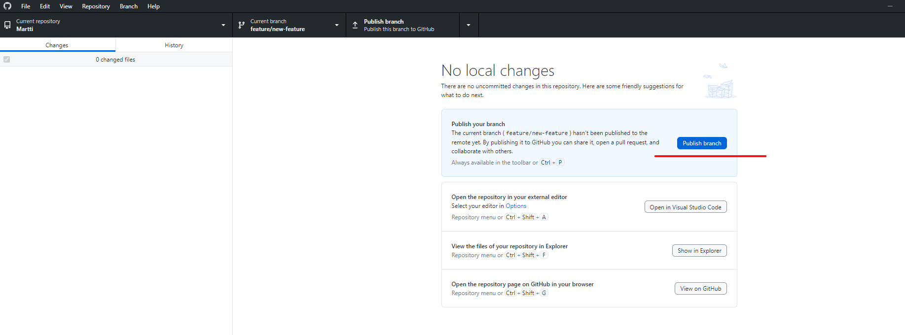

Next, the developer opens their code editor, where the new branch is already active, and starts developing the new feature.

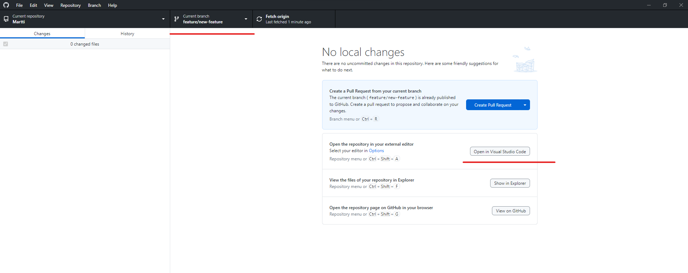

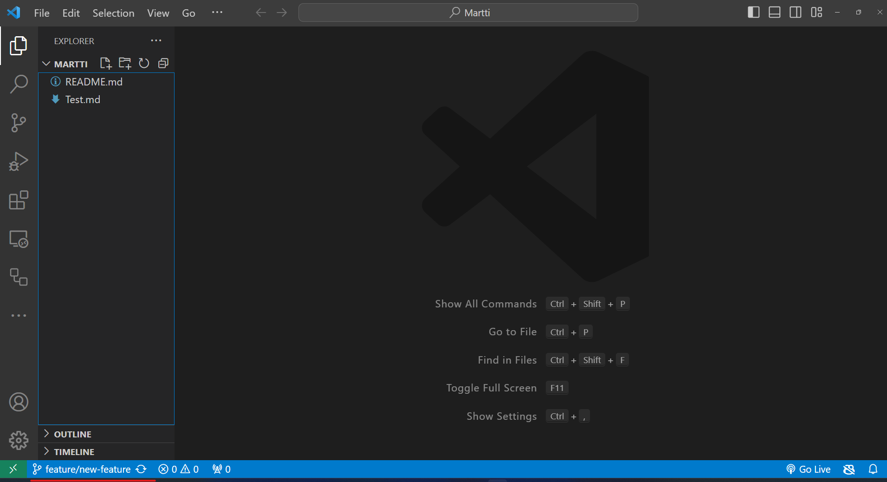

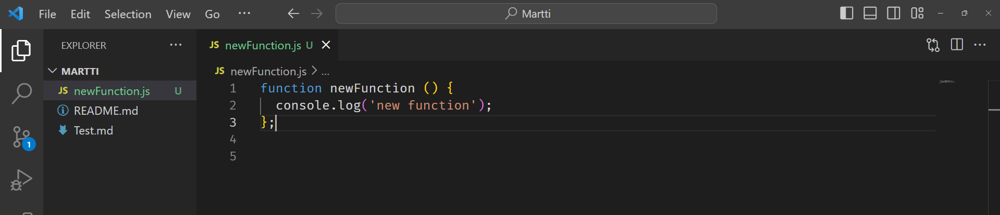

Once the new code is written, the developer commits and pushes the changes to the new branch.

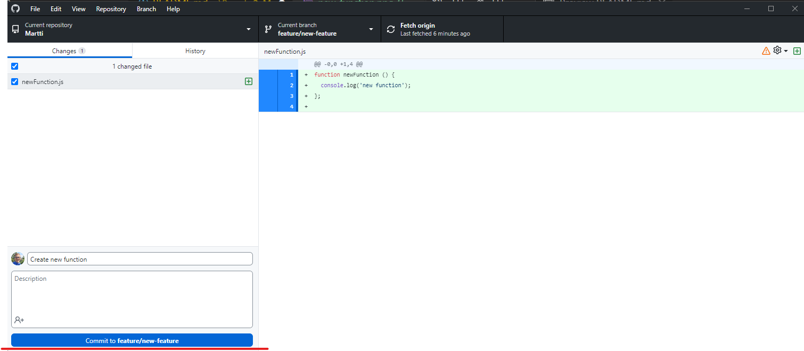

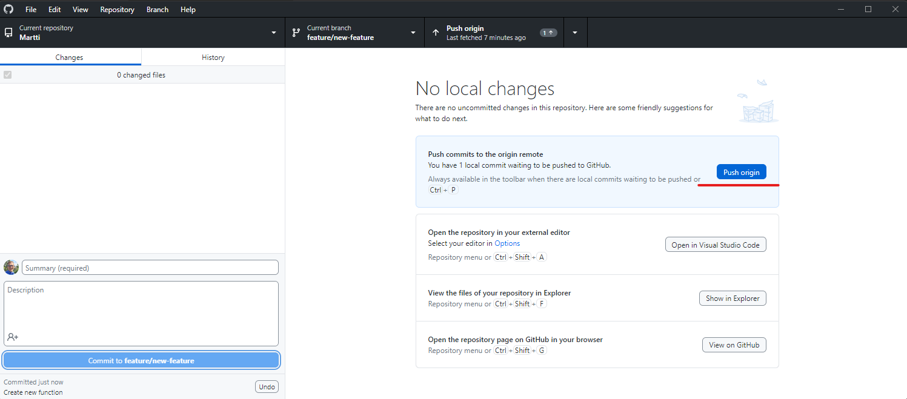

Now the new branch with the new code is visible on GitHub, and there is an option to create a pull request - the `Compare & pull request` button.

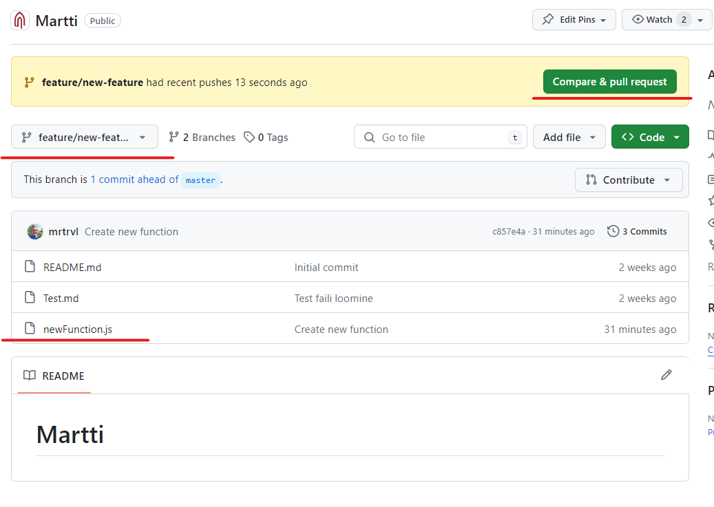

At the same time, if you look at the main branch, the new changes are not yet visible.

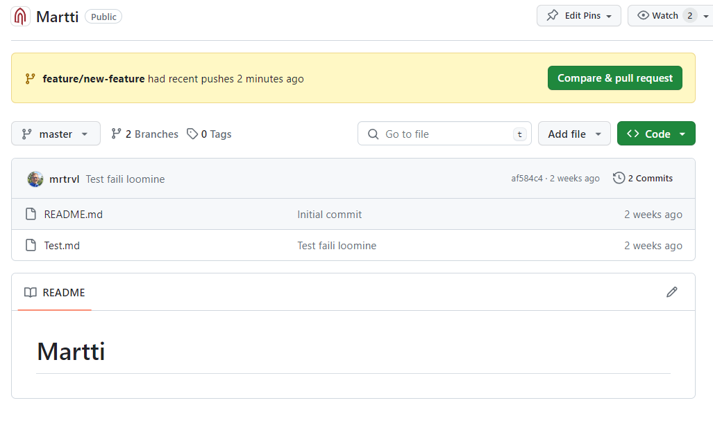

To get the new changes into the main branch, a pull request needs to be made, allowing the new changes to be merged into the main branch.

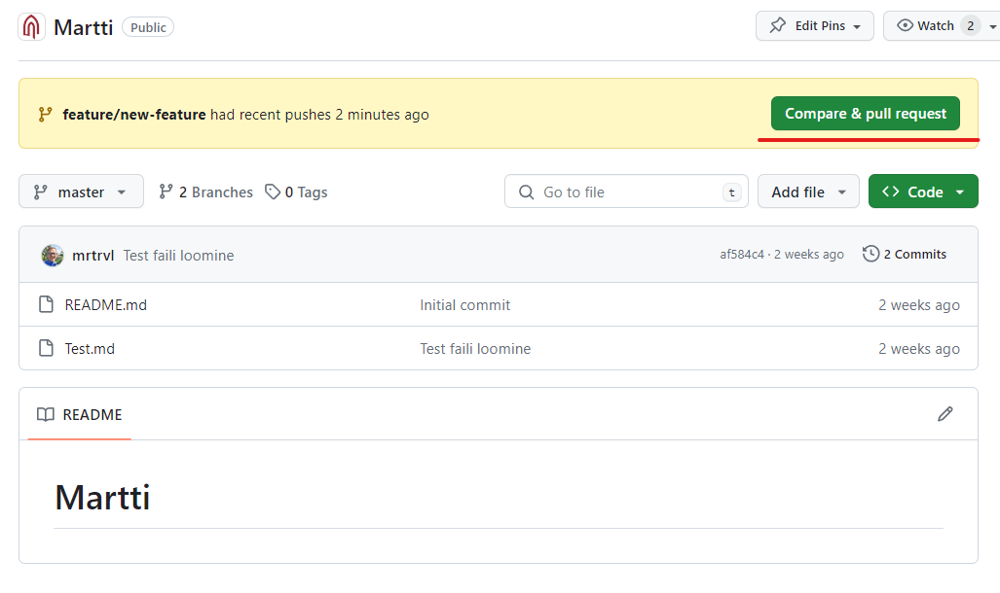

It is then possible to review the changes between branches, assign reviewers if necessary, and write a brief description of the changes. Then, publish the pull request by clicking `Create pull request`.

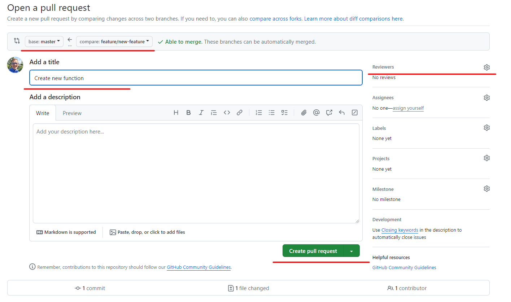

The pull request can be reviewed, comments can be added, and changes can be made if needed. Once everything is in order, the pull request can be merged with the main branch by clicking `Merge pull request`.

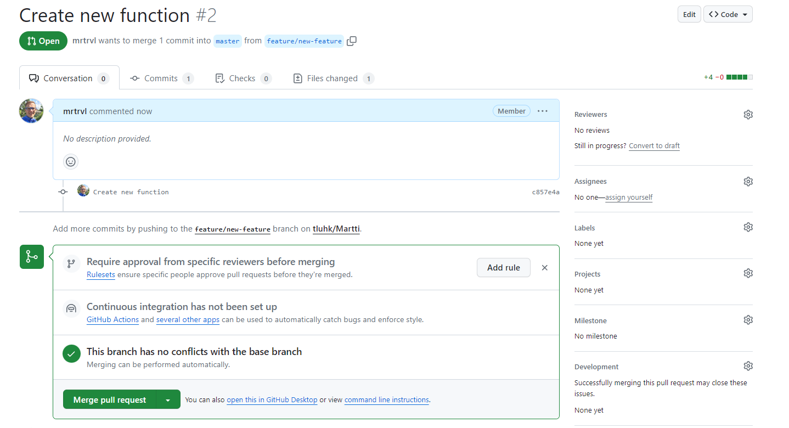

After merging the pull request, the new changes are visible in the main branch.

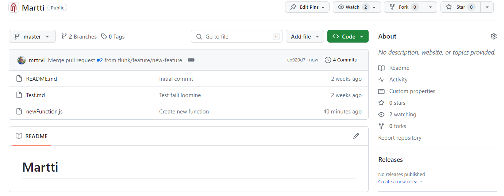

Finally, the new branch can be deleted if it is no longer needed, and the developer can switch back to the main branch.

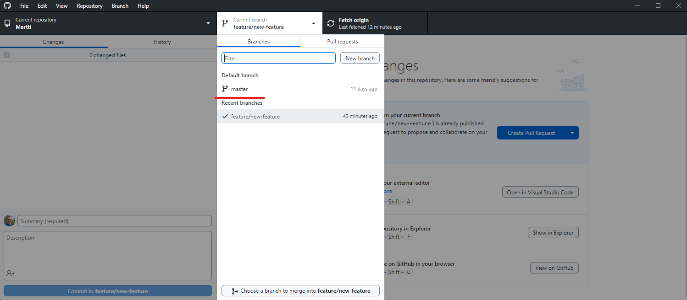

## Exercises

- Follow the above steps to create a new branch, make changes in it, and merge it with the main branch.

