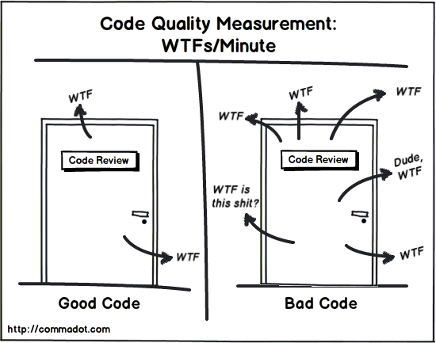

# Code Quality


- [Code Quality](#code-quality)
  - [What Does Code Quality Mean?](#what-does-code-quality-mean)
  - [How to Ensure Code Quality?](#how-to-ensure-code-quality)
  - [Examples](#examples)
    - [Code Readability](#code-readability)
    - [Simplicity](#simplicity)
    - [Maintainability](#maintainability)
    - [Reliability](#reliability)

## What Does Code Quality Mean?

Code quality refers to the overall quality and maintainability of a codebase. It encompasses various aspects of code, including its readability, consistency, simplicity, maintainability, and reliability. A high-quality codebase is easier to understand, modify, and maintain over time, saving development teams time and resources.

  
[Image Source](http://zpalexander.com/content/images/2017/09/wtf.png)

Here are some factors that contribute to good code quality:

- **Readability:** Code should be easily readable and understandable. It should be well-structured and organized, with consistent naming conventions, spacing, and indentation.
- **Consistency:** Code should be stylistically and methodologically consistent. This makes it easier for other developers to understand and modify the code.
- **Simplicity:** Code should be simple and clear. This reduces the likelihood of errors and makes the code easier to modify and maintain over time.
- **Maintainability:** Code should be maintainable over time. This means it should be easy to change, fix, and update as requirements evolve.
- **Reliability:** Code should be reliable and predictable. It should work as expected and handle errors in a way that does not cause failures in the program.

## How to Ensure Code Quality?

Here are some points on how to ensure code quality:

- **Consistent Code Formatting:** Consistent code formatting makes it easier for developers to understand and maintain the codebase. Use a code linter or formatter, such as Prettier or [ESLint](../Eslint/README.md), to enforce a consistent style.
- **Code Comments and Documentation:** Documenting the codebase with comments, documentation, and inline notes is a good practice to ensure that developers can understand and modify the code. Comment briefly on why you are doing something in a particular way, not just what you are doing. Aim to name variables and functions in such a way that comments are not necessary. Long names are okay.
- **Unit Testing:** Writing automated tests for the code helps ensure that it functions as expected and that changes to the codebase do not introduce new bugs or issues. Tools such as [Jest](https://jestjs.io/) or [Mocha](https://mochajs.org/) can be used for writing and running JavaScript unit tests.
- [**Code Reviews**](../Code-Review/README.md): Code reviews by other developers can be a valuable tool for ensuring high code quality. Code reviews allow other developers to review code changes, suggest improvements, and catch errors or issues.
- **Error Handling:** Proper error handling in the code can help ensure its reliability and predictability. Make sure that errors are handled consistently throughout the codebase and that error messages are informative and helpful to developers.
- **Use of Modern JavaScript Features:** Using modern JavaScript features (e.g., arrow functions, destructuring, and template literals) can help improve code quality. These features can make the code more concise and easier to read.
- **Code Refactoring:** Refactoring is the process of improving existing code without changing its behavior. Refactoring can help improve code quality by making it more readable, maintainable, and scalable.

By following these practices, you can ensure that your JavaScript code is of high quality and easily maintainable over time.

## Examples

### Code Readability

For example:

```javascript
function add(x,y){return x+y;}
console.log(add(2,3));
```
This code performs a simple addition and prints the result to the console. While the code works correctly, it is not very readable. Here is an improved version of the same code that is more readable:

```javascript
function add(num1, num2) {
  return num1 + num2;
}

const result = add(2, 3);
console.log(result);
```
In this version, we have improved the readability of the code by giving the function parameters more descriptive names (num1 and num2) and adding spaces to make the code more readable. We also stored the result of the addition in a variable before printing it to the console, making the code easier to understand.

### Simplicity

For example:

```javascript
function checkLogin(username, password) {
  if (username === 'admin' && password === 'password') {
    return true;
  } else {
    return false;
  }
}
```
This code defines a function `checkLogin` that takes two arguments (username and password) and returns `true` if the values are 'admin' and 'password' respectively, and `false` otherwise. While the code works correctly, it can be simplified. Here is a simpler version of the same code that produces the same result:

```javascript
function checkLogin(username, password) {
  return (username === 'admin' && password === 'password');
}
```
In this version, we have simplified the code by removing the unnecessary `if` statement and `else` block. We also removed the `true` and `false` return statements and replaced them with a single boolean expression that returns `true` or `false` based on the conditions.

### Maintainability

For example:

```javascript
function calculateTax(price, taxRate) {
  let taxAmount = price * taxRate;
  let total = price + taxAmount;
  return total;
}
```

This code defines a function `calculateTax` that takes two arguments (`price` and `taxRate`) and returns the total amount including tax. While this code works correctly, it is not very maintainable. Here is an improved version of the same code that is more maintainable:

```javascript
function calculateTotalPrice(price, taxRate) {
  const taxAmount = calculateTaxAmount(price, taxRate);
  const totalPrice = price + taxAmount;
  return totalPrice;
}

function calculateTaxAmount(price, taxRate) {
  return price * taxRate;
}
```

In this version, we have improved the maintainability of the code by breaking it into two functions: `calculateTotalPrice` and `calculateTaxAmount`. The `calculateTotalPrice` function now calls the `calculateTaxAmount` function to get the tax amount and then calculates the total price. By breaking the code into smaller functions, we have made it easier to understand and modify.

This code is now more maintainable because any changes to the tax calculation can be made in the `calculateTaxAmount` function without affecting the rest of the code. This makes the code easier to update and modify in the future, leading to better code quality.

### Reliability

For example:

```javascript
function divide(a, b) {
  return a / b;
}
```

This code defines a function `divide` that takes two arguments (`a` and `b`) and returns the result of dividing `a` by `b`. While this works correctly most of the time, it is not very reliable because it does not handle the case where `b` is zero, which would cause a division by zero error. Here is an improved version of the same code that is more reliable:

```javascript
function divide(a, b) {
  if (b === 0) {
    throw new Error('Division by zero error');
  }
  return a / b;
}
```
In this version, we have improved the reliability of the code by adding a check to ensure that `b` is not zero before performing the division. If `b` is zero, the function throws a new error object with a message indicating a division by zero error.

By adding this check, we have made the code more reliable because it now handles the case where `b` is zero, preventing a division by zero error. This leads to better code quality because the code is more likely to work correctly and produce the expected results.

Sources and further reading:

- <https://blog.cleancoder.com/>
- <https://github.com/jnguyen095/clean-code/blob/master/Clean.Code.A.Handbook.of.Agile.Software.Craftsmanship.pdf>
- <https://github.com/ryanmcdermott/clean-code-javascript>


