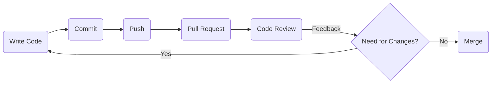

# Code Review

## Learning Outcomes

After completing this topic, you will be able to:

- Explain what code review is;
- Identify the objectives and benefits of code review;
- Describe the code review process and stages;
- Implement code review in the software development process.

## What is Code Review?

Code review is a process where one or more developers review the code written by another developer. The purpose of a code review is to identify potential issues, improve code quality, and ensure code compliance with project requirements.

Code review typically involves line-by-line reading of the code, looking for issues such as:

- Bugs;
- Security vulnerabilities;
- Performance issues;
- Violations of coding standards;
- Design flaws.

The reviewer may also suggest improvements or provide feedback on how to make the code more efficient, maintainable, and readable.

Code review is an essential part of the software development process as it helps identify errors and improve code quality before it is merged into the main codebase. It also provides developers an opportunity to learn from each other and share knowledge, which can help improve team skills and expertise.

Code review can be conducted manually, where one developer reads through the code and provides feedback, or it can be automated, using tools that analyze the code for issues and suggest corrections. Regardless of the approach, code review is an important step in ensuring the quality and reliability of software applications.

## At What Stage is Code Review Conducted?

Code review is conducted in the software development process after the code is written but before it is merged into the main codebase.

In most software development workflows, code review is part of the pull request process. When a developer has finished writing a new feature or fixing a bug, they create a pull request that includes the changes made. Other team developers then review the code changes and provide feedback, either manually or using automated tools.

After the code review and resolving any issues, the changes can be merged into the main codebase. Code review is often an iterative process, meaning that there may be several rounds of feedback and modifications before the changes are finally approved.

