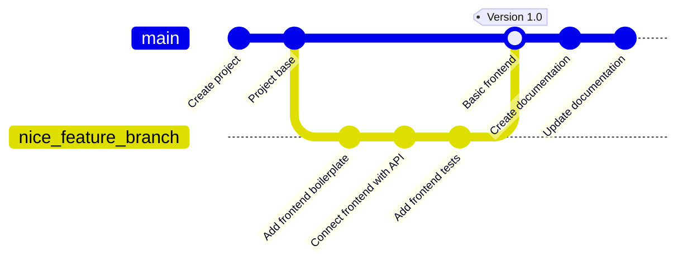
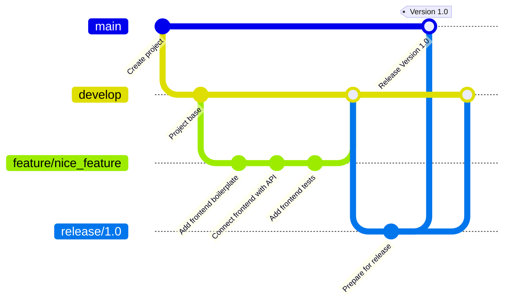

# Git

In this topic, we'll learn about the basics of Git and version control. We'll cover the importance of version control systems, the basics of Git, and the Git flow process.

- [Git](#git)
  - [Learning outcomes](#learning-outcomes)
  - [What is Git?](#what-is-git)
  - [Basic Git Architecture](#basic-git-architecture)
  - [Installing Git](#installing-git)
  - [Basic Git vocabulary](#basic-git-vocabulary)
  - [Basic Git Commands](#basic-git-commands)
  - [Graphical Git Clients](#graphical-git-clients)
    - [Some Popular Graphical Clients for Git:](#some-popular-graphical-clients-for-git)
    - [Reasons to Use Graphical Git Clients:](#reasons-to-use-graphical-git-clients)
  - [Git flow](#git-flow)
    - [1. **Main Branches**:](#1-main-branches)
    - [2. **Supporting Branches**:](#2-supporting-branches)
    - [**Basic Git Flow Process**:](#basic-git-flow-process)
  - [Git hosting platforms](#git-hosting-platforms)
  - [Excercises](#excercises)

## Learning outcomes

After completing this topic, you'll be able to:

- understand the importance of version control systems;
- describe the basics of Git and version control;
- describe the basic Git architecture;
- describe the basic Git vocabulary;
- describe the basic Git flow;

## What is Git?



**Git** is a distributed version control system (_DVCS_) used to track changes in source code during software development. It's designed to handle everything from small to very large projects with speed and efficiency. **Git** provides a way for multiple developers to collaborate on the same codebase without interfering with each other.

Git was created by Linus Torvalds in 2005 for the development of the Linux kernel. Its adoption has grown rapidly, and it's now the dominant version control system in the software industry. It's used by companies like Google, Facebook, Microsoft, and Twitter to manage their codebases.

Here are the key aspects and features of **Git**:

- **Distributed System**: Unlike centralized version control systems where there's a single central repository, in **Git**, every developer's copy of the code is also a repository that can contain the entire history and version tracking capabilities. This ensures redundancy and makes operations like branching and merging extremely efficient.
- **Branching and Merging**: **Git**'s branching model allows developers to create isolated branches for feature development or bug fixes. These branches can then be merged back into the main branch, typically known as the 'master' branch.
- **History**: **Git** tracks the entire history of the project. Every commit is checksummed and retrievable, ensuring integrity and traceability.
- **Staging Area**: **Git** introduces a unique concept of a _staging area_ or _index_. This is an intermediate area where commits can be formatted and reviewed before completing the commit.
- **Performance**: **Git** operations are performed locally, making it faster than many version control systems that rely on network operations.
- **Integrity**: **Git** uses a hashing algorithm called SHA-1 to checksum its data. This ensures the integrity of the version history.
- **Flexibility**: **Git** supports various workflows, from centralized to fully distributed, making it adaptable to different project needs.
- **Collaboration Platforms**: Platforms like _GitHub_, _GitLab_, and _Bitbucket_ enhance **Git**'s collaborative capabilities by providing code hosting, pull requests, code reviews, and issue tracking.
- **Free and Open Source**: **Git** is free software distributed under the terms of the GNU General Public License version 2.

## Basic Git Architecture

Git has a unique architecture and data model that makes it efficient and powerful. Here's a breakdown of the basic components of Git's architecture:

- **Blobs**:
  - Represents the content of a file in Git.
  - A blob holds the file data but doesn’t contain any metadata about the file.
  - It's a binary large object and is identified by a SHA-1 hash of its content.
- **Trees**:
  - Represents a directory or folder in Git.
  - A tree object maps names to blobs or trees (essentially, it can reference other trees for subdirectories).
  - Like blobs, trees are identified by a SHA-1 hash.
- **Commits**:
  - Represents a particular point in the repository's history.
  - A commit points to a tree that captures the state of the repository at a certain point in time.
  - Contains metadata such as:
    - Author
    - Committer
    - Date
    - Commit message
  - Each commit also points to its parent commit(s), forming a linked list. This is what creates the "history" in Git. Merge commits can point to multiple parents.
  - Identified by a SHA-1 hash.
- **Branches**:
  - A moving pointer to a commit.
  - When you create a branch, Git creates a pointer to the commit you're currently on.
  - As new commits are created, the branch pointer automatically moves to point to the latest commit.
  - The default branch in most repositories is named "master" (though a shift towards naming it "main" has been observed recently).
  - Branches allow for divergent development, where features or experiments can be developed in isolation before merging them back into the main codebase.

This architecture, built around a directed acyclic graph of objects, is what allows Git to efficiently track changes, create branches, and merge histories. The use of SHA-1 hashes ensures the integrity and consistency of the repository across clones and versions.

## Installing Git

Latest version of Git and instructions for installation can be found from [git-scm.com](https://git-scm.com/book/en/v2/Getting-Started-Installing-Git).

## Basic Git vocabulary

Git has its own unique vocabulary, and understanding these terms is key to working effectively with Git. Here's a basic overview of some essential Git terminology:
- **Repository (Repo)**:
  - A directory or storage space where your project lives. It contains all of the project files and the entire revision history.
  - Can be local (on your computer) or remote (e.g., on a server or service like GitHub).
- **Commit**:
  - A set of changes or modifications to files. Each commit is uniquely identified by a SHA-1 hash code.
  - Represents a snapshot of the repository's files and directory structure at a particular point in time.
- **Branch**:
  - A parallel version of a repository. It diverges from the main working project into a separate area where you can work without affecting the main or "master" branch.
  - Useful for developing new features or testing out ideas.
- **Master or main**:
  - The default development branch. Whenever you create a Git repository, a branch named "master" or "main" is created, and becomes the active branch.
  - Note: There's a shift in the industry to rename this default branch to "main" for inclusivity reasons.
- **Clone**:
  - A copy of a repository that lives on your computer instead of on a server elsewhere or the original repository site.
  - `git clone [URL]` is the command used to clone (or copy) a repository from an existing URL.
- **Fork**:
  - A personal copy of another user's repository. Forking is used to suggest changes to someone else's project or to use someone else's project as a starting point for your own idea.
- **Pull**:
  - Refers to when you fetch in changes from a remote repository or branch and merge them into your current branch.
  - `git pull [remote] [branch_name]` is the command used to pull changes.
- **Push**:
  - Sending your committed changes to a remote repository.
  - `git push [remote] [branch_name]` is the command used to push your changes.
- **HEAD**:
  - A special pointer or reference to a specific commit in the repository. By default, it points to the latest commit in the branch you're currently on.
- **Merge**:
  - The process of integrating changes from one branch into another.
- **Merge Conflict**:
  - Occurs when competing changes are made to the same line of a file, or when one person edits a file and another person deletes the same file.
  - Git will highlight the differences and require you to choose which changes to keep.
- **Pull Request (PR)**:
  - On platforms like GitHub, a pull request is a way to propose changes from a fork or a branch which can then be merged into another branch, typically the master/main branch.
- **Remote**:
  - A version of your project that is hosted on the internet or network somewhere. You can have multiple remotes, and they are handy for collaborating with others.
- **Staging Area (or Index)**:
  - An intermediate area where commits can be formatted and reviewed before completing the commit.
  - `git add [file_name]` is used to add changes to the staging area.
- **Fetch**:
  - The act of downloading new data from a remote repository. Unlike `pull`, `fetch` gets the data but does not merge it.
- **Tag**:
  - A reference or pointer to a specific commit, often used to capture a point in history that is significant, such as a release version.

This overview covers the basic terms you'll encounter when starting with Git. As you delve deeper, you'll naturally come across more advanced concepts and terms.

## Basic Git Commands

Here's a basic overview of some essential Git commands and their descriptions:

- **`git init`**:
  - Initializes a new Git repository and starts tracking an existing directory.
  - Adds a hidden subfolder within the existing directory that houses the internal data structure required for version control.
- **`git clone [url]`**:
  - Creates a local copy of a project that already exists remotely.
  - The clone includes all the project’s files, history, and branches.
- **`git add [file-name.txt]`**:
  - Adds changes in the file to the staging area.
  - Prepares and packages up changes for a commit.
- **`git add .`**:
  - Adds all the changes in the current directory to the staging area (useful for tracking several changes across different files).
- **`git commit -m "[commit message]"`**:
  - Captures a snapshot of the project's currently staged changes.
- **`git status`**:
  - Shows the status of changes as untracked, modified, or staged.
- **`git branch`**:
  - Lists all local branches in the repository.
  - If you need to see all branches (including remote), use `git branch -a`.
- **`git branch [branch-name]`**:
  - Creates a new branch.
- **`git checkout [branch-name]`**:
  - Switches to the specified branch and updates the working directory.
  - Note: The command has evolved. You can now use `git switch [branch-name]` in newer versions of Git.
- **`git merge [branch-name]`**:
  - Merges the specified branch’s history into the current branch.
- **`git pull`**:
  - Updates your current local working branch with all new commits from the corresponding remote branch on GitHub.
- **`git push [remote-name] [branch-name]`**:
  - Pushes your local branch updates to the corresponding remote branch on GitHub.
- **`git log`**:
  - Displays an ordered list of all the commits which lead up to the current state of the branch.
  - There are many options to tailor the output format, like `git log --oneline` for a condensed view.
- **`git diff`**:
  - Shows the file differences that are not yet staged.
- **`git diff --staged`**:
  - Shows file differences when comparing the staged changes to the last commit.
- **`git remote add [alias] [url]`**:
  - Adds a remote repository to your local project.
- **`git remote -v`**:
  - Lists all remote repositories connected to the local project.
- **`git fetch`**:
  - Fetches all the updates from the remote repository (does not merge them).
- **`git revert [commit]`**:
  - Undoes all the changes made in a particular commit with a new commit.
- **`git reset`**:
  - Resets your staging area to match the most recent commit, but leaves the working directory unchanged. Useful for undoing `git add`.

This list covers the basics to get you started. Git is a deep tool with a variety of commands, and as you gain more experience, you'll discover many more advanced commands and options that can be used in various scenarios.

## Graphical Git Clients

**Graphical Git Clients** are applications that provide a visual interface to interact with Git, rather than relying solely on the command-line. They visually represent the version history, branches, and other aspects of a Git repository.

While graphical clients can be incredibly helpful, especially for those not comfortable with the command line, they do abstract away some of the intricacies of Git. For deeper, more complex operations, or to truly understand the inner workings of Git, familiarity with the command line is beneficial. Both approaches have their advantages, and many developers find a hybrid approach (using both command line and GUI) to be the most efficient.

### Some Popular Graphical Clients for Git:

- [**GitHub Desktop**](https://desktop.github.com/): This is the official GUI for GitHub. It’s open-source and cross-platform (available for macOS and Windows).
- [**Sourcetree**](https://www.sourcetreeapp.com/): Developed by Atlassian, it's a free tool available for macOS and Windows. It offers visual interaction with your repositories and supports Mercurial as well as Git.
- [**GitKraken**](https://www.gitkraken.com/): This cross-platform tool (available for Windows, macOS, and Linux) offers a vibrant and interactive interface. It's known for its graph visualization and has integrations with GitHub, GitLab, Bitbucket, and more.
- [**TortoiseGit**](https://tortoisegit.org/): Primarily for Windows, TortoiseGit integrates directly into the Windows shell, so you can right-click on a folder to access its features.

### Reasons to Use Graphical Git Clients:

- **User-Friendly**: For beginners, the command line can be intimidating. Graphical clients offer a more approachable and intuitive interface to interact with Git.
- **Visualization**: They provide a clear visual representation of branches, commits, merges, and more. This is especially helpful in understanding the flow and structure of commits in a repository.
- **Simplifies Complex Tasks**: Some Git tasks can be complex and verbose on the command line. GUI clients often simplify these processes into more manageable steps or provide a drag-and-drop interface.
- **Conflict Resolution**: Many graphical clients offer a visual way to resolve merge conflicts, making it clearer and sometimes easier than manually editing conflict markers in a text editor.
- **Integrated Tooling**: Graphical clients might come with built-in tools or integrations, such as Git blame, repository hosting services, and more.
- **Multitasking**: GUIs usually allow you to work on multiple repositories in separate tabs/windows, making context switching easier.
- **Immediate Feedback**: Many GUIs provide immediate visual feedback for most operations, such as the result of a merge or the changes introduced in a particular commit.
- **Support for Non-Git Operations**: Some GUIs offer features that aren't strictly Git operations, like the ability to open a file in a preferred editor, view the command history, or even run custom scripts.

## Git flow

Git Flow is a popular workflow methodology in Git that defines a structured approach to branching and merging. It provides a solid framework for managing larger projects and can simplify the process of collaborating with other developers on a shared repository. Below, I'll outline the Git Flow process, focusing on the role of branching:

### 1. **Main Branches**:

- **`main` (formerly `master`)**:
  - This branch contains the official release history.
  - All commits in the `main` branch represent a version of the software that is fully tested and deployable.
- **`develop`**:
  - Serves as an integration branch for features.
  - All the changes destined for the next release are integrated into this branch.

### 2. **Supporting Branches**:

These branches are used to aid parallel development, easily track features, prepare for releases, and quickly fix live issues.

- **Feature Branches**:
  - Branch off from: `develop`
  - Merge back into: `develop`
  - Naming convention: anything except `main`, `develop`, `release-*`, or `hotfix-*`
  - Purpose: Used to develop new features or enhancements. They exist as long as the feature is in development.

    ```mermaid
    graph LR
        A[develop] --> B[feature/feature_name]
        B --> A
    ```

- **Release Branches**:
  - Branch off from: `develop`
  - Merge back into: `main` and `develop`
  - Naming convention: `release-*`
  - Purpose: Used to prepare a new product version. This is where we tag our versions before they go into production. Bug fixes can be applied in this branch.

    ```mermaid
    graph LR
        A[develop] --> B[release/version_number]
        B --> C[main]
        B --> A
    ```

- **Hotfix Branches**:
  - Branch off from: `main`
  - Merge back into: `main` and `develop`
  - Naming convention: `hotfix-*`
  - Purpose: They arise from the necessity to act immediately upon an undesired state of the `main` branch. Used to quickly patch production releases.

    ```mermaid
    graph LR
        A[main] --> B[hotfix/issue]
        B --> A
        B --> C[develop]
    ```

### **Basic Git Flow Process**:



1. **Initialization**:
   Initialize a Git repository and then set up an empty `main` and `develop` branch.
2. **Start a New Feature**:
   For every new feature, create a new branch from `develop`, and name it according to the feature you're working on.
3. **Incorporate a Finished Feature**:
   Once the feature is complete and tested, it is merged back into `develop`. It awaits the next release cycle for integration into `main`.
4. **Release Time**:
   When enough features are ready, or a predetermined release point is reached, `develop` is branched off to a release branch, where final testing happens.
5. **Merge with Main**:
   Once the release branch is thoroughly tested, it is merged into `main` and tagged with a version number. It then also needs to be merged back into `develop` to ensure features added in the next cycle have the hotfixes and updates.
6. **Hotfixes**:
   If an issue is detected in the `main` branch and needs an immediate fix, a hotfix branch is created. Once the hotfix is complete, it's merged both into `main` (and tagged) and into `develop`.

Git Flow offers a rigorous framework for large-scale projects, but it might be overkill for smaller projects or teams. Some teams opt for simpler workflows, like GitHub flow or GitLab flow. Still, understanding Git Flow provides a solid foundation for how branching can be used in complex scenarios.

## Git hosting platforms

We could use Git locally, but it's more common to use a remote Git hosting platform. These platforms provide a centralized location for storing and collaborating on Git repositories. They also offer additional features like issue tracking, pull requests, code reviews, and more.

Here are some popular Git hosting platforms:

- [**GitHub**](https://github.com)
- [**GitLab**](https://gitlab.com)
- [**Bitbucket**](https://bitbucket.org)
- etc.

## Excercises

Try to explain the following concepts in your own words:
- What is Git and Version Control?
- Name at least four terms from the git vocabulary
- Name at least one Git hosting platform

Next steps:
- install `git` on your computer
