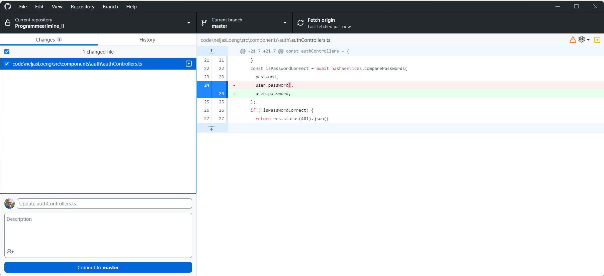

# Github

In this topic, we'll learn about GitHub, one of the most popular code hosting platforms in the world. We'll explore its features, learn how to use it, and discover how it can be used to collaborate on software projects.

- [Github](#github)
  - [Learning Outcomes](#learning-outcomes)
  - [What is Github?](#what-is-github)
  - [Creating an Account](#creating-an-account)
  - [Github Desktop](#github-desktop)
  - [Excercises](#excercises)

## Learning Outcomes

After completing this topic, you'll be able to:

- describe what GitHub is and why it's popular;
- create a GitHub account;
- navigate the GitHub UI.
- use Github Desktop to clone, commit, push, and pull changes to a repository.
- use Github Desktop to create a branch, make changes, and merge it.

## What is Github?

**GitHub** is a web-based platform that offers hosting for software development and version control using Git. It provides the distributed version control capabilities of Git along with added functionalities by GitHub.

GitHub was founded in 2008 by Tom Preston-Werner, Chris Wanstrath, and PJ Hyett. In 2018, it was acquired by Microsoft. Today, it is one of the world's largest code hosting platforms, with a very large community of developers and containing a plethora of open-source projects as well as private repositories.

Here are some key aspects and features of GitHub:

- **Repositories**: At the heart of GitHub is the "repository" (often abbreviated as "repo"). A repository contains all the project files, including the history of changes. Repositories can be public (accessible to everyone), private (limited access), or organization internal (visible to members of an organization).
- **Forking**: Users can "fork" a repository, meaning creating a personal copy of another user's project. This allows users to make changes without affecting the original project. If changes are made in a fork, users can send a pull request to the original repository owner to suggest integrating those changes.
- **Pull Requests (PRs)**: Pull requests allow notifying others about changes made in a repository. When a pull request is sent, project maintainers can review the set of changes, discuss potential modifications, and even make follow-up modifications before merging the changes into the repository.
- **Issues**: GitHub offers an issue tracking system where users can report bugs, request features, or discuss other project-related questions. In addition, GitHub issues are often used for task distribution/tracking and project management.
- **GitHub Actions**: This feature allows for the creation of automated workflows for CI/CD (Continuous Integration/Continuous Deployment) and other event-triggered tasks directly within a GitHub repository.
- **GitHub Pages**: Users can host static websites directly from their repositories on GitHub. This is popular for personal portfolios, project documentation, etc.
- **Gists**: A gist is a service provided by GitHub for sharing snippets of code. While repositories are for larger projects, gists are intended for smaller pieces of code sharing.
- **Collaboration**: GitHub offers a variety of tools such as code reviews, project management boards, and extensive collaboration features to make teamwork easier.
- **Marketplace**: The GitHub marketplace offers a range of tools and integrations that extend and enhance GitHub's functionality, ranging from continuous integration services to code quality checkers and more.
- **Security**: GitHub has several security features, including automated security checks for known vulnerabilities in dependencies and "Dependabot," which can automatically create pull requests to update dependencies to newer, safer versions.
- **Sponsorship**: GitHub introduced a "Sponsor" feature, allowing users to financially support their favorite open-source developers and projects on GitHub.
- **Integrations**: GitHub can be integrated with a wide range of third-party tools and platforms, enhancing its functionality.
- **GitHub Projects**: This feature allows users to create Kanban-style boards for project and task management.

## Creating an Account

To create a GitHub account, go to [github.com](https://github.com/signup) and follow the instructions.

## Github Desktop

GitHub Desktop is a Graphical User Interface (GUI) for Git, created by GitHub. It aims to simplify the process of managing your Git repositories and GitHub projects in a more user-friendly way compared to using Git solely through the command line. Here are some key aspects of GitHub Desktop:

- **Repository Management**:
  - GitHub Desktop allows users to create new repositories, clone existing repositories, and manage local repositories.
  - It provides a visual representation of your repositories, making it easier to understand the structure and changes over time.

- **Branching and Merging**:
  - Users can create, switch, and merge branches directly from the interface, making the branching process more intuitive.
  - It provides visualizations for merge conflicts and assists in resolving them.

- **Commit History**:
  - The application provides a visual history of commits, which can be helpful for understanding the progression of a project.
  - Users can easily see who made changes, what changes were made, and when those changes were made.

- **Easy Commits and Pushes**:
  - GitHub Desktop simplifies the process of staging changes, committing them, and pushing them to GitHub.
  - It provides a simple form for entering commit messages and choosing which changes to include in a commit.

- **Integration with GitHub**:
  - The application is tightly integrated with GitHub, allowing for easy synchronization between local repositories and GitHub repositories.
  - Users can open pull requests, view issues, and more, all within the GitHub Desktop interface.

- **Cross-Platform**:
  - GitHub Desktop is available for Windows and macOS, making it a versatile tool for teams with mixed operating systems.

- **Open Source**:
  - GitHub Desktop is open source, allowing anyone to contribute to its development or examine its code.

- **Assistance for Advanced Git Features**:
  - While GitHub Desktop focuses on simplifying basic Git operations, it also provides assistance for more advanced Git features, serving as a bridge between the command line and GUI operations.

Overall, GitHub Desktop is designed for developers who prefer a graphical interface, and it can be especially helpful for those who are new to Git or prefer visual interactions over command-line interactions.

## Excercises

Go to [github.com](https://www.github.com), register an account (if you don't have an account yet) or login (if you already have one).

Explore the GitHub UI. Familiarize yourself with the various features and sections of the website.

Next, do the following:

- install `Github Desktop` on your computer
- create a new repository on `Github`
- clone the repository to your computer
- add a new file to the repository
- commit the changes
- push the changes to the remote repository
- create new `Issue` on Your repository on `Github` and assign it to yourself

