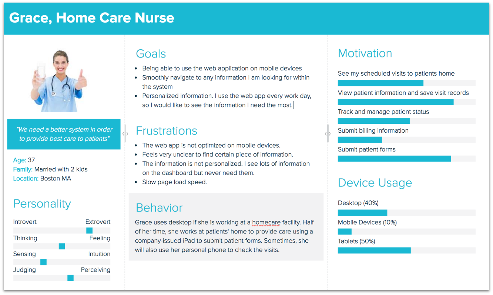
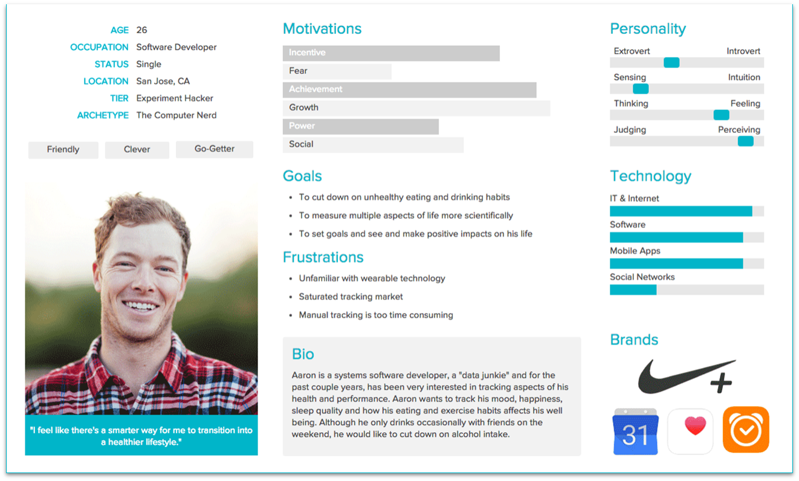

- [Persona](#persona)
  - [Learning Outcomes](#learning-outcomes)
  - [What is a Persona?](#what-is-a-persona)
  - [Brief Overview of a Persona](#brief-overview-of-a-persona)
  - [Creating a Persona](#creating-a-persona)
  - [What Does a Persona Describe?](#what-does-a-persona-describe)
  - [Types of Personas](#types-of-personas)
  - [Examples of Personas](#examples-of-personas)
  - [Tools for Creating Personas](#tools-for-creating-personas)

## Learning Outcomes

After completing this topic, you will be able to:

- Explain what a persona is;
- Identify the objectives and benefits of a persona;
- Create a persona in the context of software development.

## What is a Persona?

In the context of software development and user experience design, a **persona** is a fictional character that represents a specific type of user. **Personas** are created based on research and data about real users and are used to help designers and developers understand their users and their needs, goals, and behaviors.

A **persona** typically includes information about the user's demographics (such as age, gender, and occupation), as well as details about their interests, motivations, and behaviors. A **persona** may also include information about the user's goals, frustrations, and pain points, as well as details about their preferred methods of interacting with the software or application.

**Personas** are used to create empathy and assist designers and developers in making decisions based on user needs and preferences. By understanding the needs and behaviors of different types of users, designers can create interfaces and experiences that are tailored to their target audience, resulting in software that is more engaging, usable, and effective.

## Brief Overview of a Persona

- A sample user, an archetype of a typical end-user, representing a specific user group;
- Created to better understand the client – what motivates them, what irritates them, what do they need?
- Does not replace user research but is based on it!
- Helps keep the end-user's needs in mind during design, e.g., distinguishing essential functionalities from non-essential ones.

## Creating a Persona

To create a persona, a team typically gathers information using research methods such as:

- Surveys;
- Interviews;
- Observations of real users.

This information is then used to create a fictional character that embodies the key characteristics of the target audience.

When creating personas, it is essential to consider the goals of the software or application, as well as the characteristics of the target audience. For example, if the software is intended for medical professionals, personas are likely to include information about their job responsibilities, level of expertise, and preferred methods of interacting with the software. On the other hand, if the software is intended for a younger audience, personas may include information about their technology usage, interests, and social behaviors.

Once personas are created, they can be used throughout the design and development process to make design decisions, assess user needs, and test software usability. By using personas, teams can create software that is more effective, engaging, and user-centric, ultimately leading to greater satisfaction and success for both users and developers.

## What Does a Persona Describe?

- General Information
  - Name;
  - Age and gender;
  - Location;
  - Education and occupation;
  - Family status, etc.
- Picture and Quote
  - A picture speaks more than words – a photo humanizes the persona. Try to find a picture that describes your persona's personality;
  - A quote gives the persona a voice. It should definitely be related to your product/service.
- Personality, Typology
  - Describing the persona's personality helps understand them better;
  - Describe traits relevant to your product/service (e.g., independent vs. needing support; consistent vs. unstable, etc.)
- Goals, Objectives
  - Only motivation related to the given service/product!
  - What do they want to achieve? What is important to them?
  - What might lead them to the service/product? What do they want?
- Pain Points, Concerns
  - Only problems related to the given service/product!
  - What prevents them from achieving their goals? What are their worries and fears?
  - How do they overcome obstacles?

## Types of Personas

- **Proto-persona**: Not based on new research. The goal is to quickly create a sketch or overview of existing assumptions!
- **Qualitative Persona**: Based on small-scale studies (e.g., interviews, observations). The goal is an in-depth understanding of clients!
- **Quantitative Persona**: Based on large-scale studies (e.g., statistics, surveys). The goal is to personify data!

## Examples of Personas

Author: Shannon Cui

Author: Julia Sjöberg

Author: Xtensio

## Tools for Creating Personas

- [UXPressia](https://uxpressia.com/)
- [Hubspot](https://www.hubspot.com/make-my-persona)

- [Persona](#persona)
  - [Öğrenme Çıktıları](#öğrenme-çıktıları)
  - [Persona Nedir?](#persona-nedir)
  - [Bir Persona Hakkında Kısa Genel Bakış](#bir-persona-hakkında-kısa-genel-bakış)
  - [Persona Oluşturma](#persona-oluşturma)
  - [Bir Persona Neyi Tanımlar?](#bir-persona-neyi-tanımlar)
  - [Persona Türleri](#persona-türleri)
  - [Persona Örnekleri](#persona-örnekleri)
  - [Persona Oluşturma Araçları](#persona-oluşturma-araçları)

## Öğrenme Çıktıları

Bu konuyu tamamladıktan sonra şunları yapabileceksiniz:

- Persona nedir, açıklayabileceksiniz;
- Bir personanın hedeflerini ve faydalarını tanımlayabileceksiniz;
- Yazılım geliştirme bağlamında bir persona oluşturabileceksiniz.

## Persona Nedir?

Yazılım geliştirme ve kullanıcı deneyimi tasarımı bağlamında, **persona**, belirli bir kullanıcı türünü temsil eden kurgusal bir karakterdir. **Personalar**, gerçek kullanıcılar hakkında yapılan araştırma ve verilerden oluşturulur ve tasarımcıların ve geliştiricilerin kullanıcılarını, ihtiyaçlarını, hedeflerini ve davranışlarını anlamalarına yardımcı olmak için kullanılır.

Bir **persona**, genellikle kullanıcının demografik bilgilerini (yaş, cinsiyet, meslek gibi) ve ilgi alanları, motivasyonları ve davranışları hakkında bilgileri içerir. Ayrıca, kullanıcının hedefleri, hayal kırıklıkları ve acı noktaları hakkında bilgiler ve yazılım veya uygulama ile etkileşimde bulunma yöntemleri de yer alabilir.

**Personalar**, empati oluşturmak ve tasarımcıların ve geliştiricilerin kullanıcı ihtiyaçlarına ve tercihlerine dayalı kararlar almalarına yardımcı olmak için kullanılır. Farklı kullanıcı türlerinin ihtiyaçlarını ve davranışlarını anlamak, tasarımcıların hedef kitlelerine özel arayüzler ve deneyimler oluşturmasına olanak tanır, bu da yazılımın daha çekici, kullanılabilir ve etkili olmasını sağlar.

## Bir Persona Hakkında Kısa Genel Bakış

- Bir örnek kullanıcı, tipik bir son kullanıcının arketipi, belirli bir kullanıcı grubunu temsil eder;
- Müşteriyi daha iyi anlamak için oluşturulmuştur – onları ne motive eder, onları ne sinirlendirir, neye ihtiyaçları vardır?
- Kullanıcı araştırmasının yerine geçmez, ancak buna dayanır!
- Tasarım sırasında son kullanıcının ihtiyaçlarını göz önünde bulundurmayı sağlar, örneğin gerekli işlevsellikleri gereksiz olanlardan ayırt etmek.

## Persona Oluşturma

Bir persona oluşturmak için, bir ekip genellikle şu araştırma yöntemlerini kullanarak bilgi toplar:

- Anketler;
- Görüşmeler;
- Gerçek kullanıcıların gözlemleri.

Bu bilgiler, hedef kitlenin temel özelliklerini taşıyan kurgusal bir karakter oluşturmak için kullanılır.

Personalar oluştururken, yazılımın veya uygulamanın hedeflerini ve hedef kitlenin özelliklerini göz önünde bulundurmak önemlidir. Örneğin, yazılım tıbbi profesyoneller için tasarlanmışsa, personalar genellikle onların iş sorumlulukları, uzmanlık seviyeleri ve yazılımla etkileşimde bulunma tercihleri hakkında bilgiler içerir. Diğer yandan, yazılım daha genç bir kitleye yönelikse, personalar teknoloji kullanımı, ilgi alanları ve sosyal davranışlar hakkında bilgiler içerebilir.

Personalar oluşturulduktan sonra, tasarım ve geliştirme sürecinde tasarım kararları almak, kullanıcı ihtiyaçlarını değerlendirmek ve yazılım kullanılabilirliğini test etmek için kullanılabilirler. Personalar kullanılarak, takımlar daha etkili, çekici ve kullanıcı odaklı yazılımlar oluşturabilir, bu da hem kullanıcılar hem de geliştiriciler için daha büyük memnuniyet ve başarı sağlar.

## Bir Persona Neyi Tanımlar?

- Genel Bilgiler
  - İsim;
  - Yaş ve cinsiyet;
  - Konum;
  - Eğitim ve meslek;
  - Aile durumu vb.
- Resim ve Alıntı
  - Bir resim kelimelerden daha fazlasını anlatır – bir fotoğraf persona’yı insancıllaştırır. Persona'nın kişiliğini tanımlayan bir fotoğraf bulmaya çalışın;
  - Bir alıntı, persona’ya ses verir. Kesinlikle ürün/hizmetinizle ilgili olmalıdır.
- Kişilik, Tipoloji
  - Persona’nın kişiliğini tanımlamak, onları daha iyi anlamanızı sağlar;
  - Ürün/hizmetinizle ilgili özellikleri tanımlayın (örneğin, bağımsız vs. desteğe ihtiyaç duyan; tutarlı vs. istikrarsız vb.)
- Hedefler, Amaçlar
  - Sadece verilen hizmet/ürünle ilgili motivasyon!
  - Ne başarmak istiyorlar? Onlar için ne önemlidir?
  - Onları hizmete/ürüne yönlendiren nedir? Ne istiyorlar?
- Acı Noktaları, Endişeler
  - Sadece verilen hizmet/ürünle ilgili sorunlar!
  - Hedeflerine ulaşmalarını engelleyen nedir? Endişeleri ve korkuları nedir?
  - Engelleri nasıl aşarlar?

## Persona Türleri

- **Proto-persona**: Yeni araştırmaya dayanmayan, mevcut varsayımların hızlıca bir taslağını oluşturmak için kullanılan tür!
- **Niteliksel Persona**: Küçük ölçekli çalışmalara dayalıdır (örneğin, görüşmeler, gözlemler). Hedef, müşterileri derinlemesine anlamaktır!
- **Niceliksel Persona**: Büyük ölçekli çalışmalara dayalıdır (örneğin, istatistikler, anketler). Hedef, veriyi kişiselleştirmektir!

## Persona Örnekleri

Yazar: Shannon Cui

Yazar: Julia Sjöberg

Yazar: Xtensio

## Persona Oluşturma Araçları

- [UXPressia](https://uxpressia.com/)
- [Hubspot](https://www.hubspot.com/make-my-persona)

