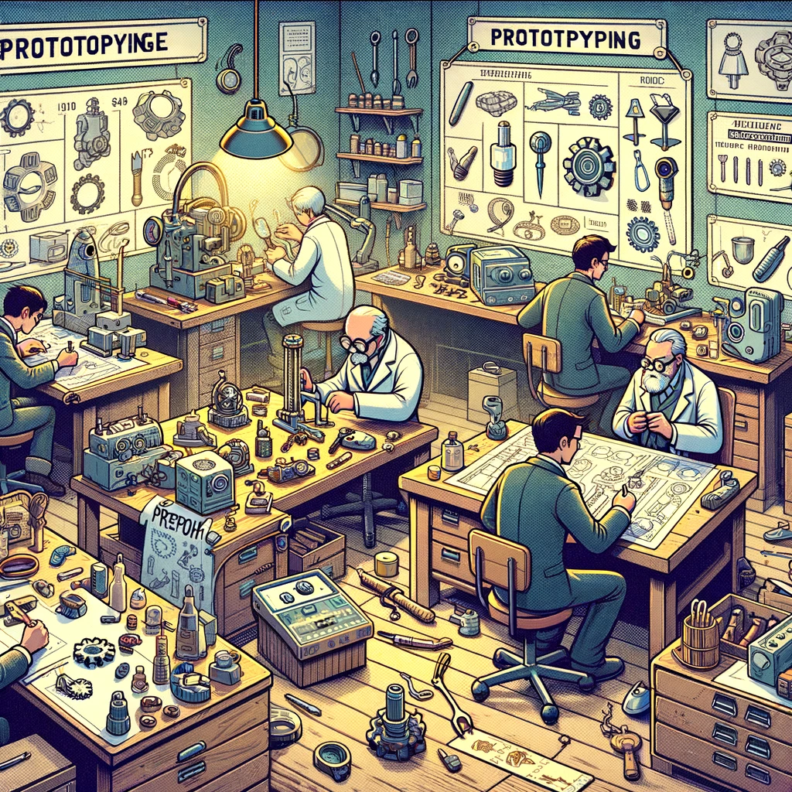
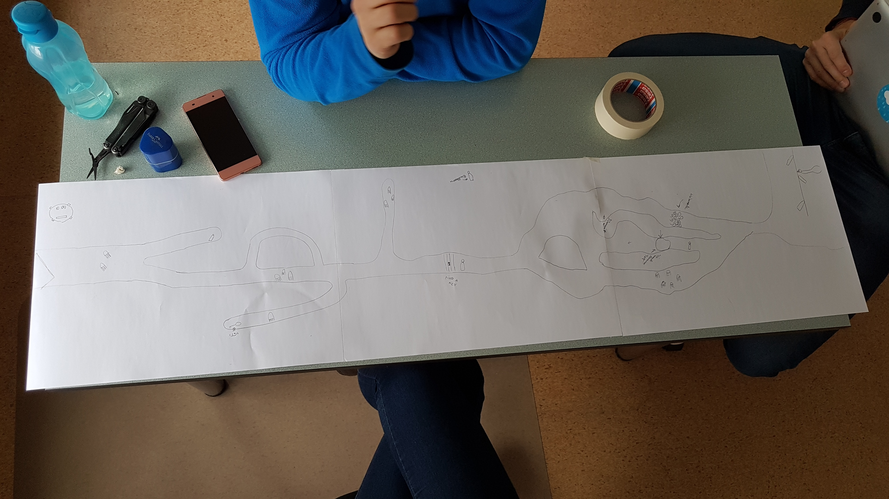
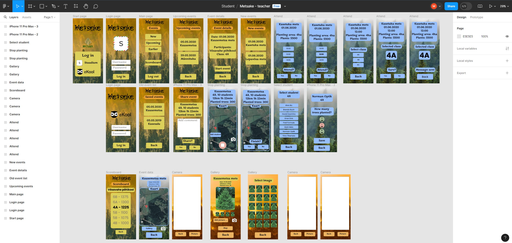

# Prototyping

Prototyping is a technique used in software development to create early working versions of a software product or system. Prototyping involves creating a simplified but functional version of the final product, which can be used to gather feedback, test ideas, and refine requirements before the final version is built.

- [Prototyping](#prototyping)
  - [Learning Outcomes](#learning-outcomes)
  - [General Overview of Prototyping](#general-overview-of-prototyping)
  - [Paper Prototyping](#paper-prototyping)
  - [Paper Prototyping - Advantages](#paper-prototyping---advantages)
  - [Paper Prototyping - Disadvantages](#paper-prototyping---disadvantages)
  - [Digital Prototyping Tools](#digital-prototyping-tools)
  - [Advantages of Digital Prototyping Tools](#advantages-of-digital-prototyping-tools)
  - [Disadvantages of Digital Prototyping Tools](#disadvantages-of-digital-prototyping-tools)

## Learning Outcomes

After completing this material:

- You can explain the benefits of prototyping in software development.
- You can explain the advantages of paper prototyping in software development.
- You can name some digital prototyping tools.

## General Overview of Prototyping

The primary goal of prototyping is to provide a tangible, interactive representation of the final product that can be used to identify potential problems and areas for improvement. By creating a prototype, developers can quickly test and iterate on different design concepts and workflows, gaining a better understanding of how the final product will function and how end users will interact with it.

Prototyping can take many forms, from simple sketches and paper prototypes to advanced digital prototypes created with specialized software tools. The type of prototype used depends on the project's needs, budget, and timeline.

Some benefits of creating prototypes in software development include:

- Better communication and collaboration between team members and stakeholders.
- Early identification of potential problems and areas for improvement.
- Reducing misunderstandings between developers and stakeholders.
- Faster iteration and testing of design concepts and workflows.
- Improved user engagement and satisfaction through early feedback and input.

Overall, prototyping is a valuable technique in software development that helps developers create better, user-centered products that meet the needs of end users.

## Paper Prototyping

Image by Oliver Õunap

Paper prototyping is a low-cost, low-fidelity prototyping technique used in software development to create a quick, simple, and interactive representation of a product or system. It involves using paper, pens, and other basic materials to create a physical model of the user interface or workflow.

To create a paper prototype, developers use sketches, drawings, and other simple materials to represent different screens, menus, and interface elements. These elements can be arranged and rearranged as needed to simulate various user interactions and workflows.

Paper prototypes are a quick and easy way to explore different design concepts and workflows and gather feedback from stakeholders and end users. Since the prototypes are simple and low-fidelity, they can be created and modified quickly without requiring expensive software or special skills.

## Paper Prototyping - Advantages

Some advantages of paper prototyping include:

- **Low cost:** Paper prototyping is a low-cost technique that requires minimal resources, making it accessible to developers and designers of all skill levels and budgets.
- **Fast iteration:** Paper prototypes can be created and modified quickly, allowing developers to test and iterate on different design concepts and workflows in a short amount of time.
- **Improved communication:** Paper prototypes can help developers and stakeholders better understand and communicate complex ideas and workflows and identify potential problems and areas for improvement.
- **Increased user involvement:** Paper prototypes can be used to gather feedback from end users early in the development process, enabling developers to create products that better meet the needs and expectations of their target audience.

## Paper Prototyping - Disadvantages

Some disadvantages of paper prototyping include:

- **Low fidelity:** Paper prototypes are simple and low-fidelity, which may limit their usefulness for more complex design concepts and workflows.
- **Limited functionality:** Paper prototypes may not be able to simulate all interactions and functionalities that may be required in the final product.
- **Limited usability:** Paper prototypes may have limited usability and interactivity, making them less suitable for more complex user interfaces and workflows.
- **Environmental limitations:** Paper prototypes require a physical environment and materials, which can be limiting, especially for remote work and distributed teams.

Overall, paper prototyping is a valuable technique in software development that helps developers and designers create better, user-centered products. By using simple and inexpensive materials to create interactive models of user interfaces and workflows, developers can quickly test and refine different design concepts and gather feedback from stakeholders and end users to ensure that the final product meets user needs and expectations.

## Digital Prototyping Tools

Prototyping tools are an essential class of tools in software development that help developers quickly create and test interactive user interface (UI) designs without the need to code. Prototyping tools allow developers to create realistic simulations of user interfaces and workflows that can be used to gather feedback from stakeholders, test usability, and iterate on designs before writing code.

There are many different prototyping tools available, ranging from simple web-based tools that don’t require installation to more advanced desktop applications with a wide range of features. Some examples of popular prototyping tools include:

- **Sketch:** Sketch is a popular UI design tool that includes built-in prototyping features. Users can create clickable prototypes by linking artboards together and adding transition effects.
  - <https://www.sketch.com/>

- **Adobe XD:** Adobe XD is a UI/UX design tool that includes features for creating and sharing interactive prototypes. Users can create interactive designs with animations, transitions, and other effects.
  - <https://www.adobe.com/products/xd/learn/get-started-xd-prototype.html>

- **InVision:** InVision is a web-based prototyping tool that allows users to create interactive designs with animations, hotspots, and other interactive elements. InVision also includes features for collaborating on designs and gathering feedback from stakeholders.
  - <https://www.invisionapp.com/>

- **Figma:** Figma is a web-based UI design and prototyping tool that allows users to create and share interactive designs with animations, transitions, and other effects. Figma also includes features for real-time collaboration and version control.
  - <https://www.figma.com/>

- **Axure RP:** Axure RP is a desktop application that allows users to create interactive wireframes, prototypes, and specifications for web and mobile applications. Axure RP includes advanced features for designing complex interactions and workflows.
  - <https://www.axure.com/>

- Many other web-based and desktop applications allow users to create interactive or non-interactive prototypes and designs.

## Advantages of Digital Prototyping Tools

Some advantages of digital prototyping tools include:

- **Interactivity:** Digital prototypes allow users to create interactive designs that simulate real-world user experiences and interactions.
- **Animations and transitions:** Digital prototypes allow users to add animations, transitions, and other effects to better visualize design concepts and workflows.
- **Collaboration and sharing:** Digital prototypes enable users to collaborate on and share designs and prototypes with team members and stakeholders in real-time.
- **Feedback and iteration:** Digital prototypes allow users to gather feedback and input from stakeholders and end users and quickly iterate and adjust design concepts based on the feedback received.
- **Reusability:** Digital prototypes allow users to reuse design elements and interactions, which can save time and resources during the design process.
- **Support for design systems:** Some digital prototyping tools support design systems and component libraries, enabling users to create reusable and consistent designs.
- **Code export for developers:** Some digital prototyping tools allow users to export design elements and interactions for developers to write code and create the final product.

## Disadvantages of Digital Prototyping Tools

Some disadvantages of digital prototyping tools include:

- **High cost:** Some digital prototyping tools can be expensive, especially when using advanced features and collaboration functions.
- **Learning curve:** Some digital prototyping tools may require time and effort to learn and use, especially for beginner users.
- **Time-consuming:** Digital prototypes can be time-consuming to create and adjust, especially for more complex design concepts and workflows.

Prototyping tools can be a valuable addition to the software development toolkit, especially in the early stages of a project when user interface designs are still being refined. By creating interactive prototypes, developers can quickly test and iterate on design concepts, gather feedback from stakeholders, and ensure that the final product meets user needs and expectations.

# Prototipleme

Prototipleme, yazılım geliştirmede bir yazılım ürünü veya sisteminin erken çalışma versiyonlarını oluşturmak için kullanılan bir tekniktir. Prototipleme, nihai ürünün sadeleştirilmiş ancak işlevsel bir versiyonunun oluşturulmasını içerir; bu versiyon, geri bildirim toplamak, fikirleri test etmek ve gereksinimleri nihai versiyon yapılmadan önce iyileştirmek için kullanılabilir.

- [Prototipleme](#prototipleme)
  - [Öğrenme Çıktıları](#öğrenme-çıktıları)
  - [Prototipleme Genel Bakış](#prototipleme-genel-bakış)
  - [Kağıt Prototipleme](#kağıt-prototipleme)
  - [Kağıt Prototipleme - Avantajlar](#kağıt-prototipleme---avantajlar)
  - [Kağıt Prototipleme - Dezavantajlar](#kağıt-prototipleme---dezavantajlar)
  - [Dijital Prototipleme Araçları](#dijital-prototipleme-araçları)
  - [Dijital Prototipleme Araçlarının Avantajları](#dijital-prototipleme-araçlarının-avantajları)
  - [Dijital Prototipleme Araçlarının Dezavantajları](#dijital-prototipleme-araçlarının-dezavantajları)

## Öğrenme Çıktıları

Bu materyali tamamladıktan sonra:

- Yazılım geliştirmede prototiplemenin faydalarını açıklayabilirsiniz.
- Yazılım geliştirmede kağıt prototiplemenin avantajlarını açıklayabilirsiniz.
- Bazı dijital prototipleme araçlarını adlandırabilirsiniz.

## Prototipleme Genel Bakış

Prototiplemenin birincil amacı, nihai ürünün somut, etkileşimli bir temsilini sağlamaktır; bu, potansiyel sorunları ve iyileştirme alanlarını tespit etmek için kullanılabilir. Bir prototip oluşturarak, geliştiriciler farklı tasarım konseptlerini ve iş akışlarını hızlıca test edebilir ve yineleyebilir, nihai ürünün nasıl çalışacağı ve son kullanıcıların nasıl etkileşimde bulunacağı konusunda daha iyi bir anlayış elde edebilirler.

Prototipleme, basit çizimler ve kağıt prototiplerden, özel yazılım araçlarıyla oluşturulmuş gelişmiş dijital prototiplere kadar birçok farklı biçimde olabilir. Kullanılacak prototip türü, projenin ihtiyaçlarına, bütçesine ve zaman çizelgesine bağlıdır.

Yazılım geliştirmede prototip oluşturmanın bazı faydaları şunlardır:

- Takım üyeleri ve paydaşlar arasında daha iyi iletişim ve işbirliği.
- Potansiyel sorunların ve iyileştirilmesi gereken alanların erken tespiti.
- Geliştiriciler ve paydaşlar arasında yanlış anlamaların azaltılması.
- Tasarım konseptlerinin ve iş akışlarının daha hızlı yinelemesi ve test edilmesi.
- Erken geri bildirim ve katılım yoluyla daha iyi kullanıcı etkileşimi ve memnuniyeti.

Genel olarak, prototipleme, geliştiricilerin son kullanıcıların ihtiyaçlarına uygun, daha iyi, kullanıcı merkezli ürünler yaratmalarına yardımcı olan değerli bir tekniktir.

## Kağıt Prototipleme

Görsel: Oliver Õunap

Kağıt prototipleme, yazılım geliştirmede bir ürün veya sistemin hızlı, basit ve etkileşimli bir temsilini oluşturmak için kullanılan düşük maliyetli, düşük çözünürlüklü bir prototipleme tekniğidir. Bu, kullanıcı arayüzü veya iş akışının fiziksel bir modelini oluşturmak için kağıt, kalem ve diğer temel malzemelerin kullanılmasını içerir.

Bir kağıt prototipi oluşturmak için geliştiriciler, farklı ekranları, menüleri ve arayüz öğelerini temsil etmek için çizimler, resimler ve diğer basit malzemeler kullanır. Bu öğeler, kullanıcı etkileşimlerini ve iş akışlarını simüle etmek için gerektiğinde düzenlenip yeniden düzenlenebilir.

Kağıt prototipleri, farklı tasarım konseptlerini ve iş akışlarını keşfetmek ve paydaşlardan ve son kullanıcılardan geri bildirim toplamak için hızlı ve kolay bir yol sağlar. Prototipler basit ve düşük çözünürlüklü olduğundan, pahalı yazılımlar veya özel beceriler gerektirmeden hızla oluşturulup değiştirilebilir.

## Kağıt Prototipleme - Avantajlar

Kağıt prototiplemenin bazı avantajları şunlardır:

- **Düşük maliyet:** Kağıt prototipleme, minimal kaynak gerektiren düşük maliyetli bir tekniktir, bu da onu her beceri seviyesindeki geliştiriciler ve tasarımcılar için erişilebilir kılar.
- **Hızlı yineleme:** Kağıt prototipleri hızlı bir şekilde oluşturulup değiştirilebilir, bu da geliştiricilerin farklı tasarım konseptlerini ve iş akışlarını kısa süre içinde test etmelerini ve yinelemelerini sağlar.
- **İyileştirilmiş iletişim:** Kağıt prototipleri, geliştiricilerin ve paydaşların karmaşık fikirleri ve iş akışlarını daha iyi anlamalarına ve iletmelerine yardımcı olabilir, ayrıca potansiyel sorunları ve geliştirilmesi gereken alanları tespit edebilirler.
- **Artan kullanıcı katılımı:** Kağıt prototipleri, geliştiricilerin hedef kitlelerinin ihtiyaçlarına ve beklentilerine daha uygun ürünler oluşturmasına olanak tanıyan erken geri bildirim toplamak için kullanılabilir.

## Kağıt Prototipleme - Dezavantajlar

Kağıt prototiplemenin bazı dezavantajları şunlardır:

- **Düşük çözünürlük:** Kağıt prototipleri basit ve düşük çözünürlüklü olduğundan, daha karmaşık tasarım konseptleri ve iş akışları için faydalı olmama ihtimali vardır.
- **Sınırlı işlevsellik:** Kağıt prototipleri, nihai üründe gereken tüm etkileşimleri ve işlevsellikleri simüle edemeyebilir.
- **Sınırlı kullanılabilirlik:** Kağıt prototipleri sınırlı kullanılabilirliğe ve etkileşime sahip olabilir, bu da daha karmaşık kullanıcı arayüzleri ve iş akışları için onları daha az uygun hale getirebilir.
- **Çevresel sınırlamalar:** Kağıt prototipleri, fiziksel bir ortam ve malzeme gerektirir, bu da özellikle uzaktan çalışma ve dağıtık ekipler için sınırlayıcı olabilir.

Genel olarak, kağıt prototipleme, geliştiricilerin ve tasarımcıların daha iyi, kullanıcı merkezli ürünler yaratmalarına yardımcı olan değerli bir tekniktir. Kullanıcı arayüzlerinin ve iş akışlarının etkileşimli modellerini oluşturmak için basit ve ucuz malzemeler kullanarak, geliştiriciler farklı tasarım konseptlerini hızla test edebilir ve paydaşlardan ve son kullanıcılardan geri bildirim toplayabilirler.

## Dijital Prototipleme Araçları

Prototipleme araçları, yazılım geliştirmede geliştiricilerin etkileşimli kullanıcı arayüzü (UI) tasarımlarını hızlıca oluşturup test etmelerini sağlayan temel araçlardır. Prototipleme araçları, kullanıcı arayüzleri ve iş akışlarının gerçekçi simülasyonlarını oluşturmalarına ve paydaşlardan geri bildirim toplamak, kullanılabilirliği test etmek ve tasarımları yinelemek için kullanılmasına olanak tanır.

Birçok farklı prototipleme aracı mevcuttur, kurulum gerektirmeyen basit web tabanlı araçlardan, çok çeşitli özelliklere sahip gelişmiş masaüstü uygulamalarına kadar. Popüler prototipleme araçlarından bazıları şunlardır:

- **Sketch:** Sketch, yerleşik prototipleme özelliklerine sahip popüler bir UI tasarım aracıdır. Kullanıcılar, artboard'ları birbirine bağlayarak ve geçiş efektleri ekleyerek tıklanabilir prototipler oluşturabilirler.
  - <https://www.sketch.com/>

- **Adobe XD:** Adobe XD, etkileşimli prototipler oluşturmak ve paylaşmak için özellikler içeren bir UI/UX tasarım aracıdır. Kullanıcılar animasyonlar, geçişler ve diğer efektlerle etkileşimli tasarımlar oluşturabilirler.
  - <https://www.adobe.com/products/xd/learn/get-started-xd-prototype.html>

- **InVision:** InVision, kullanıcıların animasyonlar, hotspotlar ve diğer etkileşimli öğelerle etkileşimli tasarımlar oluşturmasına olanak tanıyan web tabanlı bir prototipleme aracıdır. Ayrıca, tasarımlar üzerinde işbirliği yapmayı ve paydaşlardan geri bildirim toplamayı sağlar.
  - <https://www.invisionapp.com/>

- **Figma:** Figma, kullanıcıların animasyonlar, geçişler ve diğer efektlerle etkileşimli tasarımlar oluşturmasına ve paylaşmasına olanak tanıyan web tabanlı bir UI tasarım ve prototipleme aracıdır. Figma, gerçek zamanlı işbirliği ve sürüm kontrolü özellikleri de sunar.
  - <https://www.figma.com/>

- **Axure RP:** Axure RP, kullanıcıların web ve mobil uygulamalar için etkileşimli kabataslak tasarımlar, prototipler ve spesifikasyonlar oluşturmasına olanak tanır. Axure RP, karmaşık etkileşimler ve iş akışları tasarlamak için gelişmiş özellikler sunar.
  - <https://www.axure.com/>

- Diğer birçok web tabanlı ve masaüstü uygulama, etkileşimli veya etkileşimsiz prototipler ve tasarımlar oluşturmanıza olanak tanır.

## Dijital Prototipleme Araçlarının Avantajları

Dijital prototipleme araçlarının bazı avantajları şunlardır:

- **Etkileşim:** Dijital prototipler, kullanıcıların gerçek dünyadaki kullanıcı deneyimlerini ve etkileşimlerini simüle eden etkileşimli tasarımlar oluşturmasına olanak tanır.
- **Animasyonlar ve geçişler:** Dijital prototipler, tasarım konseptlerini ve iş akışlarını daha iyi görselleştirmek için animasyonlar, geçişler ve diğer efektleri eklemeye olanak tanır.
- **İşbirliği ve paylaşım:** Dijital prototipler, kullanıcıların tasarımlarını ve prototiplerini takım üyeleri ve paydaşlarla gerçek zamanlı olarak işbirliği yaparak paylaşmalarını sağlar.
- **Geri bildirim ve yineleme:** Dijital prototipler, paydaşlardan ve son kullanıcılardan geri bildirim toplar ve alınan geri bildirimlere göre tasarım konseptlerini hızla yineleyip ayarlamayı mümkün kılar.
- **Yeniden kullanılabilirlik:** Dijital prototipler, tasarım öğelerini ve etkileşimlerini yeniden kullanmanıza olanak tanır, bu da tasarım sürecinde zaman ve kaynak tasarrufu sağlar.
- **Tasarım sistemleri desteği:** Bazı dijital prototipleme araçları, kullanıcıların yeniden kullanılabilir ve tutarlı tasarımlar oluşturmasına olanak tanıyan tasarım sistemleri ve bileşen kitaplıkları destekler.
- **Geliştiriciler için kod dışa aktarımı:** Bazı dijital prototipleme araçları, tasarım öğelerini ve etkileşimlerini geliştiricilere dışa aktararak nihai ürünün oluşturulmasına yardımcı olur.

## Dijital Prototipleme Araçlarının Dezavantajları

Dijital prototipleme araçlarının bazı dezavantajları şunlardır:

- **Yüksek maliyet:** Bazı dijital prototipleme araçları, özellikle gelişmiş özellikler ve işbirliği fonksiyonları kullanıldığında pahalı olabilir.
- **Öğrenme eğrisi:** Bazı dijital prototipleme araçları, özellikle başlangıç seviyesindeki kullanıcılar için öğrenmek ve kullanmak için zaman ve çaba gerektirebilir.
- **Zaman alıcı:** Dijital prototipler, özellikle daha karmaşık tasarım konseptleri ve iş akışları için oluşturulup ayarlandığında zaman alıcı olabilir.

Prototipleme araçları, yazılım geliştirme araç setine değerli bir ekleme olabilir, özellikle bir proje başlatıldığında kullanıcı arayüzü tasarımları henüz şekillendirilirken. Etkileşimli prototipler oluşturarak, geliştiriciler tasarım konseptlerini hızla test ed
