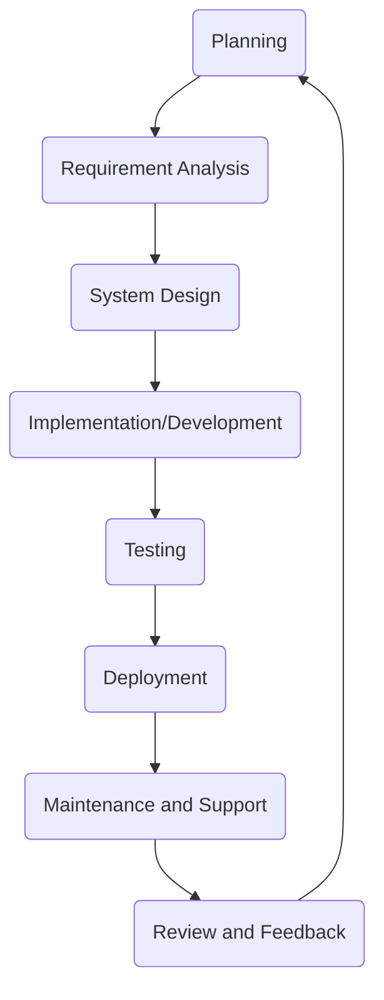

# Software Development Life Cycle (SDLC):

- [Software Development Life Cycle (SDLC):](#software-development-life-cycle-sdlc)
  - [Learning Outcomes:](#learning-outcomes)
  - [Typical SDLC Phases:](#typical-sdlc-phases)
  - [Importance of SDLC:](#importance-of-sdlc)
  - [Common SDLC Models:](#common-sdlc-models)
    - [**Waterfall Model:**](#waterfall-model)
    - [**Lean**](#lean)
    - [**Spiral Model:**](#spiral-model)
    - [**Agile Model:**](#agile-model)
    - [**Feature-Driven Development (FDD)**](#feature-driven-development-fdd)
    - [**Extreme Programming (XP)**](#extreme-programming-xp)
    - [**Kanban:**](#kanban)
    - [**Scrum:**](#scrum)
  - [Excercises and Assignments](#excercises-and-assignments)

## Learning Outcomes:

After completing this topic, you'll be able to:

- understand the Software Development Life Cycle (SDLC);
- identify the different phases of the SDLC;
- describe the importance of SDLC;
- identify the common SDLC models.
- apply SDLC principles to software development.

The Software Development Life Cycle (SDLC) is a systematic process for planning, creating, testing, deploying, and maintaining software. It defines the stages and tasks involved in producing software from inception to retirement.

## Typical SDLC Phases:

The Software Development Life Cycle (SDLC) is a structured process that defines the phases or steps involved in producing software. While there are different models or frameworks for SDLC, many share common phases. Here's an overview of the typical steps involved:

1. **Planning:**
   - Determine the scope of the project.
   - Identify potential risks, constraints, and resources.
   - Develop a project plan, including timelines, milestones, and budget estimates.
   - User research to understand user needs and expectations.
2. **Requirement Analysis:**
   - Gather and document the needs and specifications from stakeholders (*end-users, clients, etc.*).
   - Analyze the feasibility of requirements.
   - Prioritize and finalize the list of requirements.
3. **System Design:**
   - Translate requirements into system specifications.
   - Design the system architecture and framework.
   - Create high-level and detailed design documents.
   - Select appropriate technologies, platforms, and tools.
4. **Implementation/Development:**
   - Write the actual code for the software.
   - Translate design documentation into functional software.
   - Integrate various components and ensure they work together.
5. **Testing:**
   - Verify that the software meets the requirements.
   - Identify and fix bugs, errors, and inconsistencies.
   - Use various testing methods like unit testing, integration testing, system testing, acceptance testing, etc.
   - Validate the software's functionality, performance, security, and usability.
6. **Deployment:**
   - Prepare the environment for the software's launch.
   - Install and configure the software in the production environment.
   - Provide necessary training to end-users if required.
   - Monitor the software's performance and ensure smooth operation.
7. **Maintenance and Support:**
   - Address any issues or bugs that arise post-deployment.
   - Provide updates, patches, or enhancements based on user feedback.
   - Ensure the software remains operational, efficient, and relevant over time.
   - Address any security vulnerabilities or compatibility issues that may arise.
8. **Review and Feedback:**
   - Gather feedback from stakeholders and end-users.
   - Analyze the software's performance and identify areas for improvement.
   - Plan for the next iteration or version of the software.

Each of these phases can be iterative, especially in agile or spiral models, where the software is developed in cycles or iterations. The exact steps and their sequence can vary based on the SDLC model chosen, organizational processes, and the nature of the project. However, the aim remains consistent: to produce high-quality software that aligns with user needs and expectations in an organized and efficient manner.

## Importance of SDLC:

- **Structured Process:** SDLC offers a structured approach to software development, ensuring that critical steps are not missed.
- **Quality Assurance:** Each phase of the SDLC has specific deliverables and review processes, leading to better software quality.
- **Risk Management:** Early identification of issues or risks allows for timely mitigation.
- **Project Management:** SDLC offers a clear framework for project managers to track progress, allocate resources, and adhere to budgets.
- **Stakeholder Communication:** By defining clear phases and deliverables, stakeholders are kept in the loop regarding progress and expected outcomes.
- **Efficiency and Cost-effectiveness:** By systematically addressing the software development process, wastage is minimized, and efficiency is improved.
- **Documentation:** Proper documentation is an integral part of the SDLC, ensuring that knowledge is preserved and system details are well understood.

## Common SDLC Models:

### **Waterfall Model:**

- **Description:** A linear and sequential approach where each phase must be completed before the next one starts. It's the earliest SDLC approach.
- **Pros:** Clear structure, simple to understand, well-defined stages.
- **Cons:** Difficult to make changes after the phase is complete, not suitable for complex projects.

### **Lean**

- **Description:** Originating from manufacturing, it focuses on resource optimization and customer value delivery. It aims to cut out any "waste" from the process.
- **Pros:** Efficient resource utilization, focuses on delivering value.
- **Cons:** May overlook necessary tasks as "waste," requires a deep understanding to implement correctly.

### **Spiral Model:**

- **Description:** Combines the design phase of the Waterfall model with the iterative philosophy of prototyping. Focuses on risk assessment at every spiral.
- **Pros:** Focus on risk management, flexibility in design and requirements.
- **Cons:** Can be expensive, requires risk assessment expertise.

### **Agile Model:**

- **Description:** An iterative approach to software delivery that builds software incrementally, with a focus on customer feedback and rapid iterations.
- **Pros:** Flexible, promotes iterative feedback, encourages customer involvement.
- **Cons:** Less predictability, can be hard to grasp for those used to traditional methods.

### **Feature-Driven Development (FDD)**

- **Description:** An iterative and incremental software development process driven by feature lists.
- **Pros:** Focus on building and delivering tangible, client-valued functions.
- **Cons:** Not as flexible as other Agile methodologies, requires detailed documentation.

### **Extreme Programming (XP)**

- **Description:** An Agile framework that emphasizes customer satisfaction, with frequent "releases" in short development cycles aimed at improving productivity and introducing checkpoints.
- **Pros:** Emphasizes code quality, encourages customer involvement.
- **Cons:** Requires extensive customer involvement, can be intense for developers.

### **Kanban:**

- **Description:** A visual approach to process management, taking cues from lean manufacturing and emphasizing just-in-time delivery.
- **Pros:** Flexibility, continuous delivery, visual nature helps in identifying bottlenecks.
- **Cons:** Less structured, can lead to scope creep if not managed correctly.

### **Scrum:**

- **Description:** A type of Agile methodology that organizes work into cycles known as "Sprints," typically lasting 2-4 weeks.
- **Pros:** Regular product deliveries, high visibility, adaptability.
- **Cons:** Requires experienced team members, scope can sometimes be too flexible.

In conclusion, the choice of SDLC framework often depends on the nature of the project, organizational preferences, team size, project scope, and other factors. The ultimate aim is to produce high-quality software that meets user expectations while maintaining a time and budgetary framework.

## Excercises and Assignments

