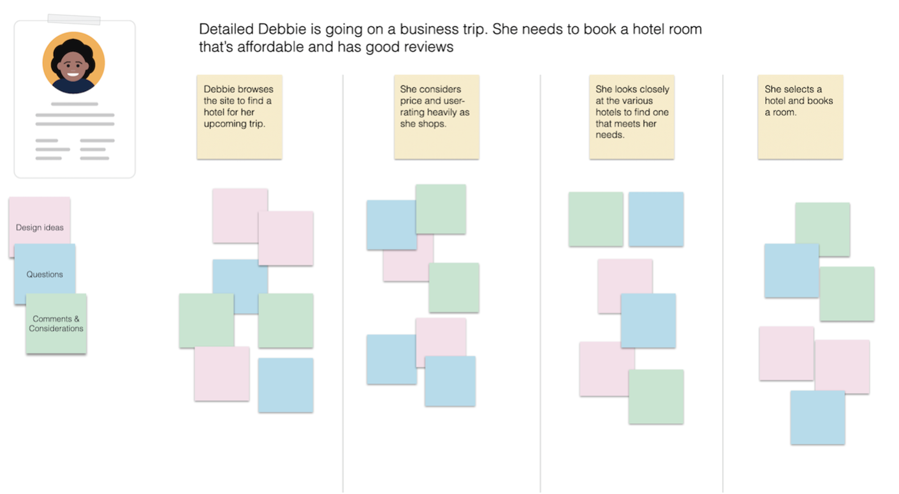

# Scenario

- [Scenario](#scenario)
  - [Learning Outcomes](#learning-outcomes)
  - [What is a Scenario in the Context of Software Development](#what-is-a-scenario-in-the-context-of-software-development)
  - [What Does a Scenario Include?](#what-does-a-scenario-include)
  - [Sample Scenario](#sample-scenario)
  - [Creating a Scenario](#creating-a-scenario)
  - [Scenario Summary](#scenario-summary)

## Learning Outcomes

After completing this topic, you will be able to:

- Explain what a scenario is;
- Identify the objectives and benefits of a scenario;
- Create a scenario in the context of software development;
- Apply scenarios in the software development process.

## What is a Scenario in the Context of Software Development

Sample scenario workshop (Nielsen Norman Group, 2021)

In software development, a scenario refers to a specific use case or situation that a user may encounter while interacting with the software. Scenarios are used to describe how a user interacts with the software and the steps they need to take to accomplish a particular task or goal.

Scenarios are often created during the requirements gathering phase of software development and are used to define both functional and non-functional requirements of the software. They can be used to capture user stories, develop use cases, and other types of requirements documentation.

## What Does a Scenario Include?

A typical scenario may include a description of the user, their goals or the steps they need to take to achieve those goals, and any relevant information about the software or environment in which it is used. For example, a scenario for an e-commerce website may describe a user who wants to purchase a product, including the steps they need to take to find the product, add it to their cart, and complete the checkout process.

Scenarios are important because they help ensure that the software meets the user's needs and can be effectively used in real-life situations. By creating scenarios, software developers and designers can better understand user goals, preferences, and behaviors, which can aid in the design and development of the software. They can also be used to test the usability and functionality of the software, helping to identify and address any issues before the software is released to users.

## Sample Scenario

| Actor | Tiina.. |
| --- | --- |
| Motivation | ..wants to learn how to create a website for her business |
| Goal | She wants to find a course that is affordable, aimed at beginners, and scheduled at convenient dates |
| Action | Tiina selects the IT category from the list of courses, sorts the courses by price and date, and reviews their content |
| Outcome | She finds a suitable course from the list and registers as a participant |

## Creating a Scenario

- Avoid excessive detailing of technology or design – the purpose of the scenario is to inspire design, not to fixate it!
- Do not describe the persona and their goals in excessive detail, focus only on the essentials!

## Scenario Summary

- Persona-based description of using the product/service;
- Does not focus on business or technological nuances or design, but describes the user experience!
- Includes:
  - Actor;
  - Motivation;
  - Goal or intention;
  - Action;
  - Outcome or resolution.

Created or validated together with real users similar to the persona (participatory design)!

