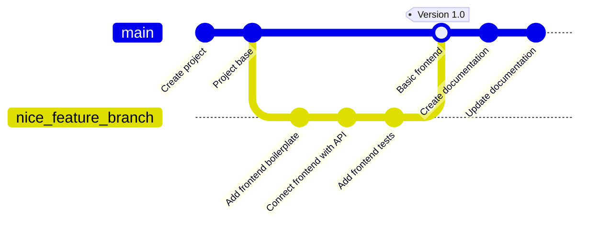

# Version Control

- [Version Control](#version-control)
  - [Learning Outcomes](#learning-outcomes)
  - [What is Version Control?](#what-is-version-control)
  - [Why is Version Control Important?](#why-is-version-control-important)
  - [Brief History of Version Control](#brief-history-of-version-control)
  - [Centralized vs. Distributed version control systems](#centralized-vs-distributed-version-control-systems)
    - [Centralized Version Control Systems (CVCS):](#centralized-version-control-systems-cvcs)
    - [Distributed Version Control Systems (DVCS):](#distributed-version-control-systems-dvcs)
    - [Comparison:](#comparison)
  - [Exercises and Assignments](#exercises-and-assignments)

## Learning Outcomes

After completing this topic, you'll be able to:

- describe what version control is and why it's important;
- describe different types of version control systems;
- compare and contrast centralized and distributed version control systems;

## What is Version Control?

Writing alone in a document and making changes might not necessitate tracking when and what changes were made. However, working with others who make changes to the same document can become crucial. Especially if the document is passed back and forth and could be modified by many different people. How do we know **what the latest version is?** How do we know **who made the last change?** How do we know **what was changed?** Applications often consist of many files, and changes to the code can be very complex. Keeping an overview of changes and history in those files is crucial for ensuring the software's quality and stability.

Searching the internet for version control often finds a similar image that visualizes the history and changes of code:

**Version Control**, also known as **Source Code Management** (*SCM*), is a system that tracks and manages changes to files, directories, and codebases over time. It allows multiple people to work on a single project without conflicting with one another and maintains a history of every modification.

Nowadays, version control is an essential part of the software development process. It is used by developers to collaborate on projects, track changes, and maintain a history of their work. It is also used by companies to manage their codebases and ensure that changes are made in a controlled and secure manner.

## Why is Version Control Important?

Version control is important for a number of reasons:

- **History & Audit Trail**: Version control provides a detailed history of changes made to the code. This helps in understanding how the code has evolved over time, identifying when a particular change was made, and by whom.
- **Collaboration**: Multiple developers can work on the same project simultaneously without stepping on each other's toes. Different developers can work on separate features or bug fixes and then merge their changes back into the main codebase without conflict.
- **Reversion**: Mistakes happen. With version control, if a new change causes a bug or issue, developers can easily revert to a previous state of the code, effectively "rolling back" the problematic change.
- **Branching & Merging**: Developers can create branches to work on new features, bug fixes, or experiments without affecting the main or stable version of the software. Once ready, these changes can be merged back into the main branch.
- **Backup**: While not a replacement for a proper backup system, version control systems can act as an additional layer of backup. If something happens to a developer's local machine, the code can be easily retrieved from the version control repository.
- **Documentation**: Commit messages in version control provide a chronological documentation trail. They can give context about why certain decisions were made at specific points in time.
- **Code Review**: Version control systems, especially when combined with platforms like *GitHub* or *GitLab*, facilitate code reviews by allowing other developers to review, comment on, and suggest modifications to the code before it's merged.
- **Release Management**: Version control helps in managing releases and patches. Developers can tag certain points in their code history as specific versions of the product. This makes it easier to track updates and patches.
- **Accountability**: With a proper log of who made what changes and when, there's a clear record of accountability. This is especially useful in team settings to understand contributions and to ensure that code changes can be tracked to specific individuals.
- **Parallel Development**: Version control systems allow for the possibility of parallel development, where multiple versions of a software application can be developed concurrently.

In summary, version control is a cornerstone of modern software development practices. It ensures smoother collaboration, provides safety nets for mistakes, and maintains a clear and auditable record of how a software project evolves over time. Whether you are a solo developer or part of a large team, using version control is essential today.

## Brief History of Version Control

Version control has evolved over the years from simple manual methods to sophisticated distributed systems. Here's a brief overview of its history:

1. **Manual Version Control (Pre-1970s)**:
   - Before proper version control systems (VCS), developers would make copies of their code and store them in separate directories, often labeling them with dates or version numbers.
   - As one can imagine, this method was error-prone, lacked scalability, and made collaboration challenging.

2. **Centralized Version Control Systems (CVCS, 1970s-1990s)**:
   - The main idea behind CVCS is having a single central repository where all changes are tracked.
   - **RCS (Revision Control System)**: Introduced in the late 1970s, RCS was one of the first tools to manage and track revisions for individual files. It used a simple mechanism of storing the latest version and differences between versions.
   - **SCCS (Source Code Control System)**: Another early system, parallel in time to RCS, but had some different features.
   - **CVS (Concurrent Versions System)**: Emerging in the 1980s, CVS was an improvement over RCS and allowed multiple developers to work on a project simultaneously.
   - **Perforce**: Proprietary software that became popular with many large organizations in the 1990s.
   - **Subversion (SVN)**: Introduced in 2000 as an improvement over CVS, offering better branch management, atomic commits, and a more consistent data model.

3. **Distributed Version Control Systems (DVCS, 2000s-Present)**:
   - In DVCS, every developer has their own local copy of the entire repository, not just the working files. This facilitates more flexible workflows.
   - **BitKeeper**: In the early 2000s, BitKeeper was one of the first DVCS. It was proprietary, but it was used by the Linux kernel developers for a time.
   - **Git**: Created by Linus Torvalds in 2005, Git was developed out of the need for a free, open-source DVCS after the relationship between the Linux development community and BitKeeper broke down. Git emphasizes speed, data integrity, and support for distributed, non-linear workflows.
   - **Mercurial**: Also emerging in 2005, Mercurial was another response to the need for an open-source DVCS. It's often praised for its simplicity and ease of use.
   - **Bazaar**: Developed by Canonical, it had a flexible architecture that allowed both centralized and distributed version control.
   - **Fossil**: Not only a DVCS but also integrated bug tracking and a wiki, wrapped up in a single cohesive package.

4. **Modern Era (2010s-Present)**:
   - Platforms like **GitHub, GitLab, and Bitbucket** have enhanced the collaborative aspects of version control, introducing features like Pull Requests, Code Reviews, Continuous Integration, and social coding.
   - The rise of these platforms has made Git the dominant version control system, given its integration and central role in these platforms.

While this is a concise overview, the history of version control is a testament to the ongoing efforts of the software community to optimize collaborative development, ensure data integrity, and streamline workflows.

## Centralized vs. Distributed version control systems

Next, let's delve into an overview and comparison of Centralized and Distributed Version Control Systems (VCS):

### Centralized Version Control Systems (CVCS):

**Overview**:
1. **Single Repository**: In CVCS, there's a single, centralized repository on a server. Developers get the latest version from this central repository and commit changes back to it.
2. **Working Copy**: Developers only get the latest snapshot (or working copy) of the codebase, not the entire version history.
3. **Central Authority**: All operations like branching and merging are done centrally on the repository.
4. **Examples**: Subversion (SVN), Concurrent Versions System (CVS), Perforce.

**Advantages**:
1. **Administrative Control**: Easier to enforce access controls and permissions.
2. **Linear History**: Maintaining a linear history of changes is straightforward.
3. **Easier Setup**: Generally simpler to set up and configure than DVCS.
4. **Central Backup**: The central server can be backed up to prevent data loss.

**Disadvantages**:
1. **Single Point of Failure**: If the central server crashes and there are no backups, code history can be lost.
2. **Network Dependency**: Most operations, like committing changes, require a connection to the central repository, potentially slowing down workflows.
3. **Merge Conflicts**: As everyone commits to the central repository, the likelihood of merge conflicts can be higher, especially in large teams.

### Distributed Version Control Systems (DVCS):

**Overview**:
1. **Multiple Repositories**: Every developer has their own local repository containing the entire codebase and its full history.
2. **Full Version History**: Developers clone the entire repository, not just the latest snapshot.
3. **Peer-to-Peer**: Merging and branching can be done locally. Commits are made to the local repository and then synchronized (pushed) to a central or remote repository.
4. **Examples**: Git, Mercurial, Bazaar, Fossil.

**Advantages**:
1. **Fast Operations**: Since most operations (commit, branch, merge) are local, they are faster and don't rely on a network connection.
2. **Backup Redundancy**: Every clone of the repository acts as a full backup, reducing the risk of data loss.
3. **Flexible Workflows**: Developers can commit changes locally, enabling more flexible workflows and frequent commits without disturbing the main codebase.
4. **Branch Management**: Branching and merging are typically more advanced and easier to handle in DVCS.
5. **Encourages Collaboration**: Features like forks and pull requests (especially on platforms like GitHub and GitLab) promote collaborative coding.

**Disadvantages**:
1. **Complexity**: The flexibility and power of DVCS can also introduce complexity, especially for those new to the concept.
2. **Large Repositories**: Storing the entire version history can be problematic if the repository is very large.

### Comparison:

| Feature/Aspect           | Centralized Version Control (CVCS) | Distributed Version Control (DVCS) |
|--------------------------|------------------------------------|------------------------------------|
| **Repository Structure** | Single central repository          | Every developer has a full-fledged local repository |
| **Network Dependency**   | Required for most operations       | Most operations can be done offline |
| **Data Redundancy**      | Centralized backup                 | Every clone is a complete backup   |
| **Learning Curve**       | Generally simpler                  | Can be more complex due to added capabilities |
| **Scalability**          | Better suited for smaller teams    | Suited for large projects and teams |
| **Version History**      | Latest snapshot on local machine   | Full version history on local machine |
| **Performance**          | Slower due to network dependency   | Faster for most operations as they are local |
| **Backup & Recovery**    | Single point of failure            | Redundancy reduces risk of data loss |
| **Collaboration**        | Linear, centralized collaboration  | Flexible, peer-to-peer collaboration |

In summary, while both CVCS and DVCS have their own strengths and weaknesses, the choice largely depends on the project's requirements, team size, and preferred workflow. However, it's worth noting that DVCS, especially Git, has seen widespread adoption in recent years due to its flexibility and the collaborative features offered by platforms like GitHub and GitLab.

## Exercises and Assignments
- Provide examples from everyday life that illustrate version control.
- Describe in your own words the difference between centralized and distributed version control systems.
- Consider some advantages and disadvantages you might experience using centralized and distributed version control systems.
